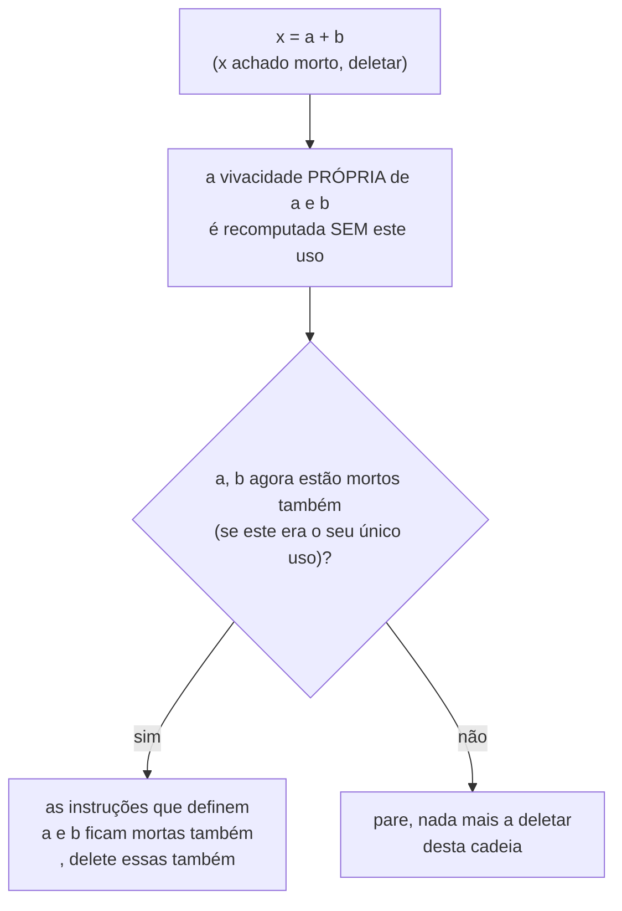

## Objetivos de Aprendizagem

- Explicar exatamente como a eliminação de código morto (DCE) usa as descobertas de `live-variable-analysis` para justificar deletar uma instrução de uma vez.
- Aplicar a DCE a um pequeno pedaço de código de três endereços, incluindo um caso onde deletar uma instrução morta expõe uma NOVA para deletar.
- Distinguir a DCE (deletar uma instrução cujo resultado nunca é lido) da eliminação de código inalcançável (deletar um bloco que nenhum caminho jamais consegue alcançar, de `control-flow-graphs-and-basic-blocks`).
- Explicar por que a DCE nunca deve deletar uma instrução com um EFEITO COLATERAL observável, mesmo que o seu valor de resultado genuinamente nunca seja lido.
- Rastrear a cascata alternada entre a DCE e a dobra/propagação de constantes, mostrando como as três otimizações cobertas até aqui compõem os efeitos umas das outras.

## Contexto e Motivação

`live-variable-analysis` computou, para cada ponto de um programa, exatamente quais valores ATUAIS de variáveis poderiam ainda ser lidos em algum lugar a jusante. A eliminação de código morto é o retorno direto: se o alvo de uma atribuição NÃO está vivo imediatamente após essa atribuição, nenhum caminho adiante jamais lê o valor que ela acabou de computar, a atribuição computa algo genuinamente inútil, e pode ser deletada de uma vez, junto de qualquer instrução que computou o valor sendo jogado fora.

Esta é a imagem espelhada de `common-subexpression-elimination`, construída sobre a OUTRA análise de fluxo de dados que esta disciplina cobriu: a CSE reusa um resultado que é redundante porque já foi computado; a DCE deleta um resultado que é morto porque nunca será usado. Ambas atuam só onde a sua respectiva análise já certificou a reescrita como incondicionalmente segura.

## Teoria Central

### A regra de deleção

```text
x = a + b       ; se x NÃO está vivo imediatamente após esta instrução
                ; (o conjunto OUT de live-variable-analysis para este ponto
                ; não contém x), esta instrução inteira está
                ; morta, delete-a de uma vez.
```

Deletá-la é seguro precisamente porque "não vivo" significa que nenhum caminho adiante jamais lê o valor de `x` antes de algo mais o sobrescrever ou o programa terminar, o valor computado, seja lá qual fosse, nunca ia importar para o comportamento observável do programa.

### O efeito em cascata: deletar uma instrução morta expõe outra



Deletar `x = a + b` remove o único lugar onde `a` e `b` eram usados naquela instrução, se esse era TAMBÉM o seu único uso restante em qualquer lugar a jusante, as próprias instruções que definem `a` e `b` ficam mortas por sua vez, exatamente o mesmo padrão em cascata que `constant-folding-and-constant-propagation` mostrou para dobras expondo mais dobras. Compiladores reais re-rodam a vivacidade (ou a mantêm incrementalmente) e re-aplicam a DCE repetidamente, até um ponto fixo, exatamente por esse motivo.

### Código morto vs. código inalcançável, um conceito genuinamente diferente

`control-flow-graphs-and-basic-blocks` já mostrou um tipo DIFERENTE de "código inútil": um bloco básico sem nenhuma aresta de entrada, inalcançável por QUALQUER caminho de execução (como um bloco logo após um `goto` incondicional que salta por cima dele). A eliminação de código morto é uma pergunta inteiramente diferente, uma instrução ALCANÇÁVEL cujo valor computado simplesmente nunca é lido por nada a jusante. Ambas são otimizações reais e distintas que um compilador de produção realiza (muitas vezes chamadas de "eliminação de código inalcançável" e "eliminação de código morto" respectivamente), e confundi-las é um erro real e comum: uma instrução pode ser perfeitamente alcançável e ainda estar morta (este conceito), ou perfeitamente "viva" no sentido de computar algo útil, mas estar num bloco que nada jamais alcança (a preocupação do conceito anterior).

## Exemplos Resolvidos

### Exemplo 1: uma única atribuição morta, achada e deletada

```text
Antes:                         A análise de variáveis vivas acha:
  x = 1                          x NÃO está vivo após esta linha
  y = 2                          (y ESTÁ vivo, usado abaixo)
  z = y + 1

Depois da DCE:
  y = 2
  z = y + 1
```

### Exemplo 2: uma deleção em cascata, exatamente o caso que o próprio exemplo resolvido de `live-variable-analysis` preparou

```text
Antes:
  a = 5
  b = 6
  x = a + b        ; x nunca é usado em lugar nenhum depois disto, MORTO
  y = 10

Passagem 1: x = a + b deletada (x não vivo depois)
Passagem 2: com esse uso de a e b sumido, a e b estão vivos em algum
  outro lugar? Se este era o seu ÚNICO uso, tanto a = 5 quanto b = 6 agora estão
  TAMBÉM mortos por sua vez.

Depois da DCE (ponto fixo):
  y = 10
```

Três instruções foram removidas mesmo que só UMA fosse originalmente, diretamente identificada como morta, as outras duas ficaram mortas só como CONSEQUÊNCIA a jusante da primeira deleção, exatamente o padrão em cascata que a seção de Teoria Central deste conceito diagrama.

### Exemplo 3: uma instrução que parece morta, mas NÃO deve ser deletada, um efeito colateral real

```text
x = readInputFromDevice();   ; x nunca é usado depois, mas esta
                                chamada de função tem um EFEITO COLATERAL
                                OBSERVÁVEL (ela consome entrada de um
                                dispositivo real), deletá-la mudaria
                                silenciosamente o comportamento observável
                                do programa, o que nenhuma otimização correta
                                pode jamais fazer.

Uma implementação de DCE correta só deleta uma COMPUTAÇÃO PURA (uma
sem efeitos colaterais) cujo resultado está morto, uma chamada a uma função que o
compilador não consegue provar ser livre de efeitos colaterais tem de ser conservadoramente mantida,
independentemente de o seu valor de retorno ser ou não usado.
```

## Equívocos Comuns e Armadilhas

- **"Eliminação de código morto e eliminação de código inalcançável são a mesma otimização, só descritas de duas formas diferentes."** Elas atuam sobre propriedades genuinamente diferentes, o código inalcançável é sobre a estrutura de grafo do CFG (nenhum caminho alcança este bloco de forma alguma, uma preocupação de `control-flow-graphs-and-basic-blocks`); o código morto é sobre o valor de uma variável nunca ser lido num caminho ALCANÇÁVEL (uma preocupação de `live-variable-analysis`), um compilador real roda ambas, como passagens separadas, por razões separadas.
- **"Uma instrução cujo resultado nunca é usado pode sempre ser deletada com segurança."** Só se a instrução for PURA, o Exemplo 3 mostra uma chamada com um efeito colateral observável onde o valor de retorno estar morto é completamente irrelevante para se deletar a própria CHAMADA seria seguro; a DCE tem de ser conservadora sobre qualquer coisa que o compilador não consiga provar que não tem efeito observável além do seu valor de retorno.
- **"A DCE só remove instruções que foram direta e individualmente identificadas como mortas numa única passagem."** O Exemplo 2 mostra que o oposto é comum, uma única deleção frequentemente expõe MAIS código morto a jusante (as próprias instruções que definem os operandos agora não usados), que é exatamente por que os otimizadores reais re-rodam a DCE (muitas vezes intercalada com a recomputação de vivacidade) até um ponto fixo, em vez de de uma vez só.
- **"DCE e propagação/dobra de constantes são otimizações não relacionadas que por acaso são cobertas no mesmo agrupamento."** Elas ativamente compõem uma à outra na prática: uma dobra pode tornar o valor de uma variável uma constante conhecida que é propagada por toda parte, deixando a sua instrução que a DEFINE originalmente sem uso vivo restante, ponto em que a DCE deleta essa atribuição original agora genuinamente morta, uma interação real e comum em compiladores otimizadores de produção.

## Resumo

A eliminação de código morto deleta uma atribuição de uma vez onde quer que `live-variable-analysis` certifique que o seu alvo não está vivo imediatamente depois, nenhum caminho adiante jamais lerá o valor sendo computado, e, como `common-subexpression-elimination`, isso é incondicionalmente seguro precisamente porque só atua onde a análise subjacente já descartou toda forma possível de dar errado, sendo a única exceção genuína uma instrução com um efeito colateral observável, que tem de ser conservadoramente mantida independentemente da vivacidade do seu valor de retorno. Deletar uma instrução morta rotineiramente expõe mais código morto a jusante, o mesmo padrão em cascata já visto com a dobra e a propagação de constantes, todas as três otimizações compõem uma à outra no pipeline de passagens de um compilador otimizador real. O conceito seguinte, `loop-optimizations-invariant-code-motion-and-strength-reduction`, move dessas reescritas gerais de programa inteiro para otimizações especificamente voltadas a laços, onde a mesma pequena reescrita compensa desproporcionalmente porque roda em toda iteração, em vez de uma vez.

## Documentation Links

- [MIT 6.035 — Computer Language Engineering, Calendar](https://ocw.mit.edu/courses/6-035-computer-language-engineering-sma-5502-fall-2005/pages/calendar/): aula de "Data-flow Optimizations" que cobre a eliminação de código morto como uma consumidora direta da análise de variáveis vivas.
- [Cooper & Torczon — Engineering a Compiler (companion site)](https://shop.elsevier.com/books/book-companion/9780120884780): livro-texto que distingue a eliminação de código morto da eliminação de código inalcançável como otimizações genuinamente separadas.
