## Learning Objectives

- Name the front-end stages this discipline reuses without re-deriving (scanning, parsing, AST construction) and state exactly where they were already covered.
- Explain the difference between an interpreter's node-by-node evaluation of an AST and a compiler's translation of that same AST into another language before anything runs.
- Draw the overall shape of a real compiler pipeline: front end, middle end, back end, naming what each stage consumes and produces.
- Explain why the same front end can feed a tree-walking interpreter or a full compiler, and why that split is a real, load-bearing engineering decision, not just an academic distinction.
- State this discipline's explicit scope: semantic analysis, intermediate representations, data-flow analysis, optimization, and code generation — not lexing, parsing, or AST construction in depth.

## Context & Motivation

`programming-languages` built a complete, working tree-walking interpreter: a scanner turned source text into tokens, a parser turned tokens into an abstract syntax tree, and an `eval` function walked that tree directly, one node at a time, computing a result as it went. That is one entirely legitimate way to make a program run — and it is exactly how many real, useful language implementations start their life (early Ruby, early Python, most toy languages, this platform's own interpreter).

A compiler shares the front end completely — the exact same scanner, the exact same parser, the exact same AST — and then does something structurally different with it: instead of evaluating the AST directly, a compiler TRANSLATES it into another language (assembly, machine code, bytecode, or another high-level language), producing an artifact that can be run later, independently, and typically much faster than a tree-walking interpreter, at the cost of a separate translation step that has to happen before execution and has to get every detail right without the safety net of "just run it and see."

This discipline is deliberately positioned as `programming-languages`'s sequel, not a restart. Stanford's CS143 and MIT's 6.035 both assume exactly this: lexical analysis and top-down/bottom-up parsing get a lecture or two of review before the bulk of the course moves to semantic analysis, intermediate representations, optimization, and code generation — the stages that are genuinely new once tokens and a parse tree already exist. `formal-languages-automata` already covers the automata theory a scanner and parser are built on (DFA/NFA, regular expressions, context-free grammars, the Chomsky hierarchy); `programming-languages` already covers concretely how a real scanner and parser are implemented and how an AST is walked and evaluated. This discipline assumes both, cites them explicitly wherever the boundary matters, and spends its entire budget on what comes after an AST already exists and a decision has been made to translate it rather than evaluate it.

## Core Theory

### The three-part shape of a real compiler

```mermaid
flowchart LR
    subgraph Front["Front End — REUSED, not re-derived here"]
        A["Source text"] --> B["Scanner\n(lexical-analysis-scanning-source-into-tokens)"]
        B --> C["Parser\n(parsing-expressions-into-an-abstract-syntax-tree)"]
        C --> D["AST"]
    end
    subgraph Middle["Middle End — THIS discipline"]
        D --> E["Semantic Analysis\n(symbol tables, static type checking)"]
        E --> F["IR generation\n(three-address code, CFG, SSA)"]
        F --> G["Optimization\n(data-flow analysis + rewrites)"]
    end
    subgraph Back["Back End — THIS discipline"]
        G --> H["Instruction selection"]
        H --> I["Register allocation"]
        I --> J["Instruction scheduling"]
        J --> K["Target machine code"]
    end
```



Every real, industrial-strength compiler (GCC, LLVM/Clang, javac + the JIT inside the JVM, V8) is organized around this same three-part shape, for the same engineering reason `why-intermediate-representations-exist` develops in detail later: separating these stages means a front end for a new source language, or a back end for a new target architecture, can be written without touching the middle — LLVM's entire commercial success is substantially a bet on exactly this separation.

### What an interpreter does instead

A tree-walking interpreter, as built in `programming-languages`, collapses the middle end and back end into a single `eval` function that recurses directly over the AST, producing a VALUE immediately rather than another program. There is no separate "generate code, then later run it" step — evaluation IS execution. This is why an interpreter never needs an intermediate representation, a register allocator, or a target instruction set at all: the AST itself is the only representation the whole system ever uses, and the host language's own call stack does the work a compiled program's stack frames would otherwise need to do explicitly.

### Where the boundary in this discipline actually falls

Two specific pieces from `programming-languages` sit exactly on this discipline's boundary and are called out explicitly rather than silently assumed: `environments-and-variable-scope` resolved a variable operationally, by walking a live chain of environments at runtime; `symbol-tables-and-scope-resolution` (the very next concept in this discipline) answers the identical question — which declaration does this name refer to? — but as a static, one-pass computation over the AST, before any code exists to run at all. Likewise `static-vs-dynamic-typing` and `type-checking-progress-and-preservation` already established what a sound static type system guarantees, proved one small-step evaluation at a time; `static-type-checking-as-a-compiler-pass` gives the batch, ahead-of-time version of exactly that same guarantee. Neither concept re-derives the underlying idea — both take the operational version already covered and ask what it looks like as a compiler pass instead.

## Worked Examples

### Example 1: the same AST, two different fates

```text
Source:  x + 1

AST:
      (+)
     /   \
   (x)   (1)

Interpreter's fate:  eval(AST) looks up x's current value in the live
  environment, adds 1, returns the resulting VALUE immediately. Nothing
  is produced except that one number.

Compiler's fate:  the same AST is walked by a code generator instead,
  which EMITS instructions to be run later:
      movq  -8(%rbp), %rax      ; load x
      addq  $1, %rax             ; add 1
  No value is computed now — a small piece of a PROGRAM is produced,
  to be run (possibly on a different machine, possibly much later,
  possibly many times) afterward.
```

### Example 2: tracing which discipline covers which stage

```text
Question: "the parser builds the wrong tree for `2 + 3 * 4` — is that
a bug in `parsing-expressions-into-an-abstract-syntax-tree`, or a bug
in this discipline's semantic analysis?"

Answer: it's a parsing bug, squarely in `programming-languages` /
`formal-languages-automata` territory (the grammar's precedence and
associativity rules, or the parser's implementation of them) — this
discipline's semantic analysis pass assumes the AST it receives already
groups `3 * 4` correctly beneath `+`; it never re-derives or re-checks
grammatical structure, only what that already-correct structure MEANS.
```

### Example 3: why AOT translation needs semantic analysis to run once, completely, up front

```text
Interpreter behavior on `1 + "two"`:
  eval() only discovers the type mismatch WHEN this specific line
  actually executes at runtime — a program with the same bug in a
  branch that's never taken might run for years without ever
  surfacing it.

Compiler behavior on the same program:
  static-type-checking-as-a-compiler-pass walks the ENTIRE AST once,
  before generating a single instruction, and can reject `1 + "two"`
  even if it sits inside a branch that never runs during any test —
  this is precisely the tradeoff `static-vs-dynamic-typing` already
  named: caught early vs. only caught when actually executed.
```

## Common Misconceptions & Pitfalls

- **"A compiler and an interpreter are built from entirely different front ends."** They are not — the scanner, parser, and AST from `programming-languages` are exactly what a compiler's front end also looks like; the divergence starts only after the AST exists, in what the system does with it next.
- **"This discipline will re-derive lexing and parsing to make sure the reader really understands them before moving on."** It deliberately will not — every reference to scanning, parsing, or grammars in this discipline cross-links directly to `programming-languages` or `formal-languages-automata` rather than repeating the derivation, exactly as tasks.md's scope decision for this discipline states.
- **"Compilers are strictly 'better' than interpreters, so this discipline supersedes the interpreter one."** They solve different problems with different tradeoffs (startup latency and portability favor interpretation; raw execution speed and the ability to catch errors ahead of time favor compilation) — `jit-vs-aot-compilation`, this discipline's closing concept, revisits this directly and shows real systems combine both rather than picking one.
- **"Semantic analysis is a completely new idea this discipline invents."** It's the compile-time, batch vantage point on ideas `programming-languages` already covered operationally — scope resolution and type checking are the same underlying questions, asked and answered differently because a compiler, unlike an interpreter, must answer them before anything runs at all.

## Summary

A compiler reuses a language's front end completely — the same scanner, parser, and AST `programming-languages` already built — and diverges only in what happens next: instead of evaluating the AST directly (an interpreter's job), a compiler translates it into another language ahead of time, through a middle end (semantic analysis, intermediate representations, optimization) and a back end (instruction selection, register allocation, code generation) this discipline covers stage by stage. Every boundary concept in this discipline — symbol tables versus environments, static type checking versus progress/preservation — takes an idea `programming-languages` already covered operationally and gives its compile-time, batch-processing counterpart, never re-deriving the underlying idea from scratch. The next concept, `symbol-tables-and-scope-resolution`, is the first of these: the static answer to a question `environments-and-variable-scope` already answered dynamically.

## Documentation Links

- [Stanford CS143 — Compilers](http://web.stanford.edu/class/cs143/) — course covering lexical/syntax analysis briefly before moving to semantic analysis, IR, optimization, and code generation, the same split this discipline follows.
- [ACM/IEEE CS2013 — Programming Languages Knowledge Area](https://csed.acm.org/knowledge-areas-programming-languages-pl-cs2013-version/) — lists the language-translation pipeline (parsing, type-checking, translation, execution as native code vs. within a VM) this discipline's scope is drawn from.
