## Objetivos de Aprendizagem

- Nomear os estágios de front end que esta disciplina reaproveita sem rederivar (scanning, parsing, construção de AST) e enunciar exatamente onde eles já foram cobertos.
- Explicar a diferença entre a avaliação nó por nó de um AST por um interpretador e a tradução desse mesmo AST para outra linguagem por um compilador antes de qualquer coisa rodar.
- Desenhar o formato geral de um pipeline de compilador real: front end, middle end, back end, nomeando o que cada estágio consome e produz.
- Explicar por que o mesmo front end pode alimentar um interpretador que percorre a árvore ou um compilador completo, e por que essa divisão é uma decisão de engenharia real e estrutural, não só uma distinção acadêmica.
- Enunciar o escopo explícito desta disciplina: análise semântica, representações intermediárias, análise de fluxo de dados, otimização e geração de código, não lexing, parsing ou construção de AST em profundidade.

## Contexto e Motivação

`programming-languages` construiu um interpretador completo e funcional que percorre a árvore: um scanner transformou o texto-fonte em tokens, um parser transformou os tokens numa árvore sintática abstrata, e uma função `eval` percorreu essa árvore diretamente, um nó por vez, computando um resultado conforme avançava. Essa é uma forma inteiramente legítima de fazer um programa rodar, e é exatamente como muitas implementações de linguagem reais e úteis começam a sua vida (Ruby inicial, Python inicial, a maioria das linguagens de brinquedo, o próprio interpretador desta plataforma).

Um compilador compartilha o front end completamente, o exato mesmo scanner, o exato mesmo parser, o exato mesmo AST, e então faz algo estruturalmente diferente com ele: em vez de avaliar o AST diretamente, um compilador o TRADUZ para outra linguagem (assembly, código de máquina, bytecode, ou outra linguagem de alto nível), produzindo um artefato que pode ser rodado depois, de forma independente, e tipicamente muito mais rápido do que um interpretador que percorre a árvore, ao custo de um passo de tradução separado que tem de acontecer antes da execução e tem de acertar todo detalhe sem a rede de segurança do "é só rodar e ver".

Esta disciplina é deliberadamente posicionada como a sequência de `programming-languages`, não um recomeço. CS143 de Stanford e 6.035 do MIT ambos assumem exatamente isso: a análise léxica e o parsing top-down/bottom-up ganham uma aula ou duas de revisão antes de o grosso do curso passar para análise semântica, representações intermediárias, otimização e geração de código, os estágios que são genuinamente novos uma vez que tokens e uma árvore de análise já existem. `formal-languages-automata` já cobre a teoria de autômatos sobre a qual um scanner e um parser são construídos (DFA/NFA, expressões regulares, gramáticas livres de contexto, a hierarquia de Chomsky); `programming-languages` já cobre concretamente como um scanner e um parser reais são implementados e como um AST é percorrido e avaliado. Esta disciplina assume ambos, cita-os explicitamente onde quer que a fronteira importe, e gasta todo o seu orçamento no que vem depois de um AST já existir e de uma decisão ter sido tomada de traduzi-lo em vez de avaliá-lo.

## Teoria Central

### O formato de três partes de um compilador real

```mermaid
flowchart LR
    subgraph Front["Front End — REAPROVEITADO, não rederivado aqui"]
        A["Texto-fonte"] --> B["Scanner\n(lexical-analysis-scanning-source-into-tokens)"]
        B --> C["Parser\n(parsing-expressions-into-an-abstract-syntax-tree)"]
        C --> D["AST"]
    end
    subgraph Middle["Middle End — ESTA disciplina"]
        D --> E["Análise Semântica\n(tabelas de símbolos, checagem estática de tipos)"]
        E --> F["Geração de IR\n(código de três endereços, CFG, SSA)"]
        F --> G["Otimização\n(análise de fluxo de dados + reescritas)"]
    end
    subgraph Back["Back End — ESTA disciplina"]
        G --> H["Seleção de instruções"]
        H --> I["Alocação de registradores"]
        I --> J["Escalonamento de instruções"]
        J --> K["Código de máquina do alvo"]
    end
```



Todo compilador real e de força industrial (GCC, LLVM/Clang, javac + o JIT dentro da JVM, V8) é organizado em torno deste mesmo formato de três partes, pelo mesmo motivo de engenharia que `why-intermediate-representations-exist` desenvolve em detalhe mais adiante: separar esses estágios significa que um front end para uma nova linguagem-fonte, ou um back end para uma nova arquitetura-alvo, pode ser escrito sem tocar no meio, o sucesso comercial inteiro de LLVM é substancialmente uma aposta exatamente nessa separação.

### O que um interpretador faz em vez disso

Um interpretador que percorre a árvore, como construído em `programming-languages`, colapsa o middle end e o back end numa única função `eval` que recorre diretamente sobre o AST, produzindo um VALOR imediatamente em vez de outro programa. Não há um passo separado de "gerar código, depois rodar mais tarde", a avaliação É a execução. É por isso que um interpretador nunca precisa de uma representação intermediária, de um alocador de registradores, ou de um conjunto de instruções-alvo de forma alguma: o próprio AST é a única representação que o sistema inteiro jamais usa, e a própria pilha de chamadas da linguagem hospedeira faz o trabalho que os quadros de pilha de um programa compilado precisariam fazer explicitamente.

### Onde a fronteira nesta disciplina de fato cai

Duas peças específicas de `programming-languages` ficam exatamente sobre a fronteira desta disciplina e são destacadas explicitamente em vez de silenciosamente assumidas: `environments-and-variable-scope` resolveu uma variável operacionalmente, percorrendo uma cadeia viva de ambientes em tempo de execução; `symbol-tables-and-scope-resolution` (o próprio conceito seguinte nesta disciplina) responde à pergunta idêntica, a qual declaração este nome se refere?, mas como uma computação estática de uma passagem sobre o AST, antes de qualquer código existir para rodar de forma alguma. Da mesma forma, `static-vs-dynamic-typing` e `type-checking-progress-and-preservation` já estabeleceram o que um sistema de tipos estático sólido garante, provado uma avaliação de passo pequeno por vez; `static-type-checking-as-a-compiler-pass` dá a versão em lote e antecipada exatamente dessa mesma garantia. Nenhum conceito rederiva a ideia subjacente, ambos tomam a versão operacional já coberta e perguntam como ela se parece como uma passagem de compilador em vez disso.

## Exemplos Resolvidos

### Exemplo 1: o mesmo AST, dois destinos diferentes

```text
Fonte:  x + 1

AST:
      (+)
     /   \
   (x)   (1)

Destino do interpretador:  eval(AST) consulta o valor atual de x no
  ambiente vivo, soma 1, retorna o VALOR resultante imediatamente. Nada
  é produzido além desse único número.

Destino do compilador:  o mesmo AST é percorrido por um gerador de código em vez disso,
  que EMITE instruções a serem rodadas depois:
      movq  -8(%rbp), %rax      ; carrega x
      addq  $1, %rax             ; soma 1
  Nenhum valor é computado agora, um pequeno pedaço de um PROGRAMA é produzido,
  para ser rodado (possivelmente numa máquina diferente, possivelmente muito depois,
  possivelmente muitas vezes) em seguida.
```

### Exemplo 2: rastrear qual disciplina cobre qual estágio

```text
Pergunta: "o parser constrói a árvore errada para `2 + 3 * 4`, isso é
um bug em `parsing-expressions-into-an-abstract-syntax-tree`, ou um bug
na análise semântica desta disciplina?"

Resposta: é um bug de parsing, firmemente em território de `programming-languages` /
`formal-languages-automata` (as regras de precedência e
associatividade da gramática, ou a implementação delas pelo parser), a
passagem de análise semântica desta disciplina assume que o AST que recebe já
agrupa `3 * 4` corretamente abaixo de `+`; ela nunca rederiva nem recheca
a estrutura gramatical, só o que essa estrutura já correta SIGNIFICA.
```

### Exemplo 3: por que a tradução AOT precisa que a análise semântica rode uma vez, completamente, logo no início

```text
Comportamento do interpretador em `1 + "two"`:
  eval() só descobre o descompasso de tipos QUANDO esta linha específica
  de fato executa em tempo de execução, um programa com o mesmo bug num
  ramo que nunca é tomado poderia rodar por anos sem jamais
  trazê-lo à tona.

Comportamento do compilador no mesmo programa:
  static-type-checking-as-a-compiler-pass percorre o AST INTEIRO uma vez,
  antes de gerar uma única instrução, e pode rejeitar `1 + "two"`
  mesmo que ele fique dentro de um ramo que nunca roda durante nenhum teste,
  essa é precisamente a troca que `static-vs-dynamic-typing` já
  nomeou: pego cedo vs. só pego quando de fato executado.
```

## Equívocos Comuns e Armadilhas

- **"Um compilador e um interpretador são construídos a partir de front ends inteiramente diferentes."** Não são, o scanner, o parser e o AST de `programming-languages` são exatamente como o front end de um compilador também se parece; a divergência começa só depois de o AST existir, no que o sistema faz com ele em seguida.
- **"Esta disciplina vai rederivar lexing e parsing para garantir que o leitor realmente os entende antes de seguir em frente."** Deliberadamente não vai, toda referência a scanning, parsing ou gramáticas nesta disciplina faz link cruzado diretamente a `programming-languages` ou `formal-languages-automata` em vez de repetir a derivação, exatamente como a decisão de escopo de tasks.md para esta disciplina enuncia.
- **"Compiladores são estritamente 'melhores' do que interpretadores, então esta disciplina suplanta a do interpretador."** Eles resolvem problemas diferentes com trade-offs diferentes (a latência de inicialização e a portabilidade favorecem a interpretação; a velocidade bruta de execução e a capacidade de pegar erros antecipadamente favorecem a compilação), `jit-vs-aot-compilation`, o conceito de encerramento desta disciplina, revisita isso diretamente e mostra que sistemas reais combinam ambos em vez de escolher um.
- **"A análise semântica é uma ideia completamente nova que esta disciplina inventa."** É o ponto de vantagem de tempo de compilação, em lote, sobre ideias que `programming-languages` já cobriu operacionalmente, a resolução de escopo e a checagem de tipos são as mesmas perguntas subjacentes, feitas e respondidas de forma diferente porque um compilador, diferentemente de um interpretador, precisa respondê-las antes de qualquer coisa rodar de forma alguma.

## Resumo

Um compilador reaproveita o front end de uma linguagem completamente, o mesmo scanner, parser e AST que `programming-languages` já construiu, e diverge só no que acontece em seguida: em vez de avaliar o AST diretamente (o trabalho de um interpretador), um compilador o traduz para outra linguagem antecipadamente, por meio de um middle end (análise semântica, representações intermediárias, otimização) e um back end (seleção de instruções, alocação de registradores, geração de código) que esta disciplina cobre estágio por estágio. Todo conceito de fronteira nesta disciplina, tabelas de símbolos versus ambientes, checagem estática de tipos versus progresso/preservação, toma uma ideia que `programming-languages` já cobriu operacionalmente e dá a sua contraparte de tempo de compilação, em processamento em lote, nunca rederivando a ideia subjacente do zero. O conceito seguinte, `symbol-tables-and-scope-resolution`, é o primeiro desses: a resposta estática a uma pergunta que `environments-and-variable-scope` já respondeu dinamicamente.

## Documentation Links

- [Stanford CS143 — Compilers](http://web.stanford.edu/class/cs143/): curso que cobre a análise léxica/sintática brevemente antes de passar para análise semântica, IR, otimização e geração de código, a mesma divisão que esta disciplina segue.
- [ACM/IEEE CS2013 — Programming Languages Knowledge Area](https://csed.acm.org/knowledge-areas-programming-languages-pl-cs2013-version/): lista o pipeline de tradução de linguagem (parsing, checagem de tipos, tradução, execução como código nativo vs. dentro de uma VM) de onde o escopo desta disciplina é extraído.
