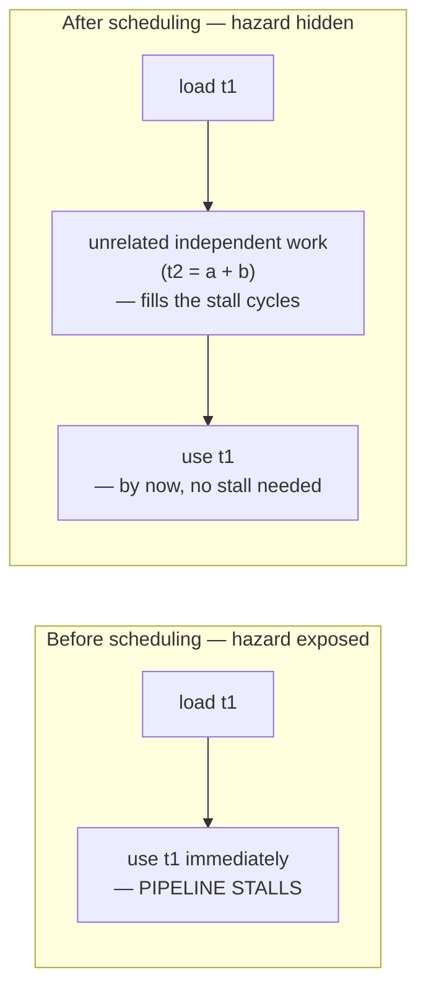

## Learning Objectives

- Restate the load-use hazard, from `the-load-use-hazard-and-pipeline-stalls`, as the concrete hardware problem this pass exists to hide.
- Explain precisely what instruction scheduling changes (WHEN each already-register-allocated instruction runs) versus what it must never change (WHICH registers are used, established by the previous concept).
- Build a dependency graph over a short instruction sequence and reorder independent instructions to place unrelated work between a load and its first use.
- Explain why scheduling must run either before or interact carefully with register allocation, since reordering can affect how long a value's live range spans and therefore how much register pressure exists.
- State honestly that this concept treats scheduling briefly, as a direct application of hazard material already covered in depth elsewhere, rather than re-deriving pipeline mechanics.

## Context & Motivation

`the-load-use-hazard-and-pipeline-stalls`, in `computer-architecture`, already established the concrete hardware problem in full: a pipelined CPU stalls for one or more cycles when an instruction needs a value that its immediately preceding instruction (typically a memory load) hasn't finished producing yet, because forwarding — which handles most other data hazards, per `data-hazards-and-forwarding` — cannot make a value available before the load itself has actually completed.

Instruction scheduling is the compiler-side half of living with this hardware reality: since `register-allocation-via-graph-coloring` has already decided WHICH physical register every value lives in, this pass's only remaining job is deciding WHEN each already-allocated instruction actually executes, relative to the others — reordering INDEPENDENT instructions (ones with no data dependency between them) to place unrelated, useful work between a load and the first instruction that needs its result, hiding the stall entirely without changing a single register assignment or a single computed value.

## Core Theory

### The dependency graph: what CAN be reordered

Two instructions can be reordered relative to each other only if neither depends on the other's result — formally, if there's no data dependency edge between them in either direction (no instruction reads what another writes, and no two instructions write the same location in an order that matters):

```text
1: t1 = load [addr]      ; a load — result not ready immediately
2: t2 = a + b              ; INDEPENDENT of instruction 1 (touches
                             different values entirely)
3: t3 = t1 + 1              ; DEPENDS on instruction 1's result (t1)
```

Instructions 1 and 2 have no dependency edge between them — either order produces the identical result — but instruction 3 must come after instruction 1 completes, since it directly consumes `t1`.

### Reordering to hide the load-use hazard



```text
Before scheduling:
  t1 = load [addr]
  t3 = t1 + 1        ; STALLS — t1 isn't ready yet (load-use hazard)

After scheduling (t2's computation moved between them):
  t1 = load [addr]
  t2 = a + b          ; independent — fills the cycle(s) the load
                         needs to complete, doing useful work instead
                         of the pipeline simply stalling
  t3 = t1 + 1          ; by the time this runs, t1 IS ready — no stall
```

Nothing about WHAT the program computes changed — `t1`, `t2`, and `t3` end up holding exactly the same values either way — only the ORDER in which two independent instructions execute changed, precisely the boundary this concept's Learning Objectives draw between scheduling's job and register allocation's.

### Why scheduling and register allocation interact

Moving an independent instruction later (to fill a stall) can extend how long its OWN operands need to stay live, since it now executes further from where its inputs were originally computed — a real, if usually modest, source of tension with `register-allocation-via-graph-coloring`'s interference graph, since a longer live range is more likely to interfere with something else and increase register pressure. Production compilers handle this in different orders (schedule before allocate, allocate before schedule, or an interleaved combination) depending on which tradeoff matters more for a given target — a genuine engineering judgment call this discipline notes honestly rather than resolving with one universal answer.

## Worked Examples

### Example 1: scheduling around a single load-use hazard

```text
Original order (register-allocated already):
  1: mov (%rbx), %rax      ; load — result not ready immediately
  2: add %rax, %rcx         ; DEPENDS on %rax from instruction 1 — stalls
  3: mov %rdx, %rsi          ; independent of both 1 and 2

Scheduled:
  1: mov (%rbx), %rax
  3: mov %rdx, %rsi           ; moved up — fills the load's latency
  2: add %rax, %rcx            ; by now, %rax is ready — no stall
```

### Example 2: two loads scheduled to overlap their latencies

```text
Original order:
  1: mov (%rbx), %rax
  2: add %rax, %r8           ; stalls after instruction 1
  3: mov (%rcx), %rdx
  4: add %rdx, %r9            ; stalls after instruction 3

Scheduled — both loads issued back-to-back, before either result
is needed:
  1: mov (%rbx), %rax
  3: mov (%rcx), %rdx          ; second load's latency now overlaps
                                 with the first load's remaining latency
  2: add %rax, %r8              ; %rax ready by now
  4: add %rdx, %r9               ; %rdx ready by now
```

This pattern — issuing multiple independent loads early, before any of their results are needed — is a genuinely common, real scheduling strategy, directly exploiting the same pipeline latency structure `the-load-use-hazard-and-pipeline-stalls` already described.

### Example 3: an instruction that CANNOT be reordered, and why

```text
1: t1 = load [addr]
2: store [addr], 99      ; writes to the SAME address just read
3: t2 = t1 + 1

Instructions 1 and 2 CANNOT be safely reordered (swapping them would
change whether the load sees the OLD or NEW value at [addr] — a real
dependency, even though neither instruction directly names the
other's destination register) — a scheduler must respect MEMORY
dependencies, not just register dependencies, when building its
dependency graph, or it risks silently changing the program's result.
```

## Common Misconceptions & Pitfalls

- **"Instruction scheduling can reorder any two instructions as long as their target registers differ."** Example 3 shows a real counterexample — a load and a store to the SAME memory address create a genuine dependency even when no register is shared between them; a correct scheduler's dependency graph must track memory accesses, not only register reads and writes.
- **"Scheduling and register allocation are independent passes that can run in either order with no interaction at all."** They genuinely interact — reordering an instruction can lengthen or shorten the live ranges register allocation's interference graph is built from, which is exactly why real compilers make a deliberate engineering choice about ordering (or interleaving) the two passes rather than treating them as fully independent.
- **"This concept re-derives pipeline hazards and forwarding from scratch."** It deliberately does not — `data-hazards-and-forwarding` and `the-load-use-hazard-and-pipeline-stalls`, already covered in full in `computer-architecture`, are assumed and cited directly; this concept's entire content is the compiler-side response to hardware behavior already established elsewhere.
- **"A scheduler should always move independent work as early as possible, without limit."** Moving work too far from its own point of relevance can itself increase live-range length and register pressure (the same tension noted in Core Theory) — real schedulers balance hiding a specific hazard against not creating new, possibly worse pressure elsewhere, rather than maximizing reordering distance unconditionally.

## Summary

Instruction scheduling reorders already register-allocated, independent instructions — never changing which register any value lives in, only when each instruction executes — to place unrelated useful work between a load and its first use, directly hiding the load-use hazard `computer-architecture` already established at the hardware level. A correct scheduler's dependency graph must respect both register and memory dependencies, and its interaction with register allocation's live ranges is a real, genuine engineering tradeoff rather than a fully independent concern. With registers assigned and instructions ordered, the final code-generation concept, `stack-frame-generation-and-the-calling-convention`, wraps this instruction sequence in the prologue, epilogue, and calling-convention machinery `c-and-assembly` already covers concretely — the last piece needed before a function is a complete, callable unit of real machine code.

## Documentation Links

- [MIT 6.035 — Computer Language Engineering, Calendar](https://ocw.mit.edu/courses/6-035-computer-language-engineering-sma-5502-fall-2005/pages/calendar/) — dedicated instruction-scheduling lecture sequence, placed directly ahead of register allocation in that course's own ordering.
- [Cooper & Torczon — Engineering a Compiler (companion site)](https://shop.elsevier.com/books/book-companion/9780120884780) — textbook covering list scheduling and dependency-graph construction as the standard instruction-scheduling technique.
