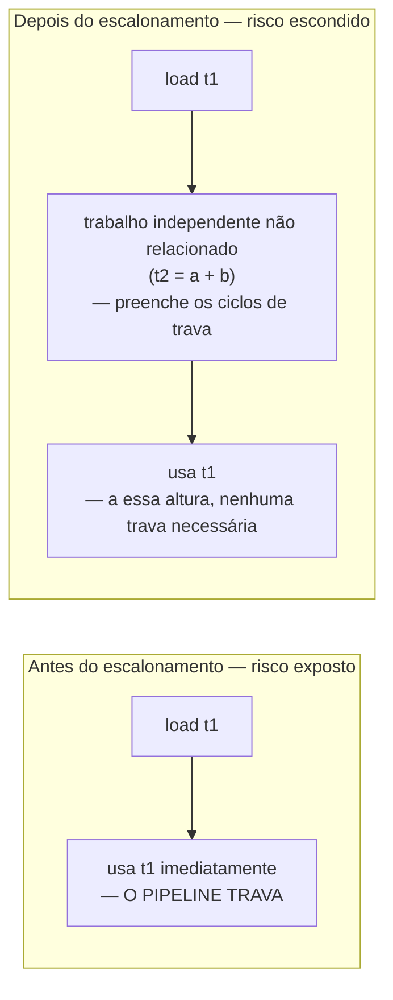

## Objetivos de Aprendizagem

- Reenunciar o risco de uso-de-carga, de `the-load-use-hazard-and-pipeline-stalls`, como o problema concreto de hardware que esta passagem existe para esconder.
- Explicar com precisão o que o escalonamento de instruções muda (QUANDO cada instrução já com registradores alocados roda) versus o que ele nunca deve mudar (QUAIS registradores são usados, estabelecido pelo conceito anterior).
- Construir um grafo de dependências sobre uma curta sequência de instruções e reordenar instruções independentes para colocar trabalho não relacionado entre uma carga e o seu primeiro uso.
- Explicar por que o escalonamento tem de rodar ou antes de ou interagir com cuidado com a alocação de registradores, já que reordenar pode afetar quanto o intervalo de vida de um valor se estende e, portanto, quanta pressão de registradores existe.
- Enunciar honestamente que este conceito trata o escalonamento brevemente, como uma aplicação direta de material de riscos já coberto em profundidade em outro lugar, em vez de rederivar a mecânica de pipeline.

## Contexto e Motivação

`the-load-use-hazard-and-pipeline-stalls`, em `computer-architecture`, já estabeleceu o problema concreto de hardware por completo: uma CPU com pipeline trava por um ou mais ciclos quando uma instrução precisa de um valor que a sua instrução imediatamente anterior (tipicamente uma carga de memória) ainda não terminou de produzir, porque o forwarding, que lida com a maioria dos outros riscos de dados, por `data-hazards-and-forwarding`, não consegue tornar um valor disponível antes de a própria carga ter de fato se completado.

O escalonamento de instruções é a metade do lado do compilador de conviver com essa realidade de hardware: como `register-allocation-via-graph-coloring` já decidiu em QUAL registrador físico cada valor vive, o único trabalho restante desta passagem é decidir QUANDO cada instrução já alocada de fato executa, em relação às outras, reordenar instruções INDEPENDENTES (as sem dependência de dados entre si) para colocar trabalho não relacionado e útil entre uma carga e a primeira instrução que precisa do seu resultado, escondendo a trava inteiramente sem mudar uma única atribuição de registrador ou um único valor computado.

## Teoria Central

### O grafo de dependências: o que PODE ser reordenado

Duas instruções podem ser reordenadas uma em relação à outra só se nenhuma depender do resultado da outra, formalmente, se não houver aresta de dependência de dados entre elas em nenhuma direção (nenhuma instrução lê o que outra escreve, e nenhuma de duas instruções escreve o mesmo local numa ordem que importa):

```text
1: t1 = load [addr]      ; uma carga, resultado não pronto imediatamente
2: t2 = a + b              ; INDEPENDENTE da instrução 1 (toca
                             valores inteiramente diferentes)
3: t3 = t1 + 1              ; DEPENDE do resultado da instrução 1 (t1)
```

As instruções 1 e 2 não têm aresta de dependência entre si, qualquer ordem produz o resultado idêntico, mas a instrução 3 tem de vir depois de a instrução 1 se completar, já que ela consome diretamente `t1`.

### Reordenar para esconder o risco de uso-de-carga



```text
Antes do escalonamento:
  t1 = load [addr]
  t3 = t1 + 1        ; TRAVA, t1 ainda não está pronto (risco de uso-de-carga)

Depois do escalonamento (a computação de t2 movida entre elas):
  t1 = load [addr]
  t2 = a + b          ; independente, preenche o(s) ciclo(s) que a carga
                         precisa para se completar, fazendo trabalho útil em vez
                         de o pipeline simplesmente travar
  t3 = t1 + 1          ; quando isto roda, t1 ESTÁ pronto, sem trava
```

Nada sobre O QUE o programa computa mudou, `t1`, `t2` e `t3` acabam segurando exatamente os mesmos valores de qualquer forma, só a ORDEM em que duas instruções independentes executam mudou, precisamente a fronteira que os Objetivos de Aprendizagem deste conceito traçam entre o trabalho do escalonamento e o da alocação de registradores.

### Por que o escalonamento e a alocação de registradores interagem

Mover uma instrução independente para mais tarde (para preencher uma trava) pode estender quanto tempo os seus PRÓPRIOS operandos precisam ficar vivos, já que ela agora executa mais longe de onde as suas entradas foram originalmente computadas, uma fonte real, ainda que normalmente modesta, de tensão com o grafo de interferência de `register-allocation-via-graph-coloring`, já que um intervalo de vida mais longo tem mais probabilidade de interferir com algo mais e aumentar a pressão de registradores. Compiladores de produção lidam com isso em ordens diferentes (escalonar antes de alocar, alocar antes de escalonar, ou uma combinação intercalada) dependendo de qual trade-off importa mais para um dado alvo, uma decisão genuína de julgamento de engenharia que esta disciplina nota honestamente em vez de resolver com uma resposta universal.

## Exemplos Resolvidos

### Exemplo 1: escalonar em torno de um único risco de uso-de-carga

```text
Ordem original (já com registradores alocados):
  1: mov (%rbx), %rax      ; carga, resultado não pronto imediatamente
  2: add %rax, %rcx         ; DEPENDE de %rax da instrução 1, trava
  3: mov %rdx, %rsi          ; independente de ambas 1 e 2

Escalonado:
  1: mov (%rbx), %rax
  3: mov %rdx, %rsi           ; movida para cima, preenche a latência da carga
  2: add %rax, %rcx            ; a essa altura, %rax está pronto, sem trava
```

### Exemplo 2: duas cargas escalonadas para sobrepor as suas latências

```text
Ordem original:
  1: mov (%rbx), %rax
  2: add %rax, %r8           ; trava após a instrução 1
  3: mov (%rcx), %rdx
  4: add %rdx, %r9            ; trava após a instrução 3

Escalonado, ambas as cargas emitidas uma após a outra, antes de qualquer resultado
ser necessário:
  1: mov (%rbx), %rax
  3: mov (%rcx), %rdx          ; a latência da segunda carga agora se sobrepõe
                                 à latência restante da primeira carga
  2: add %rax, %r8              ; %rax pronto a essa altura
  4: add %rdx, %r9               ; %rdx pronto a essa altura
```

Esse padrão, emitir múltiplas cargas independentes cedo, antes de qualquer um dos seus resultados ser necessário, é uma estratégia de escalonamento genuinamente comum e real, explorando diretamente a mesma estrutura de latência de pipeline que `the-load-use-hazard-and-pipeline-stalls` já descreveu.

### Exemplo 3: uma instrução que NÃO PODE ser reordenada, e por quê

```text
1: t1 = load [addr]
2: store [addr], 99      ; escreve no MESMO endereço que acabou de ser lido
3: t2 = t1 + 1

As instruções 1 e 2 NÃO PODEM ser reordenadas com segurança (trocá-las mudaria
se a carga vê o valor ANTIGO ou NOVO em [addr], uma dependência real,
mesmo que nenhuma instrução nomeie diretamente o registrador de destino da
outra), um escalonador tem de respeitar dependências de MEMÓRIA,
não só dependências de registrador, ao construir o seu grafo de
dependências, ou arrisca mudar silenciosamente o resultado do programa.
```

## Equívocos Comuns e Armadilhas

- **"O escalonamento de instruções pode reordenar quaisquer duas instruções desde que os seus registradores de destino difiram."** O Exemplo 3 mostra um contraexemplo real, uma carga e um store para o MESMO endereço de memória criam uma dependência genuína mesmo quando nenhum registrador é compartilhado entre elas; o grafo de dependências de um escalonador correto tem de rastrear acessos à memória, não só leituras e escritas de registrador.
- **"Escalonamento e alocação de registradores são passagens independentes que podem rodar em qualquer ordem sem nenhuma interação."** Elas genuinamente interagem, reordenar uma instrução pode alongar ou encurtar os intervalos de vida a partir dos quais o grafo de interferência da alocação de registradores é construído, que é exatamente por que compiladores reais fazem uma escolha deliberada de engenharia sobre a ordenação (ou intercalação) das duas passagens, em vez de tratá-las como totalmente independentes.
- **"Este conceito rederiva riscos de pipeline e forwarding do zero."** Ele deliberadamente não o faz, `data-hazards-and-forwarding` e `the-load-use-hazard-and-pipeline-stalls`, já cobertos por completo em `computer-architecture`, são assumidos e citados diretamente; todo o conteúdo deste conceito é a resposta do lado do compilador a um comportamento de hardware já estabelecido em outro lugar.
- **"Um escalonador deve sempre mover trabalho independente o mais cedo possível, sem limite."** Mover trabalho longe demais do seu próprio ponto de relevância pode, ele mesmo, aumentar o comprimento do intervalo de vida e a pressão de registradores (a mesma tensão notada na Teoria Central), escalonadores reais equilibram esconder um risco específico contra não criar uma nova pressão, possivelmente pior, em outro lugar, em vez de maximizar a distância de reordenação incondicionalmente.

## Resumo

O escalonamento de instruções reordena instruções independentes já com registradores alocados, nunca mudando em qual registrador qualquer valor vive, só quando cada instrução executa, para colocar trabalho útil não relacionado entre uma carga e o seu primeiro uso, escondendo diretamente o risco de uso-de-carga que `computer-architecture` já estabeleceu no nível do hardware. O grafo de dependências de um escalonador correto tem de respeitar dependências tanto de registrador quanto de memória, e a sua interação com os intervalos de vida da alocação de registradores é um trade-off de engenharia real e genuíno, em vez de uma preocupação totalmente independente. Com os registradores atribuídos e as instruções ordenadas, o conceito final de geração de código, `stack-frame-generation-and-the-calling-convention`, embrulha esta sequência de instruções na maquinaria de prólogo, epílogo e convenção de chamada que `c-and-assembly` já cobre concretamente, a última peça necessária antes de uma função ser uma unidade completa e chamável de código de máquina real.

## Documentation Links

- [MIT 6.035 — Computer Language Engineering, Calendar](https://ocw.mit.edu/courses/6-035-computer-language-engineering-sma-5502-fall-2005/pages/calendar/): sequência de aulas dedicada ao escalonamento de instruções, colocada diretamente antes da alocação de registradores na própria ordenação desse curso.
- [Cooper & Torczon — Engineering a Compiler (companion site)](https://shop.elsevier.com/books/book-companion/9780120884780): livro-texto que cobre o escalonamento por lista e a construção de grafo de dependências como a técnica padrão de escalonamento de instruções.
