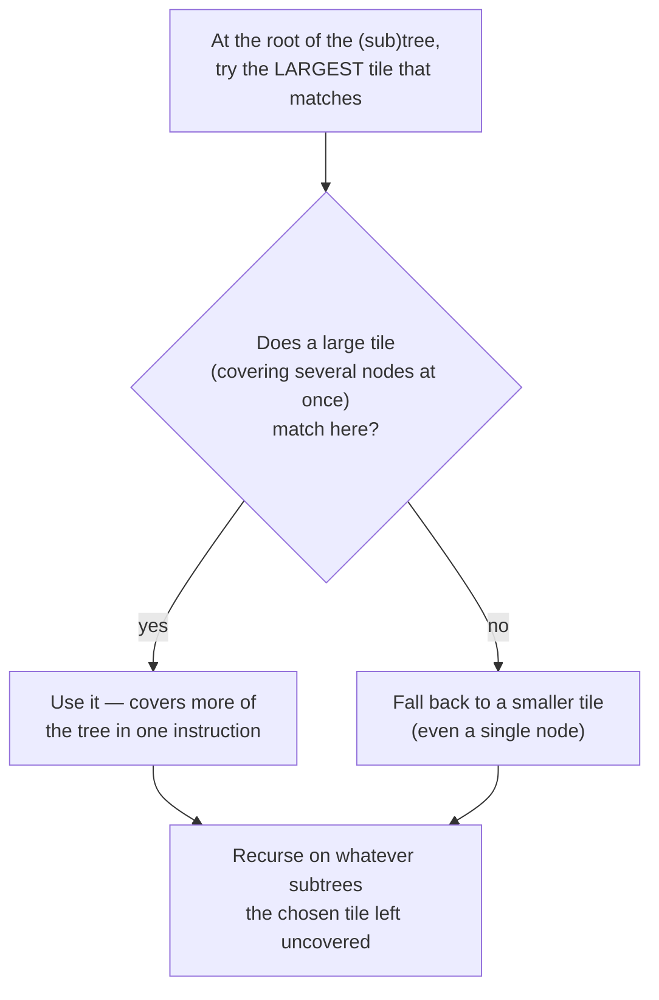

## Learning Objectives

- Explain what instruction selection actually does: covering an IR expression tree with tiles, each tile a template for one real target instruction.
- Represent a small piece of three-address code as an expression-DAG or tree, and manually tile it with x86-64 instructions from `c-and-assembly`'s registers and arithmetic material.
- Explain "maximal munch" precisely: greedily matching the largest possible tile at the root of a (sub)tree first, and why this is a reasonable, fast heuristic even though it isn't always globally optimal.
- Explain why instruction selection is genuinely target-specific — the same optimized IR produces a different tiling for a different target architecture.
- Distinguish this pass's job (WHICH instructions to emit) from register allocation's job (WHICH registers those instructions actually use), the very next concept.

## Context & Motivation

Every concept so far in the Optimization cluster worked entirely within the IR — three-address code, control-flow graphs, SSA form — a representation deliberately independent of any one target machine, exactly as `why-intermediate-representations-exist` argued for. At some point, though, an actual target machine's actual instructions have to be chosen — and a target machine's real instruction set, as `c-and-assembly` already covered concretely for x86-64 (`x86-64-registers-and-data-movement`, `arithmetic-and-logical-instructions`), doesn't necessarily offer one instruction per IR operation; it often offers instructions that do MORE than one IR operation's worth of work in a single step (a combined multiply-add, or an addressing mode that folds a small computation directly into a memory access).

INSTRUCTION SELECTION is the pass that bridges this gap: it takes an optimized IR expression (represented as a tree, or more generally a DAG once shared subexpressions from `common-subexpression-elimination` are accounted for) and covers it with TILES — each tile a small pattern matching some piece of the tree, paired with the real target instruction(s) that pattern corresponds to — choosing a tiling that covers the whole tree using instructions the target machine actually has.

## Core Theory

### Tiles as templates matching IR patterns to real instructions

```text
Tile 1:  IR pattern: t = a + b          → x86-64: addq %rb, %ra  (result in %ra)
Tile 2:  IR pattern: t = a * const      → x86-64: imulq $const, %ra
Tile 3:  IR pattern: t = *(base + off)  → x86-64: movq off(%rbase), %rt
                                            (a SINGLE instruction covers
                                             BOTH the addition and the
                                             load, using x86-64's own
                                             addressing mode)
```

Tile 3 is the concrete reason this pass genuinely matters, rather than being a trivial one-to-one mapping: an IR that represents "compute `base + offset`, then load from that address" as two separate three-address instructions can often be covered by a SINGLE real x86-64 instruction, because the target's own addressing modes already do that combined computation as part of a normal load — recognizing this opportunity is exactly what a good tiling finds and a naive one-instruction-per-IR-op translation would miss.

### Maximal munch: a fast, greedy tiling heuristic



MAXIMAL MUNCH greedily picks, at each point, the largest tile that matches, on the reasoning that a single real instruction covering more IR work is usually cheaper than several smaller instructions covering the same ground — a fast, simple, and in practice quite effective heuristic, though not always globally optimal (a genuinely optimal tiling in general requires a more expensive dynamic-programming approach, assigning a cost to every possible tile and choosing the true minimum-cost combination — a real refinement production compilers use, set aside here as a deliberate scope boundary beyond this introductory greedy version).

### Why this pass is target-specific in a way earlier passes were not

Every optimization from `constant-folding-and-constant-propagation` through `the-undecidability-of-optimization` operated purely on the IR, entirely oblivious to which real machine the program would eventually run on — that target-independence was the entire point of building an IR in the first place. Instruction selection is the first pass in this discipline where the target genuinely matters: the SAME optimized IR tiled against x86-64 (with its addressing modes and two-operand instruction format) produces a different instruction sequence than the same IR tiled against a different architecture with different available instructions and addressing modes — exactly the back-end-specific work `why-intermediate-representations-exist` argued should be isolated to precisely this one pass, rather than spread throughout the optimizer.

## Worked Examples

### Example 1: tiling a simple expression with a combined addressing-mode tile

```text
IR:
  t1 = base + 8
  t2 = load t1

Naive, one-instruction-per-IR-op translation:
  addq  $8, %rbase        ; two instructions
  movq  (%rbase), %rt2

Maximal munch, recognizing Tile 3 covers BOTH IR instructions at once:
  movq  8(%rbase), %rt2   ; ONE instruction, using x86-64's own
                             base+displacement addressing mode
```

### Example 2: falling back to smaller tiles when no large one matches

```text
IR:
  t1 = a * b
  t2 = t1 + c

No single x86-64 instruction directly computes "multiply then add" for
arbitrary operands (unlike some other architectures' fused
multiply-add) — maximal munch tries the largest tile at the root
(t2 = t1 + c) first, finds only Tile 1 (plain addition) matches, uses
it, then recurses into t1 = a * b, matching Tile 2:

  imulq %rb, %ra      ; t1 = a * b, via Tile 2
  addq  %rc, %ra        ; t2 = t1 + c, via Tile 1
```

### Example 3: why the choice is genuinely target-specific

```text
The SAME IR:
  t1 = base + 8
  t2 = load t1

...tiled for x86-64 (Example 1): ONE instruction, using x86-64's
  base+displacement addressing mode.

...tiled for a hypothetical simpler target with NO addressing modes
  at all (every load must use a plain register, no offset folded in):
  addq  $8, %rbase       ; must compute the address explicitly
  movq  (%rbase), %rt2    ; separate load, no addressing-mode tile available

Same optimized IR in, genuinely different instruction sequence out —
entirely because of what real instructions and addressing modes each
target actually offers.
```

## Common Misconceptions & Pitfalls

- **"Instruction selection just replaces each IR instruction with the 'equivalent' real instruction, one-for-one."** Example 1 shows this is often suboptimal — a good tiling actively looks for opportunities where ONE real instruction (using an addressing mode, or a fused operation) can cover what the IR represents as SEVERAL separate steps, which a naive one-to-one mapping would completely miss.
- **"Maximal munch always finds the truly optimal (cheapest) instruction sequence."** It's a fast, greedy heuristic, not a guarantee of global optimality — Example 2 shows it committing to whatever's largest at each point without looking ahead, which in some real cases produces a slightly more expensive sequence than an exhaustive, cost-based dynamic-programming tiler would find; production compilers that need the last few percent of performance often use the more expensive, truly optimal approach instead.
- **"Instruction selection is where register allocation happens too, since both are about generating real instructions."** They are deliberately separate passes with separate jobs — this concept decides WHICH instructions to emit (and often generates code assuming an unlimited supply of virtual registers); `register-allocation-via-graph-coloring`, the very next concept, decides WHICH real, limited machine registers those virtual registers actually map to.
- **"Since IR is target-independent, instruction selection should be too."** The opposite is exactly this concept's point — instruction selection is the FIRST pass in the back end where target-specific details (available instructions, addressing modes) genuinely and necessarily enter the picture, precisely because its whole job is bridging from the target-independent IR to real, target-specific instructions.

## Summary

Instruction selection covers an optimized IR's expression tree with tiles — patterns matching real target instructions, including combined operations like an addressing mode that folds an addition into a load — using maximal munch's fast, greedy heuristic (largest matching tile first, recursing into whatever's left uncovered) to produce a real instruction sequence, still typically using an unlimited supply of virtual registers at this stage. This is the first genuinely target-specific pass in this discipline, exactly the isolated back-end work `why-intermediate-representations-exist` argued a shared IR should confine to one place. With real instructions chosen, the next concept, `register-allocation-via-graph-coloring`, takes on the separate job this pass deliberately left open: mapping those virtual registers down onto the target's actual, limited register file.

## Documentation Links

- [Stanford CS143 — Compilers](http://web.stanford.edu/class/cs143/) — code-generation lectures covering tree-pattern-matching instruction selection as the bridge from optimized IR to real target instructions.
- [Cooper & Torczon — Engineering a Compiler (companion site)](https://shop.elsevier.com/books/book-companion/9780120884780) — textbook presenting maximal munch and tile-based instruction selection, including its dynamic-programming, cost-optimal refinement.
