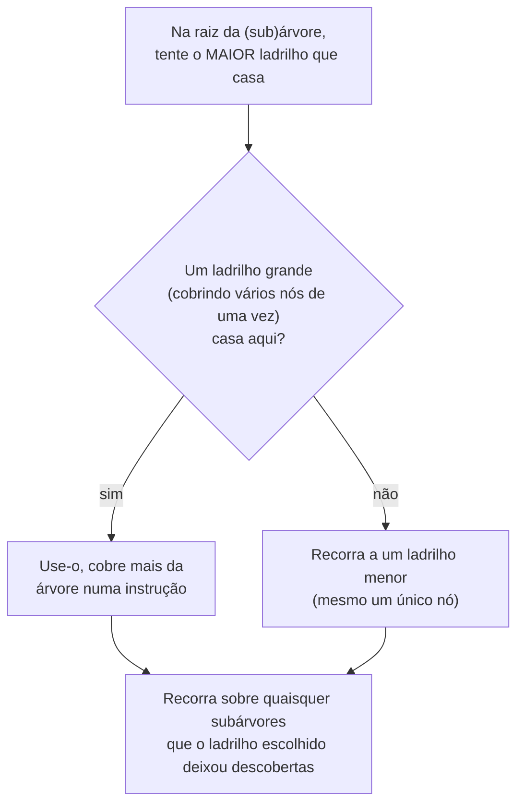

## Objetivos de Aprendizagem

- Explicar o que a seleção de instruções de fato faz: cobrir uma árvore de expressão de IR com ladrilhos, cada ladrilho um modelo para uma instrução real do alvo.
- Representar um pequeno pedaço de código de três endereços como um DAG de expressão ou árvore, e ladrilhá-lo manualmente com instruções x86-64 do material de registradores e aritmética de `c-and-assembly`.
- Explicar "maximal munch" com precisão: casar gananciosamente o maior ladrilho possível na raiz de uma (sub)árvore primeiro, e por que esse é um heurístico razoável e rápido mesmo que nem sempre seja globalmente ótimo.
- Explicar por que a seleção de instruções é genuinamente específica do alvo, o mesmo IR otimizado produz um ladrilhamento diferente para uma arquitetura-alvo diferente.
- Distinguir o trabalho desta passagem (QUAIS instruções emitir) do trabalho da alocação de registradores (QUAIS registradores essas instruções de fato usam), o próprio conceito seguinte.

## Contexto e Motivação

Todo conceito até aqui no agrupamento de Otimização trabalhou inteiramente dentro do IR, código de três endereços, grafos de fluxo de controle, forma SSA, uma representação deliberadamente independente de qualquer máquina-alvo, exatamente como `why-intermediate-representations-exist` argumentou. Em algum momento, porém, as instruções de fato de uma máquina-alvo de fato têm de ser escolhidas, e o conjunto de instruções real de uma máquina-alvo, como `c-and-assembly` já cobriu concretamente para x86-64 (`x86-64-registers-and-data-movement`, `arithmetic-and-logical-instructions`), não necessariamente oferece uma instrução por operação de IR; ele muitas vezes oferece instruções que fazem MAIS do que o trabalho de uma operação de IR num único passo (um multiply-add combinado, ou um modo de endereçamento que dobra uma pequena computação diretamente num acesso à memória).

A SELEÇÃO DE INSTRUÇÕES é a passagem que faz a ponte dessa lacuna: ela toma uma expressão de IR otimizada (representada como uma árvore, ou mais geralmente um DAG uma vez que as subexpressões compartilhadas de `common-subexpression-elimination` são levadas em conta) e a cobre com LADRILHOS, cada ladrilho um pequeno padrão que casa com algum pedaço da árvore, pareado com a(s) instrução(ões) real(is) do alvo à(s) qual(is) esse padrão corresponde, escolhendo um ladrilhamento que cobre a árvore inteira usando instruções que a máquina-alvo de fato tem.

## Teoria Central

### Ladrilhos como modelos que casam padrões de IR a instruções reais

```text
Ladrilho 1:  padrão de IR: t = a + b          → x86-64: addq %rb, %ra  (resultado em %ra)
Ladrilho 2:  padrão de IR: t = a * const      → x86-64: imulq $const, %ra
Ladrilho 3:  padrão de IR: t = *(base + off)  → x86-64: movq off(%rbase), %rt
                                            (uma ÚNICA instrução cobre
                                             TANTO a adição QUANTO a
                                             carga, usando o próprio modo de
                                             endereçamento de x86-64)
```

O Ladrilho 3 é a razão concreta pela qual esta passagem genuinamente importa, em vez de ser um mapeamento trivial um para um: um IR que representa "computar `base + offset`, depois carregar daquele endereço" como duas instruções de três endereços separadas pode muitas vezes ser coberto por uma ÚNICA instrução x86-64 real, porque os próprios modos de endereçamento do alvo já fazem essa computação combinada como parte de uma carga normal, reconhecer essa oportunidade é exatamente o que um bom ladrilhamento encontra e o que uma tradução ingênua de uma-instrução-por-op-de-IR perderia.

### Maximal munch: um heurístico de ladrilhamento rápido e ganancioso



MAXIMAL MUNCH escolhe gananciosamente, em cada ponto, o maior ladrilho que casa, com o raciocínio de que uma única instrução real cobrindo mais trabalho de IR normalmente é mais barata do que várias instruções menores cobrindo o mesmo terreno, um heurístico rápido, simples e, na prática, bem eficaz, embora nem sempre globalmente ótimo (um ladrilhamento genuinamente ótimo em geral exige uma abordagem de programação dinâmica mais cara, atribuindo um custo a todo ladrilho possível e escolhendo a verdadeira combinação de custo mínimo, um refinamento real que compiladores de produção usam, posto de lado aqui como uma fronteira de escopo deliberada além desta versão gananciosa introdutória).

### Por que esta passagem é específica do alvo de um jeito que as passagens anteriores não eram

Toda otimização de `constant-folding-and-constant-propagation` até `the-undecidability-of-optimization` operou puramente sobre o IR, inteiramente alheia a qual máquina real o programa eventualmente rodaria, essa independência de alvo era o ponto inteiro de construir um IR em primeiro lugar. A seleção de instruções é a primeira passagem nesta disciplina onde o alvo genuinamente importa: o MESMO IR otimizado ladrilhado contra x86-64 (com os seus modos de endereçamento e formato de instrução de dois operandos) produz uma sequência de instruções diferente do mesmo IR ladrilhado contra uma arquitetura diferente com instruções e modos de endereçamento disponíveis diferentes, exatamente o trabalho específico do back end que `why-intermediate-representations-exist` argumentou que deveria ser isolado a precisamente esta única passagem, em vez de espalhado por todo o otimizador.

## Exemplos Resolvidos

### Exemplo 1: ladrilhar uma expressão simples com um ladrilho de modo de endereçamento combinado

```text
IR:
  t1 = base + 8
  t2 = load t1

Tradução ingênua de uma-instrução-por-op-de-IR:
  addq  $8, %rbase        ; duas instruções
  movq  (%rbase), %rt2

Maximal munch, reconhecendo que o Ladrilho 3 cobre AMBAS as instruções de IR de uma vez:
  movq  8(%rbase), %rt2   ; UMA instrução, usando o próprio modo de
                             endereçamento base+deslocamento de x86-64
```

### Exemplo 2: recorrer a ladrilhos menores quando nenhum grande casa

```text
IR:
  t1 = a * b
  t2 = t1 + c

Nenhuma única instrução x86-64 computa diretamente "multiplicar depois somar" para
operandos arbitrários (diferentemente do multiply-add fundido de
algumas outras arquiteturas), maximal munch tenta o maior ladrilho na raiz
(t2 = t1 + c) primeiro, encontra que só o Ladrilho 1 (adição simples) casa, usa-o,
depois recorre em t1 = a * b, casando o Ladrilho 2:

  imulq %rb, %ra      ; t1 = a * b, via Ladrilho 2
  addq  %rc, %ra        ; t2 = t1 + c, via Ladrilho 1
```

### Exemplo 3: por que a escolha é genuinamente específica do alvo

```text
O MESMO IR:
  t1 = base + 8
  t2 = load t1

...ladrilhado para x86-64 (Exemplo 1): UMA instrução, usando o modo de
  endereçamento base+deslocamento de x86-64.

...ladrilhado para um alvo hipotético mais simples SEM modos de endereçamento
  de forma alguma (toda carga tem de usar um registrador simples, sem deslocamento dobrado):
  addq  $8, %rbase       ; tem de computar o endereço explicitamente
  movq  (%rbase), %rt2    ; carga separada, nenhum ladrilho de modo de endereçamento disponível

Mesmo IR otimizado na entrada, sequência de instruções genuinamente diferente na saída,
inteiramente por causa de quais instruções reais e modos de endereçamento cada
alvo de fato oferece.
```

## Equívocos Comuns e Armadilhas

- **"A seleção de instruções só substitui cada instrução de IR pela instrução real 'equivalente', uma por uma."** O Exemplo 1 mostra que isso muitas vezes é subótimo, um bom ladrilhamento ativamente busca oportunidades onde UMA instrução real (usando um modo de endereçamento, ou uma operação fundida) pode cobrir o que o IR representa como VÁRIOS passos separados, o que um mapeamento ingênuo um para um perderia completamente.
- **"Maximal munch sempre encontra a sequência de instruções verdadeiramente ótima (mais barata)."** É um heurístico rápido e ganancioso, não uma garantia de otimalidade global, o Exemplo 2 o mostra se comprometendo com o que é maior em cada ponto sem olhar adiante, o que em alguns casos reais produz uma sequência ligeiramente mais cara do que um ladrilhador exaustivo e baseado em custo por programação dinâmica encontraria; compiladores de produção que precisam dos últimos poucos por cento de desempenho muitas vezes usam a abordagem mais cara e verdadeiramente ótima em vez disso.
- **"A seleção de instruções é onde a alocação de registradores também acontece, já que ambas são sobre gerar instruções reais."** Elas são passagens deliberadamente separadas com trabalhos separados, este conceito decide QUAIS instruções emitir (e muitas vezes gera código assumindo um suprimento ilimitado de registradores virtuais); `register-allocation-via-graph-coloring`, o próprio conceito seguinte, decide para QUAIS registradores de máquina reais e limitados esses registradores virtuais de fato mapeiam.
- **"Como o IR é independente do alvo, a seleção de instruções também deveria ser."** O oposto é exatamente o ponto deste conceito, a seleção de instruções é a PRIMEIRA passagem no back end onde detalhes específicos do alvo (instruções disponíveis, modos de endereçamento) genuína e necessariamente entram em cena, precisamente porque o seu trabalho inteiro é fazer a ponte do IR independente do alvo para instruções reais e específicas do alvo.

## Resumo

A seleção de instruções cobre a árvore de expressão de um IR otimizado com ladrilhos, padrões que casam com instruções reais do alvo, incluindo operações combinadas como um modo de endereçamento que dobra uma adição numa carga, usando o heurístico rápido e ganancioso de maximal munch (maior ladrilho que casa primeiro, recorrendo sobre o que restou descoberto) para produzir uma sequência de instruções real, ainda tipicamente usando um suprimento ilimitado de registradores virtuais neste estágio. Esta é a primeira passagem genuinamente específica do alvo nesta disciplina, exatamente o trabalho isolado de back end que `why-intermediate-representations-exist` argumentou que um IR compartilhado deveria confinar a um só lugar. Com as instruções reais escolhidas, o conceito seguinte, `register-allocation-via-graph-coloring`, assume o trabalho separado que esta passagem deliberadamente deixou em aberto: mapear esses registradores virtuais para o arquivo de registradores de fato, limitado, do alvo.

## Documentation Links

- [Stanford CS143 — Compilers](http://web.stanford.edu/class/cs143/): aulas de geração de código que cobrem a seleção de instruções por casamento de padrões em árvore como a ponte do IR otimizado para instruções reais do alvo.
- [Cooper & Torczon — Engineering a Compiler (companion site)](https://shop.elsevier.com/books/book-companion/9780120884780): livro-texto que apresenta o maximal munch e a seleção de instruções baseada em ladrilhos, incluindo o seu refinamento de custo ótimo por programação dinâmica.
