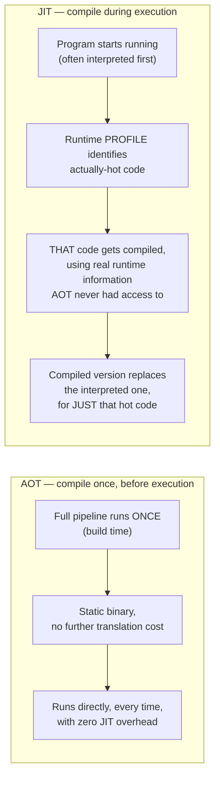

## Learning Objectives

- Define AOT (ahead-of-time) and JIT (just-in-time) compilation precisely: WHEN the pipeline covered in this discipline actually runs, relative to the program's own execution.
- Explain the concrete tradeoff each strategy makes: AOT pays translation cost once, before any execution, and never again; JIT pays it repeatedly (or adaptively) DURING execution, in exchange for information only available at runtime.
- Name at least one real, currently deployed system for each strategy and one genuinely hybrid system, and state what each one actually does.
- Explain profile-guided, tiered compilation concretely: interpret first, then compile only the code a real execution profile identifies as hot.
- Explain honestly why "JIT is strictly better" and "AOT is strictly better" are both wrong, tying the answer back to `from-interpreter-to-compiler-the-shape-of-a-real-pipeline`'s opening framing.

## Context & Motivation

`from-interpreter-to-compiler-the-shape-of-a-real-pipeline`, this discipline's opening concept, drew a line between an interpreter (evaluate the AST directly, right now) and a compiler (translate ahead of time, run the result later). JIT vs. AOT compilation revisits that exact same line, but shows it isn't really a binary choice between two fixed camps — it's a spectrum of WHEN the entire pipeline this discipline covered (semantic analysis through code generation) actually executes, relative to the program it's compiling.

AHEAD-OF-TIME (AOT) compilation runs the full pipeline once, before the program ever executes, producing a static binary that can be run directly, as many times as needed, with zero further translation cost — this is what C, C++, and Rust compilers do by default. JUST-IN-TIME (JIT) compilation defers some or all of that same pipeline until the program is already running, trading a real, unavoidable runtime translation cost for genuine ADDITIONAL INFORMATION that simply doesn't exist before execution begins — which specific branches actually get taken, which specific types actually flow through a polymorphic call site, which loops actually run enough iterations to be worth aggressively optimizing.

## Core Theory

### The core tradeoff, stated precisely



AOT's cost model: pay the full translation cost exactly once, at build time, never again — but every optimization decision (which branch is likely, which loop is hot) has to be a STATIC GUESS, made without ever having actually run the program. JIT's cost model: pay translation cost repeatedly, DURING the program's own execution — a genuine, real overhead subtracted directly from the program's own running time — but every optimization decision can be grounded in ACTUAL observed behavior, not a guess.

### Profile-guided, tiered compilation — the concrete mechanism

Real JIT systems (the JVM's HotSpot, JavaScript's V8) rarely compile everything with full, expensive optimization immediately — that would spend far too much of the program's own execution time on compiling code that might only run once. Instead, they run in TIERS: interpret (or lightly compile) everything at first, cheaply, while collecting a real runtime PROFILE of which code paths actually execute frequently; only code the profile identifies as genuinely HOT gets the full, expensive optimization pipeline (everything this discipline covers — semantic analysis was already done ahead of time for most JITs, but IR generation, data-flow analysis, optimization, and code generation are run live) applied to it, on the theory that the cost of fully optimizing rarely-run code would never be recouped by how little it actually executes.

### Real systems on the spectrum

```text
AOT:   GCC, Clang, rustc  — full pipeline runs once, at build time,
       producing a static binary; no runtime compilation cost at all.

JIT:   JavaScript engines (V8) — the ENTIRE pipeline runs live, since
       there's no separate "build step" for a script downloaded and
       run on the fly; tiered compilation (interpreter → baseline
       compiler → optimizing compiler) manages the resulting cost.

Hybrid: the JVM — javac performs semantic analysis and produces
       portable bytecode AHEAD of time (an AOT step); HotSpot's JIT
       then interprets that bytecode initially and compiles only the
       methods a real runtime profile identifies as hot, using
       information (actual argument types at a polymorphic call site,
       actual branch frequencies) that genuinely doesn't exist until
       the program is already running.
```

## Worked Examples

### Example 1: an optimization only a JIT can make safely, because it needs runtime information

```text
Source (a dynamically-typed or polymorphic call site):
  result = obj.method(x);

An AOT compiler, compiling this ahead of time, generally cannot know
WHICH concrete implementation of `method` will actually be called at
this specific call site (it might depend on obj's runtime type,
determined by data the program hasn't even loaded yet) — it must
generate general, safe code that handles every possibility.

A JIT, having actually RUN this call site many times already, can
observe: "every single time, obj's actual runtime type has been
exactly TypeA" — and generate a specialized, much faster version that
assumes TypeA directly, with a cheap runtime check as a fallback in
case a different type genuinely does show up later. This specific
technique (inline caching, generalized as "speculative optimization
based on an observed profile") has no AOT equivalent, because the
information it exploits didn't exist before the program actually ran.
```

### Example 2: an optimization AOT performs "for free" that a naive JIT would pay for repeatedly

```text
A large, purely computational function, called exactly once, doing
one big batch of numeric work.

AOT: the FULL optimization pipeline (loop optimizations, register
  allocation, everything covered in this discipline) already ran once,
  at build time — this single call gets maximally optimized code with
  ZERO runtime compilation overhead subtracted from its own execution.

Naive JIT (interpreting everything, then compiling only after
  observing repeated execution): since this function runs only ONCE,
  a profile-based JIT might never even trigger full optimization for
  it at all — it could run entirely interpreted, genuinely slower for
  this specific case than the AOT version, precisely because the
  "will this be worth optimizing" bet a tiered JIT makes doesn't pay
  off for code that only runs once.
```

### Example 3: why the JVM's hybrid design captures both advantages honestly

```text
javac (AOT step): performs semantic-analysis-as-a-compiler-pass,
  static-type-checking-as-a-compiler-pass — ONCE, ahead of time,
  producing portable, verified bytecode; every USER of that .class
  file benefits from this work being done exactly once, ever,
  regardless of how many times or where the bytecode later runs.

HotSpot (JIT step, at actual runtime): interprets the bytecode
  initially (fast startup, no compilation delay before the program
  can begin doing useful work at all) and applies the REST of this
  discipline's pipeline (IR generation, optimization, code generation)
  only to methods a real execution profile shows are actually hot —
  getting AOT's "pay once for correctness-critical work" and JIT's
  "optimize based on real, observed behavior" in the same system.
```

## Common Misconceptions & Pitfalls

- **"JIT compilation is strictly more advanced and therefore strictly better than AOT."** Example 2 shows a real, concrete case where AOT wins outright — a function that runs exactly once benefits from AOT's zero-runtime-overhead full optimization in a way a profile-driven JIT, by design, might never even attempt to match.
- **"AOT compilers could match JIT's specialized optimizations if they just tried harder at compile time."** Some of JIT's advantages are not a matter of effort but of genuinely unavailable INFORMATION — Example 1's observed-type specialization exploits data that simply does not exist until the program has actually run with real inputs; no amount of static analysis sophistication recovers information about behavior on inputs the compiler never saw.
- **"A JIT always has to choose between fast startup and eventually-fast execution — it can't have both."** Tiered compilation is precisely the mechanism that avoids this false choice — cheap interpretation gets a program running immediately, while the profile-guided optimizing tier only kicks in for code that's proven, by actual observed behavior, to be worth the investment.
- **"The JVM 'is' a JIT compiler, full stop, with no AOT component at all."** The JVM ecosystem's real design is genuinely hybrid — `javac`'s semantic analysis and bytecode generation IS a real, complete AOT step (this discipline's front-loaded passes, done exactly once); HotSpot's later, runtime-driven optimization is the JIT half, layered on top of that already-AOT-compiled bytecode.

## Summary

AOT and JIT compilation are two different answers to WHEN this discipline's entire pipeline actually runs relative to a program's execution: AOT runs it once, ahead of time, trading the ability to use runtime information for zero ongoing translation cost; JIT runs some or all of it during execution, trading a real, ongoing translation cost for optimization decisions grounded in actually observed behavior rather than a static guess. Real systems increasingly avoid picking one extreme — the JVM's `javac`+HotSpot pairing does genuine AOT work (semantic analysis, bytecode generation) followed by genuine, profile-guided JIT work (tiered compilation, applying this discipline's optimization and code-generation passes only to code proven hot) — capturing real advantages from both strategies in one system. With this bridge in place, the discipline's final concept, the capstone, traces one small, concrete source expression through every single stage covered, front to back, naming exactly which concept is responsible for each step.

## Documentation Links

- [Stanford CS143 — Compilers](http://web.stanford.edu/class/cs143/) — course material covering JIT compilation as a modern extension of the classical AOT pipeline this discipline builds up.
- [ACM/IEEE CS2013 — Programming Languages Knowledge Area](https://csed.acm.org/knowledge-areas-programming-languages-pl-cs2013-version/) — knowledge area explicitly distinguishing compilation to native code ahead of time from execution as native code within a runtime/virtual machine.
