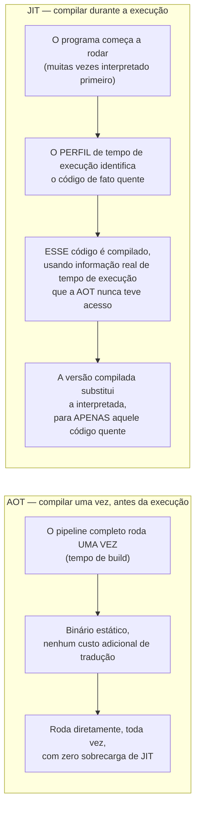

## Objetivos de Aprendizagem

- Definir a compilação AOT (antecipada) e JIT (just-in-time) com precisão: QUANDO o pipeline coberto nesta disciplina de fato roda, em relação à própria execução do programa.
- Explicar o trade-off concreto que cada estratégia faz: a AOT paga o custo de tradução uma vez, antes de qualquer execução, e nunca mais; a JIT o paga repetidamente (ou de forma adaptativa) DURANTE a execução, em troca de informação só disponível em tempo de execução.
- Nomear pelo menos um sistema real e atualmente implantado para cada estratégia e um sistema genuinamente híbrido, e enunciar o que cada um de fato faz.
- Explicar a compilação em camadas guiada por perfil concretamente: interpretar primeiro, depois compilar só o código que um perfil de execução real identifica como quente.
- Explicar honestamente por que "JIT é estritamente melhor" e "AOT é estritamente melhor" são ambos errados, amarrando a resposta de volta ao enquadramento de abertura de `from-interpreter-to-compiler-the-shape-of-a-real-pipeline`.

## Contexto e Motivação

`from-interpreter-to-compiler-the-shape-of-a-real-pipeline`, o conceito de abertura desta disciplina, traçou uma linha entre um interpretador (avaliar o AST diretamente, agora mesmo) e um compilador (traduzir antecipadamente, rodar o resultado depois). A compilação JIT vs. AOT revisita essa exata mesma linha, mas mostra que ela não é realmente uma escolha binária entre dois campos fixos, é um espectro de QUANDO o pipeline inteiro que esta disciplina cobriu (análise semântica até geração de código) de fato executa, em relação ao programa que está compilando.

A compilação ANTECIPADA (AOT) roda o pipeline completo uma vez, antes de o programa jamais executar, produzindo um binário estático que pode ser rodado diretamente, tantas vezes quantas necessárias, com zero custo adicional de tradução, é o que os compiladores de C, C++ e Rust fazem por padrão. A compilação JUST-IN-TIME (JIT) adia parte ou todo esse mesmo pipeline até o programa já estar rodando, trocando um custo de tradução real e inevitável em tempo de execução por INFORMAÇÃO ADICIONAL genuína que simplesmente não existe antes de a execução começar, quais ramos específicos de fato são tomados, quais tipos específicos de fato fluem por um local de chamada polimórfico, quais laços de fato rodam iterações suficientes para valer a pena otimizar agressivamente.

## Teoria Central

### O trade-off central, enunciado com precisão



O modelo de custo da AOT: pagar o custo de tradução completo exatamente uma vez, em tempo de build, nunca mais, mas toda decisão de otimização (qual ramo é provável, qual laço é quente) tem de ser um CHUTE ESTÁTICO, feito sem jamais ter de fato rodado o programa. O modelo de custo da JIT: pagar o custo de tradução repetidamente, DURANTE a própria execução do programa, uma sobrecarga genuína e real subtraída diretamente do próprio tempo de execução do programa, mas toda decisão de otimização pode ser fundamentada em comportamento de fato OBSERVADO, e não num chute.

### Compilação em camadas guiada por perfil, o mecanismo concreto

Os sistemas JIT reais (o HotSpot da JVM, o V8 do JavaScript) raramente compilam tudo com otimização completa e cara imediatamente, isso gastaria tempo de execução do próprio programa demais compilando código que talvez rode só uma vez. Em vez disso, eles rodam em CAMADAS: interpretar (ou compilar levemente) tudo no começo, de forma barata, enquanto coletam um PERFIL real de tempo de execução de quais caminhos de código de fato executam com frequência; só o código que o perfil identifica como genuinamente QUENTE ganha o pipeline de otimização completo e caro (tudo o que esta disciplina cobre, a análise semântica já foi feita antecipadamente para a maioria dos JITs, mas a geração de IR, a análise de fluxo de dados, a otimização e a geração de código rodam ao vivo) aplicado a ele, com a teoria de que o custo de otimizar por completo código que roda raramente nunca seria recuperado pelo pouco que ele de fato executa.

### Sistemas reais no espectro

```text
AOT:   GCC, Clang, rustc  — o pipeline completo roda uma vez, em tempo de build,
       produzindo um binário estático; nenhum custo de compilação em tempo de execução de forma alguma.

JIT:   motores JavaScript (V8) — o pipeline INTEIRO roda ao vivo, já que
       não há um "passo de build" separado para um script baixado e
       rodado na hora; a compilação em camadas (interpretador → compilador
       de base → compilador otimizador) gerencia o custo resultante.

Híbrido: a JVM — javac realiza a análise semântica e produz
       bytecode portátil ANTECIPADAMENTE (um passo AOT); o JIT do HotSpot
       então interpreta esse bytecode inicialmente e compila só os
       métodos que um perfil real de tempo de execução identifica como quentes, usando
       informação (tipos de argumento de fato num local de chamada polimórfico,
       frequências de ramo de fato) que genuinamente não existe até
       o programa já estar rodando.
```

## Exemplos Resolvidos

### Exemplo 1: uma otimização que só um JIT pode fazer com segurança, porque ela precisa de informação de tempo de execução

```text
Fonte (um local de chamada dinamicamente tipado ou polimórfico):
  result = obj.method(x);

Um compilador AOT, compilando isto antecipadamente, geralmente não consegue saber
QUAL implementação concreta de `method` de fato será chamada neste
local de chamada específico (pode depender do tipo de tempo de execução de obj,
determinado por dados que o programa nem carregou ainda), ele tem de
gerar código geral e seguro que lida com toda possibilidade.

Um JIT, tendo de fato RODADO este local de chamada muitas vezes já, pode
observar: "toda vez, o tipo de tempo de execução de obj foi
exatamente TypeA", e gerar uma versão especializada e muito mais rápida que
assume TypeA diretamente, com uma checagem barata de tempo de execução como recurso
caso um tipo diferente genuinamente apareça mais tarde. Essa
técnica específica (inline caching, generalizada como "otimização especulativa
baseada num perfil observado") não tem equivalente AOT, porque a
informação que ela explora não existia antes de o programa de fato rodar.
```

### Exemplo 2: uma otimização que a AOT realiza "de graça" e que um JIT ingênuo pagaria repetidamente

```text
Uma função grande e puramente computacional, chamada exatamente uma vez, fazendo
um grande lote de trabalho numérico.

AOT: o pipeline de otimização COMPLETO (otimizações de laço, alocação
  de registradores, tudo coberto nesta disciplina) já rodou uma vez,
  em tempo de build, esta única chamada ganha código otimizado ao máximo com
  ZERO sobrecarga de compilação em tempo de execução subtraída da sua própria execução.

JIT ingênuo (interpretando tudo, depois compilando só após
  observar execução repetida): como esta função roda só UMA VEZ,
  um JIT baseado em perfil poderia nem sequer disparar a otimização completa para
  ela de forma alguma, ela poderia rodar inteiramente interpretada, genuinamente mais lenta para
  este caso específico do que a versão AOT, precisamente porque a
  aposta de "valerá a pena otimizar isto" que um JIT em camadas faz não
  compensa para código que roda só uma vez.
```

### Exemplo 3: por que o design híbrido da JVM captura ambas as vantagens honestamente

```text
javac (passo AOT): realiza semantic-analysis-as-a-compiler-pass,
  static-type-checking-as-a-compiler-pass — UMA VEZ, antecipadamente,
  produzindo bytecode portátil e verificado; todo USUÁRIO desse arquivo .class
  se beneficia de este trabalho ser feito exatamente uma vez, para sempre,
  independentemente de quantas vezes ou onde o bytecode rode depois.

HotSpot (passo JIT, no tempo de execução de fato): interpreta o bytecode
  inicialmente (inicialização rápida, nenhum atraso de compilação antes de o programa
  poder começar a fazer trabalho útil de forma alguma) e aplica o RESTO do
  pipeline desta disciplina (geração de IR, otimização, geração de código)
  só aos métodos que um perfil de execução real mostra serem de fato quentes,
  obtendo o "pagar uma vez pelo trabalho crítico de correção" da AOT e o
  "otimizar com base em comportamento real e observado" do JIT no mesmo sistema.
```

## Equívocos Comuns e Armadilhas

- **"A compilação JIT é estritamente mais avançada e, portanto, estritamente melhor do que a AOT."** O Exemplo 2 mostra um caso real e concreto onde a AOT vence de vez, uma função que roda exatamente uma vez se beneficia da otimização completa de sobrecarga zero em tempo de execução da AOT de uma forma que um JIT guiado por perfil, por design, talvez nem sequer tente igualar.
- **"Compiladores AOT poderiam igualar as otimizações especializadas do JIT se só se esforçassem mais em tempo de compilação."** Algumas das vantagens do JIT não são uma questão de esforço, mas de INFORMAÇÃO genuinamente indisponível, a especialização por tipo observado do Exemplo 1 explora dados que simplesmente não existem até o programa de fato ter rodado com entradas reais; nenhuma sofisticação de análise estática recupera informação sobre comportamento em entradas que o compilador nunca viu.
- **"Um JIT sempre tem de escolher entre inicialização rápida e execução eventualmente rápida, não pode ter ambas."** A compilação em camadas é precisamente o mecanismo que evita essa falsa escolha, a interpretação barata coloca um programa rodando imediatamente, enquanto a camada otimizadora guiada por perfil só entra em ação para código que se provou, por comportamento de fato observado, valer o investimento.
- **"A JVM 'é' um compilador JIT, ponto final, sem nenhum componente AOT de forma alguma."** O design real do ecossistema da JVM é genuinamente híbrido, a análise semântica e a geração de bytecode de `javac` SÃO um passo AOT real e completo (as passagens front-loaded desta disciplina, feitas exatamente uma vez); a otimização posterior e guiada por tempo de execução do HotSpot é a metade JIT, em camadas sobre esse bytecode já compilado por AOT.

## Resumo

A compilação AOT e JIT são duas respostas diferentes para QUANDO o pipeline inteiro desta disciplina de fato roda em relação à execução de um programa: a AOT o roda uma vez, antecipadamente, trocando a capacidade de usar informação de tempo de execução por zero custo contínuo de tradução; o JIT roda parte ou todo ele durante a execução, trocando um custo de tradução real e contínuo por decisões de otimização fundamentadas em comportamento de fato observado, em vez de um chute estático. Sistemas reais cada vez mais evitam escolher um extremo, o par `javac`+HotSpot da JVM faz trabalho AOT genuíno (análise semântica, geração de bytecode) seguido de trabalho JIT genuíno e guiado por perfil (compilação em camadas, aplicando as passagens de otimização e geração de código desta disciplina só a código provado quente), capturando vantagens reais de ambas as estratégias num só sistema. Com essa ponte em vigor, o conceito final da disciplina, o capstone, rastreia uma pequena e concreta expressão-fonte por cada estágio coberto, da frente ao fim, nomeando exatamente qual conceito é responsável por cada passo.

## Documentation Links

- [Stanford CS143 — Compilers](http://web.stanford.edu/class/cs143/): material de curso que cobre a compilação JIT como uma extensão moderna do pipeline AOT clássico que esta disciplina constrói.
- [ACM/IEEE CS2013 — Programming Languages Knowledge Area](https://csed.acm.org/knowledge-areas-programming-languages-pl-cs2013-version/): área de conhecimento que distingue explicitamente a compilação para código nativo antecipadamente da execução como código nativo dentro de um runtime/máquina virtual.
