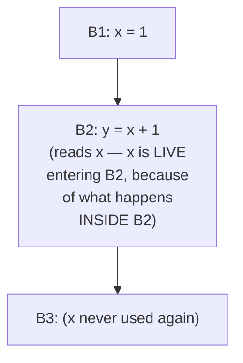

## Learning Objectives

- Define liveness precisely: a variable is live at a point if some path from there reads its current value before any reassignment overwrites it.
- Instantiate the data-flow framework for live variables: identify its lattice, its direction (backward, the first backward analysis in this discipline), transfer function, and join.
- Run the worklist algorithm backward on a small CFG, computing IN and OUT liveness sets for each block.
- Explain concretely why liveness has to run backward: a variable's liveness at a point depends on what happens AFTER that point, not before it.
- Name the two later concepts that consume this analysis directly: `dead-code-elimination` (this discipline) and `register-allocation-via-graph-coloring` (much later, in Code Generation).

## Context & Motivation

`reaching-definitions` asked a question about the PAST: which earlier assignment could be the source of a variable's current value? Live-variable analysis asks the mirror-image question about the FUTURE: will this variable's CURRENT value ever actually be read again before it gets overwritten? A variable is LIVE at a point if the answer is yes along some path from there; it is DEAD if every path from there either overwrites it or reaches the end of the program without ever reading it again.

This is the first BACKWARD analysis in this discipline, and the direction flip is not incidental — it's forced by the question itself. Liveness at a point is a fact about what happens LATER in execution, so information has to flow backward through the CFG, from a block's exit toward its entry, exactly the opposite direction reaching definitions used. Two very concrete payoffs depend directly on this analysis: `dead-code-elimination`, a few concepts ahead, deletes an assignment outright the moment liveness reports its target is dead; and `register-allocation-via-graph-coloring`, much later in Code Generation, builds its entire interference graph (which values can safely share one register) directly from liveness information computed here.

## Core Theory

### Instantiating the framework, backward this time

```text
Lattice:      sets of variable names
Direction:    BACKWARD (liveness at a point depends on what happens
              downstream, after that point, not upstream before it)
Join:         UNION (a variable is live if it's live along SOME
              successor path — another MAY analysis, like reaching
              definitions, but running in the opposite direction)
Transfer function for block B, given OUT(B) (facts live at B's exit):
  USE(B) = variables read in B BEFORE any reassignment within B
  DEF(B) = variables assigned in B (that reach the end of B without
           being read again first — a technicality that matters only
           for a variable both read and reassigned within the same
           block, handled by processing B's own instructions in
           reverse order internally)
  IN(B) = USE(B) ∪ (OUT(B) - DEF(B))
```

`IN(B)` keeps everything live at `B`'s exit EXCEPT what `B` itself overwrites (since an overwrite makes any PRIOR value dead from that point backward), and adds whatever `B` reads before overwriting it.

### Why backward, concretely



Whether `x` is live at the exit of `B1` depends entirely on what `B2` does with it — a fact that only exists "later" in the control-flow order. Propagating this backward (from `B2`'s use, back into `B1`'s exit fact) is the only direction that makes sense; propagating forward would require knowing the future before computing the past.

## Worked Examples

### Example 1: computing liveness on a simple sequence

```text
B1: x = 1
B2: y = x + 1
B3: z = y + 2      ; x is NEVER used again after B2

OUT(B3) = {} (assume nothing live after B3, end of function)
IN(B3): USE(B3) = {y}; DEF(B3) = {z}
  IN(B3) = {y} ∪ ({} - {z}) = {y}

OUT(B2) = IN(B3) = {y}
IN(B2): USE(B2) = {x}; DEF(B2) = {y}
  IN(B2) = {x} ∪ ({y} - {y}) = {x}

OUT(B1) = IN(B2) = {x}
IN(B1): USE(B1) = {}; DEF(B1) = {x}
  IN(B1) = {} ∪ ({x} - {x}) = {}

Result: x is live entering B2 (it's about to be read there), but x is
NOT live at the very start of B1 — nothing has read it yet at that
point, so there's nothing yet to protect.
```

### Example 2: a dead assignment, found directly from liveness

```text
B1: x = 1
B2: x = 2      ; the value 1 assigned in B1 is NEVER read anywhere —
B3: y = x + 1   ; only the SECOND assignment (x = 2) is ever used

OUT(B1) = IN(B2)
IN(B2): USE(B2) = {} (B2 reads nothing before its own assignment);
        DEF(B2) = {x}
  IN(B2) = {} ∪ (OUT(B2) - {x})

Since x is overwritten in B2 before being read again anywhere in B2
itself, and OUT(B2) does include x (used in B3), x IS live at B2's
EXIT (needed by B3) but is NOT live at B1's exit / B2's entry in a
way that credits B1's assignment — DEF(B2) kills whatever reached
B2's entry for x, so x=1 from B1 is a dead assignment: nothing ever
reads the specific value 1 before it's overwritten by x=2.
dead-code-elimination (a few concepts ahead) deletes B1's assignment
outright, using exactly this finding.
```

### Example 3: liveness feeding register allocation, previewed

```text
x = 1          ; x live from here...
y = 2          ; y live from here...
z = x + y      ; ...to here, where BOTH are read — x and y are
                 SIMULTANEOUSLY live across this range
w = z + 1      ; x and y are now both dead — z is live instead

Since x and y are simultaneously live (both needed at the same
instruction), they CANNOT safely share one machine register — this
exact "simultaneously live" relationship, computed by this analysis,
is precisely what register-allocation-via-graph-coloring (Code
Generation, later in this discipline) turns into an interference-graph
edge between x and y.
```

## Common Misconceptions & Pitfalls

- **"Liveness could just as easily be computed forward, the same way as reaching definitions."** It genuinely cannot, not as a matter of preference but of correctness — liveness is defined in terms of what happens LATER (a future read), so the transfer function fundamentally needs information from a block's exit to compute its entry, the opposite of what a forward pass can provide.
- **"A variable assigned but never read anywhere in the whole function is the only kind of dead code this analysis finds."** Example 2 shows a subtler case: `x` IS read later (in B3), but one SPECIFIC assignment to it (`x = 1` in B1) is dead, because a later assignment (`x = 2`) overwrites it before that specific value is ever used — liveness operates at the granularity of "is THIS particular assignment's value ever read," not just "is this variable name ever read anywhere."
- **"Two variables that are both live at some point in the program always interfere and can never share a register."** They interfere only if they are SIMULTANEOUSLY live — live at literally the same program point, as in Example 3 — two variables that are each live at different, non-overlapping times can safely share a register, and this precise distinction is exactly what `register-allocation-via-graph-coloring` computes an interference graph to capture correctly.
- **"USE and DEF for a block are computed independently, without caring about order within the block."** Order within a block matters for a variable both read and reassigned in the same block — processing a block's own instructions in reverse internally (as the transfer function's DEF(B) subtlety in Core Theory notes) is what correctly handles the case of a read followed later by a reassignment of the same variable within one block.

## Summary

Live-variable analysis instantiates the same generic data-flow framework as reaching definitions, but running backward: a variable is live at a point if some path forward from there reads it before any reassignment, computed via each block's USE (read before any local reassignment) and DEF (locally reassigned) sets, propagated from exit toward entry and iterated to a fixed point. This is the first backward analysis in this discipline, forced by the nature of the question itself — liveness depends on the future, not the past. Its two direct, concrete payoffs are the very next optimizations covered: `dead-code-elimination` deletes an assignment the moment its target is found dead, and — much later, in Code Generation — `register-allocation-via-graph-coloring` builds its entire interference graph from exactly the "simultaneously live" relationship this analysis computes. The next concept, `available-expressions-analysis`, returns to a forward, MUST-style analysis, completing the trio this discipline's optimizations are built from.

## Documentation Links

- [Cooper & Torczon — Engineering a Compiler (companion site)](https://shop.elsevier.com/books/book-companion/9780120884780) — textbook presenting live-variable analysis as the canonical backward data-flow analysis, and its direct role in register allocation.
- [MIT 6.035 — Computer Language Engineering, Calendar](https://ocw.mit.edu/courses/6-035-computer-language-engineering-sma-5502-fall-2005/pages/calendar/) — data-flow-analysis and data-flow-optimization lecture sequence covering liveness ahead of dead-code elimination.
