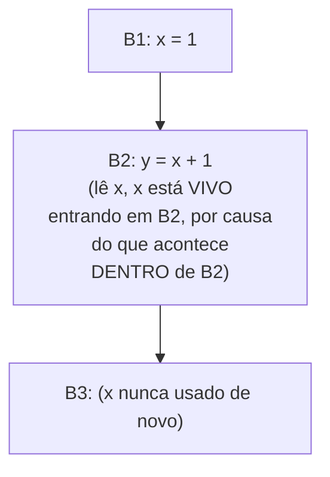

## Objetivos de Aprendizagem

- Definir a vivacidade com precisão: uma variável está viva num ponto se algum caminho a partir dali lê o seu valor atual antes de qualquer reatribuição sobrescrevê-lo.
- Instanciar o arcabouço de fluxo de dados para variáveis vivas: identificar o seu reticulado, a sua direção (para trás, a primeira análise para trás nesta disciplina), a função de transferência e a junção.
- Rodar o algoritmo de lista de trabalho para trás num pequeno CFG, computando os conjuntos de vivacidade IN e OUT para cada bloco.
- Explicar concretamente por que a vivacidade tem de rodar para trás: a vivacidade de uma variável num ponto depende do que acontece DEPOIS daquele ponto, não antes dele.
- Nomear os dois conceitos posteriores que consomem esta análise diretamente: `dead-code-elimination` (esta disciplina) e `register-allocation-via-graph-coloring` (muito depois, em Geração de Código).

## Contexto e Motivação

`reaching-definitions` fez uma pergunta sobre o PASSADO: qual atribuição anterior poderia ser a fonte do valor atual de uma variável? A análise de variáveis vivas faz a pergunta espelhada sobre o FUTURO: o valor ATUAL desta variável jamais será de fato lido de novo antes de ser sobrescrito? Uma variável está VIVA num ponto se a resposta é sim ao longo de algum caminho a partir dali; ela está MORTA se todo caminho a partir dali ou a sobrescreve ou alcança o fim do programa sem jamais lê-la de novo.

Esta é a primeira análise PARA TRÁS nesta disciplina, e a inversão de direção não é incidental, é forçada pela própria pergunta. A vivacidade num ponto é um fato sobre o que acontece MAIS TARDE na execução, então a informação tem de fluir para trás pelo CFG, da saída de um bloco rumo à sua entrada, exatamente a direção oposta à que as definições que alcançam usaram. Dois retornos muito concretos dependem diretamente desta análise: `dead-code-elimination`, alguns conceitos adiante, deleta uma atribuição de uma vez no momento em que a vivacidade reporta que o seu alvo está morto; e `register-allocation-via-graph-coloring`, muito depois em Geração de Código, constrói o seu grafo de interferência inteiro (quais valores podem compartilhar com segurança um registrador) diretamente da informação de vivacidade computada aqui.

## Teoria Central

### Instanciar o arcabouço, para trás desta vez

```text
Reticulado:   conjuntos de nomes de variáveis
Direção:      PARA TRÁS (a vivacidade num ponto depende do que acontece
              a jusante, depois daquele ponto, não a montante antes dele)
Junção:       UNIÃO (uma variável está viva se está viva ao longo de ALGUM
              caminho sucessor, outra análise MAY, como as definições
              que alcançam, mas rodando na direção oposta)
Função de transferência para o bloco B, dado OUT(B) (fatos vivos na saída de B):
  USE(B) = variáveis lidas em B ANTES de qualquer reatribuição dentro de B
  DEF(B) = variáveis atribuídas em B (que alcançam o fim de B sem
           serem lidas de novo primeiro, um tecnicismo que importa só
           para uma variável tanto lida quanto reatribuída dentro do mesmo
           bloco, tratado processando as próprias instruções de B em
           ordem reversa internamente)
  IN(B) = USE(B) ∪ (OUT(B) - DEF(B))
```

`IN(B)` mantém tudo o que está vivo na saída de `B` EXCETO o que `B` em si sobrescreve (já que uma sobrescrita torna qualquer valor ANTERIOR morto a partir daquele ponto para trás), e acrescenta o que quer que `B` leia antes de sobrescrevê-lo.

### Por que para trás, concretamente



Se `x` está vivo na saída de `B1` depende inteiramente do que `B2` faz com ele, um fato que só existe "mais tarde" na ordem de fluxo de controle. Propagar isso para trás (do uso de `B2`, de volta ao fato de saída de `B1`) é a única direção que faz sentido; propagar para frente exigiria conhecer o futuro antes de computar o passado.

## Exemplos Resolvidos

### Exemplo 1: computar a vivacidade numa sequência simples

```text
B1: x = 1
B2: y = x + 1
B3: z = y + 2      ; x NUNCA é usado de novo depois de B2

OUT(B3) = {} (assuma nada vivo depois de B3, fim da função)
IN(B3): USE(B3) = {y}; DEF(B3) = {z}
  IN(B3) = {y} ∪ ({} - {z}) = {y}

OUT(B2) = IN(B3) = {y}
IN(B2): USE(B2) = {x}; DEF(B2) = {y}
  IN(B2) = {x} ∪ ({y} - {y}) = {x}

OUT(B1) = IN(B2) = {x}
IN(B1): USE(B1) = {}; DEF(B1) = {x}
  IN(B1) = {} ∪ ({x} - {x}) = {}

Resultado: x está vivo entrando em B2 (está prestes a ser lido ali), mas x
NÃO está vivo bem no começo de B1, nada o leu ainda naquele
ponto, então não há nada ainda a proteger.
```

### Exemplo 2: uma atribuição morta, achada diretamente a partir da vivacidade

```text
B1: x = 1
B2: x = 2      ; o valor 1 atribuído em B1 NUNCA é lido em lugar nenhum,
B3: y = x + 1   ; só a SEGUNDA atribuição (x = 2) é jamais usada

OUT(B1) = IN(B2)
IN(B2): USE(B2) = {} (B2 não lê nada antes da sua própria atribuição);
        DEF(B2) = {x}
  IN(B2) = {} ∪ (OUT(B2) - {x})

Como x é sobrescrito em B2 antes de ser lido de novo em qualquer lugar de B2
em si, e OUT(B2) de fato inclui x (usado em B3), x ESTÁ vivo na
SAÍDA de B2 (necessário por B3), mas NÃO está vivo na saída de B1 / entrada de B2 de uma
forma que credite a atribuição de B1, DEF(B2) mata o que quer que alcançasse
a entrada de B2 para x, então x=1 de B1 é uma atribuição morta: nada jamais
lê o valor específico 1 antes de ele ser sobrescrito por x=2.
dead-code-elimination (alguns conceitos adiante) deleta a atribuição de B1
de uma vez, usando exatamente essa descoberta.
```

### Exemplo 3: a vivacidade alimentando a alocação de registradores, prévia

```text
x = 1          ; x vivo a partir daqui...
y = 2          ; y vivo a partir daqui...
z = x + y      ; ...até aqui, onde AMBOS são lidos, x e y estão
                 SIMULTANEAMENTE vivos ao longo deste intervalo
w = z + 1      ; x e y agora estão ambos mortos, z está vivo em vez disso

Como x e y estão simultaneamente vivos (ambos necessários na mesma
instrução), eles NÃO PODEM compartilhar com segurança um registrador de máquina, essa
exata relação "simultaneamente vivos", computada por esta análise,
é precisamente o que register-allocation-via-graph-coloring (Geração de
Código, mais adiante nesta disciplina) transforma numa aresta de grafo de
interferência entre x e y.
```

## Equívocos Comuns e Armadilhas

- **"A vivacidade poderia ser computada igualmente para frente, do mesmo jeito que as definições que alcançam."** Ela genuinamente não pode, não como questão de preferência, mas de correção, a vivacidade é definida em termos do que acontece MAIS TARDE (uma leitura futura), então a função de transferência fundamentalmente precisa de informação da saída de um bloco para computar a sua entrada, o oposto do que uma passagem para frente consegue fornecer.
- **"Uma variável atribuída, mas nunca lida em lugar nenhum da função inteira é o único tipo de código morto que esta análise encontra."** O Exemplo 2 mostra um caso mais sutil: `x` É lido mais tarde (em B3), mas uma atribuição ESPECÍFICA a ele (`x = 1` em B1) está morta, porque uma atribuição posterior (`x = 2`) a sobrescreve antes de aquele valor específico ser jamais usado, a vivacidade opera na granularidade de "o valor DESTA atribuição particular é jamais lido", não só "este nome de variável é jamais lido em algum lugar".
- **"Duas variáveis que estão ambas vivas em algum ponto do programa sempre interferem e nunca podem compartilhar um registrador."** Elas interferem só se estiverem SIMULTANEAMENTE vivas, vivas literalmente no mesmo ponto do programa, como no Exemplo 3, duas variáveis que estão cada uma viva em momentos diferentes e não sobrepostos podem compartilhar um registrador com segurança, e essa distinção precisa é exatamente o que `register-allocation-via-graph-coloring` computa um grafo de interferência para capturar corretamente.
- **"USE e DEF de um bloco são computados independentemente, sem se importar com a ordem dentro do bloco."** A ordem dentro de um bloco importa para uma variável tanto lida quanto reatribuída no mesmo bloco, processar as próprias instruções de um bloco em reverso internamente (como a sutileza de DEF(B) da função de transferência nota na Teoria Central) é o que lida corretamente com o caso de uma leitura seguida mais tarde de uma reatribuição da mesma variável dentro de um bloco.

## Resumo

A análise de variáveis vivas instancia o mesmo arcabouço genérico de fluxo de dados que as definições que alcançam, mas rodando para trás: uma variável está viva num ponto se algum caminho adiante a partir dali a lê antes de qualquer reatribuição, computada pelos conjuntos USE (lida antes de qualquer reatribuição local) e DEF (reatribuída localmente) de cada bloco, propagados da saída rumo à entrada e iterados até um ponto fixo. Esta é a primeira análise para trás nesta disciplina, forçada pela natureza da própria pergunta, a vivacidade depende do futuro, não do passado. Os seus dois retornos diretos e concretos são as próprias otimizações cobertas a seguir: `dead-code-elimination` deleta uma atribuição no momento em que o seu alvo é achado morto, e, muito depois, em Geração de Código, `register-allocation-via-graph-coloring` constrói o seu grafo de interferência inteiro exatamente da relação "simultaneamente vivos" que esta análise computa. O conceito seguinte, `available-expressions-analysis`, retorna a uma análise para frente, no estilo MUST, completando o trio a partir do qual as otimizações desta disciplina são construídas.

## Documentation Links

- [Cooper & Torczon — Engineering a Compiler (companion site)](https://shop.elsevier.com/books/book-companion/9780120884780): livro-texto que apresenta a análise de variáveis vivas como a análise de fluxo de dados para trás canônica, e o seu papel direto na alocação de registradores.
- [MIT 6.035 — Computer Language Engineering, Calendar](https://ocw.mit.edu/courses/6-035-computer-language-engineering-sma-5502-fall-2005/pages/calendar/): sequência de aulas de análise de fluxo de dados e de otimização de fluxo de dados que cobre a vivacidade antes da eliminação de código morto.
