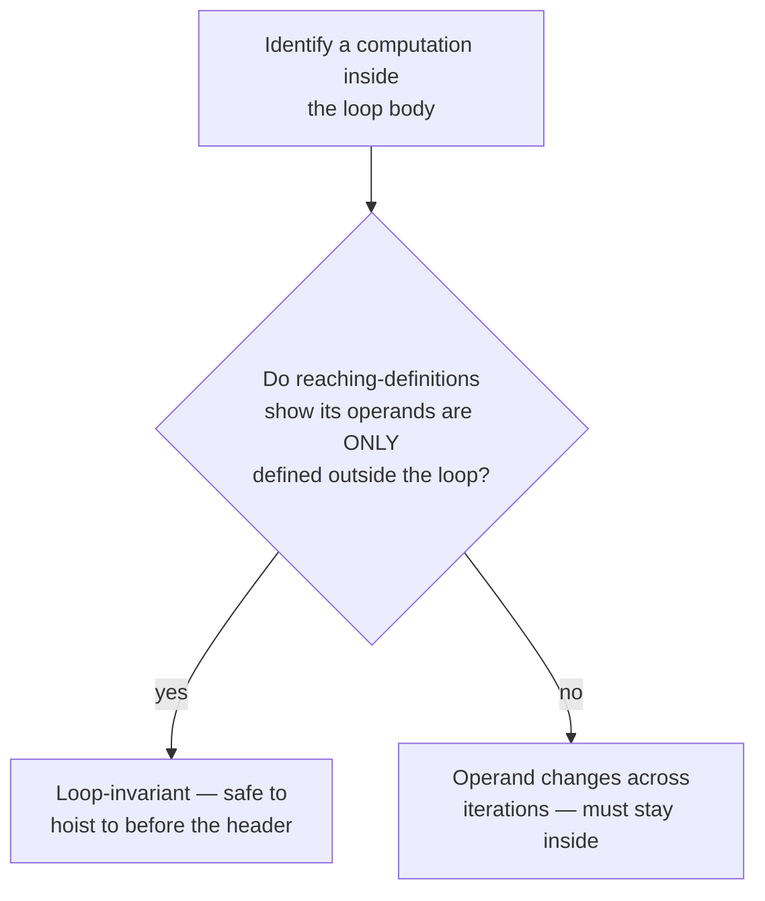

## Learning Objectives

- Explain why loops receive dedicated optimization attention: the same instruction runs many times, so a fixed, one-time cost to optimize it pays off proportionally to the loop's trip count.
- Identify a loop-invariant computation (one whose operands never change across iterations) and hoist it to before the loop, using `reaching-definitions` to justify that hoisting is safe.
- Apply strength reduction to replace an expensive per-iteration multiply (by the loop's induction variable) with a cheaper running addition that produces the identical sequence of values.
- Identify a loop's natural boundary as a specific CFG shape (a back edge with a single entry point, a structure `control-flow-graphs-and-basic-blocks` already made visible as a cycle).
- State precisely why hoisting a computation must not change the number of times it's actually evaluated in a way that could alter observable behavior (e.g., a computation with a side effect, or one that might not have executed at all on some iteration count).

## Context & Motivation

Every optimization covered so far in this discipline applies uniformly across a whole program — a fold here, a dead assignment removed there, each instance independent of how many times that code actually runs. A loop breaks that uniformity in a way worth exploiting directly: a single instruction sitting inside a loop body that executes a thousand times costs a thousand times what the same instruction sitting outside the loop would cost, which means a rewrite that would be a marginal, barely-measurable win anywhere else can be a large, very real win inside a hot loop.

Two classic loop optimizations target this directly. INVARIANT CODE MOTION moves a computation that produces the SAME result on every iteration out of the loop entirely, so it runs once instead of every time. STRENGTH REDUCTION replaces an expensive operation (typically a multiply tied to a loop's own induction variable) with a cheaper one — usually an addition — that provably produces the exact same sequence of values across iterations, without ever needing to perform the expensive operation at all after the first iteration.

## Core Theory

### Recognizing a loop as a CFG shape

`control-flow-graphs-and-basic-blocks` already made a loop visible directly as a cycle — a back edge from a later block to an earlier one. A NATURAL LOOP, the specific shape these optimizations target, has one additional property: a single entry point (a "header" block) that dominates every block inside the loop — meaning every path into the loop body passes through the header first. This single-entry structure is exactly what makes "before the loop" and "inside the loop" well-defined places to move code between.

### Invariant code motion

```text
for (i = 0; i < n; i++) {
  x = a * b;         ; a and b are NEVER reassigned anywhere in
                        the loop — this computation produces the
                        SAME value on every single iteration
  y[i] = x + i;
}
```

`reaching-definitions` is exactly what certifies this is safe to hoist: if the ONLY definitions of `a` and `b` reaching this point are from BEFORE the loop (nothing inside the loop body redefines either), the computation `a * b` is loop-invariant, and can be moved to run exactly once, before the loop starts, instead of once per iteration:

```text
t = a * b;               ; hoisted — computed ONCE
for (i = 0; i < n; i++) {
  x = t;
  y[i] = x + i;
}
```



### Strength reduction on an induction variable

An INDUCTION VARIABLE is a variable that changes by a fixed amount on every iteration (the classic case: a loop counter `i` incremented by 1 each time). An expression that multiplies an induction variable by a constant — `i * 4`, common when indexing into an array of 4-byte elements — changes by the SAME fixed amount each iteration too, which means it can be tracked with a running addition instead of a fresh multiplication every time:

```text
Before:
for (i = 0; i < n; i++) {
  addr = i * 4;          ; a multiply, every single iteration
  y[addr] = ...;
}

After strength reduction:
t = 0;                    ; t tracks i*4, starting at 0*4 = 0
for (i = 0; i < n; i++) {
  addr = t;
  y[addr] = ...;
  t = t + 4;               ; ONE addition replaces the multiply,
                            ; since (i+1)*4 = i*4 + 4 exactly
}
```

This produces the IDENTICAL sequence of values for `addr` on every iteration — `0, 4, 8, 12, ...` — using only additions, which on most real hardware are cheaper than multiplications (a real, measurable win the `computer-architecture` discipline's arithmetic-unit material already establishes at the hardware level).

## Worked Examples

### Example 1: hoisting a loop-invariant array-bound computation

```text
for (i = 0; i < arr.length; i++) {   ; arr.length recomputed EVERY
  process(arr[i]);                     iteration, even though arr
}                                      is never reassigned in the loop

After hoisting:
n = arr.length;      ; computed once
for (i = 0; i < n; i++) {
  process(arr[i]);
}
```

This specific pattern — hoisting a loop bound's length computation — is one of the single most common real-world wins invariant code motion delivers, present in essentially every optimizing compiler's loop pass.

### Example 2: strength reduction combined with the earlier optimizations

```text
for (i = 0; i < n; i++) {
  x = i * 8;             ; strength-reduced to a running += 8
  y = x + base;           ; base is loop-invariant — hoisted separately
  arr[y] = 0;
}

After BOTH optimizations:
t = 0;                    ; tracks i*8
for (i = 0; i < n; i++) {
  x = t;
  y = x + base;             ; base itself doesn't change — but x does
                             each iteration, so this specific + is NOT
                             hoistable; only truly invariant subparts move
  arr[y] = 0;
  t = t + 8;
}
```

This example is deliberately included to show the two optimizations composing on the SAME loop without conflicting — invariant code motion and strength reduction target different computations within the same body, and a real compiler applies both passes, potentially repeatedly, to the same loop.

### Example 3: a computation that looks invariant but must NOT be hoisted

```text
for (i = 0; i < n; i++) {
  if (i == 0) {
    x = expensiveButPure(a, b);   ; produces the SAME value every
  }                                  time it runs, but only RUNS on
  use(x);                            the FIRST iteration in this code
}

Hoisting this above the loop entirely would change the program's
observable behavior if n could be 0 (the hoisted version would call
expensiveButPure even when the loop body never executes at all) —
reaching-definitions and a dominance check together (a fact the
hoisted computation must be guaranteed to execute on EVERY path the
loop could take, including zero iterations) are what a real compiler
must verify before hoisting, not just "does this compute the same
value each time it happens to run."
```

## Common Misconceptions & Pitfalls

- **"Any computation whose value doesn't visibly change across a loop's source code is safe to hoist."** Example 3 shows a real counterexample: a computation guarded by a condition that's only true on some iterations produces the same value each time it DOES run, but hoisting it unconditionally could execute it on a run where the original code never would have (e.g., a zero-iteration loop) — invariance and "safe to hoist unconditionally" are related but not identical conditions.
- **"Strength reduction only applies to multiplication by a loop counter."** The general technique applies to any expression that changes by a fixed, predictable increment each iteration as a function of an induction variable — array indexing by a constant stride is the textbook case, but the underlying idea (replace a recomputation with an incremental update) generalizes further than just `i * constant`.
- **"Loop optimizations are a completely separate category from the general optimizations covered earlier in this discipline."** They are the SAME optimizations (recognizing an invariant computation is directly built on `reaching-definitions`, exactly as `constant-folding-and-constant-propagation` was), applied with special attention to a specific, especially profitable CFG shape (a natural loop) — not a different analytical foundation.
- **"Hoisting a loop-invariant computation always makes the program strictly faster, with no downside to consider."** In the vast majority of cases it does, but hoisting a computation that increases the LIVE RANGE of the value it produces (Example 1's hoisted `n`, for instance, is now live across the entire loop instead of recomputed locally) can, in principle, increase register pressure — a real, if usually minor, tension with `register-allocation-via-graph-coloring`, later in this discipline, that a production compiler's heuristics have to balance.

## Summary

Loop optimizations target the same analytical foundation already built (`reaching-definitions` in particular) but apply it specifically to a natural loop's shape, because a single win inside a loop body pays off once per iteration rather than once total. Invariant code motion hoists a computation whose operands are certified unchanged across iterations to run once, before the loop, instead of on every pass through it — with a genuine caveat about computations that don't provably run on every possible iteration count. Strength reduction replaces a multiply tied to an induction variable with an equivalent running addition, producing the identical sequence of values at lower per-iteration cost. With this concept, the discipline has covered its core optimization toolkit; the next and final optimization concept, `the-undecidability-of-optimization`, steps back to explain the fundamental, provable limit every one of these optimizations operates under — why they are each conservative by necessity, not by choice.

## Documentation Links

- [Cooper & Torczon — Engineering a Compiler (companion site)](https://shop.elsevier.com/books/book-companion/9780120884780) — textbook covering loop-invariant code motion and strength reduction as classic, high-payoff loop optimizations built on the same data-flow foundations.
- [Stanford CS143 — Compilers](http://web.stanford.edu/class/cs143/) — optimization material presenting loops as the highest-leverage target for the analyses and rewrites already covered generally.
