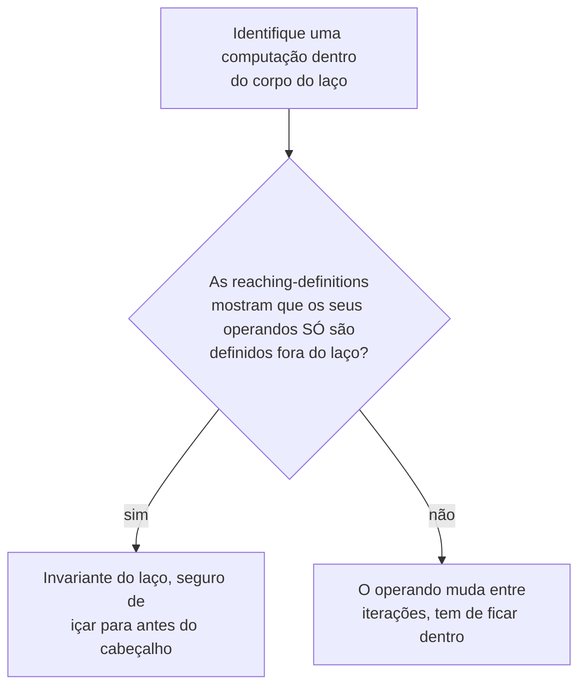

## Objetivos de Aprendizagem

- Explicar por que os laços recebem atenção dedicada de otimização: a mesma instrução roda muitas vezes, então um custo fixo e único de otimizá-la compensa proporcionalmente à contagem de voltas do laço.
- Identificar uma computação invariante do laço (uma cujos operandos nunca mudam entre iterações) e içá-la para antes do laço, usando `reaching-definitions` para justificar que o içamento é seguro.
- Aplicar a redução de força para substituir uma multiplicação cara por iteração (pela variável de indução do laço) por uma adição corrente mais barata que produz a sequência idêntica de valores.
- Identificar a fronteira natural de um laço como um formato específico de CFG (uma aresta de retorno com um único ponto de entrada, uma estrutura que `control-flow-graphs-and-basic-blocks` já tornou visível como um ciclo).
- Enunciar com precisão por que içar uma computação não deve mudar o número de vezes que ela é de fato avaliada de uma forma que poderia alterar o comportamento observável (ex.: uma computação com efeito colateral, ou uma que poderia não ter executado de forma alguma em alguma contagem de iterações).

## Contexto e Motivação

Toda otimização coberta até aqui nesta disciplina se aplica uniformemente por um programa inteiro, uma dobra aqui, uma atribuição morta removida ali, cada instância independente de quantas vezes aquele código de fato roda. Um laço quebra essa uniformidade de uma forma que vale explorar diretamente: uma única instrução dentro de um corpo de laço que executa mil vezes custa mil vezes o que a mesma instrução fora do laço custaria, o que significa que uma reescrita que seria um ganho marginal e mal mensurável em qualquer outro lugar pode ser um ganho grande e muito real dentro de um laço quente.

Duas otimizações clássicas de laço miram isso diretamente. A MOVIMENTAÇÃO DE CÓDIGO INVARIANTE move uma computação que produz o MESMO resultado em toda iteração para fora do laço inteiramente, de modo que ela roda uma vez em vez de toda vez. A REDUÇÃO DE FORÇA substitui uma operação cara (tipicamente uma multiplicação ligada à própria variável de indução de um laço) por uma mais barata, normalmente uma adição, que comprovadamente produz a exata mesma sequência de valores entre iterações, sem jamais precisar realizar a operação cara de forma alguma depois da primeira iteração.

## Teoria Central

### Reconhecer um laço como um formato de CFG

`control-flow-graphs-and-basic-blocks` já tornou um laço visível diretamente como um ciclo, uma aresta de retorno de um bloco posterior para um anterior. Um LAÇO NATURAL, o formato específico que essas otimizações miram, tem uma propriedade adicional: um único ponto de entrada (um bloco "cabeçalho") que domina todo bloco dentro do laço, ou seja, todo caminho para dentro do corpo do laço passa primeiro pelo cabeçalho. Essa estrutura de entrada única é exatamente o que torna "antes do laço" e "dentro do laço" lugares bem definidos entre os quais mover código.

### Movimentação de código invariante

```text
for (i = 0; i < n; i++) {
  x = a * b;         ; a e b NUNCA são reatribuídos em lugar nenhum do
                        laço, esta computação produz o
                        MESMO valor em toda iteração
  y[i] = x + i;
}
```

`reaching-definitions` é exatamente o que certifica que isto é seguro de içar: se as ÚNICAS definições de `a` e `b` que alcançam este ponto são de ANTES do laço (nada dentro do corpo do laço redefine qualquer um), a computação `a * b` é invariante do laço, e pode ser movida para rodar exatamente uma vez, antes de o laço começar, em vez de uma vez por iteração:

```text
t = a * b;               ; içada, computada UMA VEZ
for (i = 0; i < n; i++) {
  x = t;
  y[i] = x + i;
}
```



### Redução de força sobre uma variável de indução

Uma VARIÁVEL DE INDUÇÃO é uma variável que muda por uma quantia fixa em toda iteração (o caso clássico: um contador de laço `i` incrementado de 1 a cada vez). Uma expressão que multiplica uma variável de indução por uma constante, `i * 4`, comum ao indexar num array de elementos de 4 bytes, muda pela MESMA quantia fixa a cada iteração também, o que significa que ela pode ser rastreada com uma adição corrente em vez de uma multiplicação nova toda vez:

```text
Antes:
for (i = 0; i < n; i++) {
  addr = i * 4;          ; uma multiplicação, em toda iteração
  y[addr] = ...;
}

Depois da redução de força:
t = 0;                    ; t rastreia i*4, começando em 0*4 = 0
for (i = 0; i < n; i++) {
  addr = t;
  y[addr] = ...;
  t = t + 4;               ; UMA adição substitui a multiplicação,
                            ; já que (i+1)*4 = i*4 + 4 exatamente
}
```

Isso produz a sequência IDÊNTICA de valores para `addr` em toda iteração, `0, 4, 8, 12, ...`, usando só adições, que na maioria do hardware real são mais baratas do que multiplicações (um ganho real e mensurável que o material de unidade aritmética da disciplina `computer-architecture` já estabelece no nível do hardware).

## Exemplos Resolvidos

### Exemplo 1: içar uma computação invariante de limite de array

```text
for (i = 0; i < arr.length; i++) {   ; arr.length recomputado EM TODA
  process(arr[i]);                     iteração, mesmo que arr
}                                      nunca seja reatribuído no laço

Depois de içar:
n = arr.length;      ; computado uma vez
for (i = 0; i < n; i++) {
  process(arr[i]);
}
```

Esse padrão específico, içar a computação de comprimento de um limite de laço, é um dos ganhos de mundo real individuais mais comuns que a movimentação de código invariante entrega, presente em essencialmente toda passagem de laço de compilador otimizador.

### Exemplo 2: redução de força combinada com as otimizações anteriores

```text
for (i = 0; i < n; i++) {
  x = i * 8;             ; reduzida de força para um += 8 corrente
  y = x + base;           ; base é invariante do laço, içada separadamente
  arr[y] = 0;
}

Depois de AMBAS as otimizações:
t = 0;                    ; rastreia i*8
for (i = 0; i < n; i++) {
  x = t;
  y = x + base;             ; base em si não muda, mas x muda
                             a cada iteração, então este + específico NÃO é
                             içável; só subpartes verdadeiramente invariantes movem
  arr[y] = 0;
  t = t + 8;
}
```

Este exemplo é incluído deliberadamente para mostrar as duas otimizações se compondo no MESMO laço sem conflitar, a movimentação de código invariante e a redução de força miram computações diferentes dentro do mesmo corpo, e um compilador real aplica ambas as passagens, potencialmente repetidamente, ao mesmo laço.

### Exemplo 3: uma computação que parece invariante, mas NÃO deve ser içada

```text
for (i = 0; i < n; i++) {
  if (i == 0) {
    x = expensiveButPure(a, b);   ; produz o MESMO valor toda
  }                                  vez que roda, mas só RODA na
  use(x);                            PRIMEIRA iteração neste código
}

Içar isto acima do laço inteiramente mudaria o comportamento
observável do programa se n pudesse ser 0 (a versão içada chamaria
expensiveButPure mesmo quando o corpo do laço nunca executa de forma alguma),
reaching-definitions e uma checagem de dominância juntas (um fato de que a
computação içada tem de ter garantia de executar em TODO caminho que o
laço poderia tomar, incluindo zero iterações) são o que um compilador real
tem de verificar antes de içar, não só "isto computa o mesmo
valor toda vez que por acaso roda".
```

## Equívocos Comuns e Armadilhas

- **"Qualquer computação cujo valor não muda visivelmente ao longo do código-fonte de um laço é segura de içar."** O Exemplo 3 mostra um contraexemplo real: uma computação protegida por uma condição que só é verdadeira em algumas iterações produz o mesmo valor toda vez que de fato RODA, mas içá-la incondicionalmente poderia executá-la numa execução onde o código original nunca o faria (ex.: um laço de zero iterações), a invariância e "seguro de içar incondicionalmente" são condições relacionadas, mas não idênticas.
- **"A redução de força só se aplica a multiplicação por um contador de laço."** A técnica geral se aplica a qualquer expressão que muda por um incremento fixo e previsível a cada iteração como função de uma variável de indução, a indexação de array por um passo constante é o caso de livro-texto, mas a ideia subjacente (substituir uma recomputação por uma atualização incremental) generaliza mais do que só `i * constante`.
- **"As otimizações de laço são uma categoria completamente separada das otimizações gerais cobertas antes nesta disciplina."** Elas são as MESMAS otimizações (reconhecer uma computação invariante é construído diretamente sobre `reaching-definitions`, exatamente como `constant-folding-and-constant-propagation` foi), aplicadas com atenção especial a um formato de CFG específico e especialmente lucrativo (um laço natural), não uma fundação analítica diferente.
- **"Içar uma computação invariante do laço sempre torna o programa estritamente mais rápido, sem nenhuma desvantagem a considerar."** Na vasta maioria dos casos sim, mas içar uma computação que aumenta o INTERVALO DE VIDA do valor que ela produz (o `n` içado do Exemplo 1, por exemplo, agora está vivo ao longo do laço inteiro em vez de recomputado localmente) pode, em princípio, aumentar a pressão de registradores, uma tensão real, ainda que normalmente menor, com `register-allocation-via-graph-coloring`, mais adiante nesta disciplina, que as heurísticas de um compilador de produção têm de equilibrar.

## Resumo

As otimizações de laço miram a mesma fundação analítica já construída (`reaching-definitions` em particular), mas a aplicam especificamente ao formato de um laço natural, porque um único ganho dentro de um corpo de laço compensa uma vez por iteração em vez de uma vez no total. A movimentação de código invariante iça uma computação cujos operandos são certificados inalterados entre iterações para rodar uma vez, antes do laço, em vez de em toda passagem por ele, com uma ressalva genuína sobre computações que não comprovadamente rodam em toda contagem de iterações possível. A redução de força substitui uma multiplicação ligada a uma variável de indução por uma adição corrente equivalente, produzindo a sequência idêntica de valores a um custo por iteração menor. Com este conceito, a disciplina cobriu o seu conjunto central de ferramentas de otimização; o próximo e último conceito de otimização, `the-undecidability-of-optimization`, dá um passo atrás para explicar o limite fundamental e comprovável sob o qual cada uma dessas otimizações opera, por que elas são cada uma conservadora por necessidade, não por escolha.

## Documentation Links

- [Cooper & Torczon — Engineering a Compiler (companion site)](https://shop.elsevier.com/books/book-companion/9780120884780): livro-texto que cobre a movimentação de código invariante do laço e a redução de força como otimizações de laço clássicas e de alto retorno construídas sobre as mesmas fundações de fluxo de dados.
- [Stanford CS143 — Compilers](http://web.stanford.edu/class/cs143/): material de otimização que apresenta os laços como o alvo de maior alavancagem para as análises e reescritas já cobertas de forma geral.
