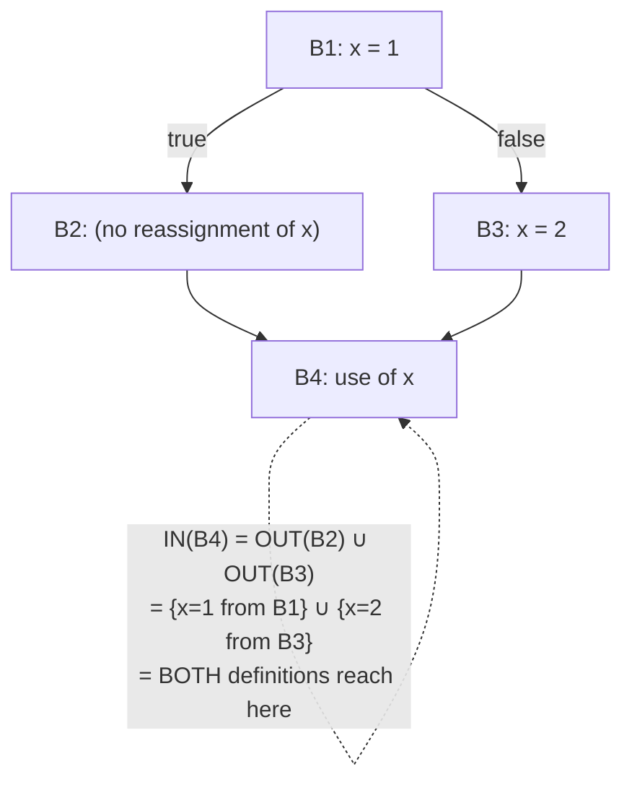

## Learning Objectives

- Define reaching definitions precisely: a definition of a variable "reaches" a program point if there is some path from that definition to that point along which the variable is never reassigned.
- Instantiate the generic data-flow framework for reaching definitions: identify its lattice (sets of definitions), its direction (forward), its transfer function, and its join operator.
- Run the worklist algorithm by hand on a small CFG with a branch, computing the exact set of reaching definitions at each block's entry and exit.
- Explain why reaching definitions is a MAY analysis (join = union), and what that choice means for correctness: better to consider a definition reaching when it might not, than to miss one that does.
- Connect this analysis forward to `constant-folding-and-constant-propagation`, which needs exactly this information before substituting a variable's known value.

## Context & Motivation

`the-data-flow-analysis-framework-lattices-and-fixed-points` set up the general recipe; reaching definitions is the first concrete analysis to plug into it, and arguably the most fundamental one, because so many later optimizations depend on it directly. The question it answers: at a given point in the program, which ASSIGNMENTS to a variable could possibly be the one whose value is currently sitting in it? `static-single-assignment-form` sidestepped needing an answer to this for most cases by construction (each SSA-renamed variable has exactly one assignment), but reaching definitions is the general analysis that answers the same question for ordinary, non-renamed code, and is also exactly the algorithm SSA CONSTRUCTION itself is built on internally.

Concretely, `constant-folding-and-constant-propagation`, a few concepts ahead, needs to know: "is `x = 5` the ONLY definition that could reach this specific use of `x`?" — if so, substituting `5` directly for `x` at that use is provably safe; if some other definition might ALSO reach it, the substitution would be unsound. Reaching definitions is precisely the analysis that answers this question correctly, for every use in the program, in one pass to a fixed point.

## Core Theory

### Instantiating the framework

```text
Lattice:      sets of definitions (each definition identified by,
              e.g., the instruction number that performs it)
Direction:    FORWARD (a definition made earlier can reach a point
              later, following the natural flow of execution)
Join:         UNION (a definition reaches a point if it reaches along
              SOME path — this is a MAY analysis, not a MUST one)
Transfer function for block B, given IN(B) (facts reaching B's entry):
  GEN(B)  = definitions made INSIDE B that are not killed later in B
  KILL(B) = definitions of any variable that B itself reassigns
            (any earlier definition of that SAME variable no longer
            reaches past this point, since B overwrote it)
  OUT(B) = GEN(B) ∪ (IN(B) - KILL(B))
```

`OUT(B)` keeps everything that reached `B`'s entry EXCEPT what `B` itself killed by reassigning, and adds whatever `B` newly defines.

### Why union, not intersection

Reaching definitions deliberately asks "could this definition possibly be the source of the current value" — a MAY question. At a merge point with two incoming paths, a definition reaching along EITHER path is considered reaching at the merge, because on any given actual run, either path might have been the one taken — using intersection instead (only definitions reaching along BOTH paths) would incorrectly discard a definition that a real execution really could have taken.



## Worked Examples

### Example 1: computing reaching definitions on a small diamond

```text
d1: x = 1
    if (c) {
d2:   x = 2
    }
d3: y = x

CFG:  B1 [d1, branch]  -->  B2 [d2]  -->  B4 [d3]
                       \--------------> /
                       (fall-through when c is false)
```

```text
GEN(B1) = {d1};   KILL(B1) = {} (nothing to kill yet)
OUT(B1) = {d1}

GEN(B2) = {d2};   KILL(B2) = {d1}  (d2 reassigns x, killing d1)
IN(B2) = OUT(B1) = {d1}
OUT(B2) = {d2} ∪ ({d1} - {d1}) = {d2}

IN(B4) = OUT(B2) ∪ OUT(B1-directly, via the false branch) = {d2} ∪ {d1} = {d1, d2}
  (both d1 and d2 could be the source of x's value at d3,
   depending on whether the branch was taken)
```

`d3: y = x` therefore has TWO reaching definitions for `x` — `constant-folding-and-constant-propagation` cannot safely substitute a single constant for `x` here, precisely BECAUSE this analysis correctly reports that ambiguity rather than guessing.

### Example 2: a case where exactly one definition reaches, enabling constant propagation

```text
d1: x = 5
d2: y = x + 1     ; only d1 reaches here — no branch, no reassignment
```

```text
GEN(B1) = {d1};  OUT(B1) = {d1}
IN(B2) = OUT(B1) = {d1}   (single definition, unambiguous)

Since exactly ONE definition of x reaches d2, and that definition
assigns a known constant (5), constant-folding-and-constant-propagation
can safely rewrite d2 as: y = 5 + 1, and then fold further to y = 6.
```

### Example 3: iterating to a fixed point around a loop

```text
d1: x = 0
    while (...) {
d2:   x = x + 1
    }
d3: y = x

Pass 1: IN(loop body) initially only reflects d1 (the back edge
  hasn't propagated d2's contribution back around yet)
  → OUT(loop body) = {d2}, KILL includes d1 (x reassigned)

Pass 2: IN(loop body) now reflects BOTH d1 (first iteration) and d2
  (every subsequent iteration, via the back edge) — join gives
  {d1, d2}
  → OUT(loop body) unchanged at {d2} (d2 still kills whatever reached it)

No further change on Pass 3 → fixed point.
Final answer at d3: IN(B_after_loop) = {d1, d2} — the loop might
  have executed zero times (only d1 reaches) or one-or-more times
  (d2 reaches), so BOTH are correctly reported as possibly reaching.
```

## Common Misconceptions & Pitfalls

- **"If a variable is reassigned anywhere in a block, none of its earlier definitions reach past that block at all."** A definition is only killed by a LATER reassignment of the SAME variable, and only from the point of that reassignment onward — Example 1's `d1` still reaches every point BEFORE `d2` executes; it's only killed starting at `d2` itself, not retroactively erased from having reached earlier points.
- **"Reaching definitions should use intersection at merge points, since a compiler wants CERTAIN facts, not just possible ones."** Reaching definitions is specifically a MAY analysis by design — union is the correct operator, because the whole point is to identify EVERY definition that could possibly be the source, so that no ambiguity is silently and unsoundly discarded; a MUST analysis with intersection would be a different, incorrect algorithm for this particular question.
- **"Once a fixed point is reached, the facts are 'approximately' correct, close enough for optimization purposes."** They are EXACTLY correct, given the analysis's own must/may semantics — reaching definitions never claims more precision than "these are all the definitions that could possibly reach," and downstream optimizations like constant propagation only act when the analysis's own answer is precise enough (a single reaching definition) to justify it.
- **"This analysis only matters for the constant-folding optimization mentioned here."** Reaching definitions is also the standard technique SSA CONSTRUCTION itself is built on internally (deciding exactly where Φ functions are needed is fundamentally a reaching-definitions-style computation), and it underlies several other classic optimizations (like certain forms of dead-store detection) not covered as their own concepts in this discipline.

## Summary

Reaching definitions instantiates the generic data-flow framework as a forward, union-based (MAY) analysis: a definition reaches a program point if some path from it to that point never reassigns the variable in between, computed via each block's GEN (definitions made and not locally killed) and KILL (definitions of any variable the block itself reassigns) sets, iterated to a fixed point exactly as `the-data-flow-analysis-framework-lattices-and-fixed-points` describes generically. When exactly one definition reaches a use, and that definition assigns a known constant, `constant-folding-and-constant-propagation` can safely substitute it — the direct, concrete payoff this analysis exists to provide. The next concept, `live-variable-analysis`, instantiates the same framework in the opposite direction — backward instead of forward — to answer a complementary question about a variable's future use rather than its past definition.

## Documentation Links

- [Cooper & Torczon — Engineering a Compiler (companion site)](https://shop.elsevier.com/books/book-companion/9780120884780) — textbook presenting reaching definitions as the canonical first instance of the forward, union-based data-flow analysis.
- [Stanford CS143 — Compilers](http://web.stanford.edu/class/cs143/) — optimization material using reaching definitions as the analysis underlying constant propagation.
