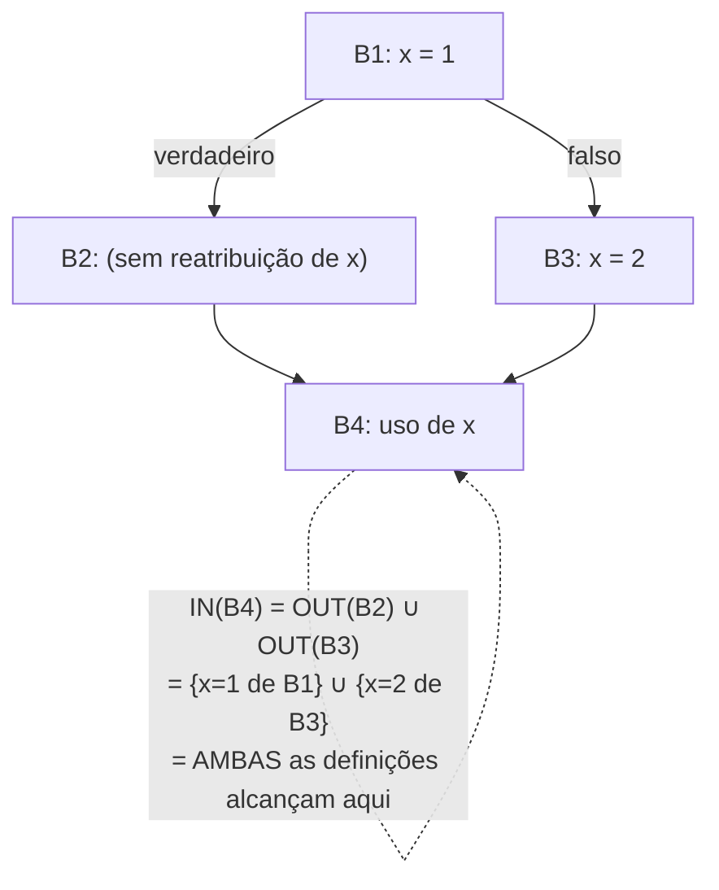

## Objetivos de Aprendizagem

- Definir as definições que alcançam com precisão: uma definição de uma variável "alcança" um ponto do programa se há algum caminho daquela definição até aquele ponto ao longo do qual a variável nunca é reatribuída.
- Instanciar o arcabouço genérico de fluxo de dados para as definições que alcançam: identificar o seu reticulado (conjuntos de definições), a sua direção (para frente), a sua função de transferência e o seu operador de junção.
- Rodar o algoritmo de lista de trabalho à mão num pequeno CFG com um desvio, computando o conjunto exato de definições que alcançam na entrada e na saída de cada bloco.
- Explicar por que as definições que alcançam são uma análise MAY (junção = união), e o que essa escolha significa para a correção: melhor considerar uma definição como alcançando quando talvez não alcance, do que perder uma que alcança.
- Conectar esta análise adiante a `constant-folding-and-constant-propagation`, que precisa exatamente desta informação antes de substituir o valor conhecido de uma variável.

## Contexto e Motivação

`the-data-flow-analysis-framework-lattices-and-fixed-points` montou a receita geral; as definições que alcançam são a primeira análise concreta a se encaixar nela, e indiscutivelmente a mais fundamental, porque tantas otimizações posteriores dependem dela diretamente. A pergunta que ela responde: num dado ponto do programa, quais ATRIBUIÇÕES a uma variável poderiam possivelmente ser aquela cujo valor está atualmente nela? `static-single-assignment-form` contornou a necessidade de uma resposta a isso para a maioria dos casos por construção (cada variável renomeada por SSA tem exatamente uma atribuição), mas as definições que alcançam são a análise geral que responde à mesma pergunta para código comum, não renomeado, e são também exatamente o algoritmo sobre o qual a própria CONSTRUÇÃO de SSA é construída internamente.

Concretamente, `constant-folding-and-constant-propagation`, alguns conceitos adiante, precisa saber: "`x = 5` é a ÚNICA definição que poderia alcançar este uso específico de `x`?", se sim, substituir `5` diretamente por `x` naquele uso é comprovadamente seguro; se alguma outra definição poderia TAMBÉM alcançá-lo, a substituição seria incorreta. As definições que alcançam são precisamente a análise que responde a essa pergunta corretamente, para todo uso no programa, numa passagem até um ponto fixo.

## Teoria Central

### Instanciar o arcabouço

```text
Reticulado:   conjuntos de definições (cada definição identificada por,
              ex., o número de instrução que a realiza)
Direção:      PARA FRENTE (uma definição feita antes pode alcançar um ponto
              depois, seguindo o fluxo natural de execução)
Junção:       UNIÃO (uma definição alcança um ponto se o alcança ao longo de
              ALGUM caminho, esta é uma análise MAY, não uma MUST)
Função de transferência para o bloco B, dado IN(B) (fatos que alcançam a entrada de B):
  GEN(B)  = definições feitas DENTRO de B que não são mortas mais tarde em B
  KILL(B) = definições de qualquer variável que B em si reatribui
            (qualquer definição anterior dessa MESMA variável não mais
            alcança além deste ponto, já que B a sobrescreveu)
  OUT(B) = GEN(B) ∪ (IN(B) - KILL(B))
```

`OUT(B)` mantém tudo o que alcançou a entrada de `B` EXCETO o que `B` em si matou ao reatribuir, e acrescenta o que quer que `B` novamente defina.

### Por que união, não interseção

As definições que alcançam deliberadamente perguntam "esta definição poderia possivelmente ser a fonte do valor atual", uma pergunta MAY. Num ponto de junção com dois caminhos de entrada, uma definição que alcança ao longo de QUALQUER caminho é considerada alcançando na junção, porque em qualquer execução real dada, qualquer caminho poderia ter sido o tomado, usar interseção em vez disso (só definições que alcançam ao longo de AMBOS os caminhos) descartaria incorretamente uma definição que uma execução real de fato poderia ter tomado.



## Exemplos Resolvidos

### Exemplo 1: computar as definições que alcançam num pequeno diamante

```text
d1: x = 1
    if (c) {
d2:   x = 2
    }
d3: y = x

CFG:  B1 [d1, desvio]  -->  B2 [d2]  -->  B4 [d3]
                       \--------------> /
                       (passagem direta quando c é falso)
```

```text
GEN(B1) = {d1};   KILL(B1) = {} (nada a matar ainda)
OUT(B1) = {d1}

GEN(B2) = {d2};   KILL(B2) = {d1}  (d2 reatribui x, matando d1)
IN(B2) = OUT(B1) = {d1}
OUT(B2) = {d2} ∪ ({d1} - {d1}) = {d2}

IN(B4) = OUT(B2) ∪ OUT(B1-diretamente, pelo ramo falso) = {d2} ∪ {d1} = {d1, d2}
  (tanto d1 quanto d2 poderiam ser a fonte do valor de x em d3,
   dependendo de se o desvio foi tomado)
```

`d3: y = x` tem, portanto, DUAS definições que alcançam para `x`, `constant-folding-and-constant-propagation` não pode substituir com segurança uma única constante por `x` aqui, precisamente PORQUE esta análise reporta corretamente essa ambiguidade em vez de chutar.

### Exemplo 2: um caso onde exatamente uma definição alcança, viabilizando a propagação de constantes

```text
d1: x = 5
d2: y = x + 1     ; só d1 alcança aqui, sem desvio, sem reatribuição
```

```text
GEN(B1) = {d1};  OUT(B1) = {d1}
IN(B2) = OUT(B1) = {d1}   (definição única, sem ambiguidade)

Como exatamente UMA definição de x alcança d2, e essa definição
atribui uma constante conhecida (5), constant-folding-and-constant-propagation
pode reescrever d2 com segurança como: y = 5 + 1, e depois dobrar mais para y = 6.
```

### Exemplo 3: iterar até um ponto fixo em torno de um laço

```text
d1: x = 0
    while (...) {
d2:   x = x + 1
    }
d3: y = x

Passagem 1: IN(corpo do laço) inicialmente reflete só d1 (a aresta de
  retorno ainda não propagou a contribuição de d2 de volta)
  → OUT(corpo do laço) = {d2}, KILL inclui d1 (x reatribuído)

Passagem 2: IN(corpo do laço) agora reflete TANTO d1 (primeira iteração) quanto d2
  (toda iteração subsequente, pela aresta de retorno), a junção dá
  {d1, d2}
  → OUT(corpo do laço) inalterado em {d2} (d2 ainda mata o que quer que o alcance)

Nenhuma outra mudança na Passagem 3 → ponto fixo.
Resposta final em d3: IN(B_após_o_laço) = {d1, d2}, o laço poderia
  ter executado zero vezes (só d1 alcança) ou uma-ou-mais vezes
  (d2 alcança), então AMBAS são corretamente reportadas como possivelmente alcançando.
```

## Equívocos Comuns e Armadilhas

- **"Se uma variável é reatribuída em qualquer lugar de um bloco, nenhuma das suas definições anteriores alcança além daquele bloco de forma alguma."** Uma definição só é morta por uma reatribuição POSTERIOR da MESMA variável, e só a partir do ponto daquela reatribuição em diante, o `d1` do Exemplo 1 ainda alcança todo ponto ANTES de `d2` executar; ele só é morto começando em `d2` em si, não retroativamente apagado de ter alcançado pontos anteriores.
- **"As definições que alcançam deveriam usar interseção nos pontos de junção, já que um compilador quer fatos CERTOS, não só possíveis."** As definições que alcançam são especificamente uma análise MAY por design, a união é o operador correto, porque o ponto inteiro é identificar TODA definição que poderia possivelmente ser a fonte, de modo que nenhuma ambiguidade seja silenciosa e incorretamente descartada; uma análise MUST com interseção seria um algoritmo diferente e incorreto para esta pergunta específica.
- **"Uma vez que um ponto fixo é alcançado, os fatos são 'aproximadamente' corretos, perto o bastante para fins de otimização."** Eles são EXATAMENTE corretos, dada a própria semântica must/may da análise, as definições que alcançam nunca alegam mais precisão do que "estas são todas as definições que poderiam possivelmente alcançar", e as otimizações a jusante como a propagação de constantes só atuam quando a própria resposta da análise é precisa o bastante (uma única definição que alcança) para justificá-lo.
- **"Esta análise só importa para a otimização de dobra de constantes mencionada aqui."** As definições que alcançam são também a técnica padrão sobre a qual a própria CONSTRUÇÃO de SSA é construída internamente (decidir exatamente onde as funções Φ são necessárias é fundamentalmente uma computação no estilo de definições que alcançam), e ela fundamenta várias outras otimizações clássicas (como certas formas de detecção de dead-store) não cobertas como seus próprios conceitos nesta disciplina.

## Resumo

As definições que alcançam instanciam o arcabouço genérico de fluxo de dados como uma análise para frente, baseada em união (MAY): uma definição alcança um ponto do programa se algum caminho dela até aquele ponto nunca reatribui a variável no meio, computada pelos conjuntos GEN (definições feitas e não mortas localmente) e KILL (definições de qualquer variável que o próprio bloco reatribui) de cada bloco, iterados até um ponto fixo exatamente como `the-data-flow-analysis-framework-lattices-and-fixed-points` descreve genericamente. Quando exatamente uma definição alcança um uso, e essa definição atribui uma constante conhecida, `constant-folding-and-constant-propagation` pode substituí-la com segurança, o retorno direto e concreto que esta análise existe para fornecer. O conceito seguinte, `live-variable-analysis`, instancia o mesmo arcabouço na direção oposta, para trás em vez de para frente, para responder a uma pergunta complementar sobre o uso futuro de uma variável, em vez da sua definição passada.

## Documentation Links

- [Cooper & Torczon — Engineering a Compiler (companion site)](https://shop.elsevier.com/books/book-companion/9780120884780): livro-texto que apresenta as definições que alcançam como a primeira instância canônica da análise de fluxo de dados para frente, baseada em união.
- [Stanford CS143 — Compilers](http://web.stanford.edu/class/cs143/): material de otimização que usa as definições que alcançam como a análise que fundamenta a propagação de constantes.
