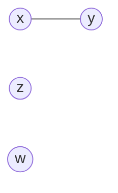
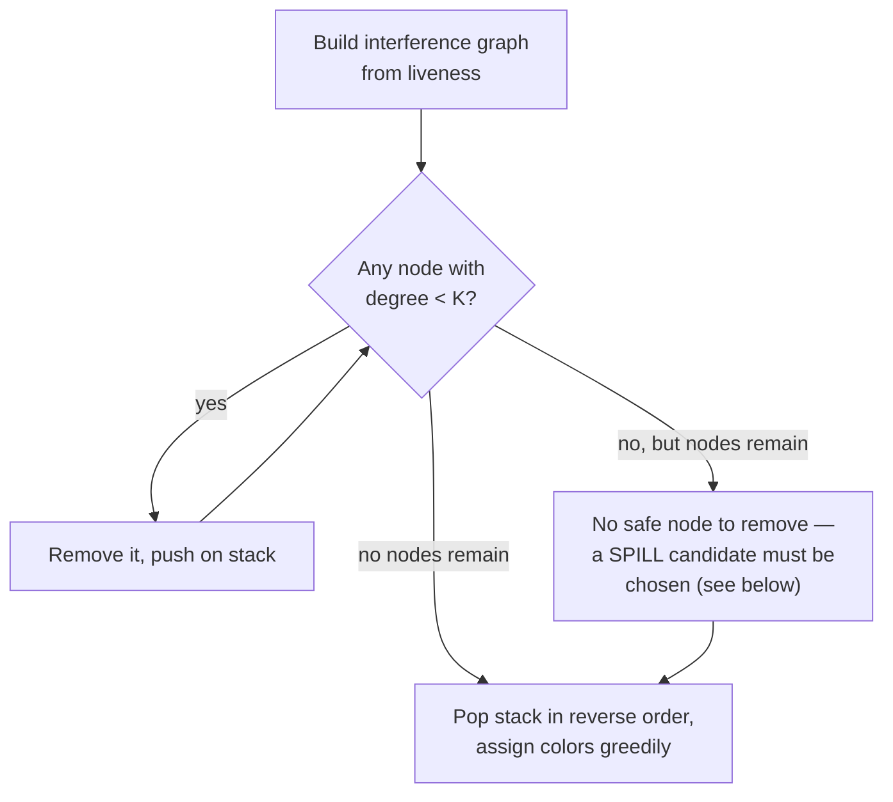

## Learning Objectives

- Build an interference graph from live-variable information: one node per virtual register/temporary, one edge between any two that are simultaneously live.
- Explain graph coloring's role precisely: a valid K-coloring of the interference graph (K = the number of real machine registers) assigns real registers with no conflict.
- Apply the Chaitin-style simplify-and-select algorithm by hand on a small interference graph: repeatedly remove a node with fewer than K neighbors, then color in reverse removal order.
- Explain what happens when no node has fewer than K neighbors (a SPILL is required), and what spilling actually means at the machine-code level.
- Explain register coalescing: merging two registers connected by a plain move into one, eliminating the move entirely when it doesn't create a new conflict.

## Context & Motivation

`instruction-selection-tree-pattern-matching` generated real target instructions, but left every operand as a VIRTUAL register — an unlimited-supply placeholder standing in for "some register, to be decided later." Real hardware has nowhere near an unlimited supply: x86-64, as `x86-64-registers-and-data-movement` already covered concretely, offers a small, fixed set of general-purpose registers. Register allocation is the pass that maps the unlimited virtual registers down onto that small, real set — and doing it well is one of the single highest-leverage optimizations a compiler performs, because a value kept in a register is dramatically cheaper to access than one spilled to memory on the stack.

The dominant classical technique, due to Chaitin, reduces this entirely to a graph-coloring problem: build an INTERFERENCE GRAPH where two virtual registers are connected by an edge exactly when `live-variable-analysis` shows they are SIMULTANEOUSLY live (both needed at the same program point, so they cannot share one physical register without corrupting each other's value) — then find a valid coloring of that graph using K colors, one per available real register.

## Core Theory

### Building the interference graph from liveness

```text
x = 1          ; x live from here...
y = 2          ; y live from here...
z = x + y      ; ...to here, where BOTH x and y are read
w = z + 1      ; x and y are now dead — z is live instead
```

`live-variable-analysis`'s own worked example already computed exactly this: `x` and `y` are simultaneously live across the range from their assignments to the line that reads both — an edge is added between `x` and `y` in the interference graph. `z` and `w` are never simultaneously live with `x` or `y` in this snippet, so no edges connect them.



### Chaitin-style simplify and select

```text
Simplify: repeatedly find a node with FEWER than K neighbors (degree
  < K) and remove it from the graph, pushing it onto a stack — a node
  with fewer neighbors than available colors is guaranteed to be
  colorable LATER, no matter what colors its neighbors end up with,
  because at most K-1 colors could possibly be taken by the time
  it's put back.

Select: pop nodes off the stack in REVERSE order of removal, assigning
  each one any color not already used by its (already-colored)
  neighbors — guaranteed to succeed for every node removed during
  Simplify, by the property that justified removing it in the first
  place.
```



### Spilling: when the graph resists a clean simplification

If every remaining node has degree ≥ K (every virtual register conflicts with at least K others), Simplify gets stuck — some value genuinely cannot be guaranteed a register no matter how the rest of the graph colors. The algorithm then picks a SPILL CANDIDATE (typically by a heuristic favoring a value that's cheap to reload and infrequently used) and rewrites the program to store that value to a stack slot after it's computed and reload it from the stack immediately before each use — trading a real, measurable runtime cost (extra memory traffic) for making the remaining graph colorable. After spilling, the graph is rebuilt and the algorithm re-run, since removing that one value's continuous interference can free up room for everything else.

### Coalescing: eliminating redundant moves

A `mov` instruction copying one register directly into another (common right after instruction selection, or at a Φ-function's lowering point from `static-single-assignment-form`) can sometimes be eliminated entirely: if the source and destination registers of that move do NOT interfere with each other (never simultaneously live in a way that would conflict), they can be COALESCED — merged into a single node in the interference graph — so the allocator assigns them the same physical register and the move instruction becomes unnecessary, deleted outright.

## Worked Examples

### Example 1: coloring a small interference graph with K = 2 registers

```text
Interference graph:  a --- b,   c (isolated, no edges)

Simplify:
  c has degree 0 < 2 → remove, push [c]
  Now only a-b remains, each has degree 1 < 2 → remove a, push [c, a]
  Only b remains, degree 0 < 2 → remove, push [c, a, b]

Select (reverse order: b, a, c):
  b: no colored neighbors yet → color R0
  a: neighbor b is R0 → must pick a DIFFERENT color → R1
  c: no neighbors at all → any color, say R0

Result: a → R1, b → R0, c → R0 — a and b get different registers
  (since they interfere), c can safely share R0 with b (they never
  interfere), using only 2 real registers total.
```

### Example 2: a graph that forces a spill

```text
Interference graph with K = 2, where a, b, c ALL pairwise interfere
(each pair simultaneously live at some point):
  a --- b, b --- c, a --- c   (a triangle — every node has degree 2)

Simplify: no node has degree < 2 (every node has EXACTLY 2 neighbors,
  not fewer) → stuck, must choose a spill candidate.

Choose c as the spill candidate (say, cheapest to reload):
  Rewrite the program: store c to the stack after it's computed,
  reload it into a temporary register immediately before each use.
  Rebuild the interference graph — c's live range is now much
  shorter (only around its reload points), likely no longer
  interfering with a and b at all.

Re-run Simplify on the new graph: a and b now form a simple 2-node
  graph, degree 1 < 2 each → colors normally, exactly as Example 1.
```

### Example 3: coalescing a move away

```text
IR after instruction selection:
  t2 = t1          ; a plain register-to-register move
  use(t2)
  (t1 never used after this move)

If t1 and t2 do NOT interfere (t1's live range ends exactly where
t2's begins, with no overlap), coalesce them into a single node:
  merged node {t1, t2} in the interference graph
  → allocator assigns ONE physical register to both
  → the mov instruction is deleted entirely — it would have just
    copied a register into itself.
```

## Common Misconceptions & Pitfalls

- **"Two variables interfere if they are both used anywhere in the same function, regardless of when."** Interference specifically requires SIMULTANEOUS liveness — `live-variable-analysis`'s own concept made this precise distinction (Example 3 there): two variables live at different, non-overlapping times never interfere and can safely share a register, exactly as `c` does with `b` in Example 1 here.
- **"A node with degree ≥ K can never be safely colored, so Simplify should give up immediately."** Simplify only gets definitively stuck when EVERY remaining node has degree ≥ K simultaneously — Example 2's spill only becomes necessary once no single node can be safely removed; a graph can have some high-degree nodes while still being fully colorable, as long as the overall structure allows a valid removal order.
- **"Spilling a value means the optimization has failed and the program will be slow."** Spilling is a real, necessary, and correctly handled fallback, not a failure state — a well-chosen spill candidate (via good heuristics) minimizes the actual runtime cost, and even production compilers with excellent register allocators spill routinely in functions with genuinely high register pressure; the algorithm's job is to spill as little as possible, not to spill never.
- **"Coalescing should always be applied whenever two registers are connected by a move, without checking anything else."** Coalescing is only safe when the two registers being merged do NOT interfere with each other — merging two registers that DO interfere would silently corrupt one value with the other, and a real allocator (using a conservative coalescing heuristic) checks this carefully before merging, sometimes deliberately declining a coalescing opportunity that looks tempting but isn't actually safe.

## Summary

Register allocation via graph coloring builds an interference graph directly from `live-variable-analysis`'s simultaneous-liveness relationship, then finds a valid K-coloring (K = the number of real machine registers) using Chaitin's simplify-and-select algorithm: repeatedly remove low-degree nodes (guaranteed colorable later), and when no such node exists, spill a chosen value to the stack and retry — with coalescing as a further refinement eliminating unnecessary moves between non-interfering registers. This is the pass that turns instruction selection's unlimited virtual registers into a real, working assignment onto the target's actual, limited register file. The next concept, `instruction-scheduling`, takes this register-allocated code and reorders it — without changing WHICH registers are used, only WHEN each instruction runs — to hide the pipeline hazards `computer-architecture` already covered concretely.

## Documentation Links

- [Cooper & Torczon — Engineering a Compiler (companion site)](https://shop.elsevier.com/books/book-companion/9780120884780) — textbook presenting graph-coloring register allocation (Chaitin-style simplify/select/spill/coalesce) as the canonical technique this concept follows.
- [MIT 6.035 — Computer Language Engineering, Calendar](https://ocw.mit.edu/courses/6-035-computer-language-engineering-sma-5502-fall-2005/pages/calendar/) — dedicated register-allocation lecture, placed directly after instruction scheduling in that course's own sequence.
