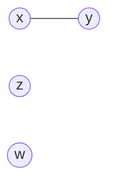
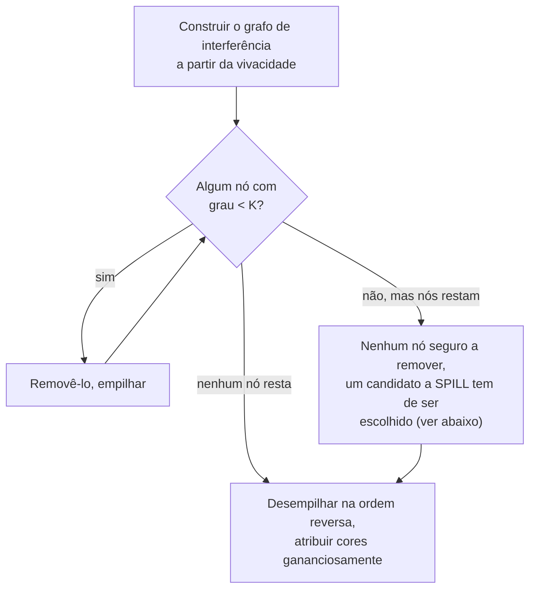

## Objetivos de Aprendizagem

- Construir um grafo de interferência a partir da informação de variáveis vivas: um nó por registrador virtual/temporário, uma aresta entre quaisquer dois que estejam simultaneamente vivos.
- Explicar o papel da coloração de grafo com precisão: uma K-coloração válida do grafo de interferência (K = o número de registradores de máquina reais) atribui registradores reais sem conflito.
- Aplicar o algoritmo de simplificar-e-selecionar no estilo de Chaitin à mão num pequeno grafo de interferência: remover repetidamente um nó com menos de K vizinhos, depois colorir na ordem reversa de remoção.
- Explicar o que acontece quando nenhum nó tem menos de K vizinhos (um SPILL é necessário), e o que o spill de fato significa no nível do código de máquina.
- Explicar o coalescimento de registradores: fundir dois registradores conectados por um move simples num só, eliminando o move inteiramente quando ele não cria um novo conflito.

## Contexto e Motivação

`instruction-selection-tree-pattern-matching` gerou instruções reais do alvo, mas deixou todo operando como um registrador VIRTUAL, um marcador de suprimento ilimitado representando "algum registrador, a ser decidido depois". O hardware real não tem nada perto de um suprimento ilimitado: x86-64, como `x86-64-registers-and-data-movement` já cobriu concretamente, oferece um conjunto pequeno e fixo de registradores de propósito geral. A alocação de registradores é a passagem que mapeia os registradores virtuais ilimitados para esse conjunto pequeno e real, e fazê-lo bem é uma das otimizações individuais de maior alavancagem que um compilador realiza, porque um valor mantido num registrador é dramaticamente mais barato de acessar do que um com spill para a memória na pilha.

A técnica clássica dominante, devida a Chaitin, reduz isso inteiramente a um problema de coloração de grafo: construir um GRAFO DE INTERFERÊNCIA onde dois registradores virtuais são conectados por uma aresta exatamente quando `live-variable-analysis` mostra que eles estão SIMULTANEAMENTE vivos (ambos necessários no mesmo ponto do programa, então não podem compartilhar um registrador físico sem corromper o valor um do outro), depois encontrar uma coloração válida desse grafo usando K cores, uma por registrador real disponível.

## Teoria Central

### Construir o grafo de interferência a partir da vivacidade

```text
x = 1          ; x vivo a partir daqui...
y = 2          ; y vivo a partir daqui...
z = x + y      ; ...até aqui, onde AMBOS x e y são lidos
w = z + 1      ; x e y agora estão mortos, z está vivo em vez disso
```

O próprio exemplo resolvido de `live-variable-analysis` já computou exatamente isto: `x` e `y` estão simultaneamente vivos ao longo do intervalo das suas atribuições até a linha que lê ambos, uma aresta é adicionada entre `x` e `y` no grafo de interferência. `z` e `w` nunca estão simultaneamente vivos com `x` ou `y` neste trecho, então nenhuma aresta os conecta.



### Simplificar e selecionar no estilo de Chaitin

```text
Simplificar: encontrar repetidamente um nó com MENOS de K vizinhos (grau
  < K) e removê-lo do grafo, empilhando-o numa pilha, um nó
  com menos vizinhos do que cores disponíveis tem garantia de ser
  colorível DEPOIS, não importa com que cores os seus vizinhos acabem,
  porque no máximo K-1 cores poderiam possivelmente estar tomadas quando
  ele for recolocado.

Selecionar: desempilhar os nós na ordem REVERSA de remoção, atribuindo
  a cada um qualquer cor não já usada pelos seus vizinhos (já
  coloridos), com garantia de sucesso para todo nó removido durante
  a Simplificação, pela propriedade que justificou removê-lo em primeiro
  lugar.
```



### Spill: quando o grafo resiste a uma simplificação limpa

Se todo nó restante tem grau ≥ K (todo registrador virtual conflita com pelo menos K outros), a Simplificação trava, algum valor genuinamente não pode ter um registrador garantido, não importa como o resto do grafo colore. O algoritmo então escolhe um CANDIDATO A SPILL (tipicamente por um heurístico que favorece um valor barato de recarregar e usado com pouca frequência) e reescreve o programa para armazenar esse valor num slot de pilha depois de ele ser computado e recarregá-lo da pilha imediatamente antes de cada uso, trocando um custo real e mensurável de tempo de execução (tráfego extra de memória) por tornar o grafo restante colorível. Depois do spill, o grafo é reconstruído e o algoritmo re-rodado, já que remover a interferência contínua daquele valor pode liberar espaço para todo o resto.

### Coalescimento: eliminar moves redundantes

Uma instrução `mov` copiando um registrador diretamente para outro (comum logo após a seleção de instruções, ou no ponto de rebaixamento de uma função Φ de `static-single-assignment-form`) às vezes pode ser eliminada inteiramente: se os registradores de origem e destino desse move NÃO interferem um com o outro (nunca simultaneamente vivos de uma forma que conflitaria), eles podem ser COALESCIDOS, fundidos num único nó no grafo de interferência, para que o alocador lhes atribua o mesmo registrador físico e a instrução de move se torne desnecessária, deletada de uma vez.

## Exemplos Resolvidos

### Exemplo 1: colorir um pequeno grafo de interferência com K = 2 registradores

```text
Grafo de interferência:  a --- b,   c (isolado, sem arestas)

Simplificar:
  c tem grau 0 < 2 → remover, empilhar [c]
  Agora só a-b resta, cada um tem grau 1 < 2 → remover a, empilhar [c, a]
  Só b resta, grau 0 < 2 → remover, empilhar [c, a, b]

Selecionar (ordem reversa: b, a, c):
  b: nenhum vizinho colorido ainda → colorir R0
  a: o vizinho b é R0 → tem de escolher uma cor DIFERENTE → R1
  c: nenhum vizinho de forma alguma → qualquer cor, digamos R0

Resultado: a → R1, b → R0, c → R0, a e b ganham registradores diferentes
  (já que interferem), c pode compartilhar R0 com b com segurança (eles nunca
  interferem), usando só 2 registradores reais no total.
```

### Exemplo 2: um grafo que força um spill

```text
Grafo de interferência com K = 2, onde a, b, c TODOS interferem par a par
(cada par simultaneamente vivo em algum ponto):
  a --- b, b --- c, a --- c   (um triângulo, todo nó tem grau 2)

Simplificar: nenhum nó tem grau < 2 (todo nó tem EXATAMENTE 2 vizinhos,
  não menos) → travado, tem de escolher um candidato a spill.

Escolher c como o candidato a spill (digamos, mais barato de recarregar):
  Reescrever o programa: armazenar c na pilha depois de ele ser computado,
  recarregá-lo num registrador temporário imediatamente antes de cada uso.
  Reconstruir o grafo de interferência, o intervalo de vida de c agora é muito
  mais curto (só em torno dos seus pontos de recarga), provavelmente não mais
  interferindo com a e b de forma alguma.

Re-rodar a Simplificação no novo grafo: a e b agora formam um grafo simples de 2 nós,
  grau 1 < 2 cada → colore normalmente, exatamente como o Exemplo 1.
```

### Exemplo 3: coalescer um move para longe

```text
IR após a seleção de instruções:
  t2 = t1          ; um move simples registrador-para-registrador
  use(t2)
  (t1 nunca usado após este move)

Se t1 e t2 NÃO interferem (o intervalo de vida de t1 termina exatamente onde
o de t2 começa, sem sobreposição), coalesça-os num único nó:
  nó fundido {t1, t2} no grafo de interferência
  → o alocador atribui UM registrador físico a ambos
  → a instrução mov é deletada inteiramente, ela só teria
    copiado um registrador para ele mesmo.
```

## Equívocos Comuns e Armadilhas

- **"Duas variáveis interferem se ambas são usadas em qualquer lugar da mesma função, independentemente de quando."** A interferência exige especificamente vivacidade SIMULTÂNEA, o próprio conceito de `live-variable-analysis` fez essa distinção precisa (o Exemplo 3 de lá): duas variáveis vivas em momentos diferentes e não sobrepostos nunca interferem e podem compartilhar um registrador com segurança, exatamente como `c` faz com `b` no Exemplo 1 aqui.
- **"Um nó com grau ≥ K nunca pode ser colorido com segurança, então a Simplificação deveria desistir imediatamente."** A Simplificação só trava definitivamente quando TODO nó restante tem grau ≥ K simultaneamente, o spill do Exemplo 2 só se torna necessário uma vez que nenhum nó único pode ser removido com segurança; um grafo pode ter alguns nós de grau alto enquanto ainda é totalmente colorível, desde que a estrutura geral permita uma ordem de remoção válida.
- **"Fazer spill de um valor significa que a otimização falhou e o programa será lento."** O spill é um recurso real, necessário e corretamente tratado, não um estado de falha, um candidato a spill bem escolhido (por bons heurísticos) minimiza o custo real de tempo de execução, e mesmo compiladores de produção com excelentes alocadores de registradores fazem spill rotineiramente em funções com pressão de registradores genuinamente alta; o trabalho do algoritmo é fazer o mínimo de spill possível, não nunca fazer spill.
- **"O coalescimento deveria ser sempre aplicado sempre que dois registradores são conectados por um move, sem checar mais nada."** O coalescimento só é seguro quando os dois registradores sendo fundidos NÃO interferem um com o outro, fundir dois registradores que DE FATO interferem corromperia silenciosamente um valor com o outro, e um alocador real (usando um heurístico de coalescimento conservador) checa isso com cuidado antes de fundir, às vezes recusando deliberadamente uma oportunidade de coalescimento que parece tentadora, mas não é de fato segura.

## Resumo

A alocação de registradores por coloração de grafo constrói um grafo de interferência diretamente da relação de vivacidade simultânea de `live-variable-analysis`, depois encontra uma K-coloração válida (K = o número de registradores de máquina reais) usando o algoritmo de simplificar-e-selecionar de Chaitin: remover repetidamente nós de grau baixo (com garantia de serem coloríveis depois), e quando nenhum nó desse tipo existe, fazer spill de um valor escolhido para a pilha e tentar de novo, com o coalescimento como um refinamento adicional eliminando moves desnecessários entre registradores que não interferem. Esta é a passagem que transforma os registradores virtuais ilimitados da seleção de instruções numa atribuição real e funcional para o arquivo de registradores de fato, limitado, do alvo. O conceito seguinte, `instruction-scheduling`, toma este código com registradores alocados e o reordena, sem mudar QUAIS registradores são usados, só QUANDO cada instrução roda, para esconder os riscos de pipeline que `computer-architecture` já cobriu concretamente.

## Documentation Links

- [Cooper & Torczon — Engineering a Compiler (companion site)](https://shop.elsevier.com/books/book-companion/9780120884780): livro-texto que apresenta a alocação de registradores por coloração de grafo (simplificar/selecionar/spill/coalescer no estilo de Chaitin) como a técnica canônica que este conceito segue.
- [MIT 6.035 — Computer Language Engineering, Calendar](https://ocw.mit.edu/courses/6-035-computer-language-engineering-sma-5502-fall-2005/pages/calendar/): aula dedicada à alocação de registradores, colocada diretamente após o escalonamento de instruções na própria sequência desse curso.
