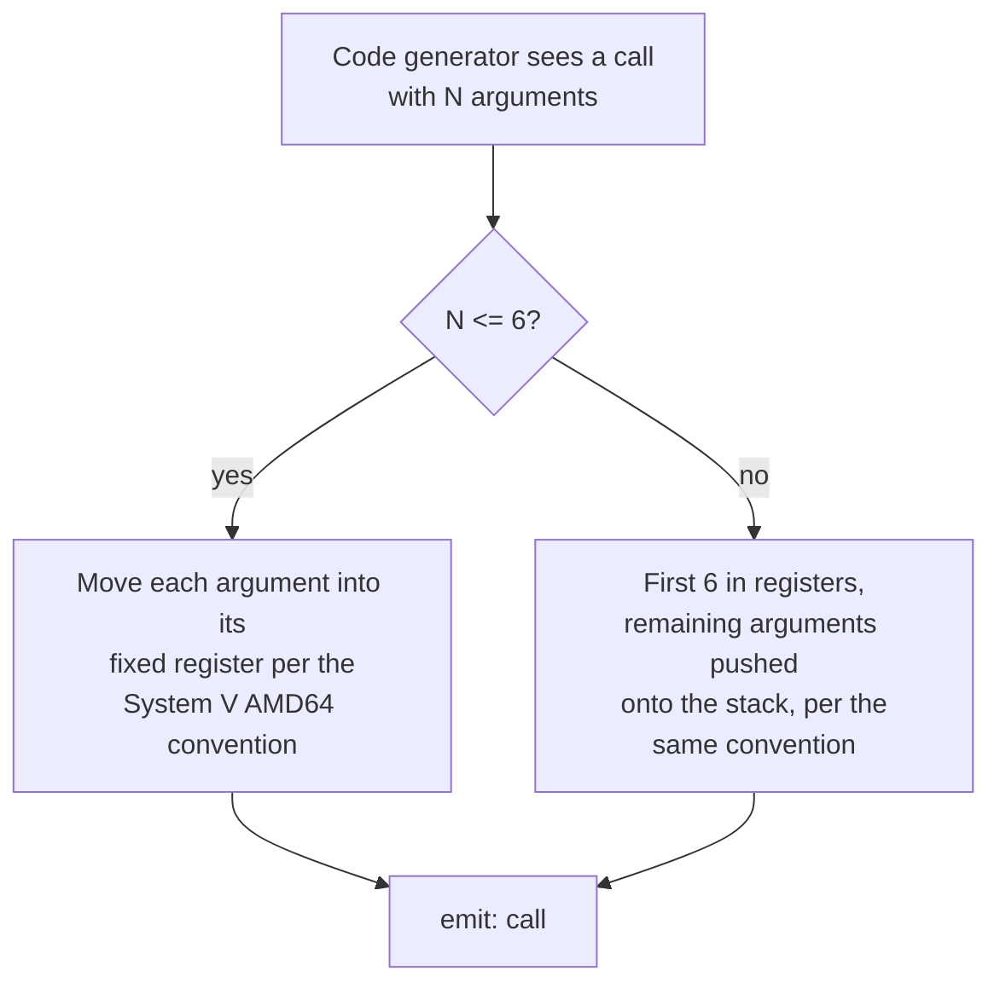

## Learning Objectives

- Explain precisely why the System V AMD64 calling convention, already covered concretely in `c-and-assembly`, is a TARGET a code generator must automatically hit for every function, not a fact only relevant to hand-written assembly.
- Compute a function's frame size from a code generator's own internal bookkeeping: local variable slots plus any spill slots `register-allocation-via-graph-coloring` introduced.
- Generate a correct prologue and epilogue automatically for an arbitrary function, following exactly the pattern `stack-frames-prologue-and-epilogue` already established by hand.
- Generate correct argument-passing code at a call site, following the calling convention's register/stack rules for the first six integer arguments and any beyond that.
- Explain why getting this pass wrong breaks interoperability with every OTHER function on the system — including ones the compiler itself never saw.

## Context & Motivation

`instruction-scheduling` produced a correctly ordered, register-allocated sequence of instructions for a function's BODY. What's still missing is everything around that body: the exact prologue and epilogue `stack-frames-prologue-and-epilogue` already worked out by hand in `c-and-assembly`, and the exact argument-passing and return-value conventions `the-system-v-amd64-calling-convention` already specified precisely. This concept is the automation of exactly that hand-written material: a real code generator computes a function's frame size and argument layout from its own internal state (how many local variables, how many spilled registers, how many parameters) and emits the correct prologue, epilogue, and call-site code — for every single function it compiles, automatically, with zero chance of the kind of manual mistake a human writing assembly by hand might make.

This matters far beyond just "getting one function to work" — the calling convention is a contract EVERY compiled function on a system implicitly agrees to, including functions the current compiler never even saw (a function from a different compiler, a different language, or a precompiled library) — getting this pass wrong doesn't just break the function itself, it breaks every OTHER piece of code that ever calls it or is called by it.

## Core Theory

### Computing frame size from the code generator's own bookkeeping

```text
Function needs:
  - 2 local variables (int, 4 bytes each, rounded to 8-byte alignment)  → 16 bytes
  - 1 spilled register from register-allocation-via-graph-coloring     → 8 bytes
  - stack must remain 16-byte aligned per the calling convention        → round total up

Total local space:  16 + 8 = 24 bytes → round up to 32 for alignment

Generated prologue (exactly the pattern from stack-frames-prologue-and-epilogue,
but with N computed automatically instead of chosen by hand):
  pushq %rbp
  movq  %rsp, %rbp
  subq  $32, %rsp          ; N = 32, computed from this function's OWN
                            ; specific locals + spills, not a fixed constant
```

Nothing about the PATTERN differs from what `stack-frames-prologue-and-epilogue` already established by hand — what's new here is that the compiler computes the one function-specific number (`$32` here) automatically, correctly, for every function it ever compiles, using its own internal record of exactly what that function needs.

### Generating argument-passing code per the calling convention

`the-system-v-amd64-calling-convention` already specified exactly which registers carry the first six integer/pointer arguments (`%rdi`, `%rsi`, `%rdx`, `%rcx`, `%r8`, `%r9`, in that order) and that further arguments go on the stack. A code generator emitting a call site follows this specification mechanically:

```text
Source call:  add(x, y, z)     ; three integer arguments

Generated call sequence:
  movq  <x's location>, %rdi     ; 1st argument
  movq  <y's location>, %rsi      ; 2nd argument
  movq  <z's location>, %rdx       ; 3rd argument
  call  add
```



### Why this pass's correctness is a system-wide contract, not a local one

If this pass generated a prologue that reserved the wrong amount of stack space, or passed the third argument in the wrong register, the bug wouldn't necessarily surface inside the function that got it wrong — it would surface as CORRUPTED DATA inside whatever function it called, or inside the CALLER once control returned, potentially a function compiled by an entirely different compiler, written in an entirely different language, following the exact same convention correctly on its own end. This is precisely why `the-system-v-amd64-calling-convention` is described as a "binding agreement" rather than an implementation detail — every compiler on the system, including this one, must generate code that upholds it exactly, every time, for interoperability to work at all.

## Worked Examples

### Example 1: full frame generation for a small function

```text
Source:
  int compute(int a, int b) {
    int x = a + 1;
    int y = b * 2;
    return x + y;
  }

Frame needs: 2 locals (x, y) → 16 bytes, no spills assumed here.

Generated code:
compute:
  pushq %rbp
  movq  %rsp, %rbp
  subq  $16, %rsp

  ; a arrives in %rdi, b in %rsi per the calling convention
  movl  %edi, -4(%rbp)     ; save a to its local slot (or keep in
                              a register — a real allocator might
                              avoid even this store; simplified here)
  movl  %esi, -8(%rbp)      ; save b similarly
  movl  -4(%rbp), %eax
  addl  $1, %eax             ; x = a + 1
  movl  -8(%rbp), %ecx
  imull $2, %ecx               ; y = b * 2
  addl  %ecx, %eax              ; return value in %eax per the convention

  leave
  ret
```

### Example 2: generating a call site with more than six arguments

```text
Source call: f(a1, a2, a3, a4, a5, a6, a7)   ; SEVEN arguments

Generated call sequence, per the calling convention's overflow rule:
  movq  a1, %rdi
  movq  a2, %rsi
  movq  a3, %rdx
  movq  a4, %rcx
  movq  a5, %r8
  movq  a6, %r9
  pushq a7          ; the 7th argument (and any beyond it) goes on
                       the STACK, since only six integer registers
                       are designated for arguments
  call  f
```

### Example 3: a bug in frame-size computation and its real, system-wide consequence

```text
Suppose a code generator's bookkeeping undercounts a spilled register,
reserving only $16 of stack space when $24 was actually needed:

  subq $16, %rsp     ; WRONG — one 8-byte spill slot overlaps space
                        the function's own return-address handling
                        (via leave/ret) assumes is untouched

At runtime, the spilled value's store could silently corrupt the
saved %rbp or approach the return address itself, depending on exact
layout — the resulting crash or corruption would very plausibly show
up much LATER, inside whatever function this one calls, or after this
function returns to ITS caller, making this exactly the class of bug
stack-smashing-and-buffer-overflows (in c-and-assembly) already showed
is dangerous precisely because of how far downstream its symptoms
can appear from its actual cause.
```

## Common Misconceptions & Pitfalls

- **"The calling convention only matters for functions written directly in assembly, not for compiler-generated code."** The opposite is the entire point of this concept — every compiler on a real system must generate code respecting exactly the same convention, since compiled functions from different compilers and even different languages routinely call each other; a compiler that deviated would break interoperability with everything else on the system.
- **"Computing the right frame size is a minor bookkeeping detail, easy to get right by inspection."** Example 3 shows the real risk — an undercounted frame size can silently corrupt adjacent stack data in a way that only manifests much later, inside a different function entirely, making this exact class of bug notoriously hard to diagnose from its symptom alone.
- **"Argument-passing code generation is the same regardless of how many arguments a call has."** Example 2 shows a genuine branch in the logic — the first six integer/pointer arguments go in fixed registers, but any beyond that must be pushed onto the stack instead, per the convention's own overflow rule; a code generator must implement both cases correctly.
- **"This concept introduces new material about stack frames beyond what `c-and-assembly` already covered."** It deliberately does not — every pattern here (prologue, epilogue, argument registers) is exactly what `stack-frames-prologue-and-epilogue` and `the-system-v-amd64-calling-convention` already established by hand; this concept's only genuinely new content is that a real code generator produces this automatically, computing the function-specific numbers (frame size, argument count) from its own internal state.

## Summary

Stack frame generation and calling-convention code generation is the automated version of exactly what `c-and-assembly` already covered by hand: a code generator computes a function's actual frame size (locals plus any register-allocation spills) and emits the standard prologue and epilogue pattern with that computed size, and generates argument-passing code at every call site following the System V AMD64 convention's register and stack-overflow rules precisely. Getting this pass right is a genuine system-wide correctness requirement, since the calling convention is a contract every compiled function — including ones from entirely different compilers — implicitly relies on. With this concept, every stage of code generation is complete: instructions selected, registers allocated, execution order scheduled, and the whole function wrapped in a correct calling-convention frame. The discipline's closing concepts turn to a bridging question — `jit-vs-aot-compilation` — and then a full, end-to-end capstone tracing one real expression through every stage covered.

## Documentation Links

- [Stanford CS143 — Compilers](http://web.stanford.edu/class/cs143/) — code-generation lectures covering runtime environments and calling-convention-driven code emission as the final code-generation stage.
- [Cooper & Torczon — Engineering a Compiler (companion site)](https://shop.elsevier.com/books/book-companion/9780120884780) — textbook chapters on runtime support for procedure calls, covering automated frame-layout and calling-convention code generation.
