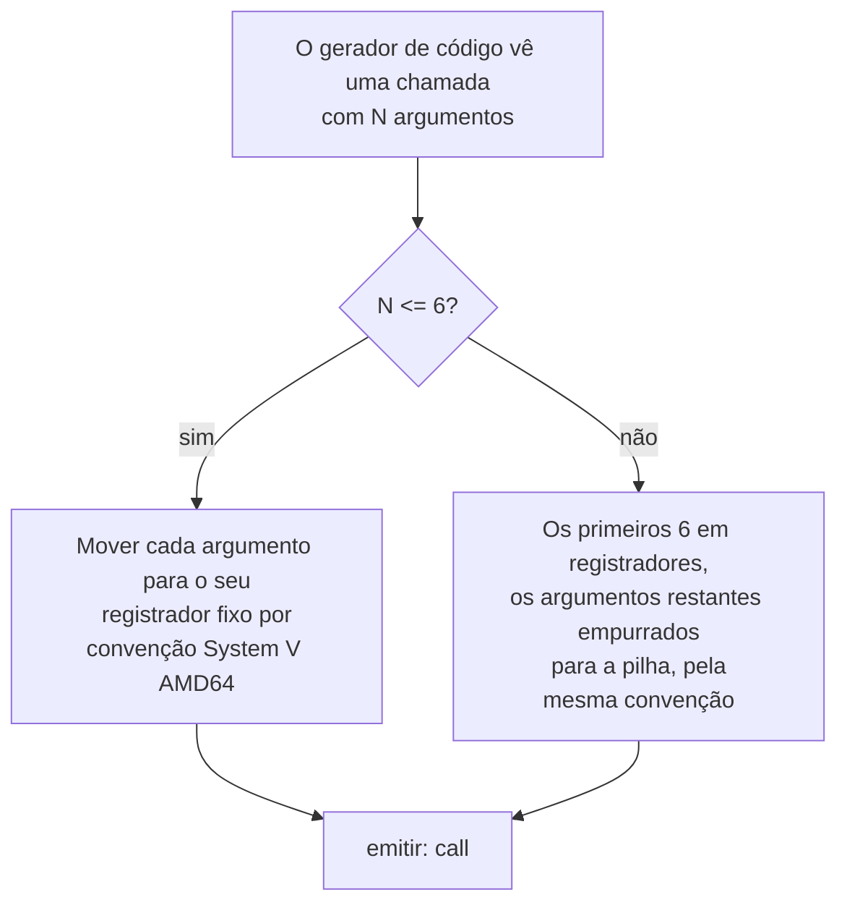

## Objetivos de Aprendizagem

- Explicar com precisão por que a convenção de chamada System V AMD64, já coberta concretamente em `c-and-assembly`, é um ALVO que um gerador de código tem de atingir automaticamente para toda função, não um fato relevante só para assembly escrito à mão.
- Computar o tamanho do quadro de uma função a partir da própria contabilidade interna de um gerador de código: slots de variável local mais quaisquer slots de spill que `register-allocation-via-graph-coloring` introduziu.
- Gerar um prólogo e um epílogo corretos automaticamente para uma função arbitrária, seguindo exatamente o padrão que `stack-frames-prologue-and-epilogue` já estabeleceu à mão.
- Gerar código correto de passagem de argumentos num local de chamada, seguindo as regras de registrador/pilha da convenção de chamada para os primeiros seis argumentos inteiros e quaisquer além disso.
- Explicar por que errar esta passagem quebra a interoperabilidade com toda OUTRA função no sistema, incluindo as que o próprio compilador nunca viu.

## Contexto e Motivação

`instruction-scheduling` produziu uma sequência corretamente ordenada e com registradores alocados de instruções para o CORPO de uma função. O que ainda falta é tudo em torno desse corpo: o prólogo e o epílogo exatos que `stack-frames-prologue-and-epilogue` já resolveu à mão em `c-and-assembly`, e a passagem de argumentos e as convenções de valor de retorno exatas que `the-system-v-amd64-calling-convention` já especificou com precisão. Este conceito é a automação exatamente desse material escrito à mão: um gerador de código real computa o tamanho do quadro de uma função e o leiaute de argumentos a partir do seu próprio estado interno (quantas variáveis locais, quantos registradores com spill, quantos parâmetros) e emite o prólogo, o epílogo e o código de local de chamada corretos, para cada função que compila, automaticamente, com zero chance do tipo de erro manual que um humano escrevendo assembly à mão poderia cometer.

Isso importa muito além de só "fazer uma função funcionar", a convenção de chamada é um contrato com o qual TODA função compilada num sistema implicitamente concorda, incluindo funções que o compilador atual nunca sequer viu (uma função de um compilador diferente, de uma linguagem diferente, ou de uma biblioteca pré-compilada), errar esta passagem não só quebra a própria função, quebra todo OUTRO pedaço de código que jamais a chama ou é chamado por ela.

## Teoria Central

### Computar o tamanho do quadro a partir da própria contabilidade do gerador de código

```text
A função precisa de:
  - 2 variáveis locais (int, 4 bytes cada, arredondadas para alinhamento de 8 bytes)  → 16 bytes
  - 1 registrador com spill de register-allocation-via-graph-coloring     → 8 bytes
  - a pilha tem de permanecer alinhada a 16 bytes por convenção de chamada  → arredondar o total para cima

Espaço local total:  16 + 8 = 24 bytes → arredondar para cima para 32 por alinhamento

Prólogo gerado (exatamente o padrão de stack-frames-prologue-and-epilogue,
mas com N computado automaticamente em vez de escolhido à mão):
  pushq %rbp
  movq  %rsp, %rbp
  subq  $32, %rsp          ; N = 32, computado a partir dos PRÓPRIOS
                            ; locais + spills específicos desta função, não uma constante fixa
```

Nada sobre o PADRÃO difere do que `stack-frames-prologue-and-epilogue` já estabeleceu à mão, o que é novo aqui é que o compilador computa o único número específico da função (`$32` aqui) automaticamente, corretamente, para toda função que jamais compila, usando o seu próprio registro de exatamente o que aquela função precisa.

### Gerar código de passagem de argumentos por convenção de chamada

`the-system-v-amd64-calling-convention` já especificou exatamente quais registradores carregam os primeiros seis argumentos inteiros/ponteiro (`%rdi`, `%rsi`, `%rdx`, `%rcx`, `%r8`, `%r9`, nessa ordem) e que argumentos adicionais vão para a pilha. Um gerador de código emitindo um local de chamada segue essa especificação mecanicamente:

```text
Chamada de fonte:  add(x, y, z)     ; três argumentos inteiros

Sequência de chamada gerada:
  movq  <local de x>, %rdi     ; 1º argumento
  movq  <local de y>, %rsi      ; 2º argumento
  movq  <local de z>, %rdx       ; 3º argumento
  call  add
```



### Por que a correção desta passagem é um contrato de todo o sistema, não local

Se esta passagem gerasse um prólogo que reservasse a quantidade errada de espaço de pilha, ou passasse o terceiro argumento no registrador errado, o bug não necessariamente apareceria dentro da função que o errou, apareceria como DADO CORROMPIDO dentro de qualquer função que ela chamasse, ou dentro do CHAMADOR uma vez que o controle retornasse, potencialmente uma função compilada por um compilador inteiramente diferente, escrita numa linguagem inteiramente diferente, seguindo a exata mesma convenção corretamente do seu próprio lado. É precisamente por isso que `the-system-v-amd64-calling-convention` é descrita como um "acordo vinculante" em vez de um detalhe de implementação, todo compilador no sistema, incluindo este, tem de gerar código que o sustenta exatamente, toda vez, para a interoperabilidade funcionar de todo.

## Exemplos Resolvidos

### Exemplo 1: geração completa de quadro para uma pequena função

```text
Fonte:
  int compute(int a, int b) {
    int x = a + 1;
    int y = b * 2;
    return x + y;
  }

O quadro precisa de: 2 locais (x, y) → 16 bytes, sem spills assumidos aqui.

Código gerado:
compute:
  pushq %rbp
  movq  %rsp, %rbp
  subq  $16, %rsp

  ; a chega em %rdi, b em %rsi por convenção de chamada
  movl  %edi, -4(%rbp)     ; salva a no seu slot local (ou mantém num
                              registrador, um alocador real poderia
                              evitar até este store; simplificado aqui)
  movl  %esi, -8(%rbp)      ; salva b da mesma forma
  movl  -4(%rbp), %eax
  addl  $1, %eax             ; x = a + 1
  movl  -8(%rbp), %ecx
  imull $2, %ecx               ; y = b * 2
  addl  %ecx, %eax              ; valor de retorno em %eax por convenção
  leave
  ret
```

### Exemplo 2: gerar um local de chamada com mais de seis argumentos

```text
Chamada de fonte: f(a1, a2, a3, a4, a5, a6, a7)   ; SETE argumentos

Sequência de chamada gerada, pela regra de transbordamento da convenção de chamada:
  movq  a1, %rdi
  movq  a2, %rsi
  movq  a3, %rdx
  movq  a4, %rcx
  movq  a5, %r8
  movq  a6, %r9
  pushq a7          ; o 7º argumento (e qualquer além dele) vai para
                       a PILHA, já que só seis registradores inteiros
                       são designados para argumentos
  call  f
```

### Exemplo 3: um bug na computação de tamanho de quadro e a sua consequência real, de todo o sistema

```text
Suponha que a contabilidade de um gerador de código subconte um registrador com spill,
reservando só $16 de espaço de pilha quando $24 eram de fato necessários:

  subq $16, %rsp     ; ERRADO, um slot de spill de 8 bytes sobrepõe espaço
                        que o próprio tratamento de endereço de retorno da função
                        (via leave/ret) assume intocado

Em tempo de execução, o store do valor com spill poderia corromper silenciosamente o
%rbp salvo ou se aproximar do próprio endereço de retorno, dependendo do leiaute
exato, a falha ou corrupção resultante muito plausivelmente apareceria
muito MAIS TARDE, dentro de qualquer função que esta chama, ou depois de esta
função retornar ao SEU chamador, tornando isto exatamente a classe de bug
que stack-smashing-and-buffer-overflows (em c-and-assembly) já mostrou
ser perigosa precisamente por causa de quão longe a jusante os seus sintomas
podem aparecer da sua causa de fato.
```

## Equívocos Comuns e Armadilhas

- **"A convenção de chamada só importa para funções escritas diretamente em assembly, não para código gerado por compilador."** O oposto é o ponto inteiro deste conceito, todo compilador num sistema real tem de gerar código respeitando exatamente a mesma convenção, já que funções compiladas de compiladores diferentes e até linguagens diferentes rotineiramente chamam umas às outras; um compilador que desviasse quebraria a interoperabilidade com todo o resto no sistema.
- **"Computar o tamanho certo do quadro é um detalhe menor de contabilidade, fácil de acertar por inspeção."** O Exemplo 3 mostra o risco real, um tamanho de quadro subcontado pode corromper silenciosamente dados de pilha adjacentes de uma forma que só se manifesta muito depois, dentro de uma função inteiramente diferente, tornando essa exata classe de bug notoriamente difícil de diagnosticar só pelo seu sintoma.
- **"A geração de código de passagem de argumentos é a mesma independentemente de quantos argumentos uma chamada tem."** O Exemplo 2 mostra um ramo genuíno na lógica, os primeiros seis argumentos inteiros/ponteiro vão em registradores fixos, mas qualquer além disso tem de ser empurrado para a pilha, pela própria regra de transbordamento da convenção; um gerador de código tem de implementar ambos os casos corretamente.
- **"Este conceito introduz material novo sobre quadros de pilha além do que `c-and-assembly` já cobriu."** Ele deliberadamente não o faz, todo padrão aqui (prólogo, epílogo, registradores de argumento) é exatamente o que `stack-frames-prologue-and-epilogue` e `the-system-v-amd64-calling-convention` já estabeleceram à mão; o único conteúdo genuinamente novo deste conceito é que um gerador de código real produz isso automaticamente, computando os números específicos da função (tamanho de quadro, contagem de argumentos) a partir do seu próprio estado interno.

## Resumo

A geração de quadro de pilha e de código de convenção de chamada é a versão automatizada exatamente do que `c-and-assembly` já cobriu à mão: um gerador de código computa o tamanho de quadro de fato de uma função (locais mais quaisquer spills de alocação de registradores) e emite o padrão de prólogo e epílogo padrão com esse tamanho computado, e gera código de passagem de argumentos em todo local de chamada seguindo as regras de registrador e de transbordamento de pilha da convenção System V AMD64 com precisão. Acertar esta passagem é um requisito genuíno de correção de todo o sistema, já que a convenção de chamada é um contrato do qual toda função compilada, incluindo as de compiladores inteiramente diferentes, implicitamente depende. Com este conceito, todo estágio de geração de código está completo: instruções selecionadas, registradores alocados, ordem de execução escalonada, e a função inteira embrulhada num quadro de convenção de chamada correto. Os conceitos de encerramento da disciplina se voltam para uma pergunta de ponte, `jit-vs-aot-compilation`, e depois um capstone completo, de ponta a ponta, rastreando uma expressão real por cada estágio coberto.

## Documentation Links

- [Stanford CS143 — Compilers](http://web.stanford.edu/class/cs143/): aulas de geração de código que cobrem ambientes de tempo de execução e a emissão de código guiada por convenção de chamada como o estágio final de geração de código.
- [Cooper & Torczon — Engineering a Compiler (companion site)](https://shop.elsevier.com/books/book-companion/9780120884780): capítulos de livro-texto sobre suporte de tempo de execução para chamadas de procedimento, cobrindo a geração automatizada de leiaute de quadro e de código de convenção de chamada.
