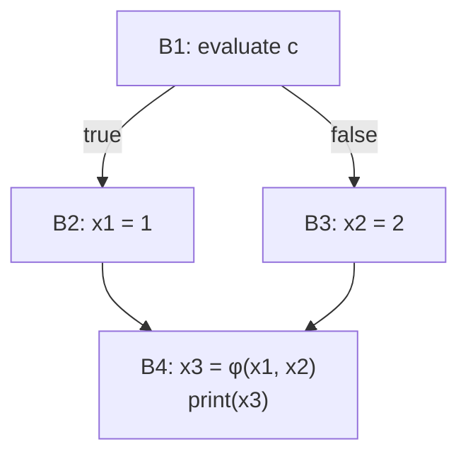
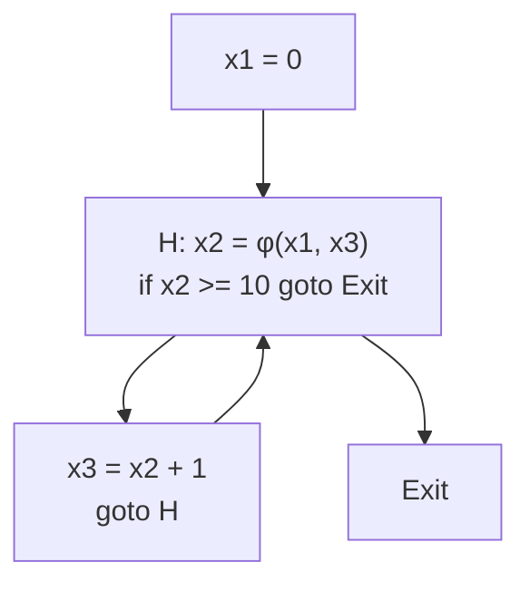

## Learning Objectives

- Define SSA form precisely: every variable is assigned exactly once in the program's text, achieved by renaming each successive assignment to a fresh version.
- Explain why merging control-flow paths (a diamond, or a loop back edge) requires a Φ (phi) function, and what a Φ function actually computes at runtime.
- Convert a small CFG with an if/else merge into SSA form by hand, inserting Φ functions at exactly the merge points that need them.
- Explain, concretely, why several data-flow facts that otherwise require a real analysis (like reaching definitions) become close to immediate once a program is in SSA form.
- Name LLVM IR as a real, currently deployed compiler IR built natively on SSA form.

## Context & Motivation

`control-flow-graphs-and-basic-blocks` made control flow explicit as a graph; static single assignment (SSA) form makes something else explicit: exactly which DEFINITION of a variable a given USE actually refers to. In ordinary three-address code, the same variable name can be assigned to repeatedly — `x = 1`, later `x = 2`, later still a use of `x` that could refer to either assignment depending on which path execution actually took to get there. Determining which one, for an arbitrary program, is exactly what `reaching-definitions` (a full data-flow analysis, several concepts away) is built to compute.

SSA form sidesteps needing that analysis for a huge number of practical cases by renaming: every variable is renamed so that each of its assignments in the program's TEXT gets a distinct version number, and wherever two different versions could reach the same point from different incoming paths, a Φ (PHI) function is inserted to explicitly merge them. Once this restructuring is done, "which definition does this use refer to" often has a trivial, syntactic answer: the one whose renamed version exactly matches. This single idea is why SSA is the design LLVM IR is built on natively, and why almost every modern optimizing compiler constructs SSA form as one of its very first IR-level steps.

## Core Theory

### Renaming: one version per assignment

```text
Original three-address code:
  x = 1
  x = x + 1
  y = x

SSA form (each assignment gets a fresh subscript):
  x1 = 1
  x2 = x1 + 1
  y1 = x2
```

Every use now refers, syntactically, to exactly one specific definition — `x2 = x1 + 1` uses `x1` (the FIRST assignment), and `y1 = x2` uses `x2` (the SECOND) — with no ambiguity left to resolve by any further analysis, purely because the renaming already encodes it.

### Why merging control-flow paths needs a Φ function

Straight-line code renames trivially, but what happens where two different paths, each having assigned a different version of the same original variable, MERGE back into one block?

```text
if (c) {
  x = 1;      // becomes x1 = 1
} else {
  x = 2;      // becomes x2 = 2
}
print(x);      // which version — x1 or x2 — does this refer to?
```



Neither `x1` nor `x2` alone is correct at the merge point B4, because the ACTUAL value depends on which branch execution took at runtime — the Φ function `x3 = φ(x1, x2)` is SSA's explicit way of saying exactly that: "x3 is x1 if control arrived from B2, or x2 if control arrived from B3," resolved concretely once code generation later lowers Φ functions away (typically into ordinary moves placed at the end of each predecessor block).

### Why SSA makes later analyses close to immediate

Once a program is fully in SSA form, asking "which definition does this specific use of `x2` refer to" has a one-line answer — the ONE assignment textually named `x2`, since SSA guarantees there is never more than one — instead of requiring `reaching-definitions`'s full iterative data-flow computation to determine it from scratch. This doesn't make reaching-definitions analysis obsolete (SSA construction itself still needs a real algorithm — computing exactly where Φ functions must be inserted, using a structure called the dominance frontier, is its own nontrivial topic this discipline sets aside as a genuine scope boundary), but it explains concretely why LLVM and nearly every serious modern optimizing compiler pays the one-time cost of SSA construction: it makes an enormous number of the optimizations later in this discipline (`constant-folding-and-constant-propagation`, `common-subexpression-elimination`, `dead-code-elimination`) simpler and more precise to implement correctly.

## Worked Examples

### Example 1: converting a straight-line sequence to SSA

```text
Original:
  a = 5
  b = a + 2
  a = b * 3
  c = a + b

SSA:
  a1 = 5
  b1 = a1 + 2
  a2 = b1 * 3
  c1 = a2 + b1
```

Each of the two assignments to `a` becomes a distinct version (`a1`, `a2`); every use is rewritten to reference exactly the version that was live at that point in the ORIGINAL sequential order — `c1 = a2 + b1` uses `a2` (the second, most recent assignment) and `b1` (assigned once, so unambiguous already).

### Example 2: a loop, requiring a Φ function at the loop header

```text
Original:
  x = 0;
  while (x < 10) {
    x = x + 1;
  }
```



The loop header needs a Φ function because `x2` at that point could have come from BEFORE the loop started (`x1`, on the very first iteration) or from the END of the previous iteration's body (`x3`, on every later iteration) — a merge point exactly like Example 1's if/else diamond, just reached by a back edge instead of two forward branches.

### Example 3: reasoning about a use directly from its SSA name

```text
Given the SSA code from Example 1:
  a1 = 5
  b1 = a1 + 2
  a2 = b1 * 3
  c1 = a2 + b1

Question: does c1's computation depend on a1 directly, or only
through b1 and a2?

Answer, read directly off the SSA names with no data-flow analysis
required: c1 = a2 + b1 uses a2 and b1 — a1 does not appear in this
instruction at all, so c1 depends on a1 only INDIRECTLY, through the
chain a1 → b1 → a2 → c1, a fact that is immediately readable from
which specific SSA-renamed variables appear in which instructions.
```

## Common Misconceptions & Pitfalls

- **"SSA form changes what a program computes."** It does not — SSA is purely a RENAMING and restructuring for the compiler's own analytical convenience; every SSA program computes exactly the same result as its non-SSA original, and Φ functions are eliminated again (lowered to ordinary moves) before final code generation, leaving runtime behavior completely unchanged.
- **"A Φ function is a real machine instruction that runs at runtime."** It is not — Φ functions are a compile-time fiction, existing only inside the compiler's IR to make merge points explicit for analysis purposes; before code generation actually emits machine instructions, every Φ function is lowered away into ordinary move instructions placed at the end of each predecessor block.
- **"Since SSA makes reaching-definitions trivial, that analysis is now pointless to learn."** SSA makes the QUESTION "which definition reaches this use" close to immediate for a SINGLE variable's own versions, but building SSA form in the first place (deciding exactly where Φ functions must go) is itself a nontrivial algorithm built on data-flow-style reasoning over the CFG — the two ideas are complementary, not redundant.
- **"Every variable in an SSA program gets renamed exactly once, no matter how it's used."** Every ASSIGNMENT gets a fresh version — a variable read many times without being reassigned keeps referring to that one same version across all of those reads; it's assignments, not uses, that drive the renaming.

## Summary

Static single assignment form renames every variable so each of its assignments becomes a distinct, uniquely numbered version, and inserts a Φ function at every control-flow merge point where two different versions could reach the same use — turning "which definition does this use refer to," a question that in general requires a full data-flow analysis to answer, into something readable close to directly off the renamed variable names themselves. This is precisely the design LLVM IR is built on natively, and the reason SSA construction is one of the very first steps almost every serious modern optimizing compiler performs. With the IR fully specified — three-address code, grouped into a control-flow graph, restructured into SSA form — the discipline turns next to the general framework, `the-data-flow-analysis-framework-lattices-and-fixed-points`, that every remaining analysis (and every optimization built on one) is an instance of.

## Documentation Links

- [Cooper & Torczon — Engineering a Compiler (companion site)](https://shop.elsevier.com/books/book-companion/9780120884780) — textbook covering SSA construction (dominance frontiers, Φ-function placement) as a dedicated IR topic.
- [MIT 6.035 — Computer Language Engineering, Calendar](https://ocw.mit.edu/courses/6-035-computer-language-engineering-sma-5502-fall-2005/pages/calendar/) — lecture sequence placing intermediate-representation design immediately ahead of the data-flow-analysis and optimization lectures SSA is meant to simplify.
