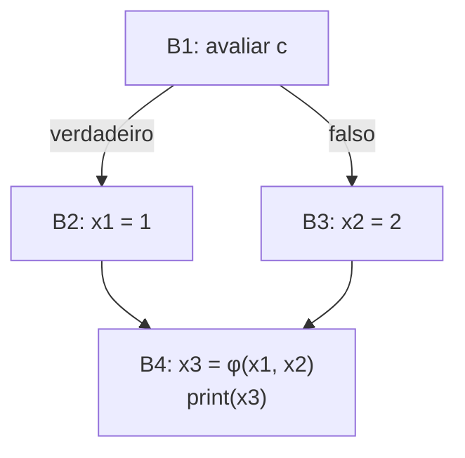
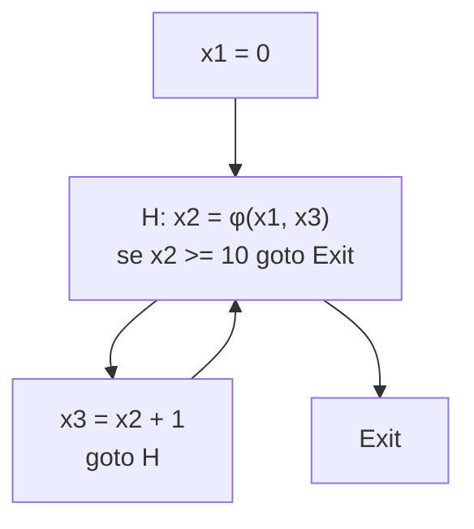

## Objetivos de Aprendizagem

- Definir a forma SSA com precisão: toda variável é atribuída exatamente uma vez no texto do programa, alcançado renomeando cada atribuição sucessiva para uma versão nova.
- Explicar por que juntar caminhos de fluxo de controle (um diamante, ou uma aresta de retorno de laço) exige uma função Φ (phi), e o que uma função Φ de fato computa em tempo de execução.
- Converter um pequeno CFG com uma junção de if/else para a forma SSA à mão, inserindo funções Φ exatamente nos pontos de junção que precisam delas.
- Explicar, concretamente, por que vários fatos de fluxo de dados que de outra forma exigem uma análise real (como as definições que alcançam) se tornam próximos de imediatos uma vez que um programa está na forma SSA.
- Nomear o LLVM IR como um IR de compilador real e atualmente implantado construído nativamente sobre a forma SSA.

## Contexto e Motivação

`control-flow-graphs-and-basic-blocks` tornou o fluxo de controle explícito como um grafo; a forma de atribuição única estática (SSA) torna outra coisa explícita: exatamente a qual DEFINIÇÃO de uma variável um dado USO de fato se refere. Em código de três endereços comum, o mesmo nome de variável pode ser atribuído repetidamente, `x = 1`, depois `x = 2`, depois ainda um uso de `x` que poderia se referir a qualquer atribuição dependendo de qual caminho a execução de fato tomou para chegar lá. Determinar qual, para um programa arbitrário, é exatamente o que `reaching-definitions` (uma análise de fluxo de dados completa, vários conceitos de distância) é construído para computar.

A forma SSA contorna a necessidade dessa análise para um número enorme de casos práticos por renomeação: toda variável é renomeada de modo que cada uma das suas atribuições no TEXTO do programa ganha um número de versão distinto, e onde quer que duas versões diferentes pudessem alcançar o mesmo ponto a partir de caminhos de entrada diferentes, uma função Φ (PHI) é inserida para fundi-las explicitamente. Uma vez feita essa reestruturação, "a qual definição este uso se refere" muitas vezes tem uma resposta trivial e sintática: aquela cuja versão renomeada bate exatamente. Essa única ideia é por que SSA é o design sobre o qual o LLVM IR é construído nativamente, e por que quase todo compilador otimizador moderno constrói a forma SSA como um dos seus primeiríssimos passos em nível de IR.

## Teoria Central

### Renomear: uma versão por atribuição

```text
Código de três endereços original:
  x = 1
  x = x + 1
  y = x

Forma SSA (cada atribuição ganha um subscrito novo):
  x1 = 1
  x2 = x1 + 1
  y1 = x2
```

Todo uso agora se refere, sintaticamente, a exatamente uma definição específica, `x2 = x1 + 1` usa `x1` (a PRIMEIRA atribuição), e `y1 = x2` usa `x2` (a SEGUNDA), sem nenhuma ambiguidade restante a resolver por qualquer análise adicional, puramente porque a renomeação já a codifica.

### Por que juntar caminhos de fluxo de controle precisa de uma função Φ

O código em linha reta renomeia trivialmente, mas o que acontece onde dois caminhos diferentes, cada um tendo atribuído uma versão diferente da mesma variável original, se JUNTAM de volta num só bloco?

```text
if (c) {
  x = 1;      // vira x1 = 1
} else {
  x = 2;      // vira x2 = 2
}
print(x);      // a qual versão, x1 ou x2, isto se refere?
```



Nem `x1` nem `x2` sozinho está correto no ponto de junção B4, porque o valor DE FATO depende de qual ramo a execução tomou em tempo de execução, a função Φ `x3 = φ(x1, x2)` é a forma explícita de SSA de dizer exatamente isso: "x3 é x1 se o controle chegou de B2, ou x2 se o controle chegou de B3", resolvido concretamente uma vez que a geração de código depois rebaixa as funções Φ (tipicamente em moves comuns colocados no fim de cada bloco predecessor).

### Por que SSA torna análises posteriores próximas de imediatas

Uma vez que um programa está totalmente na forma SSA, perguntar "a qual definição este uso específico de `x2` se refere" tem uma resposta de uma linha, a ÚNICA atribuição textualmente nomeada `x2`, já que SSA garante que nunca há mais de uma, em vez de exigir a computação iterativa completa de fluxo de dados de `reaching-definitions` para determiná-la do zero. Isso não torna a análise de definições que alcançam obsoleta (a própria construção de SSA ainda precisa de um algoritmo real, computar exatamente onde as funções Φ têm de ser inseridas, usando uma estrutura chamada fronteira de dominância, é o seu próprio tópico não trivial que esta disciplina põe de lado como uma fronteira de escopo genuína), mas explica concretamente por que LLVM e quase todo compilador otimizador moderno sério paga o custo único da construção de SSA: ela torna um número enorme das otimizações posteriores nesta disciplina (`constant-folding-and-constant-propagation`, `common-subexpression-elimination`, `dead-code-elimination`) mais simples e mais precisas de implementar corretamente.

## Exemplos Resolvidos

### Exemplo 1: converter uma sequência em linha reta para SSA

```text
Original:
  a = 5
  b = a + 2
  a = b * 3
  c = a + b

SSA:
  a1 = 5
  b1 = a1 + 2
  a2 = b1 * 3
  c1 = a2 + b1
```

Cada uma das duas atribuições a `a` vira uma versão distinta (`a1`, `a2`); todo uso é reescrito para referenciar exatamente a versão que estava viva naquele ponto na ordem sequencial ORIGINAL, `c1 = a2 + b1` usa `a2` (a segunda, mais recente atribuição) e `b1` (atribuído uma vez, então já sem ambiguidade).

### Exemplo 2: um laço, exigindo uma função Φ no cabeçalho do laço

```text
Original:
  x = 0;
  while (x < 10) {
    x = x + 1;
  }
```



O cabeçalho do laço precisa de uma função Φ porque `x2` naquele ponto poderia ter vindo de ANTES de o laço começar (`x1`, na primeiríssima iteração) ou do FIM do corpo da iteração anterior (`x3`, em toda iteração posterior), um ponto de junção exatamente como o diamante de if/else do Exemplo 1, só que alcançado por uma aresta de retorno em vez de dois ramos para frente.

### Exemplo 3: raciocinar sobre um uso diretamente a partir do seu nome SSA

```text
Dado o código SSA do Exemplo 1:
  a1 = 5
  b1 = a1 + 2
  a2 = b1 * 3
  c1 = a2 + b1

Pergunta: a computação de c1 depende de a1 diretamente, ou só
através de b1 e a2?

Resposta, lida diretamente dos nomes SSA sem nenhuma análise de fluxo de dados
necessária: c1 = a2 + b1 usa a2 e b1, a1 não aparece nesta
instrução de forma alguma, então c1 depende de a1 só INDIRETAMENTE, pela
cadeia a1 → b1 → a2 → c1, um fato que é imediatamente legível a partir de
quais variáveis específicas renomeadas por SSA aparecem em quais instruções.
```

## Equívocos Comuns e Armadilhas

- **"A forma SSA muda o que um programa computa."** Não muda, SSA é puramente uma RENOMEAÇÃO e reestruturação para a conveniência analítica do próprio compilador; todo programa SSA computa exatamente o mesmo resultado que o seu original não SSA, e as funções Φ são eliminadas de novo (rebaixadas para moves comuns) antes da geração final de código, deixando o comportamento de tempo de execução completamente inalterado.
- **"Uma função Φ é uma instrução de máquina real que roda em tempo de execução."** Não é, as funções Φ são uma ficção de tempo de compilação, existindo só dentro do IR do compilador para tornar os pontos de junção explícitos para fins de análise; antes de a geração de código de fato emitir instruções de máquina, toda função Φ é rebaixada em instruções de move comuns colocadas no fim de cada bloco predecessor.
- **"Como SSA torna as definições que alcançam triviais, essa análise agora é inútil de aprender."** SSA torna a PERGUNTA "qual definição alcança este uso" próxima de imediata para as próprias versões de uma ÚNICA variável, mas construir a forma SSA em primeiro lugar (decidir exatamente onde as funções Φ têm de ir) é, ele mesmo, um algoritmo não trivial construído sobre raciocínio no estilo de fluxo de dados sobre o CFG, as duas ideias são complementares, não redundantes.
- **"Toda variável num programa SSA é renomeada exatamente uma vez, não importa como é usada."** Toda ATRIBUIÇÃO ganha uma versão nova, uma variável lida muitas vezes sem ser reatribuída continua se referindo a essa mesma versão em todas essas leituras; são as atribuições, não os usos, que guiam a renomeação.

## Resumo

A forma de atribuição única estática renomeia toda variável para que cada uma das suas atribuições se torne uma versão distinta e unicamente numerada, e insere uma função Φ em todo ponto de junção de fluxo de controle onde duas versões diferentes poderiam alcançar o mesmo uso, transformando "a qual definição este uso se refere", uma pergunta que em geral exige uma análise de fluxo de dados completa para responder, em algo legível próximo de diretamente a partir dos próprios nomes das variáveis renomeadas. Esse é precisamente o design sobre o qual o LLVM IR é construído nativamente, e a razão pela qual a construção de SSA é um dos primeiríssimos passos que quase todo compilador otimizador moderno sério realiza. Com o IR totalmente especificado, código de três endereços, agrupado num grafo de fluxo de controle, reestruturado na forma SSA, a disciplina se volta a seguir para o arcabouço geral, `the-data-flow-analysis-framework-lattices-and-fixed-points`, do qual toda análise restante (e toda otimização construída sobre uma) é uma instância.

## Documentation Links

- [Cooper & Torczon — Engineering a Compiler (companion site)](https://shop.elsevier.com/books/book-companion/9780120884780): livro-texto que cobre a construção de SSA (fronteiras de dominância, colocação de funções Φ) como um tópico de IR dedicado.
- [MIT 6.035 — Computer Language Engineering, Calendar](https://ocw.mit.edu/courses/6-035-computer-language-engineering-sma-5502-fall-2005/pages/calendar/): sequência de aulas que coloca o design de representação intermediária imediatamente antes das aulas de análise de fluxo de dados e de otimização que SSA pretende simplificar.
