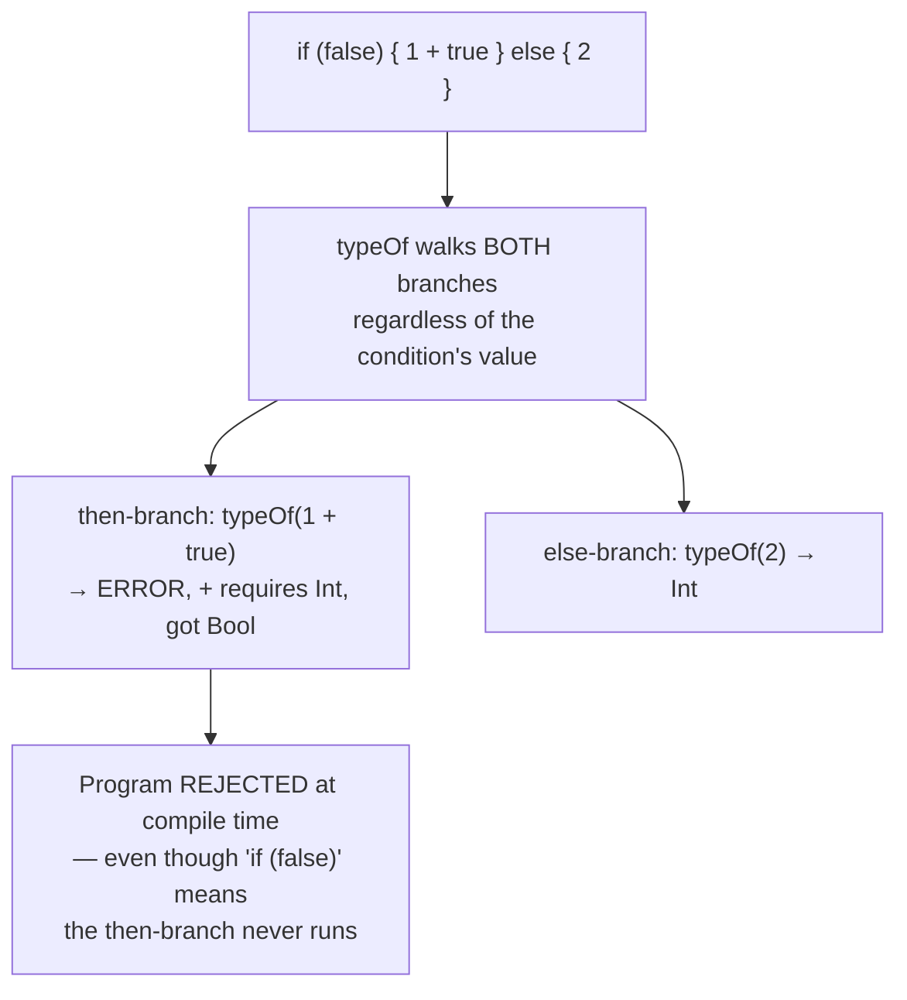

## Learning Objectives

- Explain the difference between checking types one small evaluation step at a time (as `type-checking-progress-and-preservation` did) and checking an entire program's types in a single batch pass over its AST.
- Implement a type-checking pass as a recursive function over the AST that, for every node, either returns a type or reports a type error, using the symbol table from the previous concept to look up each identifier's declared type.
- Explain why a type checker can reject a program without ever running any of its code, including code inside a branch that would never execute.
- Connect this pass's guarantee back to progress and preservation: what a compiler's static check buys, in engineering terms, that a runtime check does not.
- State honestly what stays out of scope here (a full unification-based inference algorithm was already covered in `programming-languages`; this concept assumes declared or already-inferred types are available and checks them, rather than re-deriving inference).

## Context & Motivation

`static-vs-dynamic-typing` framed the core tradeoff (caught early vs. more flexible), and `type-checking-progress-and-preservation` proved, one small evaluation step at a time, that a well-typed term either is done or can still take a step (progress), and that taking a step never changes a term's type (preservation). Both of those results were stated and proved OPERATIONALLY — in terms of what happens as a term actually evaluates.

A compiler cannot check types "as evaluation happens," because nothing is evaluating yet — there is only an AST and a symbol table, built by the previous concept, and a compile-time decision to make: does this WHOLE program type-check, everywhere, in every branch, whether or not that branch will ever execute on any particular run? Static type checking as a compiler pass answers exactly that question, as a single recursive walk over the AST that assigns a type to every expression (or reports the first place it cannot), consuming the symbol table's declared types rather than re-deriving them from usage the way full inference would.

This is the same operational guarantee — "well-typed programs don't go wrong" — delivered from a different vantage point: not "verified as evaluation proceeds," but "verified completely, in one pass, before evaluation is even scheduled to begin."

## Core Theory

### The type checker as a recursive function over the AST

```text
typeOf(node, symbolTable) -> Type   (or reports an error and stops)

typeOf(IntLiteral n)         = Int
typeOf(BoolLiteral b)        = Bool
typeOf(Identifier x)         = symbolTable.lookup(x).type      -- from the PREVIOUS concept
typeOf(BinaryOp(op, l, r)):
    tl = typeOf(l, symbolTable)
    tr = typeOf(r, symbolTable)
    if op is "+" and tl == Int and tr == Int:  return Int
    else: ERROR "operator + requires two Int operands, got" tl "and" tr
typeOf(If(cond, then, else)):
    tc = typeOf(cond, symbolTable)
    if tc != Bool: ERROR "if condition must be Bool, got" tc
    tt = typeOf(then, symbolTable)
    te = typeOf(else, symbolTable)
    if tt != te: ERROR "if branches must have the same type"
    else: return tt
```

Every rule here mirrors a typing rule already stated for the simply typed lambda calculus in `programming-languages` — the difference is entirely structural: there, a typing judgment `Γ ⊢ t : T` was checked against a context as part of proving progress and preservation for one small-step evaluation rule at a time; here, the exact same judgments are checked by one recursive function walking a real AST once, front to back, with the symbol table from `symbol-tables-and-scope-resolution` standing in for the typing context Γ.

### Why this rejects unreachable-branch errors too



An interpreter checking types operationally, one step at a time, would never even reach the `1 + true` expression here, because the condition is `false` — the bug would sit latent, undetected, for as long as that branch happened not to run. A batch, ahead-of-time pass has no such blind spot: it type-checks every branch structurally, whether or not any particular execution would ever reach it.

### What this pass assumes, and what it doesn't re-derive

This pass consumes types that are already known — either written explicitly by the programmer, or already recovered by `type-inference-and-the-need-for-unification` (covered fully in `programming-languages`, using constraint generation and Robinson's unification). This concept does not repeat that inference machinery; it is the CHECKING half of the type-system story, assuming annotations or inferred types are already attached to declarations in the symbol table, and verifying that every USE of those declarations is consistent with them.

## Worked Examples

### Example 1: a program that type-checks completely

```text
function add(x: Int, y: Int) -> Int {
  return x + y;
}
```

```text
typeOf(x + y, symbolTable) where symbolTable has x: Int, y: Int
  typeOf(x) = Int   (looked up via symbol-tables-and-scope-resolution)
  typeOf(y) = Int
  "+" rule: both Int → result Int
typeOf(return x + y) checked against declared return type Int → MATCH
Program type-checks — no error, ready to move to IR generation.
```

### Example 2: an error caught in a never-executed branch

```text
function f(flag: Bool) -> Int {
  if (flag) {
    return 1;
  } else {
    return "oops";   // wrong type, but only reached when flag is false
  }
}
```

```text
typeOf walks BOTH branches unconditionally:
  then: typeOf(1) = Int             — matches declared return type Int
  else: typeOf("oops") = String     — does NOT match declared return type Int
→ ERROR reported at compile time, regardless of what value `flag`
  happens to hold on any given run — this program is rejected before
  it is ever executed even once.
```

### Example 3: an error that requires the symbol table from the previous concept

```text
function g() -> Int {
  return count + 1;   // `count` was never declared anywhere
}
```

```text
typeOf(count) → symbolTable.lookup("count") → NOT FOUND
  (symbol-tables-and-scope-resolution already reported this as an
   undeclared-identifier error during its own pass)
typeOf(count + 1) cannot proceed meaningfully without a type for
  `count` — type checking depends directly on scope resolution having
  already run and populated the symbol table; the two passes are
  ordered, not independent.
```

## Common Misconceptions & Pitfalls

- **"Static type checking as a compiler pass is a completely different theory from progress and preservation."** It is the same theory, delivered structurally rather than operationally — every typing rule checked here is the same rule `type-checking-progress-and-preservation` proved sound for one evaluation step; this pass just applies all of them, to the whole AST, in one batch, before any step occurs.
- **"A batch type checker can only catch errors in code that would actually run."** The opposite is one of its main practical advantages — Example 2 shows a type error inside a branch that a specific execution might never reach, caught anyway, because the pass walks every branch structurally regardless of any runtime condition's actual value.
- **"This concept re-derives type inference — writing every annotation by hand isn't required here either."** It does not — full inference (generating and solving constraints via unification) was already covered completely in `programming-languages`'s `type-inference-and-the-need-for-unification`; this pass assumes types are already attached (by annotation or by that inference) and only CHECKS consistency of uses against them.
- **"Type checking and scope resolution can run in either order, or even simultaneously, without issue."** In practice type checking depends on scope resolution having already run, since looking up an identifier's type (as in every `typeOf(Identifier x)` rule) requires the symbol table `symbol-tables-and-scope-resolution` builds to already exist and be fully populated for the relevant scope.

## Summary

Static type checking as a compiler pass takes the exact typing rules already proved sound (via progress and preservation) for one small evaluation step, and applies all of them structurally, in one recursive walk over the whole AST, using the symbol table from `symbol-tables-and-scope-resolution` to resolve every identifier's declared type. Because the walk covers every branch unconditionally, it catches type errors that a runtime, operational check would only ever discover if a specific buggy branch happened to execute — the concrete engineering payoff of moving type checking from "as evaluation proceeds" to "once, completely, before evaluation is even scheduled." This pass deliberately does not re-derive full type inference, already covered via unification in `programming-languages`; it assumes types are attached and verifies consistency. The next concept, `syntax-directed-translation-and-attribute-grammars`, generalizes this same "compute something by recursing over the AST" pattern beyond just type checking, into the broader framework semantic analysis and code generation both actually run on.

## Documentation Links

- [Stanford CS143 — Compilers](http://web.stanford.edu/class/cs143/) — semantic-analysis phase covering type checking as a batch pass consuming a symbol table already built.
- [ACM/IEEE CS2013 — Programming Languages Knowledge Area](https://csed.acm.org/knowledge-areas-programming-languages-pl-cs2013-version/) — Compiler/Semantic Analysis knowledge unit listing type checking as a distinct, AST-driven compiler pass.
