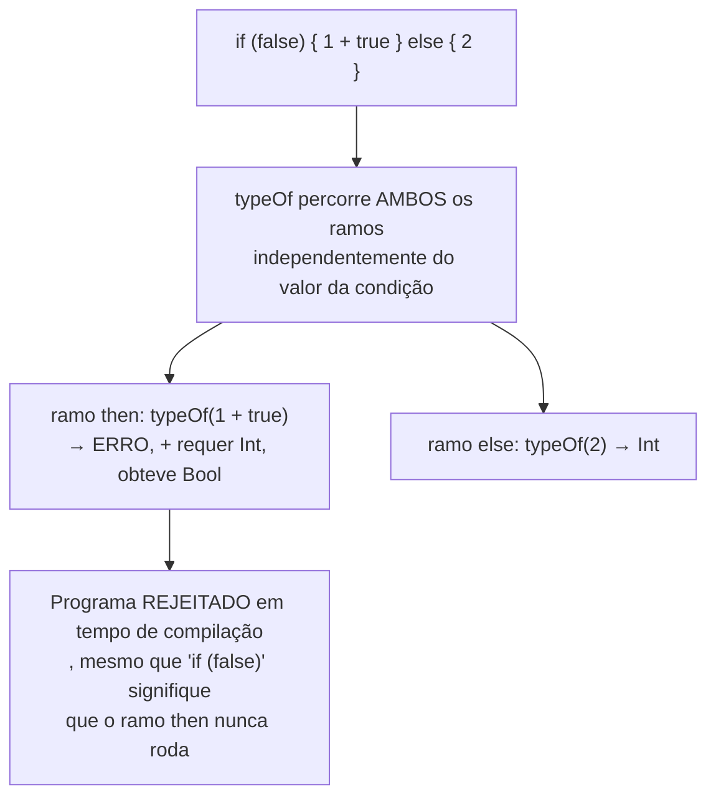

## Objetivos de Aprendizagem

- Explicar a diferença entre checar tipos um pequeno passo de avaliação por vez (como `type-checking-progress-and-preservation` fez) e checar os tipos de um programa inteiro numa única passagem em lote sobre o seu AST.
- Implementar uma passagem de checagem de tipos como uma função recursiva sobre o AST que, para todo nó, ou retorna um tipo ou reporta um erro de tipo, usando a tabela de símbolos do conceito anterior para consultar o tipo declarado de cada identificador.
- Explicar por que um verificador de tipos pode rejeitar um programa sem jamais rodar nenhum do seu código, incluindo código dentro de um ramo que nunca executaria.
- Conectar a garantia desta passagem de volta a progresso e preservação: o que a checagem estática de um compilador compra, em termos de engenharia, que uma checagem em tempo de execução não compra.
- Enunciar honestamente o que fica fora de escopo aqui (um algoritmo completo de inferência baseado em unificação já foi coberto em `programming-languages`; este conceito assume que tipos declarados ou já inferidos estão disponíveis e os checa, em vez de rederivar a inferência).

## Contexto e Motivação

`static-vs-dynamic-typing` enquadrou o trade-off central (pego cedo vs. mais flexível), e `type-checking-progress-and-preservation` provou, um pequeno passo de avaliação por vez, que um termo bem tipado ou está pronto ou ainda pode dar um passo (progresso), e que dar um passo nunca muda o tipo de um termo (preservação). Ambos esses resultados foram enunciados e provados OPERACIONALMENTE, em termos do que acontece conforme um termo de fato avalia.

Um compilador não pode checar tipos "conforme a avaliação acontece", porque nada está avaliando ainda, há só um AST e uma tabela de símbolos, construída pelo conceito anterior, e uma decisão de tempo de compilação a fazer: este programa INTEIRO faz a checagem de tipos, em toda parte, em todo ramo, quer esse ramo jamais execute em qualquer execução particular? A checagem estática de tipos como passagem de compilador responde exatamente a essa pergunta, como uma única caminhada recursiva sobre o AST que atribui um tipo a toda expressão (ou reporta o primeiro lugar onde não consegue), consumindo os tipos declarados da tabela de símbolos em vez de rederivá-los do uso do jeito que a inferência completa faria.

Essa é a mesma garantia operacional, "programas bem tipados não dão errado", entregue de um ponto de vantagem diferente: não "verificado conforme a avaliação prossegue", mas "verificado completamente, numa passagem, antes de a avaliação sequer estar agendada para começar".

## Teoria Central

### O verificador de tipos como uma função recursiva sobre o AST

```text
typeOf(node, symbolTable) -> Type   (ou reporta um erro e para)

typeOf(IntLiteral n)         = Int
typeOf(BoolLiteral b)        = Bool
typeOf(Identifier x)         = symbolTable.lookup(x).type      -- do conceito ANTERIOR
typeOf(BinaryOp(op, l, r)):
    tl = typeOf(l, symbolTable)
    tr = typeOf(r, symbolTable)
    if op is "+" and tl == Int and tr == Int:  return Int
    else: ERRO "operador + requer dois operandos Int, obteve" tl "e" tr
typeOf(If(cond, then, else)):
    tc = typeOf(cond, symbolTable)
    if tc != Bool: ERRO "condição de if tem de ser Bool, obteve" tc
    tt = typeOf(then, symbolTable)
    te = typeOf(else, symbolTable)
    if tt != te: ERRO "os ramos de if têm de ter o mesmo tipo"
    else: return tt
```

Toda regra aqui espelha uma regra de tipagem já enunciada para o cálculo lambda simplesmente tipado em `programming-languages`, a diferença é inteiramente estrutural: lá, um juízo de tipagem `Γ ⊢ t : T` era checado contra um contexto como parte de provar progresso e preservação para uma regra de avaliação de passo pequeno por vez; aqui, os exatos mesmos juízos são checados por uma função recursiva percorrendo um AST real uma vez, da frente ao fim, com a tabela de símbolos de `symbol-tables-and-scope-resolution` fazendo as vezes do contexto de tipagem Γ.

### Por que isto rejeita também erros de ramo inalcançável



Um interpretador que checa tipos operacionalmente, um passo por vez, nunca sequer alcançaria a expressão `1 + true` aqui, porque a condição é `false`, o bug ficaria latente, não detectado, por tanto tempo quanto aquele ramo por acaso não rodasse. Uma passagem em lote, antecipada, não tem esse ponto cego: ela faz a checagem de tipos de todo ramo estruturalmente, quer qualquer execução particular jamais o alcançasse.

### O que esta passagem assume, e o que ela não rederiva

Esta passagem consome tipos que já são conhecidos, ou escritos explicitamente pelo programador, ou já recuperados por `type-inference-and-the-need-for-unification` (coberto por completo em `programming-languages`, usando geração de restrições e a unificação de Robinson). Este conceito não repete essa maquinaria de inferência; é a metade de CHECAGEM da história do sistema de tipos, assumindo que anotações ou tipos inferidos já estão atrelados às declarações na tabela de símbolos, e verificando que todo USO dessas declarações é consistente com elas.

## Exemplos Resolvidos

### Exemplo 1: um programa que faz a checagem de tipos completamente

```text
function add(x: Int, y: Int) -> Int {
  return x + y;
}
```

```text
typeOf(x + y, symbolTable) onde symbolTable tem x: Int, y: Int
  typeOf(x) = Int   (consultado via symbol-tables-and-scope-resolution)
  typeOf(y) = Int
  regra "+": ambos Int → resultado Int
typeOf(return x + y) checado contra o tipo de retorno declarado Int → CASA
O programa faz a checagem de tipos, sem erro, pronto para passar à geração de IR.
```

### Exemplo 2: um erro pego num ramo nunca executado

```text
function f(flag: Bool) -> Int {
  if (flag) {
    return 1;
  } else {
    return "oops";   // tipo errado, mas só alcançado quando flag é falso
  }
}
```

```text
typeOf percorre AMBOS os ramos incondicionalmente:
  then: typeOf(1) = Int             — casa com o tipo de retorno declarado Int
  else: typeOf("oops") = String     — NÃO casa com o tipo de retorno declarado Int
→ ERRO reportado em tempo de compilação, independentemente de que valor `flag`
  por acaso segura em qualquer execução dada, este programa é rejeitado antes
  de ser jamais executado uma só vez.
```

### Exemplo 3: um erro que exige a tabela de símbolos do conceito anterior

```text
function g() -> Int {
  return count + 1;   // `count` nunca foi declarado em lugar nenhum
}
```

```text
typeOf(count) → symbolTable.lookup("count") → NÃO ENCONTRADO
  (symbol-tables-and-scope-resolution já reportou isto como um
   erro de identificador não declarado durante a sua própria passagem)
typeOf(count + 1) não consegue prosseguir de forma significativa sem um tipo para
  `count`, a checagem de tipos depende diretamente de a resolução de escopo ter
  já rodado e populado a tabela de símbolos; as duas passagens são
  ordenadas, não independentes.
```

## Equívocos Comuns e Armadilhas

- **"A checagem estática de tipos como passagem de compilador é uma teoria completamente diferente de progresso e preservação."** É a mesma teoria, entregue estruturalmente em vez de operacionalmente, toda regra de tipagem checada aqui é a mesma regra que `type-checking-progress-and-preservation` provou sólida para um passo de avaliação; esta passagem só aplica todas elas, ao AST inteiro, num lote, antes de qualquer passo ocorrer.
- **"Um verificador de tipos em lote só consegue pegar erros em código que de fato rodaria."** O oposto é uma das suas principais vantagens práticas, o Exemplo 2 mostra um erro de tipo dentro de um ramo que uma execução específica poderia nunca alcançar, pego mesmo assim, porque a passagem percorre todo ramo estruturalmente independentemente do valor de fato de qualquer condição de tempo de execução.
- **"Este conceito rederiva a inferência de tipos, escrever toda anotação à mão também não é exigido aqui."** Ele não o faz, a inferência completa (gerar e resolver restrições por unificação) já foi coberta por completo no `type-inference-and-the-need-for-unification` de `programming-languages`; esta passagem assume que os tipos já estão atrelados (por anotação ou por aquela inferência) e só CHECA a consistência dos usos contra eles.
- **"A checagem de tipos e a resolução de escopo podem rodar em qualquer ordem, ou até simultaneamente, sem problema."** Na prática, a checagem de tipos depende de a resolução de escopo ter já rodado, já que consultar o tipo de um identificador (como em toda regra `typeOf(Identifier x)`) exige que a tabela de símbolos que `symbol-tables-and-scope-resolution` constrói já exista e esteja totalmente populada para o escopo relevante.

## Resumo

A checagem estática de tipos como passagem de compilador toma as exatas regras de tipagem já provadas sólidas (por progresso e preservação) para um pequeno passo de avaliação, e aplica todas elas estruturalmente, numa caminhada recursiva sobre o AST inteiro, usando a tabela de símbolos de `symbol-tables-and-scope-resolution` para resolver o tipo declarado de todo identificador. Como a caminhada cobre todo ramo incondicionalmente, ela pega erros de tipo que uma checagem em tempo de execução, operacional, só descobriria se um ramo específico com bug por acaso executasse, o retorno concreto de engenharia de mover a checagem de tipos de "conforme a avaliação prossegue" para "uma vez, completamente, antes de a avaliação sequer estar agendada". Esta passagem deliberadamente não rederiva a inferência completa de tipos, já coberta por unificação em `programming-languages`; ela assume que os tipos estão atrelados e verifica a consistência. O conceito seguinte, `syntax-directed-translation-and-attribute-grammars`, generaliza esse mesmo padrão de "computar algo recorrendo sobre o AST" para além de só a checagem de tipos, no arcabouço mais amplo sobre o qual a análise semântica e a geração de código ambas de fato rodam.

## Documentation Links

- [Stanford CS143 — Compilers](http://web.stanford.edu/class/cs143/): fase de análise semântica que cobre a checagem de tipos como uma passagem em lote que consome uma tabela de símbolos já construída.
- [ACM/IEEE CS2013 — Programming Languages Knowledge Area](https://csed.acm.org/knowledge-areas-programming-languages-pl-cs2013-version/): unidade de conhecimento de Compilador/Análise Semântica que lista a checagem de tipos como uma passagem de compilador distinta e guiada por AST.
