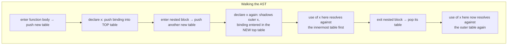

## Learning Objectives

- Explain what a symbol table is and why a compiler needs one even though an interpreter's environment already solves an equivalent problem.
- Build a symbol table by walking an AST, entering each declaration and looking up each use, including nested scopes.
- Implement scoping as a stack of symbol tables (one per lexical block), and use it to detect a use-before-declaration or a duplicate-declaration error statically.
- Contrast this static, one-pass resolution with `environments-and-variable-scope`'s runtime chain of environments, naming exactly what stays the same and what changes.
- Explain why scope errors caught here never need a single instruction of the program to run.

## Context & Motivation

`environments-and-variable-scope` built an environment — a chain of runtime mappings from name to value — that a tree-walking interpreter consults every time it evaluates a variable reference, at the exact moment that reference executes. That works perfectly for an interpreter, because "the exact moment a reference executes" always eventually happens, one way or another, as the program actually runs.

A compiler cannot afford to wait. Scope resolution has to happen exactly once, for the whole program, as a single pass over the AST, entirely before a single instruction is emitted — because the compiler needs to know, right now, at compile time, exactly which declaration every name in the program refers to, in order to decide things like how much stack space a function needs, which register or memory slot each local variable ultimately lives in, and whether the program is even well-formed enough to translate at all. The SYMBOL TABLE is the compile-time data structure that plays the same conceptual role an environment played at runtime — a mapping from name to the information the compiler needs about it — but built once, statically, walking the AST from top to bottom rather than being consulted lazily as evaluation happens to reach each reference.

## Core Theory

### What a symbol table entry actually holds

Unlike an environment's runtime binding (name → current value), a compile-time symbol table entry holds compile-time FACTS about a declaration, not a value that doesn't exist yet:

```text
Symbol table entry for a declared variable `x`:
  name:        "x"
  type:        Int                (needed by static-type-checking-as-a-compiler-pass)
  scope depth: 2                  (which nested block it was declared in)
  storage:     "local, offset -8" (decided later, once stack-frame-generation runs)
  kind:        variable            (vs. function, parameter, type name, ...)
```

None of these facts require the program to be running — they are all derivable purely from the AST's structure and the declarations it contains.

### Scoping as a stack of tables

A single flat symbol table cannot handle nested blocks correctly, because an inner block's declaration of `x` should shadow an outer one only within that block, and should stop shadowing it the moment the block ends — exactly the same shadowing behavior `environments-and-variable-scope` already established for a runtime environment chain. The static analogue is a STACK of symbol tables, one pushed per entered scope and popped on exit:



A lookup for a name walks the stack from the innermost (top) table outward, exactly mirroring `environments-and-variable-scope`'s environment-chain lookup — the only difference is WHEN this walk happens: here, once, during a single compile-time pass over the AST; there, every time evaluation actually reaches that reference at runtime.

### Two static errors this pass alone can catch

Because the entire AST is visible at once during this pass, two whole classes of error are catchable before any code exists:

- **Use before declaration** (in languages that require it): a lookup that finds nothing in any table on the stack, at the exact AST position where the reference occurs, is reported immediately as "undeclared identifier" — no need to run the program and hope that line executes.
- **Duplicate declaration in the same scope**: attempting to insert a second binding for the same name into a table that already holds one, in the SAME scope (not a shadowing case, which spans different scopes), is reported directly as a redeclaration error.

## Worked Examples

### Example 1: building the table for a small nested function

```text
function outer() {
  var x = 1;
  {
    var x = 2;      // shadows outer x within this block only
    print(x);        // resolves to 2 (innermost table)
  }
  print(x);           // resolves to 1 (outer table, block's table already popped)
}
```

```text
Walking outer():
  push table T1 (outer's scope)
  declare x in T1              → T1 = {x: Int}
  enter block → push table T2
  declare x in T2               → T2 = {x: Int}   (shadows T1's x)
  lookup x for print(x)         → found in T2 first → resolves to T2's x
  exit block → pop T2
  lookup x for print(x)         → T2 gone, found in T1 → resolves to T1's x
```

### Example 2: catching a use-before-declaration error statically

```text
function bad() {
  print(y);      // used here
  var y = 5;     // declared here, AFTER the use
}
```

```text
Walking bad() top to bottom:
  encounter print(y) → look up y in current table stack → NOT FOUND
    (the declaration hasn't been walked yet, since AST traversal is
     in source order and `var y` appears later in the text)
  → report: "y used before its declaration" — entirely from walking
    the AST once, without ever generating or running a single
    instruction.
```

### Example 3: a duplicate-declaration error in the same scope

```text
function conflict() {
  var z = 1;
  var z = 2;    // ERROR: z already declared in this exact scope
}
```

```text
Walking conflict():
  push table T1
  declare z in T1 → T1 = {z: Int}
  attempt to declare z in T1 again → T1 ALREADY has an entry for z
    in this SAME table (not a different, nested one — this is not
    shadowing) → report: "z redeclared in the same scope"
```

## Common Misconceptions & Pitfalls

- **"A symbol table is just an environment with a different name."** They play analogous roles but at different times: an environment is a runtime structure consulted lazily, holding actual VALUES, as an interpreter executes; a symbol table is a compile-time structure built once, holding compile-time FACTS (type, storage, kind), entirely before execution exists.
- **"Shadowing a variable in a nested block is a redeclaration error."** It is not — shadowing spans two different tables (a new one pushed for the nested scope); a genuine duplicate-declaration error requires inserting two bindings for the same name into the exact same table, as Example 3 shows.
- **"Symbol table construction requires two passes over the AST — one to collect declarations, one to check uses."** Many languages resolve this in a single pass by construction (declare-before-use is enforced, as in Example 2), but some real languages (e.g. mutually recursive top-level functions) genuinely do need declarations collected in a first pass before uses are checked in a second — the single-pass version shown here is the simpler, more common introductory case, not a universal law.
- **"Since this pass happens statically, it can also verify everything type checking needs to verify."** Scope resolution alone only answers WHICH declaration a name refers to — it does not check whether a use is well-TYPED; that is a separate, subsequent pass, `static-type-checking-as-a-compiler-pass`, that consumes the type information this pass's symbol table already recorded.

## Summary

A symbol table answers, statically and once, the exact question `environments-and-variable-scope` answered dynamically and repeatedly: which declaration does this name refer to? Implemented as a stack of tables — one pushed per entered lexical scope, popped on exit — a single top-to-bottom walk of the AST both builds the table (on each declaration) and resolves every use (by searching the stack from innermost outward), catching use-before-declaration and duplicate-declaration errors along the way, entirely without running the program. This static structure is exactly what the next concept, `static-type-checking-as-a-compiler-pass`, builds on: knowing which declaration a name resolves to is the prerequisite for knowing what TYPE that declaration has, and therefore whether a given use of it is well-typed.

## Documentation Links

- [Stanford CS143 — Compilers](http://web.stanford.edu/class/cs143/) — course whose semantic-analysis phase covers symbol-table construction and scope checking as the first pass after parsing.
- [MIT 6.035 — Computer Language Engineering, Syllabus](https://ocw.mit.edu/courses/6-035-computer-language-engineering-sma-5502-fall-2005/pages/syllabus/) — lists the "Semantic Checker" as a distinct compiler-project segment, built directly on top of the parser's output.
