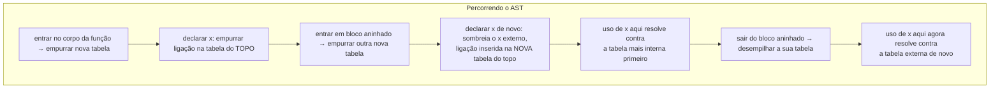

## Objetivos de Aprendizagem

- Explicar o que é uma tabela de símbolos e por que um compilador precisa de uma mesmo que o ambiente de um interpretador já resolva um problema equivalente.
- Construir uma tabela de símbolos percorrendo um AST, inserindo cada declaração e consultando cada uso, incluindo escopos aninhados.
- Implementar o escopo como uma pilha de tabelas de símbolos (uma por bloco léxico), e usá-la para detectar um erro de uso-antes-da-declaração ou de declaração-duplicada estaticamente.
- Contrastar essa resolução estática de uma passagem com a cadeia de ambientes de tempo de execução de `environments-and-variable-scope`, nomeando exatamente o que fica igual e o que muda.
- Explicar por que os erros de escopo pegos aqui nunca precisam que uma única instrução do programa rode.

## Contexto e Motivação

`environments-and-variable-scope` construiu um ambiente, uma cadeia de mapeamentos de tempo de execução de nome para valor, que um interpretador que percorre a árvore consulta toda vez que avalia uma referência de variável, no exato momento em que aquela referência executa. Isso funciona perfeitamente para um interpretador, porque "o exato momento em que uma referência executa" sempre eventualmente acontece, de um jeito ou de outro, conforme o programa de fato roda.

Um compilador não pode se dar ao luxo de esperar. A resolução de escopo tem de acontecer exatamente uma vez, para o programa inteiro, como uma única passagem sobre o AST, inteiramente antes de uma única instrução ser emitida, porque o compilador precisa saber, agora mesmo, em tempo de compilação, exatamente a qual declaração todo nome no programa se refere, a fim de decidir coisas como quanto espaço de pilha uma função precisa, em qual registrador ou slot de memória cada variável local por fim vive, e se o programa é sequer bem formado o bastante para traduzir de todo. A TABELA DE SÍMBOLOS é a estrutura de dados de tempo de compilação que desempenha o mesmo papel conceitual que um ambiente desempenhou em tempo de execução, um mapeamento de nome para a informação de que o compilador precisa sobre ele, mas construída uma vez, estaticamente, percorrendo o AST de cima para baixo em vez de ser consultada preguiçosamente conforme a avaliação por acaso alcança cada referência.

## Teoria Central

### O que uma entrada de tabela de símbolos de fato segura

Diferentemente de uma ligação de tempo de execução de um ambiente (nome → valor atual), uma entrada de tabela de símbolos de tempo de compilação segura FATOS de tempo de compilação sobre uma declaração, não um valor que ainda não existe:

```text
Entrada de tabela de símbolos para uma variável declarada `x`:
  name:        "x"
  type:        Int                (necessário por static-type-checking-as-a-compiler-pass)
  profundidade de escopo: 2       (em qual bloco aninhado foi declarada)
  storage:     "local, offset -8" (decidido depois, uma vez que stack-frame-generation roda)
  kind:        variável            (vs. função, parâmetro, nome de tipo, ...)
```

Nenhum desses fatos exige que o programa esteja rodando, são todos deriváveis puramente da estrutura do AST e das declarações que ele contém.

### Escopo como uma pilha de tabelas

Uma única tabela de símbolos plana não consegue lidar com blocos aninhados corretamente, porque a declaração de `x` de um bloco interno deveria sombrear uma externa só dentro daquele bloco, e deveria parar de sombreá-la no momento em que o bloco termina, exatamente o mesmo comportamento de sombreamento que `environments-and-variable-scope` já estabeleceu para uma cadeia de ambientes de tempo de execução. O análogo estático é uma PILHA de tabelas de símbolos, uma empurrada por escopo entrado e desempilhada na saída:



Uma consulta por um nome percorre a pilha da tabela mais interna (topo) para fora, espelhando exatamente a consulta de cadeia de ambientes de `environments-and-variable-scope`, a única diferença é QUANDO essa caminhada acontece: aqui, uma vez, durante uma única passagem de tempo de compilação sobre o AST; lá, toda vez que a avaliação de fato alcança aquela referência em tempo de execução.

### Dois erros estáticos que só esta passagem consegue pegar

Como o AST inteiro é visível de uma vez durante esta passagem, duas classes inteiras de erro são pegáveis antes de qualquer código existir:

- **Uso antes da declaração** (em linguagens que o exigem): uma consulta que não encontra nada em nenhuma tabela na pilha, na exata posição do AST onde a referência ocorre, é reportada imediatamente como "identificador não declarado", sem necessidade de rodar o programa e torcer para aquela linha executar.
- **Declaração duplicada no mesmo escopo**: tentar inserir uma segunda ligação para o mesmo nome numa tabela que já segura uma, no MESMO escopo (não um caso de sombreamento, que abrange escopos diferentes), é reportado diretamente como um erro de redeclaração.

## Exemplos Resolvidos

### Exemplo 1: construir a tabela para uma pequena função aninhada

```text
function outer() {
  var x = 1;
  {
    var x = 2;      // sombreia o x externo só dentro deste bloco
    print(x);        // resolve para 2 (tabela mais interna)
  }
  print(x);           // resolve para 1 (tabela externa, tabela do bloco já desempilhada)
}
```

```text
Percorrendo outer():
  empurrar tabela T1 (escopo de outer)
  declarar x em T1              → T1 = {x: Int}
  entrar no bloco → empurrar tabela T2
  declarar x em T2               → T2 = {x: Int}   (sombreia o x de T1)
  consultar x para print(x)      → encontrado em T2 primeiro → resolve para o x de T2
  sair do bloco → desempilhar T2
  consultar x para print(x)      → T2 sumiu, encontrado em T1 → resolve para o x de T1
```

### Exemplo 2: pegar um erro de uso-antes-da-declaração estaticamente

```text
function bad() {
  print(y);      // usado aqui
  var y = 5;     // declarado aqui, DEPOIS do uso
}
```

```text
Percorrendo bad() de cima para baixo:
  encontrar print(y) → consultar y na pilha de tabelas atual → NÃO ENCONTRADO
    (a declaração ainda não foi percorrida, já que a travessia do AST é
     em ordem de fonte e `var y` aparece mais tarde no texto)
  → reportar: "y usado antes da sua declaração", inteiramente a partir de percorrer
    o AST uma vez, sem jamais gerar ou rodar uma única
    instrução.
```

### Exemplo 3: um erro de declaração-duplicada no mesmo escopo

```text
function conflict() {
  var z = 1;
  var z = 2;    // ERRO: z já declarado neste exato escopo
}
```

```text
Percorrendo conflict():
  empurrar tabela T1
  declarar z em T1 → T1 = {z: Int}
  tentar declarar z em T1 de novo → T1 JÁ tem uma entrada para z
    nesta MESMA tabela (não uma diferente, aninhada, isto não é
    sombreamento) → reportar: "z redeclarado no mesmo escopo"
```

## Equívocos Comuns e Armadilhas

- **"Uma tabela de símbolos é só um ambiente com um nome diferente."** Elas desempenham papéis análogos, mas em momentos diferentes: um ambiente é uma estrutura de tempo de execução consultada preguiçosamente, segurando VALORES de fato, conforme um interpretador executa; uma tabela de símbolos é uma estrutura de tempo de compilação construída uma vez, segurando FATOS de tempo de compilação (tipo, armazenamento, espécie), inteiramente antes de a execução existir.
- **"Sombrear uma variável num bloco aninhado é um erro de redeclaração."** Não é, o sombreamento abrange duas tabelas diferentes (uma nova empurrada para o escopo aninhado); um erro genuíno de declaração duplicada exige inserir duas ligações para o mesmo nome na exata mesma tabela, como o Exemplo 3 mostra.
- **"A construção de tabela de símbolos exige duas passagens sobre o AST, uma para coletar declarações, uma para checar usos."** Muitas linguagens resolvem isso numa única passagem por construção (declarar-antes-de-usar é imposto, como no Exemplo 2), mas algumas linguagens reais (ex.: funções mutuamente recursivas de nível superior) genuinamente precisam que as declarações sejam coletadas numa primeira passagem antes de os usos serem checados numa segunda, a versão de passagem única mostrada aqui é o caso introdutório mais simples e mais comum, não uma lei universal.
- **"Como esta passagem acontece estaticamente, ela também consegue verificar tudo o que a checagem de tipos precisa verificar."** A resolução de escopo sozinha só responde a QUAL declaração um nome se refere, ela não checa se um uso é bem TIPADO; essa é uma passagem separada e subsequente, `static-type-checking-as-a-compiler-pass`, que consome a informação de tipo que a tabela de símbolos desta passagem já registrou.

## Resumo

Uma tabela de símbolos responde, estaticamente e uma vez, à exata pergunta que `environments-and-variable-scope` respondeu dinamicamente e repetidamente: a qual declaração este nome se refere? Implementada como uma pilha de tabelas, uma empurrada por escopo léxico entrado, desempilhada na saída, uma única caminhada de cima para baixo do AST tanto constrói a tabela (em cada declaração) quanto resolve todo uso (buscando na pilha da mais interna para fora), pegando erros de uso-antes-da-declaração e de declaração-duplicada pelo caminho, inteiramente sem rodar o programa. Essa estrutura estática é exatamente aquilo sobre o qual o conceito seguinte, `static-type-checking-as-a-compiler-pass`, se constrói: saber a qual declaração um nome resolve é o pré-requisito para saber que TIPO essa declaração tem, e, portanto, se um dado uso dela é bem tipado.

## Documentation Links

- [Stanford CS143 — Compilers](http://web.stanford.edu/class/cs143/): curso cuja fase de análise semântica cobre a construção de tabela de símbolos e a checagem de escopo como a primeira passagem após o parsing.
- [MIT 6.035 — Computer Language Engineering, Syllabus](https://ocw.mit.edu/courses/6-035-computer-language-engineering-sma-5502-fall-2005/pages/syllabus/): lista o "Semantic Checker" como um segmento distinto de projeto de compilador, construído diretamente sobre a saída do parser.
