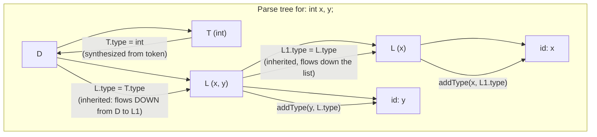

## Learning Objectives

- Define an attribute grammar: a context-free grammar (already covered in `formal-languages-automata`) extended with a semantic action attached to each production.
- Distinguish synthesized attributes (computed bottom-up, from children to parent) from inherited attributes (passed top-down, from parent or siblings to a node).
- Trace attribute evaluation over a real parse tree for a small expression grammar, computing both a synthesized attribute (a value) and an inherited one (a declared type flowing down into a use).
- Explain why syntax-directed translation is the general framework that both `static-type-checking-as-a-compiler-pass` and `three-address-code` generation are specific instances of.
- Identify when an attribute grammar's evaluation order forces a specific traversal of the parse tree (e.g. depends only on children vs. depends on a sibling not yet visited).

## Context & Motivation

`context-free-grammars-and-derivations` (in `formal-languages-automata`) defined a grammar purely syntactically: a set of productions that generate strings, with no notion of what any derived string MEANS. `parsing-expressions-into-an-abstract-syntax-tree` (in `programming-languages`) built a real parser that recovers a derivation's structure as a tree — still, at that point, carrying no semantic information beyond shape.

An attribute grammar is the classic bridge from one to the other: take an existing context-free grammar, and attach a SEMANTIC ACTION to each production — a small computation, expressed in terms of ATTRIBUTES (values attached to grammar symbols), that runs whenever that production is used in a derivation. This is not a new idea invented separately for type checking or for code generation — it is the single, general mechanism both of them are built from: `static-type-checking-as-a-compiler-pass`'s `typeOf` function and `three-address-code`'s code-generation function are both, underneath, syntax-directed translations, just with a specific choice of what the attributes compute.

## Core Theory

### Synthesized vs. inherited attributes

A SYNTHESIZED attribute at a node is computed from its CHILDREN's attributes — information flows upward, from leaves toward the root, exactly the shape a bottom-up evaluation naturally takes:

```text
Production:  E → E1 + E2
Semantic action (synthesized):  E.val = E1.val + E2.val

Production:  E → num
Semantic action (synthesized):  E.val = num.lexval
```

An INHERITED attribute at a node is computed from its PARENT or its SIBLINGS — information flows downward or sideways, which is exactly what's needed for something like a declared type reaching a use, or scope information reaching a nested block:

```text
Production:  D → T L
Semantic action (inherited):  L.type = T.type   (the declared type T
                                flows DOWN into L, the list of names
                                being declared with that type)
Production:  L → L1 , id
Semantic action:  L1.type = L.type               (inherited type keeps
                                flowing down the list)
             addType(id.name, L.type)             (used to build the
                                symbol table — this is exactly the
                                mechanism symbol-tables-and-scope-
                                resolution runs)
```

### Evaluation order is determined by attribute dependencies



A synthesized-only attribute grammar can always be evaluated bottom-up, in a single post-order traversal of the parse tree (every child's value is ready by the time the parent needs it). An inherited attribute forces a different traversal order: a node's inherited attribute may depend on its PARENT's own attribute (already computed further up, or passed down as the parent is visited) or on a SIBLING to its left — meaning the tree must be visited in an order that respects those specific dependencies, not simply "children first" or "parent first" uniformly.

### Why this is the general framework both later passes specialize

`static-type-checking-as-a-compiler-pass`'s `typeOf` function is a synthesized-attribute evaluation: `typeOf(BinaryOp(op, l, r))` computes the parent's type attribute purely from its children's already-computed type attributes, exactly like `E.val = E1.val + E2.val` above. `three-address-code` generation (the very next cluster) is a MIXED synthesized/inherited translation: code for a subexpression is synthesized bottom-up (the actual instructions), while things like a target register name or a "place to jump on false" label are often inherited top-down into a subtree before its own code is generated. Naming this shared framework once, here, means neither later concept needs to re-justify why "compute something recursively over the AST, using information from children and sometimes from parents" is a sound, general technique — it already is, by construction.

## Worked Examples

### Example 1: evaluating a purely synthesized grammar for arithmetic

```text
Grammar:              Semantic action:
E → E1 + E2            E.val = E1.val + E2.val
E → E1 * E2            E.val = E1.val * E2.val
E → num                E.val = num.lexval

Input: 2 + 3 * 4

Parse tree (respecting precedence, already resolved by the parser):
      E
    / | \
  E   +   E
  |      / | \
  2     E  *  E
        |     |
        3     4

Bottom-up evaluation:
  E(3).val = 3
  E(4).val = 4
  E(3*4).val = 3 * 4 = 12
  E(2).val = 2
  E(2+3*4).val = 2 + 12 = 14
```

### Example 2: an inherited attribute carrying a declared type into a use

```text
Source: int x, y;

Using the D → T L grammar above:
  T.type = int                       (synthesized from the token "int")
  L.type = T.type = int              (INHERITED: flows down from D into L)
  L1 (the "x" part of the list) inherits L.type = int
  addType("x", int)                   — this call is exactly what feeds
                                        symbol-tables-and-scope-resolution's
                                        table with x's declared type
  addType("y", int)                   — same for y
```

### Example 3: a dependency that forces a specific traversal order

```text
Grammar:              Semantic action:
S → E ; S1              S1.startLabel = newLabel()   (INHERITED — S1
                                                        needs a label
                                                        decided by its
                                                        PARENT, before
                                                        S1 itself can
                                                        be translated)
                          E.code = translate(E)         (SYNTHESIZED
                                                        from E's own
                                                        subtree)

Evaluation must:
  1. compute S1.startLabel FIRST (top-down, from S into S1)
     — S1's own children cannot decide this value themselves
  2. only THEN recurse into S1's subtree, now that the inherited
     value it depends on is already available
This is exactly why "always visit children before the parent" is not
a universally safe traversal order once inherited attributes exist —
the order must respect the actual dependency graph between attributes.
```

## Common Misconceptions & Pitfalls

- **"Attribute grammars are a separate, additional grammar formalism, distinct from the context-free grammars already covered."** They are the SAME context-free grammar from `formal-languages-automata`, with semantic actions attached to each production — no new generative power is added; only a computation is layered on top of an existing derivation.
- **"Every attribute can be computed with a single bottom-up pass."** Only synthesized attributes guarantee that; an inherited attribute (Example 2's declared type, Example 3's label) may require information from a parent or an already-visited sibling, forcing a traversal order that respects those specific dependencies rather than a uniform post-order walk.
- **"Syntax-directed translation is only relevant to code generation, not to earlier passes like type checking."** `static-type-checking-as-a-compiler-pass`'s entire `typeOf` function is itself a synthesized-attribute evaluation over the AST — it was already an instance of this framework, just not named as such until now.
- **"Once an attribute grammar is written down, its evaluation order is obvious from the grammar alone."** It is only obvious for purely synthesized cases; a grammar mixing inherited and synthesized attributes can require a real dependency analysis to determine a valid evaluation order, and a badly designed set of attributes can even have no valid order at all (a genuine circular dependency).

## Summary

An attribute grammar attaches a semantic action, expressed over synthesized (bottom-up) and inherited (top-down or sideways) attributes, to each production of an already-existing context-free grammar — turning a purely syntactic derivation tree from `formal-languages-automata` into a structure that also carries meaning. Synthesized attributes alone permit a single bottom-up pass (Example 1); inherited attributes (Examples 2 and 3) force an evaluation order that respects the actual dependency between a node's attribute and its parent's or sibling's. This is the general mechanism both `static-type-checking-as-a-compiler-pass`'s `typeOf` function and the upcoming IR-generation passes are specific instances of — naming it once here means every later "recurse over the AST, computing something" pass in this discipline is understood as an application of a single, well-founded technique. The discipline now turns from what the AST MEANS (semantic analysis) to what it gets TRANSLATED INTO — intermediate representations, starting with the very next concept.

## Documentation Links

- [Stanford CS143 — Compilers](http://web.stanford.edu/class/cs143/) — semantic-analysis material presenting attribute grammars as the bridge from parse tree to semantic actions.
- [MIT 6.035 — Computer Language Engineering, Syllabus](https://ocw.mit.edu/courses/6-035-computer-language-engineering-sma-5502-fall-2005/pages/syllabus/) — "Semantic Checker" project segment, built via syntax-directed computation over the parser's output tree.
