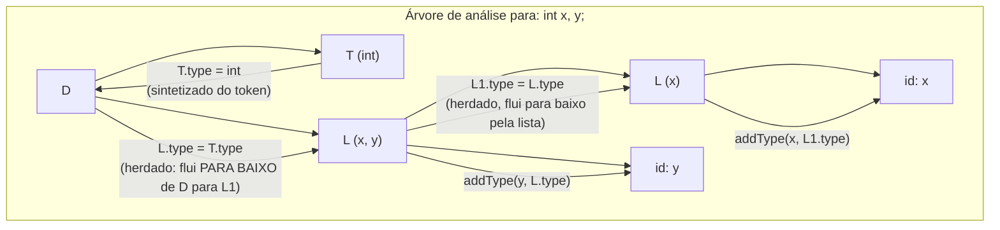

## Objetivos de Aprendizagem

- Definir uma gramática de atributos: uma gramática livre de contexto (já coberta em `formal-languages-automata`) estendida com uma ação semântica atrelada a cada produção.
- Distinguir atributos sintetizados (computados de baixo para cima, dos filhos ao pai) de atributos herdados (passados de cima para baixo, do pai ou dos irmãos para um nó).
- Rastrear a avaliação de atributos sobre uma árvore de análise real para uma pequena gramática de expressão, computando tanto um atributo sintetizado (um valor) quanto um herdado (um tipo declarado fluindo para baixo até um uso).
- Explicar por que a tradução dirigida por sintaxe é o arcabouço geral do qual tanto `static-type-checking-as-a-compiler-pass` quanto a geração de `three-address-code` são instâncias específicas.
- Identificar quando a ordem de avaliação de uma gramática de atributos força uma travessia específica da árvore de análise (ex.: depende só dos filhos vs. depende de um irmão ainda não visitado).

## Contexto e Motivação

`context-free-grammars-and-derivations` (em `formal-languages-automata`) definiu uma gramática puramente de forma sintática: um conjunto de produções que geram strings, sem nenhuma noção do que qualquer string derivada SIGNIFICA. `parsing-expressions-into-an-abstract-syntax-tree` (em `programming-languages`) construiu um parser real que recupera a estrutura de uma derivação como uma árvore, ainda, naquele ponto, não carregando nenhuma informação semântica além do formato.

Uma gramática de atributos é a ponte clássica de um para o outro: tomar uma gramática livre de contexto existente, e atrelar uma AÇÃO SEMÂNTICA a cada produção, uma pequena computação, expressa em termos de ATRIBUTOS (valores atrelados a símbolos de gramática), que roda sempre que aquela produção é usada numa derivação. Essa não é uma ideia nova inventada separadamente para a checagem de tipos ou para a geração de código, é o único e geral mecanismo do qual ambas são construídas: a função `typeOf` de `static-type-checking-as-a-compiler-pass` e a função de geração de código de `three-address-code` são ambas, por baixo, traduções dirigidas por sintaxe, só que com uma escolha específica do que os atributos computam.

## Teoria Central

### Atributos sintetizados vs. herdados

Um atributo SINTETIZADO num nó é computado a partir dos atributos dos seus FILHOS, a informação flui para cima, das folhas rumo à raiz, exatamente o formato que uma avaliação de baixo para cima naturalmente toma:

```text
Produção:  E → E1 + E2
Ação semântica (sintetizada):  E.val = E1.val + E2.val

Produção:  E → num
Ação semântica (sintetizada):  E.val = num.lexval
```

Um atributo HERDADO num nó é computado a partir do seu PAI ou dos seus IRMÃOS, a informação flui para baixo ou para o lado, que é exatamente o que é necessário para algo como um tipo declarado alcançando um uso, ou informação de escopo alcançando um bloco aninhado:

```text
Produção:  D → T L
Ação semântica (herdada):  L.type = T.type   (o tipo declarado T
                                flui PARA BAIXO até L, a lista de nomes
                                sendo declarada com aquele tipo)
Produção:  L → L1 , id
Ação semântica:  L1.type = L.type               (o tipo herdado continua
                                fluindo para baixo pela lista)
             addType(id.name, L.type)             (usado para construir a
                                tabela de símbolos, este é exatamente o
                                mecanismo que symbol-tables-and-scope-
                                resolution roda)
```

### A ordem de avaliação é determinada pelas dependências de atributos



Uma gramática de atributos só sintetizados pode sempre ser avaliada de baixo para cima, numa única travessia em pós-ordem da árvore de análise (o valor de todo filho está pronto quando o pai precisa dele). Um atributo herdado força uma ordem de travessia diferente: o atributo herdado de um nó pode depender do próprio atributo do seu PAI (já computado mais acima, ou passado para baixo conforme o pai é visitado) ou de um IRMÃO à sua esquerda, ou seja, a árvore tem de ser visitada numa ordem que respeite essas dependências específicas, não simplesmente "filhos primeiro" ou "pai primeiro" uniformemente.

### Por que este é o arcabouço geral que ambas as passagens posteriores especializam

A função `typeOf` de `static-type-checking-as-a-compiler-pass` é uma avaliação de atributo sintetizado: `typeOf(BinaryOp(op, l, r))` computa o atributo de tipo do pai puramente a partir dos atributos de tipo já computados dos seus filhos, exatamente como `E.val = E1.val + E2.val` acima. A geração de `three-address-code` (o próprio agrupamento seguinte) é uma tradução MISTA sintetizada/herdada: o código para uma subexpressão é sintetizado de baixo para cima (as instruções de fato), enquanto coisas como um nome de registrador-alvo ou um rótulo de "lugar para saltar em caso de falso" são muitas vezes herdadas de cima para baixo numa subárvore antes de o seu próprio código ser gerado. Nomear este arcabouço compartilhado uma vez, aqui, significa que nenhum conceito posterior precisa rejustificar por que "computar algo recursivamente sobre o AST, usando informação dos filhos e às vezes dos pais" é uma técnica sólida e geral, ela já é, por construção.

## Exemplos Resolvidos

### Exemplo 1: avaliar uma gramática puramente sintetizada para aritmética

```text
Gramática:            Ação semântica:
E → E1 + E2            E.val = E1.val + E2.val
E → E1 * E2            E.val = E1.val * E2.val
E → num                E.val = num.lexval

Entrada: 2 + 3 * 4

Árvore de análise (respeitando a precedência, já resolvida pelo parser):
      E
    / | \
  E   +   E
  |      / | \
  2     E  *  E
        |     |
        3     4

Avaliação de baixo para cima:
  E(3).val = 3
  E(4).val = 4
  E(3*4).val = 3 * 4 = 12
  E(2).val = 2
  E(2+3*4).val = 2 + 12 = 14
```

### Exemplo 2: um atributo herdado carregando um tipo declarado até um uso

```text
Fonte: int x, y;

Usando a gramática D → T L acima:
  T.type = int                       (sintetizado do token "int")
  L.type = T.type = int              (HERDADO: flui para baixo de D até L)
  L1 (a parte "x" da lista) herda L.type = int
  addType("x", int)                   — esta chamada é exatamente o que alimenta
                                        a tabela de symbol-tables-and-scope-resolution
                                        com o tipo declarado de x
  addType("y", int)                   — o mesmo para y
```

### Exemplo 3: uma dependência que força uma ordem de travessia específica

```text
Gramática:            Ação semântica:
S → E ; S1              S1.startLabel = newLabel()   (HERDADO, S1
                                                        precisa de um rótulo
                                                        decidido pelo seu
                                                        PAI, antes de
                                                        o próprio S1 poder
                                                        ser traduzido)
                          E.code = translate(E)         (SINTETIZADO
                                                        da própria
                                                        subárvore de E)

A avaliação tem de:
  1. computar S1.startLabel PRIMEIRO (de cima para baixo, de S até S1)
     — os próprios filhos de S1 não conseguem decidir este valor sozinhos
  2. só ENTÃO recorrer na subárvore de S1, agora que o valor herdado
     do qual ela depende já está disponível
É exatamente por isso que "sempre visitar os filhos antes do pai" não é
uma ordem de travessia universalmente segura uma vez que atributos herdados existem,
a ordem tem de respeitar o grafo de dependências de fato entre os atributos.
```

## Equívocos Comuns e Armadilhas

- **"As gramáticas de atributos são um formalismo de gramática separado e adicional, distinto das gramáticas livres de contexto já cobertas."** Elas são a MESMA gramática livre de contexto de `formal-languages-automata`, com ações semânticas atreladas a cada produção, nenhum novo poder gerativo é adicionado; só uma computação é posta em camadas sobre uma derivação existente.
- **"Todo atributo pode ser computado com uma única passagem de baixo para cima."** Só os atributos sintetizados garantem isso; um atributo herdado (o tipo declarado do Exemplo 2, o rótulo do Exemplo 3) pode exigir informação de um pai ou de um irmão já visitado, forçando uma ordem de travessia que respeite essas dependências específicas em vez de uma caminhada uniforme em pós-ordem.
- **"A tradução dirigida por sintaxe só é relevante para a geração de código, não para passagens anteriores como a checagem de tipos."** A função `typeOf` inteira de `static-type-checking-as-a-compiler-pass` é, ela mesma, uma avaliação de atributo sintetizado sobre o AST, ela já era uma instância deste arcabouço, só não nomeada como tal até agora.
- **"Uma vez que uma gramática de atributos é escrita, a sua ordem de avaliação é óbvia só a partir da gramática."** Ela só é óbvia para casos puramente sintetizados; uma gramática que mistura atributos herdados e sintetizados pode exigir uma análise real de dependências para determinar uma ordem de avaliação válida, e um conjunto mal projetado de atributos pode até não ter nenhuma ordem válida de forma alguma (uma dependência circular genuína).

## Resumo

Uma gramática de atributos atrela uma ação semântica, expressa sobre atributos sintetizados (de baixo para cima) e herdados (de cima para baixo ou para o lado), a cada produção de uma gramática livre de contexto já existente, transformando uma árvore de derivação puramente sintática de `formal-languages-automata` numa estrutura que também carrega significado. Só os atributos sintetizados permitem uma única passagem de baixo para cima (Exemplo 1); os atributos herdados (Exemplos 2 e 3) forçam uma ordem de avaliação que respeita a dependência de fato entre o atributo de um nó e o do seu pai ou irmão. Este é o mecanismo geral do qual tanto a função `typeOf` de `static-type-checking-as-a-compiler-pass` quanto as próximas passagens de geração de IR são instâncias específicas, nomeá-lo uma vez aqui significa que toda passagem posterior de "recorrer sobre o AST, computando algo" nesta disciplina é entendida como uma aplicação de uma única técnica bem fundamentada. A disciplina agora se volta do que o AST SIGNIFICA (análise semântica) para aquilo em que ele é TRADUZIDO, representações intermediárias, começando com o próprio conceito seguinte.

## Documentation Links

- [Stanford CS143 — Compilers](http://web.stanford.edu/class/cs143/): material de análise semântica que apresenta as gramáticas de atributos como a ponte da árvore de análise para as ações semânticas.
- [MIT 6.035 — Computer Language Engineering, Syllabus](https://ocw.mit.edu/courses/6-035-computer-language-engineering-sma-5502-fall-2005/pages/syllabus/): segmento de projeto "Semantic Checker", construído por computação dirigida por sintaxe sobre a árvore de saída do parser.
