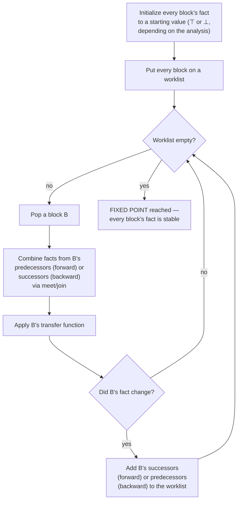

## Learning Objectives

- State the four ingredients every data-flow analysis is built from: a domain of facts (a lattice), a direction (forward or backward), a transfer function per basic block, and a meet/join operator combining facts from multiple predecessors or successors.
- Explain what a fixed point is in this context, and why iterating the transfer functions over a CFG is guaranteed to reach one for the analyses this discipline covers.
- Trace the generic worklist algorithm by hand on a small CFG, without committing to any one specific analysis's facts yet.
- Explain why a loop in the CFG (a cycle) requires iteration to resolve, rather than a single top-to-bottom pass being sufficient.
- Preview, by name only, the three specific analyses the next three concepts instantiate this framework into.

## Context & Motivation

`static-single-assignment-form` closed the intermediate-representation cluster; this concept opens a new one by stepping back to ask a more general question first: reaching definitions, live variables, and available expressions — the three specific analyses covered in the next three concepts — all sound like different problems, but they are secretly the SAME algorithm, run with different inputs. Learning that one algorithm once, here, in the abstract, means each of the next three concepts is a short exercise in plugging in a specific choice of facts, rather than a fresh algorithm to learn from scratch each time.

This is exactly how Cooper & Torczon's and MIT 6.035's own treatments structure the material — a generic framework lecture (lattices, transfer functions, fixed-point iteration) taught once, ahead of the specific analyses that instantiate it — and it is the same instinct `syntax-directed-translation-and-attribute-grammars` already modeled earlier in this discipline: name the shared mechanism once, so later concepts can specialize it rather than re-derive it.

## Core Theory

### The four ingredients

- **A domain of facts (a LATTICE).** For a given analysis, a "fact" at a program point is some piece of information — a set of variable names, a set of expressions, whatever the specific analysis needs. The set of ALL possible facts, ordered by "how much information" each one represents, forms a lattice: a structure with a well-defined way to combine two facts (MEET, for analyses that want the intersection of what's guaranteed on every path, or JOIN, for analyses that want the union of what's possible on any path).
- **A direction.** A FORWARD analysis pushes facts from a block's entry to its exit, following the CFG's edges in their natural direction (used when a block's outgoing fact depends on what came IN). A BACKWARD analysis pushes facts from a block's exit back to its entry (used when a block's fact depends on what happens LATER, downstream).
- **A transfer function per block.** Each basic block has a function that takes the fact true at its entry (forward) or exit (backward) and computes the fact true at the other end, based on what that specific block's instructions actually do.
- **A meet/join at merge points.** When two or more edges converge on one block (an if/else merging, or a loop's back edge arriving alongside its forward entry), the facts arriving along each edge are combined with the lattice's meet or join operator before that block's own transfer function runs.

### The generic worklist algorithm



The algorithm terminates because the lattice has finite height for the analyses this discipline covers (facts only ever move in one direction along the lattice's ordering as the loop reruns, never oscillate back and forth), which guarantees a FIXED POINT — a state where re-running every transfer function changes nothing further — is reached after a bounded number of iterations, however many times a loop's back edge forces a block to be revisited.

### Why a CFG cycle forces iteration

A block inside a loop has a predecessor that comes AFTER it in program order (the back edge) — so its correct fact can depend on a fact that isn't known yet on a single top-to-bottom pass. Running the transfer functions repeatedly, propagating facts around the cycle, is exactly what lets that circular dependency resolve: each pass around the loop can only refine (never worsen) the current facts, until nothing changes further.

## Worked Examples

### Example 1: tracing the worklist algorithm abstractly on a diamond

```text
CFG:      B1
         /  \
       B2    B3
         \  /
          B4

Forward analysis, generic trace:
  Initialize: fact(B1) = entry fact; fact(B2)=fact(B3)=fact(B4) = ⊤ (nothing known yet)
  Worklist: [B1, B2, B3, B4]

  Process B1: transfer(B1) → produces a fact, propagate to B2 and B3
  Process B2: meet(incoming from B1) → transfer(B2) → propagate to B4
  Process B3: meet(incoming from B1) → transfer(B3) → propagate to B4
  Process B4: meet(incoming from B2 AND B3) → transfer(B4)
    (B4 needs BOTH B2's and B3's contributions before its own fact
     is meaningful — this is exactly what the meet/join step is for)
  Worklist empty → fixed point reached, no cycles here so one pass suffices
```

### Example 2: why a loop needs more than one pass

```text
CFG:   B1 -> B2 -> (back edge to B2) ... -> B3

  Pass 1: fact(B2) computed using only B1's contribution (the back
    edge from later in the loop hasn't propagated anything back yet,
    since B2 hasn't been visited a second time)
  B2's fact CHANGES once the back edge's contribution is folded in
    on a later iteration → B2 is re-added to the worklist
  Pass 2: fact(B2) is recomputed using BOTH B1's AND the loop body's
    own contribution via the back edge → now correct
  No further changes → fixed point reached, needed exactly 2 passes
    over B2 because of the cycle
```

### Example 3: forward vs. backward, kept abstract

```text
Forward analysis (e.g. reaching-definitions, next concept):
  fact(exit of B) = transfer_B(fact(entry of B))
  fact(entry of B) = JOIN over all predecessors P of fact(exit of P)

Backward analysis (e.g. live-variable-analysis, two concepts ahead):
  fact(entry of B) = transfer_B(fact(exit of B))
  fact(exit of B) = JOIN over all successors S of fact(entry of S)

Same shape, same worklist algorithm, same fixed-point guarantee —
only the DIRECTION of propagation and the specific transfer function
differ between the two.
```

## Common Misconceptions & Pitfalls

- **"Each data-flow analysis needs its own separate algorithm, tailored to what it's trying to compute."** The opposite is this concept's entire point — reaching definitions, live variables, and available expressions (the next three concepts) all run the identical worklist algorithm; only the lattice, direction, and transfer function differ, exactly as this concept's four-ingredient list separates out.
- **"A single top-to-bottom pass over the CFG is always enough, as long as the blocks are visited in the right order."** Only true for CFGs with no cycles — the moment a loop's back edge exists (Example 2), a block's correct fact can depend on information that only becomes available after processing a LATER block in program order, which is exactly why iteration to a fixed point, not a single ordered pass, is the general algorithm.
- **"Meet and join are just two names for the same operation."** They are dual operators serving different analysis goals: meet typically combines facts by taking what's true on EVERY incoming path (used by analyses wanting a guaranteed, must-hold property), while join combines facts by taking what's true on ANY incoming path (used by analyses wanting a may-hold property) — the next three concepts each make a specific, real choice between them.
- **"The worklist algorithm might never terminate for a sufficiently large or complicated program."** For the finite-height lattices used by every analysis in this discipline, termination is mathematically guaranteed regardless of program size, because facts can only move in one direction along the lattice's ordering as iteration proceeds — this is a real, provable property, not an empirical hope.

## Summary

Every data-flow analysis in this discipline shares one generic recipe: a lattice of possible facts, a direction (forward or backward) that determines which way facts flow through the CFG, a transfer function per basic block, and a meet/join operator combining facts at merge points, iterated via a worklist algorithm until a fixed point is reached — guaranteed to terminate because the underlying lattices have finite height. A CFG cycle (a loop) is precisely what forces more than a single pass, since a block's correct fact can genuinely depend on information only available after a later block in program order has already been processed once. The next three concepts — `reaching-definitions`, `live-variable-analysis`, `available-expressions-analysis` — are each a short, concrete instantiation of exactly this framework, differing only in their choice of lattice, direction, and transfer function.

## Documentation Links

- [MIT 6.035 — Computer Language Engineering, Calendar](https://ocw.mit.edu/courses/6-035-computer-language-engineering-sma-5502-fall-2005/pages/calendar/) — dedicated "Foundations of Data-flow Analysis" lecture, teaching the general framework ahead of specific analyses, the same structure this concept follows.
- [Cooper & Torczon — Engineering a Compiler (companion site)](https://shop.elsevier.com/books/book-companion/9780120884780) — textbook presenting data-flow analysis as one generic iterative framework instantiated by different specific analyses.
