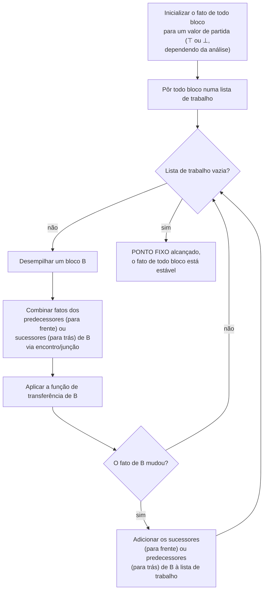

## Objetivos de Aprendizagem

- Enunciar os quatro ingredientes dos quais toda análise de fluxo de dados é construída: um domínio de fatos (um reticulado), uma direção (para frente ou para trás), uma função de transferência por bloco básico, e um operador de encontro/junção combinando fatos de múltiplos predecessores ou sucessores.
- Explicar o que é um ponto fixo neste contexto, e por que iterar as funções de transferência sobre um CFG tem garantia de alcançar um para as análises que esta disciplina cobre.
- Rastrear o algoritmo genérico de lista de trabalho à mão num pequeno CFG, sem se comprometer ainda com os fatos de qualquer análise específica.
- Explicar por que um laço no CFG (um ciclo) exige iteração para resolver, em vez de uma única passagem de cima para baixo ser suficiente.
- Prever, só por nome, as três análises específicas que os próximos três conceitos instanciam a partir deste arcabouço.

## Contexto e Motivação

`static-single-assignment-form` encerrou o agrupamento de representação intermediária; este conceito abre um novo dando um passo atrás para fazer uma pergunta mais geral primeiro: definições que alcançam, variáveis vivas e expressões disponíveis, as três análises específicas cobertas nos próximos três conceitos, todas soam como problemas diferentes, mas são secretamente o MESMO algoritmo, rodado com entradas diferentes. Aprender esse único algoritmo uma vez, aqui, no abstrato, significa que cada um dos próximos três conceitos é um curto exercício de encaixar uma escolha específica de fatos, em vez de um algoritmo novo a aprender do zero a cada vez.

É exatamente assim que os próprios tratamentos de Cooper & Torczon e do MIT 6.035 estruturam o material, uma aula de arcabouço genérico (reticulados, funções de transferência, iteração de ponto fixo) ensinada uma vez, antes das análises específicas que o instanciam, e é o mesmo instinto que `syntax-directed-translation-and-attribute-grammars` já modelou antes nesta disciplina: nomear o mecanismo compartilhado uma vez, para que os conceitos posteriores possam especializá-lo em vez de rederivá-lo.

## Teoria Central

### Os quatro ingredientes

- **Um domínio de fatos (um RETICULADO).** Para uma dada análise, um "fato" num ponto do programa é algum pedaço de informação, um conjunto de nomes de variáveis, um conjunto de expressões, seja lá o que a análise específica precise. O conjunto de TODOS os fatos possíveis, ordenado por "quanta informação" cada um representa, forma um reticulado: uma estrutura com uma forma bem definida de combinar dois fatos (ENCONTRO, para análises que querem a interseção do que é garantido em todo caminho, ou JUNÇÃO, para análises que querem a união do que é possível em qualquer caminho).
- **Uma direção.** Uma análise PARA FRENTE empurra fatos da entrada de um bloco para a sua saída, seguindo as arestas do CFG na sua direção natural (usada quando o fato de saída de um bloco depende do que entrou). Uma análise PARA TRÁS empurra fatos da saída de um bloco de volta à sua entrada (usada quando o fato de um bloco depende do que acontece MAIS TARDE, a jusante).
- **Uma função de transferência por bloco.** Cada bloco básico tem uma função que toma o fato verdadeiro na sua entrada (para frente) ou saída (para trás) e computa o fato verdadeiro na outra ponta, com base no que as instruções daquele bloco específico de fato fazem.
- **Um encontro/junção nos pontos de junção.** Quando duas ou mais arestas convergem num bloco (um if/else se juntando, ou a aresta de retorno de um laço chegando ao lado da sua entrada para frente), os fatos chegando ao longo de cada aresta são combinados com o operador de encontro ou junção do reticulado antes de a própria função de transferência daquele bloco rodar.

### O algoritmo genérico de lista de trabalho



O algoritmo termina porque o reticulado tem altura finita para as análises que esta disciplina cobre (os fatos só se movem numa direção ao longo da ordenação do reticulado conforme o laço re-roda, nunca oscilam para frente e para trás), o que garante que um PONTO FIXO, um estado onde re-rodar toda função de transferência não muda mais nada, é alcançado após um número limitado de iterações, por mais vezes que a aresta de retorno de um laço force um bloco a ser revisitado.

### Por que um ciclo de CFG força iteração

Um bloco dentro de um laço tem um predecessor que vem DEPOIS dele na ordem do programa (a aresta de retorno), então o seu fato correto pode depender de um fato que ainda não é conhecido numa única passagem de cima para baixo. Rodar as funções de transferência repetidamente, propagando fatos em torno do ciclo, é exatamente o que deixa essa dependência circular se resolver: cada passagem em torno do laço só pode refinar (nunca piorar) os fatos atuais, até nada mais mudar.

## Exemplos Resolvidos

### Exemplo 1: rastrear o algoritmo de lista de trabalho abstratamente num diamante

```text
CFG:      B1
         /  \
       B2    B3
         \  /
          B4

Análise para frente, rastreamento genérico:
  Inicializar: fact(B1) = fato de entrada; fact(B2)=fact(B3)=fact(B4) = ⊤ (nada conhecido ainda)
  Lista de trabalho: [B1, B2, B3, B4]

  Processar B1: transfer(B1) → produz um fato, propagar para B2 e B3
  Processar B2: encontro(entrada de B1) → transfer(B2) → propagar para B4
  Processar B3: encontro(entrada de B1) → transfer(B3) → propagar para B4
  Processar B4: encontro(entrada de B2 E B3) → transfer(B4)
    (B4 precisa das contribuições TANTO de B2 QUANTO de B3 antes de o seu próprio fato
     ser significativo, é exatamente para isto que o passo de encontro/junção serve)
  Lista de trabalho vazia → ponto fixo alcançado, sem ciclos aqui, então uma passagem basta
```

### Exemplo 2: por que um laço precisa de mais de uma passagem

```text
CFG:   B1 -> B2 -> (aresta de retorno para B2) ... -> B3

  Passagem 1: fact(B2) computado usando só a contribuição de B1 (a aresta
    de retorno de mais tarde no laço ainda não propagou nada de volta,
    já que B2 não foi visitado uma segunda vez)
  O fato de B2 MUDA uma vez que a contribuição da aresta de retorno é incorporada
    numa iteração posterior → B2 é readicionado à lista de trabalho
  Passagem 2: fact(B2) é recomputado usando TANTO a de B1 QUANTO a própria
    contribuição do corpo do laço pela aresta de retorno → agora correto
  Nenhuma outra mudança → ponto fixo alcançado, precisou de exatamente 2 passagens
    sobre B2 por causa do ciclo
```

### Exemplo 3: para frente vs. para trás, mantido abstrato

```text
Análise para frente (ex.: reaching-definitions, conceito seguinte):
  fact(saída de B) = transfer_B(fact(entrada de B))
  fact(entrada de B) = JUNÇÃO sobre todos os predecessores P de fact(saída de P)

Análise para trás (ex.: live-variable-analysis, dois conceitos adiante):
  fact(entrada de B) = transfer_B(fact(saída de B))
  fact(saída de B) = JUNÇÃO sobre todos os sucessores S de fact(entrada de S)

Mesmo formato, mesmo algoritmo de lista de trabalho, mesma garantia de ponto fixo,
só a DIREÇÃO da propagação e a função de transferência específica
diferem entre as duas.
```

## Equívocos Comuns e Armadilhas

- **"Cada análise de fluxo de dados precisa do seu próprio algoritmo separado, feito sob medida para o que ela tenta computar."** O oposto é o ponto inteiro deste conceito, as definições que alcançam, as variáveis vivas e as expressões disponíveis (os próximos três conceitos) todas rodam o algoritmo de lista de trabalho idêntico; só o reticulado, a direção e a função de transferência diferem, exatamente como a lista de quatro ingredientes deste conceito separa.
- **"Uma única passagem de cima para baixo sobre o CFG é sempre suficiente, desde que os blocos sejam visitados na ordem certa."** Só é verdade para CFGs sem ciclos, no momento em que a aresta de retorno de um laço existe (Exemplo 2), o fato correto de um bloco pode depender de informação que só fica disponível após processar um bloco POSTERIOR na ordem do programa, que é exatamente por que a iteração até um ponto fixo, não uma única passagem ordenada, é o algoritmo geral.
- **"Encontro e junção são só dois nomes para a mesma operação."** Eles são operadores duais que servem a objetivos de análise diferentes: o encontro tipicamente combina fatos tomando o que é verdadeiro em TODO caminho de entrada (usado por análises que querem uma propriedade garantida, do tipo must), enquanto a junção combina fatos tomando o que é verdadeiro em QUALQUER caminho de entrada (usado por análises que querem uma propriedade do tipo may), os próximos três conceitos cada um faz uma escolha específica e real entre eles.
- **"O algoritmo de lista de trabalho poderia nunca terminar para um programa suficientemente grande ou complicado."** Para os reticulados de altura finita usados por toda análise nesta disciplina, a terminação é matematicamente garantida independentemente do tamanho do programa, porque os fatos só podem se mover numa direção ao longo da ordenação do reticulado conforme a iteração prossegue, essa é uma propriedade real e comprovável, não uma esperança empírica.

## Resumo

Toda análise de fluxo de dados nesta disciplina compartilha uma receita genérica: um reticulado de fatos possíveis, uma direção (para frente ou para trás) que determina por qual caminho os fatos fluem pelo CFG, uma função de transferência por bloco básico, e um operador de encontro/junção combinando fatos nos pontos de junção, iterados por um algoritmo de lista de trabalho até um ponto fixo ser alcançado, com garantia de terminar porque os reticulados subjacentes têm altura finita. Um ciclo de CFG (um laço) é precisamente o que força mais de uma passagem, já que o fato correto de um bloco pode genuinamente depender de informação só disponível depois de um bloco posterior na ordem do programa já ter sido processado uma vez. Os próximos três conceitos, `reaching-definitions`, `live-variable-analysis`, `available-expressions-analysis`, são cada um uma instanciação curta e concreta exatamente deste arcabouço, diferindo só na sua escolha de reticulado, direção e função de transferência.

## Documentation Links

- [MIT 6.035 — Computer Language Engineering, Calendar](https://ocw.mit.edu/courses/6-035-computer-language-engineering-sma-5502-fall-2005/pages/calendar/): aula dedicada de "Foundations of Data-flow Analysis", que ensina o arcabouço geral antes das análises específicas, a mesma estrutura que este conceito segue.
- [Cooper & Torczon — Engineering a Compiler (companion site)](https://shop.elsevier.com/books/book-companion/9780120884780): livro-texto que apresenta a análise de fluxo de dados como um único arcabouço iterativo genérico instanciado por diferentes análises específicas.
