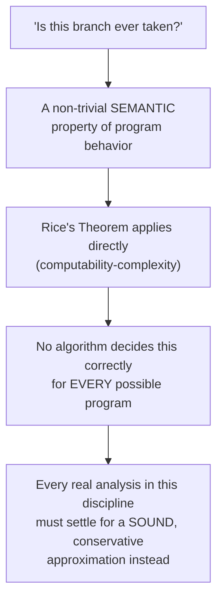

## Learning Objectives

- State, from `rices-theorem`, exactly why "is this branch ever taken," "does this pointer ever alias that one," and "does this loop always terminate" are each genuinely undecidable in general, not just hard.
- Explain why every data-flow analysis in this discipline is therefore a deliberately CONSERVATIVE approximation — one that only ever answers "maybe, so don't optimize" rather than guessing.
- Trace a concrete, realistic example of a missed optimization a real compiler cannot safely perform, and explain precisely which undecidable question stands in the way.
- Explain the practical strategies real compilers use to live productively with this limit (restricting to a decidable sub-question, tolerating imprecision safely, or asking the programmer for help via annotations).
- Connect this concept back to why `available-expressions-analysis`'s MUST guarantee and `reaching-definitions`'s MAY guarantee were each defined the specific way they were — not as arbitrary conventions, but as the only SOUND choices available given this underlying limit.

## Context & Motivation

`the-halting-problem` and `rices-theorem`, already proved in full in `computability-complexity`, establish something that sounds abstract until it's applied directly to a real compiler: any NON-TRIVIAL question about a program's actual BEHAVIOR — not its syntax, its behavior — is undecidable in general. "Does this specific branch ever get taken, for some input?" is exactly such a question — a real, non-trivial semantic property of the program's behavior — which means Rice's Theorem applies directly: no algorithm can answer it correctly for every possible program.

This is not a minor caveat tucked into a footnote — it is the single fact that explains why every optimization covered in this discipline is built the way it is. `available-expressions-analysis` could not simply ask "will this expression's value definitely still be valid here" and get a perfect answer — that IS one of the undecidable questions Rice's Theorem covers. Instead, every data-flow analysis in this discipline computes a SOUND, CONSERVATIVE APPROXIMATION: a safe answer that is sometimes less precise than the true answer, but never, ever wrong in the unsafe direction.

## Core Theory

### From Rice's Theorem to a concrete compiler question

`rices-theorem` states that any non-trivial property of the LANGUAGE a Turing machine recognizes is undecidable. A compiler question like "does this branch ever execute" is a direct instance: treat the program as a machine, and the property "this specific branch's code is part of some accepting computation" as the semantic property in question — non-trivial (some programs' branches are reachable, some aren't), which means, by Rice's Theorem exactly as already proved, no algorithm can decide it correctly for every possible program.



### Why this forces conservatism, not just imprecision

A conservative approximation for a MAY question (like `reaching-definitions`) errs by reporting MORE possible definitions than the true answer might strictly require — safe, because acting on a superset of the truth never causes an optimization to wrongly assume something is impossible when it's actually possible. A conservative approximation for a MUST question (like `available-expressions-analysis`) errs by reporting FEWER guaranteed facts than might actually be true — safe, because acting only on a subset of what's really guaranteed never causes an optimization to wrongly assume something is certain when it might not be. Neither analysis ever claims to compute the perfectly precise, actually-undecidable answer — each is engineered, by the specific choice of union or intersection at merge points, to fail only in the always-safe direction: missing a possible optimization, never performing an unsafe one.

### A concrete, real missed optimization

```text
void process(int[] arr, int i) {
  if (i >= 0 && i < arr.length) {   ; a bounds check
    arr[i] = compute();
  }
}

Call site: process(arr, 5);   // the caller happens to KNOW i is
                                  always exactly 5, and arr.length is
                                  always 10 — the bounds check is
                                  PROVABLY always true at THIS call
                                  site, and could, in principle, be
                                  eliminated for this specific call.
```

Whether the bounds check is provably always true in general (across every possible call site, considering the full, arbitrarily complex logic that could compute `i` and `arr.length` beforehand) is exactly the kind of question Rice's Theorem covers — it depends on the actual, arbitrary behavior of whatever code produced `i` and `arr`. A real compiler CAN sometimes eliminate this specific bounds check, using more targeted, sound techniques (value-range analysis, specific to bounded classes of programs) that succeed on many REAL cases without needing to solve the fully general, undecidable version of the question — but no compiler can guarantee eliminating every such check that a human could, in principle, prove safe by reasoning about the specific program at hand.

## Worked Examples

### Example 1: why a perfect alias analysis cannot exist

```text
void f(int* p, int* q) {
  *p = 1;
  *q = 2;
  use(*p);     ; is this *p still 1, or did *q = 2 just overwrite it
                 (if p and q happen to point to the SAME address)?
}
```

Whether `p` and `q` ever alias (point to the same memory) in general depends on arbitrarily complex logic elsewhere in the program that could have set them — a real instance of an undecidable behavioral property. Real compilers use SOUND, conservative alias analyses (assuming `p` and `q` MIGHT alias unless proven otherwise by a specific, decidable sub-check, like both being provably-distinct local stack variables) rather than attempting the fully general, impossible version of the question.

### Example 2: constant propagation's own conservatism, re-examined through this lens

```text
x = 1;
if (someVeryComplexConditionThatIsActuallyAlwaysFalse()) {
  x = 2;
}
y = x + 1;    ; a human who fully analyzed the complex condition
                could PROVE it's always false, meaning x=2 never
                actually runs, and y = 2 always (constant!) — but
                reaching-definitions, correctly and by design, reports
                BOTH x=1 and x=2 as possibly reaching here, since
                proving the condition is always false in general is
                exactly the kind of undecidable question this concept
                is about.
```

`constant-folding-and-constant-propagation`, several concepts earlier, is therefore provably INCOMPLETE in general — it will genuinely miss some real optimization opportunities that a human, or a much more expensive special-case analysis, could find — and this is not a bug or an oversight in that concept's design; it is the necessary, unavoidable consequence of the limit this concept now makes explicit.

### Example 3: a real strategy for living with the limit — restricting to a decidable sub-question

```text
General question (undecidable): "does this loop ALWAYS terminate?"

Restricted, DECIDABLE sub-question real compilers actually use:
  "is this loop's induction variable incremented by a fixed positive
  amount each iteration, compared against a fixed upper bound, with
  no other exit path?" — THIS specific, narrower pattern IS
  mechanically checkable, covers a huge fraction of real loops
  (exactly the kind strength-reduction and invariant-code-motion
  already target), and never needs to solve the fully general halting
  question to be useful.
```

## Common Misconceptions & Pitfalls

- **"Undecidability means compilers basically can't optimize anything useful."** The opposite is demonstrably true — every optimization already covered in this discipline (constant folding, CSE, DCE, loop optimizations) works, correctly and safely, on an enormous fraction of real programs; undecidability only rules out a PERFECT, universally complete version of each analysis, not a sound, useful, conservative one.
- **"A conservative approximation means the analysis is 'wrong' some of the time."** It is never wrong in the sense of producing an unsafe result — `reaching-definitions` and `available-expressions-analysis` are each precisely, provably correct with respect to their own defined semantics (may vs. must); what they sometimes are is less PRECISE than the true, undecidable answer, missing an opportunity a smarter (but impossible-in-general) analysis might have found.
- **"This is a purely theoretical concern that doesn't affect what real compiler engineers actually do."** It directly explains real, everyday compiler engineering decisions — why alias analysis is a genuinely hard, actively researched problem, why bounds-check elimination only fires in specific, provable patterns rather than universally, and why "the compiler didn't optimize this even though a human clearly could see it was safe" is a real, common, and fully explained phenomenon rather than a bug to file.
- **"Since the general question is undecidable, no compiler ever attempts anything related to it."** Real compilers routinely attack NARROWER, decidable sub-questions that cover a large practical fraction of real cases (Example 3's bounded-loop pattern, or restricted alias analyses that succeed for provably-distinct local variables) — the undecidable general question is avoided by deliberately asking a smaller, answerable one instead, not by giving up on the topic entirely.

## Summary

Rice's Theorem, already proved in full in `computability-complexity`, applies directly to compiler optimization: any non-trivial question about a program's actual behavior — does this branch execute, do these two pointers ever alias, does this loop always terminate — is undecidable in general, which means every data-flow analysis in this discipline is necessarily a sound, conservative approximation, engineered (via the specific choice of union for MAY analyses and intersection for MUST analyses) to fail only in the always-safe direction, never the unsafe one. Real compilers live productively with this limit by restricting themselves to narrower, genuinely decidable sub-questions that cover a large practical fraction of real programs, rather than attempting the impossible fully general version. With the theoretical foundation for WHY optimization is necessarily incomplete now explicit, the discipline turns to Code Generation — translating the optimized IR into real target-machine instructions, starting with `instruction-selection-tree-pattern-matching`.

## Documentation Links

- [ACM/IEEE CS2013 — Programming Languages Knowledge Area](https://csed.acm.org/knowledge-areas-programming-languages-pl-cs2013-version/) — Static Analysis knowledge unit explicitly framing program-analysis frameworks (control-flow graphs, data-flow analyses) as necessarily approximate, in service of sound optimization.
- [Cooper & Torczon — Engineering a Compiler (companion site)](https://shop.elsevier.com/books/book-companion/9780120884780) — textbook discussing the fundamental limits of static analysis and the conservative design of real data-flow frameworks.
