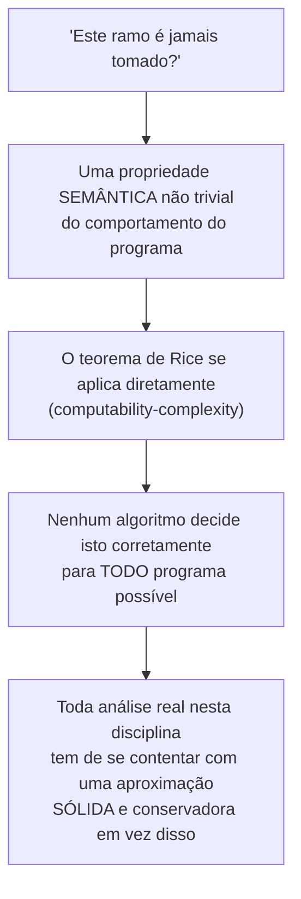

## Objetivos de Aprendizagem

- Enunciar, a partir de `rices-theorem`, exatamente por que "este ramo é jamais tomado", "este ponteiro jamais faz alias com aquele" e "este laço sempre termina" são cada um genuinamente indecidíveis em geral, não só difíceis.
- Explicar por que toda análise de fluxo de dados nesta disciplina é, portanto, uma aproximação deliberadamente CONSERVADORA, uma que só responde "talvez, então não otimize" em vez de chutar.
- Rastrear um exemplo concreto e realista de uma otimização perdida que um compilador real não consegue realizar com segurança, e explicar com precisão qual pergunta indecidível está no caminho.
- Explicar as estratégias práticas que os compiladores reais usam para conviver produtivamente com esse limite (restringir a uma subpergunta decidível, tolerar a imprecisão com segurança, ou pedir ajuda ao programador por anotações).
- Conectar este conceito de volta a por que a garantia MUST de `available-expressions-analysis` e a garantia MAY de `reaching-definitions` foram cada uma definida da forma específica que foram, não como convenções arbitrárias, mas como as únicas escolhas SÓLIDAS disponíveis dado este limite subjacente.

## Contexto e Motivação

`the-halting-problem` e `rices-theorem`, já provados por completo em `computability-complexity`, estabelecem algo que soa abstrato até ser aplicado diretamente a um compilador real: qualquer pergunta NÃO TRIVIAL sobre o COMPORTAMENTO de fato de um programa, não a sua sintaxe, o seu comportamento, é indecidível em geral. "Este ramo específico é jamais tomado, para alguma entrada?" é exatamente uma pergunta dessas, uma propriedade semântica real e não trivial do comportamento do programa, o que significa que o teorema de Rice se aplica diretamente: nenhum algoritmo consegue respondê-la corretamente para todo programa possível.

Essa não é uma ressalva menor enfiada numa nota de rodapé, é o único fato que explica por que toda otimização coberta nesta disciplina é construída do jeito que é. `available-expressions-analysis` não poderia simplesmente perguntar "o valor desta expressão com certeza ainda será válido aqui" e obter uma resposta perfeita, essa É uma das perguntas indecidíveis que o teorema de Rice cobre. Em vez disso, toda análise de fluxo de dados nesta disciplina computa uma APROXIMAÇÃO SÓLIDA e CONSERVADORA: uma resposta segura que às vezes é menos precisa do que a resposta verdadeira, mas nunca, jamais, errada na direção insegura.

## Teoria Central

### Do teorema de Rice a uma pergunta concreta de compilador

`rices-theorem` enuncia que qualquer propriedade não trivial da LINGUAGEM que uma máquina de Turing reconhece é indecidível. Uma pergunta de compilador como "este ramo é jamais executado" é uma instância direta: trate o programa como uma máquina, e a propriedade "o código deste ramo específico é parte de alguma computação de aceitação" como a propriedade semântica em questão, não trivial (os ramos de alguns programas são alcançáveis, os de alguns não são), o que significa que, pelo teorema de Rice exatamente como já provado, nenhum algoritmo consegue decidi-la corretamente para todo programa possível.



### Por que isto força conservadorismo, não só imprecisão

Uma aproximação conservadora para uma pergunta MAY (como `reaching-definitions`) erra reportando MAIS definições possíveis do que a resposta verdadeira poderia estritamente exigir, segura, porque atuar sobre um superconjunto da verdade nunca faz uma otimização assumir erradamente que algo é impossível quando é de fato possível. Uma aproximação conservadora para uma pergunta MUST (como `available-expressions-analysis`) erra reportando MENOS fatos garantidos do que poderia de fato ser verdade, segura, porque atuar só sobre um subconjunto do que é realmente garantido nunca faz uma otimização assumir erradamente que algo é certo quando poderia não ser. Nenhuma análise jamais alega computar a resposta perfeitamente precisa e de fato indecidível, cada uma é engenheirada, pela escolha específica de união ou interseção nos pontos de junção, para falhar só na direção sempre segura: perder uma otimização possível, nunca realizar uma insegura.

### Uma otimização perdida real e concreta

```text
void process(int[] arr, int i) {
  if (i >= 0 && i < arr.length) {   ; uma checagem de limites
    arr[i] = compute();
  }
}

Local de chamada: process(arr, 5);   // o chamador por acaso SABE que i é
                                  sempre exatamente 5, e arr.length é
                                  sempre 10, a checagem de limites é
                                  COMPROVADAMENTE sempre verdadeira NESTE local
                                  de chamada, e poderia, em princípio, ser
                                  eliminada para esta chamada específica.
```

Se a checagem de limites é comprovadamente sempre verdadeira em geral (por todo local de chamada possível, considerando a lógica completa e arbitrariamente complexa que poderia computar `i` e `arr.length` de antemão) é exatamente o tipo de pergunta que o teorema de Rice cobre, depende do comportamento de fato, arbitrário, de qualquer código que produziu `i` e `arr`. Um compilador real PODE às vezes eliminar esta checagem de limites específica, usando técnicas mais direcionadas e sólidas (análise de faixa de valores, específica a classes limitadas de programas) que têm sucesso em muitos casos REAIS sem precisar resolver a versão totalmente geral e indecidível da pergunta, mas nenhum compilador consegue garantir eliminar toda checagem desse tipo que um humano poderia, em princípio, provar segura raciocinando sobre o programa específico em mãos.

## Exemplos Resolvidos

### Exemplo 1: por que uma análise de alias perfeita não pode existir

```text
void f(int* p, int* q) {
  *p = 1;
  *q = 2;
  use(*p);     ; este *p ainda é 1, ou *q = 2 acabou de sobrescrevê-lo
                 (se p e q por acaso apontam para o MESMO endereço)?
}
```

Se `p` e `q` jamais fazem alias (apontam para a mesma memória) em geral depende de lógica arbitrariamente complexa em outro lugar do programa que poderia tê-los definido, uma instância real de uma propriedade comportamental indecidível. Compiladores reais usam análises de alias SÓLIDAS e conservadoras (assumindo que `p` e `q` PODERIAM fazer alias a menos que provado o contrário por uma subchecagem específica e decidível, como ambos serem variáveis locais de pilha comprovadamente distintas) em vez de tentar a versão totalmente geral e impossível da pergunta.

### Exemplo 2: o próprio conservadorismo da propagação de constantes, reexaminado por esta lente

```text
x = 1;
if (someVeryComplexConditionThatIsActuallyAlwaysFalse()) {
  x = 2;
}
y = x + 1;    ; um humano que analisasse por completo a condição complexa
                poderia PROVAR que ela é sempre falsa, significando que x=2 nunca
                de fato roda, e y = 2 sempre (constante!), mas
                reaching-definitions, corretamente e por design, reporta
                TANTO x=1 QUANTO x=2 como possivelmente alcançando aqui, já que
                provar que a condição é sempre falsa em geral é
                exatamente o tipo de pergunta indecidível de que este conceito
                trata.
```

`constant-folding-and-constant-propagation`, vários conceitos antes, é, portanto, comprovadamente INCOMPLETO em geral, ele genuinamente perderá algumas oportunidades reais de otimização que um humano, ou uma análise de caso especial muito mais cara, poderia encontrar, e isso não é um bug ou um descuido no design daquele conceito; é a consequência necessária e inevitável do limite que este conceito agora torna explícito.

### Exemplo 3: uma estratégia real para conviver com o limite, restringir a uma subpergunta decidível

```text
Pergunta geral (indecidível): "este laço SEMPRE termina?"

Subpergunta restrita e DECIDÍVEL que compiladores reais de fato usam:
  "a variável de indução deste laço é incrementada por uma quantia positiva fixa
  a cada iteração, comparada contra um limite superior fixo, sem
  nenhum outro caminho de saída?", ESTE padrão específico e mais estreito É
  mecanicamente checável, cobre uma enorme fração dos laços reais
  (exatamente o tipo que a redução de força e a movimentação de código invariante
  já miram), e nunca precisa resolver a pergunta de parada totalmente
  geral para ser útil.
```

## Equívocos Comuns e Armadilhas

- **"Indecidibilidade significa que os compiladores basicamente não conseguem otimizar nada útil."** O oposto é demonstravelmente verdadeiro, toda otimização já coberta nesta disciplina (dobra de constante, CSE, DCE, otimizações de laço) funciona, corretamente e com segurança, numa enorme fração dos programas reais; a indecidibilidade só descarta uma versão PERFEITA e universalmente completa de cada análise, não uma sólida, útil e conservadora.
- **"Uma aproximação conservadora significa que a análise está 'errada' parte do tempo."** Ela nunca está errada no sentido de produzir um resultado inseguro, `reaching-definitions` e `available-expressions-analysis` são cada uma precisa e comprovadamente corretas em relação à sua própria semântica definida (may vs. must); o que elas às vezes são é menos PRECISAS do que a resposta verdadeira e indecidível, perdendo uma oportunidade que uma análise mais esperta (mas impossível-em-geral) poderia ter encontrado.
- **"Essa é uma preocupação puramente teórica que não afeta o que os engenheiros de compilador reais de fato fazem."** Ela explica diretamente decisões reais e cotidianas de engenharia de compilador, por que a análise de alias é um problema genuinamente difícil e ativamente pesquisado, por que a eliminação de checagem de limites só dispara em padrões específicos e prováveis em vez de universalmente, e por que "o compilador não otimizou isto mesmo que um humano claramente visse que era seguro" é um fenômeno real, comum e totalmente explicado, em vez de um bug a reportar.
- **"Como a pergunta geral é indecidível, nenhum compilador jamais tenta nada relacionado a ela."** Compiladores reais rotineiramente atacam subperguntas mais ESTREITAS e decidíveis que cobrem uma grande fração prática dos casos reais (o padrão de laço limitado do Exemplo 3, ou análises de alias restritas que têm sucesso para variáveis locais comprovadamente distintas), a pergunta geral indecidível é evitada ao fazer deliberadamente uma menor e respondível em vez dela, não ao desistir do tópico por completo.

## Resumo

O teorema de Rice, já provado por completo em `computability-complexity`, aplica-se diretamente à otimização de compilador: qualquer pergunta não trivial sobre o comportamento de fato de um programa, este ramo executa, estes dois ponteiros jamais fazem alias, este laço sempre termina, é indecidível em geral, o que significa que toda análise de fluxo de dados nesta disciplina é necessariamente uma aproximação sólida e conservadora, engenheirada (pela escolha específica de união para análises MAY e interseção para análises MUST) para falhar só na direção sempre segura, nunca na insegura. Compiladores reais convivem produtivamente com esse limite restringindo-se a subperguntas mais estreitas e genuinamente decidíveis que cobrem uma grande fração prática dos programas reais, em vez de tentar a versão totalmente geral e impossível. Com a fundação teórica para POR QUE a otimização é necessariamente incompleta agora explícita, a disciplina se volta para a Geração de Código, traduzir o IR otimizado em instruções reais da máquina-alvo, começando com `instruction-selection-tree-pattern-matching`.

## Documentation Links

- [ACM/IEEE CS2013 — Programming Languages Knowledge Area](https://csed.acm.org/knowledge-areas-programming-languages-pl-cs2013-version/): unidade de conhecimento de Análise Estática que enquadra explicitamente os arcabouços de análise de programa (grafos de fluxo de controle, análises de fluxo de dados) como necessariamente aproximados, a serviço de uma otimização sólida.
- [Cooper & Torczon — Engineering a Compiler (companion site)](https://shop.elsevier.com/books/book-companion/9780120884780): livro-texto que discute os limites fundamentais da análise estática e o design conservador dos arcabouços reais de fluxo de dados.
