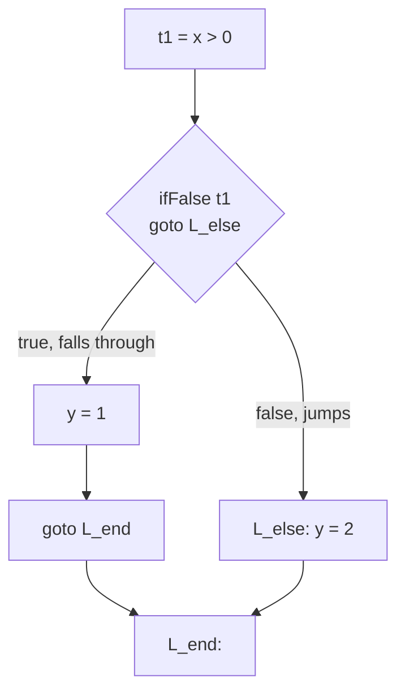

## Learning Objectives

- Define three-address code precisely: every instruction has at most one operator and at most three operand positions (two sources, one destination).
- Translate an AST expression tree into a sequence of three-address instructions, introducing a fresh temporary for each intermediate result.
- Translate `if`/`while` control flow into three-address code using explicit conditional and unconditional jumps to labels, without relying on any tree structure.
- Explain why "at most one operator per instruction" is exactly the property that makes later analyses and optimizations (data-flow analysis, instruction selection) tractable to define uniformly.
- Contrast three-address code's flat, sequential shape with an AST's nested, recursive shape, precisely at the points where each is easier to work with.

## Context & Motivation

`why-intermediate-representations-exist` argued for a shared, source- and target-independent IR in the abstract; three-address code is the first concrete shape that IR actually takes in this discipline. The name describes its defining constraint directly: every instruction names at most three addresses — two operands and one result — and performs at most one operation. An AST expression like `a + b * c` nests two operators inside one tree; three-address code FLATTENS that nesting by introducing a fresh TEMPORARY variable to hold each intermediate result, so that no single instruction ever has to represent more than one operation at a time.

This flattening is not busywork — it is precisely what later concepts need. `control-flow-graphs-and-basic-blocks` needs a sequence of instructions it can group into straight-line blocks; every data-flow analysis in the next cluster is defined in terms of "what does THIS instruction define, and what does it use" — a question that only has a clean, unambiguous answer once each instruction does exactly one thing.

## Core Theory

### Flattening an expression tree into three-address code

```text
AST for:  a + b * c

      (+)
     /   \
   (a)   (*)
        /   \
      (b)   (c)

Three-address code (post-order translation, one temp per operator node):
  t1 = b * c        ; t1 holds the intermediate result of b * c
  t2 = a + t1        ; t2 holds the final result
```

Each three-address instruction corresponds to exactly one internal node of the original AST — the translation is a straightforward post-order walk: translate each child first (recursively), obtaining the temporary that holds its value, then emit one instruction combining those temporaries for the current node.

### Translating control flow: explicit jumps replace tree nesting

```text
AST for:  if (x > 0) { y = 1; } else { y = 2; }

Three-address code:
      t1 = x > 0
      ifFalse t1 goto L_else
      y = 1
      goto L_end
  L_else:
      y = 2
  L_end:
```

Compare this directly to `translating-control-flow-if-while-for`'s x86-64 material, already covered in `c-and-assembly`: the SAME shape — compute a condition, branch conditionally, fall through or jump — appears here one level of abstraction above real machine instructions. Three-address code's conditional and unconditional jumps to labels are a deliberately close match to the comparison-and-branch instructions a real target machine actually offers, which is exactly what makes the later instruction-selection pass a comparatively small, mechanical step rather than a second complete redesign.



### Why "one operator per instruction" is the property that matters

A data-flow analysis needs to ask, for a single instruction, "what variable(s) does this instruction DEFINE, and what variable(s) does it USE?" — a question with a clean, mechanically checkable answer for `t2 = a + t1` (defines `t2`; uses `a` and `t1`) but a genuinely ambiguous one for a whole AST subtree like `a + b * c` taken as a unit (does it "use" `b` and `c` at the same program point as `a`, or at a different one, nested inside?). Flattening to one operator per instruction removes this ambiguity entirely, which is precisely why `the-data-flow-analysis-framework-lattices-and-fixed-points`, `reaching-definitions`, `live-variable-analysis`, and `available-expressions-analysis` are all defined directly in terms of three-address instructions, never in terms of AST subtrees.

## Worked Examples

### Example 1: a longer expression with multiple temporaries

```text
AST for:  (a + b) * (c - d)

Three-address code:
  t1 = a + b
  t2 = c - d
  t3 = t1 * t2
```

Two subexpressions are each flattened independently into their own temporary (`t1`, `t2`), and the outer multiplication becomes one final instruction (`t3`) combining exactly those two temporaries — never more than one operator per line, regardless of how deeply the original expression was nested.

### Example 2: a `while` loop lowered to jumps

```text
AST for:  while (x > 0) { x = x - 1; }

Three-address code:
  L_start:
      t1 = x > 0
      ifFalse t1 goto L_end
      t2 = x - 1
      x = t2
      goto L_start
  L_end:
```

The loop's repeated re-evaluation of its condition, implicit in the AST's recursive structure, becomes an explicit `goto L_start` at the bottom — the exact translation pattern `translating-control-flow-if-while-for` already showed at the x86-64 level, one abstraction layer up.

### Example 3: why flattening resolves an ambiguity a tree-based analysis would face

```text
Consider: is `b` "used" at the same point as `c` in `a + b * c`?

As an AST subtree taken as a whole: ambiguous — the tree doesn't
distinguish a moment "during" the multiplication from a moment
"during" the addition; both operators exist at once, nested.

As three-address code:
  t1 = b * c     ; b and c are used HERE, at this specific instruction
  t2 = a + t1     ; a and t1 are used HERE, a DIFFERENT instruction

Every later data-flow analysis needs exactly this level of precision —
one program point per instruction — to compute a correct answer.
```

## Common Misconceptions & Pitfalls

- **"Three-address code always has exactly three addresses, never fewer."** "At most three" is the precise bound — `goto L`, a unary negation `t2 = -t1`, or a bare label each have fewer than three; the name describes an upper bound on complexity per instruction, not a fixed arity every instruction must hit exactly.
- **"Introducing a fresh temporary per operator wastes registers that a real machine doesn't have."** A virtual temporary in three-address code is not yet a physical register at all — `register-allocation-via-graph-coloring`, much later in this discipline, is the pass specifically responsible for mapping an unlimited supply of these virtual temporaries down onto a machine's actual limited register file, spilling to the stack where necessary.
- **"Three-address code and the AST it was generated from carry different information — something is lost in translation."** Nothing about the program's MEANING is lost; only its SHAPE changes, from nested tree to flat sequence with explicit temporaries and explicit jumps — exactly the shape trade `why-intermediate-representations-exist` argued for, trading source-language-specific tree shapes for one small, uniform instruction format.
- **"This is a completely different notion of 'jump' from what `stack-frame-generation-and-the-calling-convention`'s `call`/`ret` do."** They're related but distinct: `goto`/`ifFalse` here are unconditional and conditional intra-procedural jumps (staying within one function, exactly like a real machine's `jmp`/`je`), while `call`/`ret` (covered concretely in `c-and-assembly`) cross procedure boundaries — this concept's jumps map onto a target's plain branch instructions, not its call mechanism.

## Summary

Three-address code flattens an AST's nested expression trees into a sequence of instructions, each performing at most one operation on at most three named addresses, introducing a fresh temporary for every intermediate result and explicit labeled jumps for every branch and loop that an AST previously represented only as tree nesting. This flat, one-operation-per-instruction shape is precisely what makes "what does this instruction define, and what does it use" a well-defined, mechanically checkable question — the exact question every data-flow analysis later in this discipline is built to answer. The next concept, `control-flow-graphs-and-basic-blocks`, takes this flat sequence one step further, grouping it into straight-line blocks connected by real graph edges that mirror the jumps already made explicit here.

## Documentation Links

- [Stanford CS143 — Compilers](http://web.stanford.edu/class/cs143/) — code-generation material producing three-address-style intermediate code from an AST as an explicit compiler stage.
- [Cooper & Torczon — Engineering a Compiler (companion site)](https://shop.elsevier.com/books/book-companion/9780120884780) — textbook whose IR chapters use three-address code as the canonical linear intermediate form.
