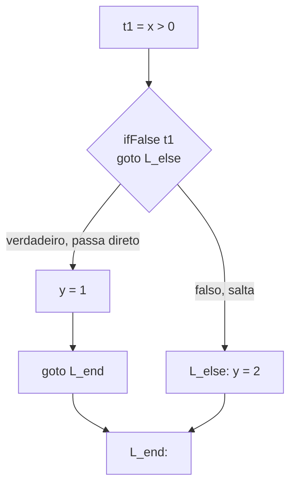

## Objetivos de Aprendizagem

- Definir o código de três endereços com precisão: toda instrução tem no máximo um operador e no máximo três posições de operando (duas fontes, um destino).
- Traduzir uma árvore de expressão de AST numa sequência de instruções de três endereços, introduzindo um temporário novo para cada resultado intermediário.
- Traduzir o fluxo de controle de `if`/`while` em código de três endereços usando saltos condicionais e incondicionais explícitos para rótulos, sem depender de nenhuma estrutura de árvore.
- Explicar por que "no máximo um operador por instrução" é exatamente a propriedade que torna as análises e otimizações posteriores (análise de fluxo de dados, seleção de instruções) tratáveis de definir uniformemente.
- Contrastar o formato plano e sequencial do código de três endereços com o formato aninhado e recursivo de um AST, precisamente nos pontos onde cada um é mais fácil de trabalhar.

## Contexto e Motivação

`why-intermediate-representations-exist` argumentou por um IR compartilhado, independente de fonte e de alvo, no abstrato; o código de três endereços é o primeiro formato concreto que esse IR de fato toma nesta disciplina. O nome descreve a sua restrição definidora diretamente: toda instrução nomeia no máximo três endereços, dois operandos e um resultado, e realiza no máximo uma operação. Uma expressão de AST como `a + b * c` aninha dois operadores dentro de uma árvore; o código de três endereços ACHATA esse aninhamento introduzindo uma variável TEMPORÁRIA nova para segurar cada resultado intermediário, de modo que nenhuma instrução individual jamais tenha de representar mais de uma operação por vez.

Esse achatamento não é trabalho burocrático, é precisamente o que os conceitos posteriores precisam. `control-flow-graphs-and-basic-blocks` precisa de uma sequência de instruções que ele possa agrupar em blocos em linha reta; toda análise de fluxo de dados no próximo agrupamento é definida em termos de "o que ESTA instrução define, e o que ela usa", uma pergunta que só tem uma resposta limpa e sem ambiguidade uma vez que cada instrução faz exatamente uma coisa.

## Teoria Central

### Achatar uma árvore de expressão em código de três endereços

```text
AST para:  a + b * c

      (+)
     /   \
   (a)   (*)
        /   \
      (b)   (c)

Código de três endereços (tradução em pós-ordem, um temp por nó operador):
  t1 = b * c        ; t1 segura o resultado intermediário de b * c
  t2 = a + t1        ; t2 segura o resultado final
```

Cada instrução de três endereços corresponde a exatamente um nó interno do AST original, a tradução é uma caminhada direta em pós-ordem: traduzir cada filho primeiro (recursivamente), obtendo o temporário que segura o seu valor, depois emitir uma instrução combinando esses temporários para o nó atual.

### Traduzir o fluxo de controle: saltos explícitos substituem o aninhamento de árvore

```text
AST para:  if (x > 0) { y = 1; } else { y = 2; }

Código de três endereços:
      t1 = x > 0
      ifFalse t1 goto L_else
      y = 1
      goto L_end
  L_else:
      y = 2
  L_end:
```

Compare isto diretamente com o material x86-64 de `translating-control-flow-if-while-for`, já coberto em `c-and-assembly`: o MESMO formato, computar uma condição, ramificar condicionalmente, passar direto ou saltar, aparece aqui um nível de abstração acima das instruções de máquina reais. Os saltos condicionais e incondicionais para rótulos do código de três endereços são uma correspondência deliberadamente próxima às instruções de comparação-e-ramificação que uma máquina-alvo real de fato oferece, que é exatamente o que torna a passagem posterior de seleção de instruções um passo comparativamente pequeno e mecânico, em vez de um segundo redesenho completo.



### Por que "um operador por instrução" é a propriedade que importa

Uma análise de fluxo de dados precisa perguntar, para uma única instrução, "que variável(is) esta instrução DEFINE, e que variável(is) ela USA?", uma pergunta com uma resposta limpa e mecanicamente checável para `t2 = a + t1` (define `t2`; usa `a` e `t1`), mas uma genuinamente ambígua para uma subárvore de AST inteira como `a + b * c` tomada como uma unidade (ela "usa" `b` e `c` no mesmo ponto do programa que `a`, ou num diferente, aninhado dentro?). Achatar para um operador por instrução remove essa ambiguidade inteiramente, que é precisamente por que `the-data-flow-analysis-framework-lattices-and-fixed-points`, `reaching-definitions`, `live-variable-analysis` e `available-expressions-analysis` são todos definidos diretamente em termos de instruções de três endereços, nunca em termos de subárvores de AST.

## Exemplos Resolvidos

### Exemplo 1: uma expressão mais longa com múltiplos temporários

```text
AST para:  (a + b) * (c - d)

Código de três endereços:
  t1 = a + b
  t2 = c - d
  t3 = t1 * t2
```

Duas subexpressões são cada uma achatada independentemente no seu próprio temporário (`t1`, `t2`), e a multiplicação externa vira uma instrução final (`t3`) combinando exatamente esses dois temporários, nunca mais de um operador por linha, independentemente de quão profundamente a expressão original estava aninhada.

### Exemplo 2: um laço `while` rebaixado para saltos

```text
AST para:  while (x > 0) { x = x - 1; }

Código de três endereços:
  L_start:
      t1 = x > 0
      ifFalse t1 goto L_end
      t2 = x - 1
      x = t2
      goto L_start
  L_end:
```

A reavaliação repetida da condição do laço, implícita na estrutura recursiva do AST, vira um `goto L_start` explícito no fundo, o exato padrão de tradução que `translating-control-flow-if-while-for` já mostrou no nível x86-64, uma camada de abstração acima.

### Exemplo 3: por que o achatamento resolve uma ambiguidade que uma análise baseada em árvore enfrentaria

```text
Considere: `b` é "usado" no mesmo ponto que `c` em `a + b * c`?

Como uma subárvore de AST tomada como um todo: ambíguo, a árvore não
distingue um momento "durante" a multiplicação de um momento
"durante" a adição; ambos os operadores existem de uma vez, aninhados.

Como código de três endereços:
  t1 = b * c     ; b e c são usados AQUI, nesta instrução específica
  t2 = a + t1     ; a e t1 são usados AQUI, uma instrução DIFERENTE

Toda análise de fluxo de dados posterior precisa exatamente deste nível de precisão,
um ponto de programa por instrução, para computar uma resposta correta.
```

## Equívocos Comuns e Armadilhas

- **"O código de três endereços sempre tem exatamente três endereços, nunca menos."** "No máximo três" é o limite preciso, `goto L`, uma negação unária `t2 = -t1`, ou um rótulo nu cada um tem menos de três; o nome descreve um limite superior de complexidade por instrução, não uma aridade fixa que toda instrução tem de atingir exatamente.
- **"Introduzir um temporário novo por operador desperdiça registradores que uma máquina real não tem."** Um temporário virtual no código de três endereços ainda não é um registrador físico de forma alguma, `register-allocation-via-graph-coloring`, muito depois nesta disciplina, é a passagem especificamente responsável por mapear um suprimento ilimitado desses temporários virtuais para o arquivo de registradores de fato, limitado, de uma máquina, fazendo spill para a pilha onde necessário.
- **"O código de três endereços e o AST do qual foi gerado carregam informação diferente, algo se perde na tradução."** Nada sobre o SIGNIFICADO do programa se perde; só o seu FORMATO muda, de árvore aninhada para sequência plana com temporários explícitos e saltos explícitos, exatamente a troca de formato pela qual `why-intermediate-representations-exist` argumentou, trocando formatos de árvore específicos da linguagem-fonte por um único formato de instrução pequeno e uniforme.
- **"Esta é uma noção de 'salto' completamente diferente do que o `call`/`ret` de `stack-frame-generation-and-the-calling-convention` faz."** Eles são relacionados, mas distintos: `goto`/`ifFalse` aqui são saltos intraprocedurais incondicionais e condicionais (permanecendo dentro de uma função, exatamente como o `jmp`/`je` de uma máquina real), enquanto `call`/`ret` (cobertos concretamente em `c-and-assembly`) cruzam fronteiras de procedimento, os saltos deste conceito mapeiam para as instruções de ramificação simples de um alvo, não para o seu mecanismo de chamada.

## Resumo

O código de três endereços achata as árvores de expressão aninhadas de um AST numa sequência de instruções, cada uma realizando no máximo uma operação sobre no máximo três endereços nomeados, introduzindo um temporário novo para todo resultado intermediário e saltos rotulados explícitos para toda ramificação e laço que um AST anteriormente representava só como aninhamento de árvore. Esse formato plano, de uma-operação-por-instrução, é precisamente o que torna "o que esta instrução define, e o que ela usa" uma pergunta bem definida e mecanicamente checável, a exata pergunta que toda análise de fluxo de dados posterior nesta disciplina é construída para responder. O conceito seguinte, `control-flow-graphs-and-basic-blocks`, leva esta sequência plana um passo adiante, agrupando-a em blocos em linha reta conectados por arestas de grafo reais que espelham os saltos já tornados explícitos aqui.

## Documentation Links

- [Stanford CS143 — Compilers](http://web.stanford.edu/class/cs143/): material de geração de código que produz código intermediário no estilo de três endereços a partir de um AST como um estágio de compilador explícito.
- [Cooper & Torczon — Engineering a Compiler (companion site)](https://shop.elsevier.com/books/book-companion/9780120884780): livro-texto cujos capítulos de IR usam o código de três endereços como a forma intermediária linear canônica.
