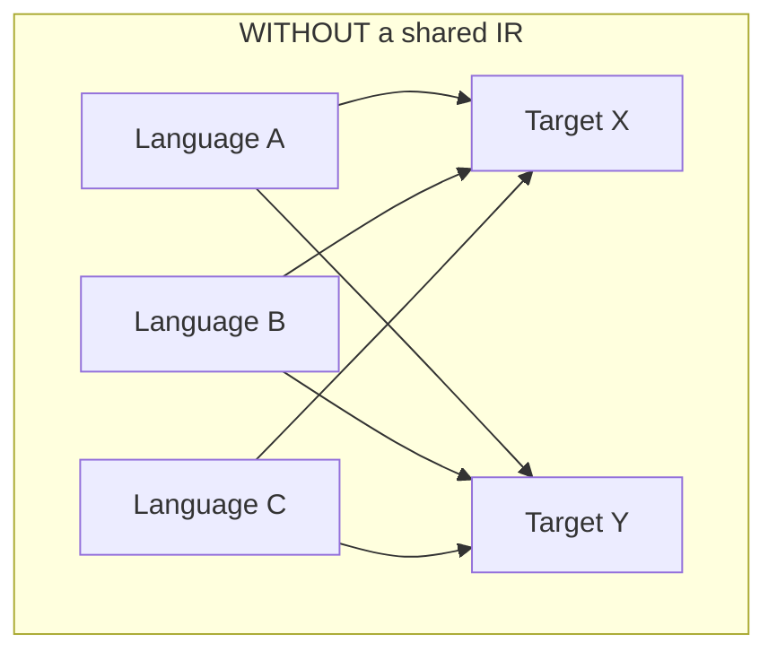
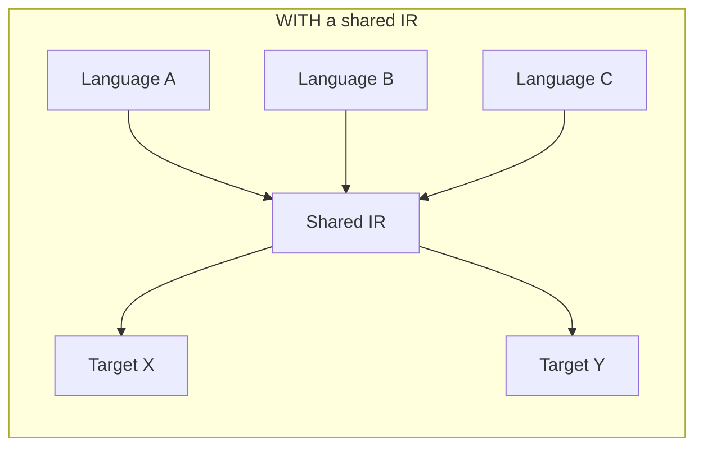

## Learning Objectives

- State the retargetability argument for an intermediate representation precisely: N front ends × M back ends becomes N + M pieces of work instead of N × M.
- Explain why running an optimization pass on an IR, rather than directly on an AST or directly on machine code, lets that one pass serve every source language and every target architecture at once.
- Name at least two properties a good IR needs (a fixed, small instruction set; explicit control flow; independence from any one source or target language) and justify each with a concrete counterexample of what breaks without it.
- Give LLVM IR as a real, currently deployed example of exactly this design, naming at least one front end and one back end that share it.
- Explain why an AST is a poor choice of IR for the optimization and code-generation work still ahead in this discipline.

## Context & Motivation

An AST already carries a program's full meaning — nothing is missing from it. So why not run every optimization directly on the AST, and generate machine code directly from it too? Because an AST's SHAPE is tied to whatever source language produced it: an `if` node looks different depending on the source language's exact `if`/`else`/`elif` syntax, a `for` loop's AST shape differs from a `while` loop's even though both eventually compile to the same kind of conditional jump, and every new source language added to a compiler would require every optimization pass to be rewritten to understand that language's particular AST shapes all over again.

An INTERMEDIATE REPRESENTATION (IR) is the deliberate answer: a single, simple, source-language-independent and target-machine-independent language that every front end translates INTO, and every optimization pass and every back end operates ON. The retargetability argument this buys is the same "avoid N×M work" argument that shows up throughout software engineering wherever an interface decouples two things that would otherwise each need to know about every variant of the other: with a shared IR, adding a new source language means writing one new front end (into the existing IR); adding a new target architecture means writing one new back end (out of the existing IR); every optimization pass, written once against the IR, benefits every combination automatically.

## Core Theory

### The N×M problem an IR eliminates





Three source languages and two targets without a shared IR means up to six separate, hand-written translation paths, each needing its own copy of every optimization the compiler wants to perform; with a shared IR, it's three front ends, two back ends, and every optimization pass written exactly once against the IR in the middle.

### What makes an IR actually good at this job

- **A small, fixed instruction set.** Unlike an AST, which has as many node shapes as a language has syntactic constructs, a good IR has a handful of instruction kinds (arithmetic, load/store, branch, call) that every source construct eventually lowers into — `translating-control-flow-if-while-for`'s x86-64 material already showed concretely that `if`, `while`, and `for` all bottom out in the same handful of comparison-and-jump instructions; an IR captures that convergence one level earlier, so an optimization pass never needs to special-case "this was originally a `for` loop" versus "this was originally a `while` loop."
- **Explicit control flow.** An AST represents control flow implicitly, as tree nesting (an `if` node's two children ARE its branches); an IR typically makes control flow explicit as labeled jumps and conditional branches between straight-line blocks of code — exactly the shape `control-flow-graphs-and-basic-blocks`, the next concept, needs to build its graph.
- **Source- and target-independence.** Nothing about a good IR's instruction set should mention any particular source language's syntax or any particular target machine's specific registers — GCC's GIMPLE/RTL and LLVM IR both deliberately avoid encoding anything language- or architecture-specific in their core instruction sets, precisely so the same IR can serve C, C++, Rust, and Swift on one side and x86-64, ARM, and RISC-V on the other.

### A real, currently deployed example: LLVM IR

LLVM IR is the concrete, working proof of this whole argument: Clang (C/C++), Rust's `rustc`, and Swift's compiler all lower their very different source languages down into the exact same LLVM IR; LLVM's optimization passes (dozens of them — inlining, loop transformations, dead code elimination, and more) are written exactly once, against that one IR; and LLVM's back ends then lower the optimized IR to x86-64, ARM, RISC-V, and several other real target architectures. Every optimization concept covered later in this discipline (`constant-folding-and-constant-propagation`, `common-subexpression-elimination`, `dead-code-elimination`, `loop-optimizations-invariant-code-motion-and-strength-reduction`) is, in LLVM, quite literally one pass written against LLVM IR exactly once, benefiting every one of those languages and every one of those targets simultaneously.

## Worked Examples

### Example 1: the same optimization written once versus written three times

```text
WITHOUT a shared IR:
  constant-folding-for-Java-AST(node)     — knows Java's AST node shapes
  constant-folding-for-Python-AST(node)   — knows Python's AST node shapes
  constant-folding-for-Rust-AST(node)     — knows Rust's AST node shapes
  (three separate implementations of the SAME idea — fold 2 + 3 into 5)

WITH a shared IR:
  constant-folding-for-IR(instruction)    — knows only the IR's own
                                            small, fixed instruction set
  (one implementation; every front end that lowers into this IR
   benefits automatically, with zero extra work per source language)
```

### Example 2: why an AST is a poor choice for the work still ahead

```text
AST for:  if (x > 0) { y = 1; } else { y = 2; }

Problem: the "then" and "else" branches are CHILDREN of the if-node —
there is no explicit notion of "control flows from here to there" that
a data-flow analysis (the next cluster) can walk as a graph; the tree
structure IS the control flow, implicitly, which is exactly what
control-flow-graphs-and-basic-blocks (the very next concept in this
discipline) makes explicit instead, by lowering this same program into
labeled blocks connected by real edges.
```

### Example 3: retargetability in numbers

```text
Suppose a compiler project supports 4 source languages and 3 target
architectures, and wants to add one new optimization pass.

WITHOUT a shared IR: up to 4 × 3 = 12 separate implementations of that
  one optimization (one per source/target PATH actually wired up).

WITH a shared IR: exactly 1 implementation, written against the IR,
  automatically available on every one of the 12 paths — this is the
  concrete payoff LLVM realizes in practice, and the reason essentially
  every modern industrial-strength compiler is structured this way.
```

## Common Misconceptions & Pitfalls

- **"An AST already contains everything an IR would — building a separate representation is redundant work."** An AST contains the program's MEANING, but not in a SHAPE that's convenient for optimization or code generation: its structure is tied to source syntax and represents control flow implicitly as tree nesting, both of which an IR deliberately flattens away, as Example 2 shows concretely.
- **"IRs are a theoretical nicety that real compilers skip in favor of going straight from AST to machine code."** The opposite is true — LLVM IR is possibly the single most consequential piece of real compiler infrastructure built in the last two decades, precisely because of the retargetability argument this concept develops; going straight from AST to machine code is what SMALL, single-language, single-target toy compilers do, at the direct cost of retargetability.
- **"A good IR should be as expressive and high-level as possible, to stay close to the source language's meaning."** The opposite design goal is what makes an IR useful: a SMALL, fixed, low-level instruction set is exactly what lets one optimization pass handle every construct uniformly, rather than needing a special case per high-level construct.
- **"Different compilers' IRs are all basically interchangeable — one could just borrow LLVM IR for anything."** IRs differ in real, load-bearing ways (LLVM IR is in SSA form by design, as the next few concepts will build up to; other compilers use different IRs suited to their own optimization strategies) — "an IR exists" is a shared design pattern, not a claim that any two IRs are equivalent or swappable.

## Summary

An intermediate representation exists to break the N×M problem: without one, adding a source language or a target architecture (or a single new optimization pass) means redoing work across every existing combination; with one, each side is written once against a shared, small, source- and target-independent instruction set with explicit control flow, and every optimization pass benefits every combination automatically — LLVM IR, feeding Clang/Rust/Swift on one side and x86-64/ARM/RISC-V on the other, is the working, currently deployed proof. The next three concepts build up a concrete IR of exactly this kind, one layer at a time: `three-address-code` gives the basic linear instruction format, `control-flow-graphs-and-basic-blocks` makes control flow explicit as a graph, and `static-single-assignment-form` restructures variable naming in a way that makes almost every later data-flow analysis and optimization dramatically simpler.

## Documentation Links

- [MIT 6.035 — Computer Language Engineering, Calendar](https://ocw.mit.edu/courses/6-035-computer-language-engineering-sma-5502-fall-2005/pages/calendar/) — lecture sequence introducing intermediate representations as their own topic, ahead of the optimization lectures that consume them.
- [Cooper & Torczon — Engineering a Compiler (companion site)](https://shop.elsevier.com/books/book-companion/9780120884780) — textbook whose IR-design chapters (retargetability, choice of instruction granularity) this concept's argument follows.
