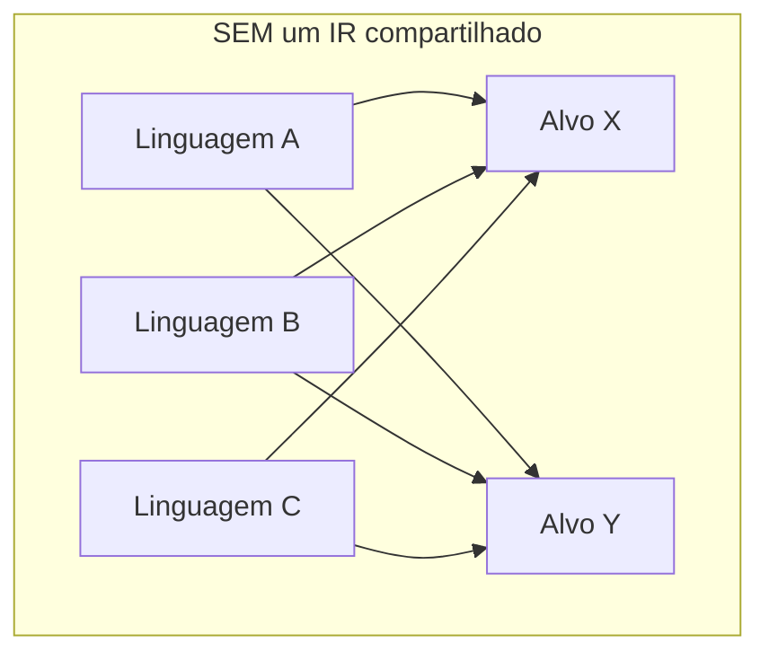
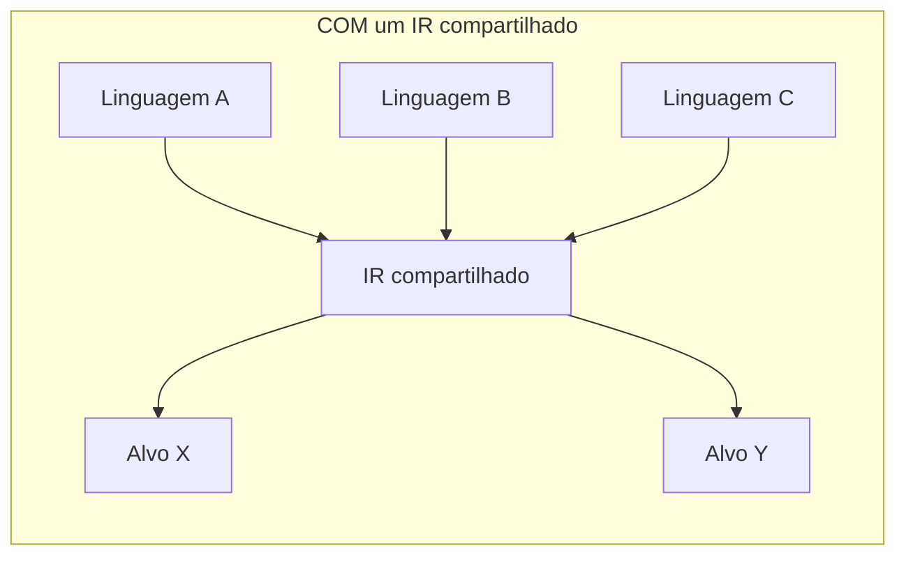

## Objetivos de Aprendizagem

- Enunciar o argumento de redirecionabilidade para uma representação intermediária com precisão: N front ends × M back ends vira N + M peças de trabalho em vez de N × M.
- Explicar por que rodar uma passagem de otimização sobre um IR, em vez de diretamente sobre um AST ou diretamente sobre código de máquina, deixa essa única passagem servir toda linguagem-fonte e toda arquitetura-alvo de uma vez.
- Nomear pelo menos duas propriedades de que um bom IR precisa (um conjunto de instruções fixo e pequeno; fluxo de controle explícito; independência de qualquer linguagem-fonte ou -alvo) e justificar cada uma com um contraexemplo concreto do que quebra sem ela.
- Dar o LLVM IR como um exemplo real e atualmente implantado exatamente deste design, nomeando pelo menos um front end e um back end que o compartilham.
- Explicar por que um AST é uma escolha ruim de IR para o trabalho de otimização e geração de código ainda adiante nesta disciplina.

## Contexto e Motivação

Um AST já carrega o significado completo de um programa, nada falta nele. Então por que não rodar toda otimização diretamente sobre o AST, e gerar código de máquina diretamente a partir dele também? Porque o FORMATO de um AST está amarrado a qualquer linguagem-fonte que o produziu: um nó `if` parece diferente dependendo da sintaxe exata de `if`/`else`/`elif` da linguagem-fonte, o formato de AST de um laço `for` difere do de um laço `while` mesmo que ambos eventualmente compilem para o mesmo tipo de salto condicional, e toda nova linguagem-fonte adicionada a um compilador exigiria que toda passagem de otimização fosse reescrita para entender os formatos de AST particulares daquela linguagem de novo.

Uma REPRESENTAÇÃO INTERMEDIÁRIA (IR) é a resposta deliberada: uma única linguagem simples, independente de linguagem-fonte e de máquina-alvo, para dentro da qual todo front end traduz, e sobre a qual toda passagem de otimização e todo back end opera. O argumento de redirecionabilidade que isso compra é o mesmo argumento de "evitar trabalho N×M" que aparece por toda a engenharia de software onde quer que uma interface desacople duas coisas que, de outra forma, cada uma precisaria saber sobre toda variante da outra: com um IR compartilhado, adicionar uma nova linguagem-fonte significa escrever um novo front end (para dentro do IR existente); adicionar uma nova arquitetura-alvo significa escrever um novo back end (para fora do IR existente); toda passagem de otimização, escrita uma vez contra o IR, beneficia toda combinação automaticamente.

## Teoria Central

### O problema N×M que um IR elimina





Três linguagens-fonte e dois alvos sem um IR compartilhado significa até seis caminhos de tradução separados e escritos à mão, cada um precisando da sua própria cópia de toda otimização que o compilador quer realizar; com um IR compartilhado, são três front ends, dois back ends, e toda passagem de otimização escrita exatamente uma vez contra o IR no meio.

### O que torna um IR de fato bom neste trabalho

- **Um conjunto de instruções pequeno e fixo.** Diferentemente de um AST, que tem tantos formatos de nó quantas construções sintáticas uma linguagem tem, um bom IR tem um punhado de espécies de instrução (aritmética, carga/armazenamento, ramificação, chamada) para dentro das quais toda construção de fonte eventualmente rebaixa, o material x86-64 de `translating-control-flow-if-while-for` já mostrou concretamente que `if`, `while` e `for` todos terminam no mesmo punhado de instruções de comparação-e-salto; um IR captura essa convergência um nível antes, de modo que uma passagem de otimização nunca precisa tratar como caso especial "isto foi originalmente um laço `for`" versus "isto foi originalmente um laço `while`".
- **Fluxo de controle explícito.** Um AST representa o fluxo de controle implicitamente, como aninhamento de árvore (os dois filhos de um nó `if` SÃO os seus ramos); um IR tipicamente torna o fluxo de controle explícito como saltos rotulados e ramificações condicionais entre blocos de código em linha reta, exatamente o formato de que `control-flow-graphs-and-basic-blocks`, o conceito seguinte, precisa para construir o seu grafo.
- **Independência de fonte e de alvo.** Nada sobre o conjunto de instruções de um bom IR deveria mencionar a sintaxe de qualquer linguagem-fonte particular ou os registradores específicos de qualquer máquina-alvo particular, o GIMPLE/RTL do GCC e o LLVM IR ambos deliberadamente evitam codificar qualquer coisa específica de linguagem ou de arquitetura nos seus conjuntos de instruções centrais, precisamente para que o mesmo IR possa servir C, C++, Rust e Swift de um lado e x86-64, ARM e RISC-V do outro.

### Um exemplo real e atualmente implantado: LLVM IR

O LLVM IR é a prova concreta e funcional de todo este argumento: Clang (C/C++), o `rustc` do Rust e o compilador do Swift todos rebaixam as suas linguagens-fonte muito diferentes para o exato mesmo LLVM IR; as passagens de otimização do LLVM (dezenas delas, inlining, transformações de laço, eliminação de código morto e mais) são escritas exatamente uma vez, contra esse único IR; e os back ends do LLVM então rebaixam o IR otimizado para x86-64, ARM, RISC-V e várias outras arquiteturas-alvo reais. Todo conceito de otimização coberto mais adiante nesta disciplina (`constant-folding-and-constant-propagation`, `common-subexpression-elimination`, `dead-code-elimination`, `loop-optimizations-invariant-code-motion-and-strength-reduction`) é, no LLVM, bem literalmente uma passagem escrita contra o LLVM IR exatamente uma vez, beneficiando cada uma dessas linguagens e cada um desses alvos simultaneamente.

## Exemplos Resolvidos

### Exemplo 1: a mesma otimização escrita uma vez versus escrita três vezes

```text
SEM um IR compartilhado:
  constant-folding-for-Java-AST(node)     — conhece os formatos de nó de AST de Java
  constant-folding-for-Python-AST(node)   — conhece os formatos de nó de AST de Python
  constant-folding-for-Rust-AST(node)     — conhece os formatos de nó de AST de Rust
  (três implementações separadas da MESMA ideia, dobrar 2 + 3 em 5)

COM um IR compartilhado:
  constant-folding-for-IR(instruction)    — conhece só o próprio conjunto
                                            de instruções pequeno e fixo do IR
  (uma implementação; todo front end que rebaixa para dentro deste IR
   beneficia automaticamente, com zero trabalho extra por linguagem-fonte)
```

### Exemplo 2: por que um AST é uma escolha ruim para o trabalho ainda adiante

```text
AST para:  if (x > 0) { y = 1; } else { y = 2; }

Problema: os ramos "then" e "else" são FILHOS do nó-if,
não há noção explícita de "o controle flui daqui para lá" que
uma análise de fluxo de dados (o próximo agrupamento) possa percorrer como um grafo; a
estrutura de árvore É o fluxo de controle, implicitamente, que é exatamente o que
control-flow-graphs-and-basic-blocks (o próprio conceito seguinte nesta
disciplina) torna explícito em vez disso, rebaixando este mesmo programa em
blocos rotulados conectados por arestas reais.
```

### Exemplo 3: redirecionabilidade em números

```text
Suponha que um projeto de compilador suporta 4 linguagens-fonte e 3 arquiteturas-
alvo, e quer adicionar uma nova passagem de otimização.

SEM um IR compartilhado: até 4 × 3 = 12 implementações separadas dessa
  única otimização (uma por CAMINHO fonte/alvo de fato ligado).

COM um IR compartilhado: exatamente 1 implementação, escrita contra o IR,
  automaticamente disponível em cada um dos 12 caminhos, este é o
  retorno concreto que o LLVM realiza na prática, e a razão pela qual essencialmente
  todo compilador moderno de força industrial é estruturado dessa forma.
```

## Equívocos Comuns e Armadilhas

- **"Um AST já contém tudo o que um IR conteria, construir uma representação separada é trabalho redundante."** Um AST contém o SIGNIFICADO do programa, mas não num FORMATO conveniente para otimização ou geração de código: a sua estrutura está amarrada à sintaxe-fonte e representa o fluxo de controle implicitamente como aninhamento de árvore, ambos os quais um IR deliberadamente achata, como o Exemplo 2 mostra concretamente.
- **"IRs são um luxo teórico que os compiladores reais pulam em favor de ir direto do AST para o código de máquina."** O oposto é verdade, o LLVM IR é possivelmente a peça individual mais consequente de infraestrutura de compilador real construída nas últimas duas décadas, precisamente por causa do argumento de redirecionabilidade que este conceito desenvolve; ir direto do AST para o código de máquina é o que compiladores de brinquedo PEQUENOS, de linguagem única, de alvo único fazem, ao custo direto da redirecionabilidade.
- **"Um bom IR deveria ser o mais expressivo e de alto nível possível, para ficar perto do significado da linguagem-fonte."** O objetivo de design oposto é o que torna um IR útil: um conjunto de instruções PEQUENO, fixo e de baixo nível é exatamente o que deixa uma passagem de otimização lidar com toda construção uniformemente, em vez de precisar de um caso especial por construção de alto nível.
- **"Os IRs de compiladores diferentes são todos basicamente intercambiáveis, bastaria pegar o LLVM IR emprestado para qualquer coisa."** Os IRs diferem de formas reais e estruturais (o LLVM IR está em forma SSA por design, como os próximos poucos conceitos vão construir; outros compiladores usam IRs diferentes adequados às suas próprias estratégias de otimização), "um IR existe" é um padrão de design compartilhado, não uma alegação de que quaisquer dois IRs são equivalentes ou trocáveis.

## Resumo

Uma representação intermediária existe para quebrar o problema N×M: sem uma, adicionar uma linguagem-fonte ou uma arquitetura-alvo (ou uma única nova passagem de otimização) significa refazer trabalho por toda combinação existente; com uma, cada lado é escrito uma vez contra um conjunto de instruções compartilhado, pequeno, independente de fonte e de alvo, com fluxo de controle explícito, e toda passagem de otimização beneficia toda combinação automaticamente, o LLVM IR, alimentando Clang/Rust/Swift de um lado e x86-64/ARM/RISC-V do outro, é a prova funcional e atualmente implantada. Os próximos três conceitos constroem um IR concreto exatamente desse tipo, uma camada por vez: `three-address-code` dá o formato de instrução linear básico, `control-flow-graphs-and-basic-blocks` torna o fluxo de controle explícito como um grafo, e `static-single-assignment-form` reestrutura a nomeação de variáveis de uma forma que torna quase toda análise de fluxo de dados e otimização posterior dramaticamente mais simples.

## Documentation Links

- [MIT 6.035 — Computer Language Engineering, Calendar](https://ocw.mit.edu/courses/6-035-computer-language-engineering-sma-5502-fall-2005/pages/calendar/): sequência de aulas que introduz as representações intermediárias como o seu próprio tópico, antes das aulas de otimização que as consomem.
- [Cooper & Torczon — Engineering a Compiler (companion site)](https://shop.elsevier.com/books/book-companion/9780120884780): livro-texto cujos capítulos de design de IR (redirecionabilidade, escolha de granularidade de instrução) o argumento deste conceito segue.
