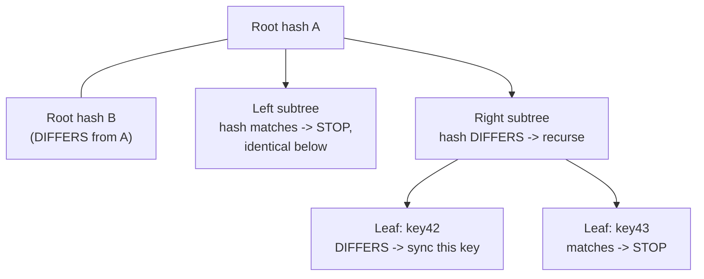

## Learning Objectives

- Name the two concrete mechanisms this concept covers, read repair and Merkle-tree-based background synchronization, and explain what triggers each.
- Explain read repair's mechanism precisely: a read that touches multiple replicas, notices disagreement via vector-clock comparison, and pushes the winning value back to the stale replicas immediately.
- Explain how comparing Merkle tree root hashes lets two replicas holding a whole key range detect exactly which keys diverged in O(log n) comparisons, rather than comparing all n keys directly.
- Explain precisely what problem these two mechanisms solve that hinted handoff does not, permanent divergence with no recovering owner to hand a hint back to.

## Context & Motivation

`eventual-consistency-and-its-real-guarantees` (`distributed-systems-i`) named gossip and anti-entropy only generically, "replicas periodically exchange recent updates with a few peers rather than coordinating globally", without specifying any concrete mechanism for what gets exchanged or how divergence is actually found. `sloppy-quorums-and-hinted-handoff` just showed one real cause of divergence, and a mechanism (hinted handoff) that resolves it once the original owner recovers, but hinted handoff only helps when there is a specific hint waiting for a specific node to come back; it says nothing about two long-lived replicas that have simply drifted apart over time (a dropped gossip message, a replica that was down longer than any hint's lifetime) with no pending hint to reconcile them. This concept covers the two real mechanisms Dynamo-style systems run for exactly that residual, no-pending-hint divergence.

## Core Theory

### Read repair: fixing divergence the instant it is observed

Every read in `dynamo-style-leaderless-replication-and-quorum-intersection`'s model already queries R replicas and compares their vector clocks. Read repair simply acts on what that comparison already reveals: if the R responses disagree and one dominates the others (per `vector-clocks-and-detecting-concurrent-writes`'s comparison rule), the coordinator pushes the winning value back to whichever replicas returned the stale one, in the background, without blocking the client's response. This fixes exactly the divergence a read happens to touch, opportunistically, as a free side effect of normal read traffic.

### Merkle-tree synchronization: finding divergence nobody has read yet

Read repair only fixes keys someone actually reads. A key range with divergent replicas that nobody queries for a long time stays divergent indefinitely under read repair alone. Background anti-entropy addresses this directly: periodically, pairs of replicas holding the same key range build a **Merkle tree** over their keys, leaves are hashes of individual key-value pairs, and each internal node is the hash of its two children, all the way up to a single root hash summarizing the entire range.

Two replicas compare their root hashes first. If the roots match, every key in the entire range is guaranteed identical (any single differing key would have propagated a different hash all the way to the root), and the comparison stops immediately, no key-by-key comparison needed at all. If the roots differ, the replicas recurse into the two children only, comparing their hashes, and continue recursing only into whichever subtrees actually disagree, stopping at any subtree whose hash matches (everything below it is guaranteed identical). This finds every genuinely diverged key in O(log n) hash comparisons for a range of n keys, instead of comparing all n keys directly.



### What this covers that `merkle-trees` (`system-design-concepts`) already builds in full depth

`merkle-trees` already covers the hash-tree data structure itself in real depth, its O(log n) membership proofs, its use in certificate transparency and Git, and even the domain-separation bug that once affected Bitcoin's implementation. This concept does not re-derive that structure; it names the one specific role the structure plays in this discipline's anti-entropy protocol, comparing two replicas' key ranges to find exactly what diverged, and cross-links to that concept for the full construction and proof of the O(log n) property this concept relies on.

### Why hinted handoff alone is not enough

Hinted handoff resolves divergence with a specific plan, a hint says exactly which node should eventually receive exactly which write. Merkle-tree anti-entropy has no such plan and needs none, it discovers divergence between any two replicas regardless of its cause, a dropped gossip message, a replica down longer than any hint survives, or even a replica that was never part of a sloppy quorum at all but simply missed an ordinary write due to a transient error. This is precisely the residual, unplanned convergence gap `eventual-consistency-and-its-real-guarantees`'s "eventually" actually depends on in practice.

## Worked Examples

### Example 1: read repair triggered by an ordinary read

```text
Key "profile-9", N=3 [A, B, C]. A read with R=2 queries B and C.

B returns value v2 with vector clock [0,3,1].
C returns value v1 with vector clock [0,1,1].

Compare: is [0,1,1] <= [0,3,1] in every slot, with at least one
  strictly less? YES (slot 2: 1 < 3). C's value happened-before
  B's: C is stale.

Coordinator returns v2 to the client (correct, fresh answer)
  AND, in the background, pushes v2 to C: READ REPAIR. C's
  divergence is fixed as a side effect of this one read, with
  no separate anti-entropy round needed for this specific key.
```

### Example 2: Merkle-tree comparison finding one diverged key among many

```text
Replicas X and Y both hold key range [1000-2000], 1024 keys.
Merkle tree depth: log2(1024) = 10 levels.

Root hash: X != Y -> divergence exists somewhere in the range.
Level 1 (2 subtrees of 512 keys each): left matches, right
  differs -> recurse only into the right half.
Level 2 (2 subtrees of 256 keys each): left matches, right
  differs -> recurse only into that quarter.
... (continuing to halve at each level) ...
Level 10 (individual keys): exactly ONE leaf hash differs,
  key #1537.

Total comparisons: 10 (one per level), instead of 1024 (one
  per key): the O(log n) saving this concept's Core Theory
  section states, made concrete with real numbers. Only key
  #1537 needs its value actually exchanged and reconciled.
```

### Example 3: divergence hinted handoff cannot fix, that anti-entropy does

```text
Node A was down for an extended maintenance window, LONGER than
  any hint's configured retention period; any hints meant for A
  were already discarded by the substitute nodes that held them
  (a real, documented Dynamo behavior: hints are not held
  forever).

A rejoins the cluster with genuinely stale data for its entire
  key range, and NO pending hint exists anywhere to tell it
  what it missed: hinted handoff has nothing left to hand off.

Background Merkle-tree anti-entropy between A and its
  neighbors, run on its own periodic schedule regardless of any
  specific outage history, is what finds and repairs this
  divergence: A's root hash for its key ranges simply differs
  from its neighbors', and the standard recursive comparison
  (Example 2) finds and fixes every affected key, with no
  dependency on a hint that no longer exists.
```

## Common Misconceptions & Pitfalls

- **"Read repair alone is enough anti-entropy, since it fixes what people actually read."** Example 3 shows exactly the gap: a key range nobody reads for a long time (or a node down long enough that its hints expire) never gets fixed by read repair at all, which is why background Merkle-tree comparison, run on a schedule independent of read traffic, is a genuinely separate, necessary mechanism.
- **"Comparing Merkle tree roots tells you WHICH key differs, not just THAT something differs."** A root-hash mismatch alone only proves divergence exists somewhere in the range; Example 2 shows the actual located key only emerges after recursing level by level down to the specific leaf, the root comparison is just the fast first check that avoids the O(n) alternative entirely when the roots already match.
- **"Anti-entropy and hinted handoff solve the same problem, just at different times."** They solve genuinely different problems: hinted handoff has a specific target node and a specific write to redeliver; anti-entropy has no target and no specific write in mind, it is a general-purpose divergence detector between any two replicas, needed precisely because not every cause of divergence comes with a hint attached.

## Summary

Read repair fixes divergence the instant a read happens to observe it, comparing R replicas' vector clocks and pushing the winning value back to whichever replicas are stale, entirely as a side effect of ordinary read traffic. Background Merkle-tree synchronization covers what read repair cannot, comparing two replicas' entire key ranges via a hash tree, checking root hashes first and recursing only into subtrees that actually disagree, finding every diverged key among n in O(log n) comparisons rather than n, with no dependency on any specific read or any specific pending hint. Together these two mechanisms are the concrete answer to what `eventual-consistency-and-its-real-guarantees` left as an unspecified "eventually," and complete this discipline's Distributed Databases material's coverage of how a Dynamo-style store actually converges. The next topic turns from replicating a single key to a genuinely different problem, keeping an operation atomic across multiple keys and nodes at once.

## Documentation Links

- [DeCandia et al.: Dynamo: Amazon's Highly Available Key-value Store (SOSP, 2007)](https://www.allthingsdistributed.com/files/amazon-dynamo-sosp2007.pdf): the source paper for both mechanisms this concept covers, read repair as an opportunistic fix during normal reads, and Merkle trees used specifically for anti-entropy between replicas holding the same key range.
- [Merkle: Protocols for Public Key Cryptosystems (IEEE Symposium on Security and Privacy, 1980)](https://www.ralphmerkle.com/papers/Protocols.pdf): the original hash-tree construction this concept's root-hash-first, recurse-on-mismatch comparison protocol is built on, cross-linked to `merkle-trees` (`system-design-concepts`) for the structure's full derivation and proof of its O(log n) property.
