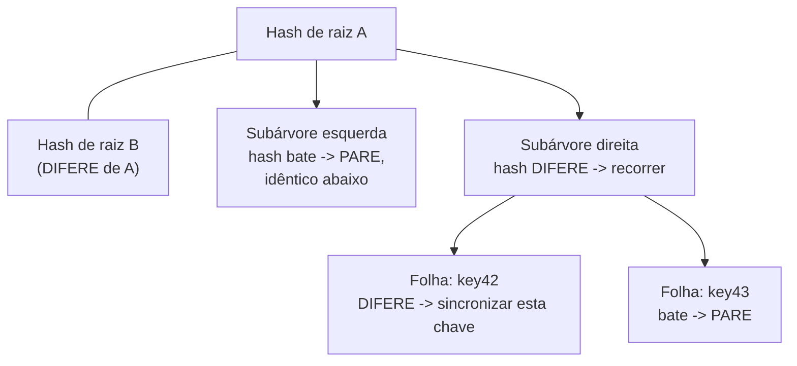

## Objetivos de Aprendizagem

- Nomear os dois mecanismos concretos que este conceito cobre, read repair e sincronização em segundo plano baseada em árvore de Merkle, e explicar o que dispara cada um.
- Explicar o mecanismo do read repair com precisão: uma leitura que toca múltiplas réplicas, nota a discordância por comparação de relógio vetorial, e empurra o valor vencedor de volta para as réplicas obsoletas imediatamente.
- Explicar como comparar os hashes de raiz das árvores de Merkle permite a duas réplicas que seguram uma faixa de chaves inteira detectar exatamente quais chaves divergiram em O(log n) comparações, em vez de comparar todas as n chaves diretamente.
- Explicar com precisão que problema esses dois mecanismos resolvem que o hinted handoff não resolve, a divergência permanente sem nenhum dono em recuperação para o qual devolver um hint.

## Contexto e Motivação

`eventual-consistency-and-its-real-guarantees` (`distributed-systems-i`) nomeou gossip e anti-entropia só de forma genérica, "as réplicas trocam periodicamente atualizações recentes com alguns pares em vez de coordenar globalmente", sem especificar nenhum mecanismo concreto do que é trocado ou de como a divergência é de fato encontrada. `sloppy-quorums-and-hinted-handoff` acabou de mostrar uma causa real de divergência, e um mecanismo (hinted handoff) que a resolve uma vez que o dono original se recupera, mas o hinted handoff só ajuda quando há um hint específico esperando por um nó específico voltar; ele nada diz sobre duas réplicas de vida longa que simplesmente derivaram uma da outra ao longo do tempo (uma mensagem de gossip perdida, uma réplica que ficou fora por mais tempo do que a vida de qualquer hint) sem nenhum hint pendente para reconciliá-las. Este conceito cobre os dois mecanismos reais que os sistemas no estilo Dynamo rodam exatamente para essa divergência residual, sem hint pendente.

## Teoria Central

### Read repair: consertar a divergência no instante em que ela é observada

Toda leitura no modelo de `dynamo-style-leaderless-replication-and-quorum-intersection` já consulta R réplicas e compara os seus relógios vetoriais. O read repair simplesmente atua sobre o que essa comparação já revela: se as R respostas discordam e uma domina as outras (pela regra de comparação de `vector-clocks-and-detecting-concurrent-writes`), o coordenador empurra o valor vencedor de volta para quaisquer réplicas que retornaram o obsoleto, em segundo plano, sem bloquear a resposta ao cliente. Isso conserta exatamente a divergência que uma leitura por acaso toca, oportunisticamente, como um efeito colateral gratuito do tráfego normal de leitura.

### Sincronização por árvore de Merkle: encontrar a divergência que ninguém leu ainda

O read repair só conserta chaves que alguém de fato lê. Uma faixa de chaves com réplicas divergentes que ninguém consulta por muito tempo permanece divergente indefinidamente só sob o read repair. A anti-entropia em segundo plano aborda isso diretamente: periodicamente, pares de réplicas que seguram a mesma faixa de chaves constroem uma **árvore de Merkle** sobre as suas chaves, as folhas são hashes de pares chave-valor individuais, e cada nó interno é o hash dos seus dois filhos, por todo o caminho até um único hash de raiz que resume a faixa inteira.

Duas réplicas comparam os seus hashes de raiz primeiro. Se as raízes batem, toda chave na faixa inteira tem garantia de ser idêntica (qualquer única chave divergente teria propagado um hash diferente por todo o caminho até a raiz), e a comparação para imediatamente, nenhuma comparação chave por chave necessária de forma alguma. Se as raízes diferem, as réplicas recorrem só nos dois filhos, comparando os seus hashes, e continuam recorrendo só nas subárvores que de fato discordam, parando em qualquer subárvore cujo hash bate (tudo abaixo dela tem garantia de ser idêntico). Isso encontra toda chave genuinamente divergida em O(log n) comparações de hash para uma faixa de n chaves, em vez de comparar todas as n chaves diretamente.



### O que isto cobre que `merkle-trees` (`system-design-concepts`) já constrói em profundidade completa

`merkle-trees` já cobre a própria estrutura de dados de árvore de hash em profundidade real, as suas provas de pertinência O(log n), o seu uso em transparência de certificados e no Git, e até o bug de separação de domínio que uma vez afetou a implementação do Bitcoin. Este conceito não rederiva essa estrutura; ele nomeia o único papel específico que a estrutura desempenha no protocolo de anti-entropia desta disciplina, comparar as faixas de chaves de duas réplicas para encontrar exatamente o que divergiu, e faz link cruzado para aquele conceito para a construção completa e a prova da propriedade O(log n) da qual este conceito depende.

### Por que o hinted handoff sozinho não é suficiente

O hinted handoff resolve a divergência com um plano específico, um hint diz exatamente qual nó deve eventualmente receber exatamente qual escrita. A anti-entropia por árvore de Merkle não tem tal plano e não precisa de nenhum, ela descobre a divergência entre quaisquer duas réplicas independentemente da sua causa, uma mensagem de gossip perdida, uma réplica fora por mais tempo do que qualquer hint sobrevive, ou até uma réplica que nunca foi parte de um quórum relaxado de forma alguma, mas simplesmente perdeu uma escrita comum por um erro transitório. Essa é precisamente a lacuna de convergência residual e não planejada da qual o "eventualmente" de `eventual-consistency-and-its-real-guarantees` de fato depende na prática.

## Exemplos Resolvidos

### Exemplo 1: read repair disparado por uma leitura comum

```text
Chave "profile-9", N=3 [A, B, C]. Uma leitura com R=2 consulta B e C.

B retorna o valor v2 com relógio vetorial [0,3,1].
C retorna o valor v1 com relógio vetorial [0,1,1].

Comparar: [0,1,1] <= [0,3,1] em todo slot, com pelo menos um
  estritamente menor? SIM (slot 2: 1 < 3). O valor de C aconteceu-antes
  do de B: C está obsoleto.

O coordenador retorna v2 ao cliente (resposta correta e fresca)
  E, em segundo plano, empurra v2 para C: READ REPAIR. A
  divergência de C é consertada como efeito colateral desta única leitura, com
  nenhuma rodada separada de anti-entropia necessária para esta chave específica.
```

### Exemplo 2: comparação por árvore de Merkle encontrando uma chave divergida entre muitas

```text
As réplicas X e Y ambas seguram a faixa de chaves [1000-2000], 1024 chaves.
Profundidade da árvore de Merkle: log2(1024) = 10 níveis.

Hash de raiz: X != Y -> a divergência existe em algum lugar da faixa.
Nível 1 (2 subárvores de 512 chaves cada): a esquerda bate, a direita
  difere -> recorrer só na metade direita.
Nível 2 (2 subárvores de 256 chaves cada): a esquerda bate, a direita
  difere -> recorrer só nesse quarto.
... (continuando a dividir ao meio em cada nível) ...
Nível 10 (chaves individuais): exatamente UM hash de folha difere,
  chave #1537.

Comparações totais: 10 (uma por nível), em vez de 1024 (uma
  por chave): a economia O(log n) que a seção de Teoria Central deste conceito
  enuncia, tornada concreta com números reais. Só a chave
  #1537 precisa do seu valor de fato trocado e reconciliado.
```

### Exemplo 3: divergência que o hinted handoff não consegue consertar, mas a anti-entropia consegue

```text
O nó A ficou fora por uma janela de manutenção prolongada, MAIS LONGA do que
  o período de retenção configurado de qualquer hint; quaisquer hints destinados a A
  já foram descartados pelos nós substitutos que os seguravam
  (um comportamento real e documentado do Dynamo: os hints não são segurados
  para sempre).

A rejunta-se ao cluster com dados genuinamente obsoletos para a sua faixa de
  chaves inteira, e NENHUM hint pendente existe em lugar nenhum para lhe dizer
  o que ele perdeu: o hinted handoff não tem nada mais a repassar.

A anti-entropia em segundo plano por árvore de Merkle entre A e os
  seus vizinhos, rodada no seu próprio cronograma periódico independentemente de qualquer
  histórico de interrupção específico, é o que encontra e repara essa
  divergência: o hash de raiz de A para as suas faixas de chaves simplesmente difere
  do dos seus vizinhos, e a comparação recursiva padrão
  (Exemplo 2) encontra e conserta toda chave afetada, sem
  dependência de um hint que não existe mais.
```

## Equívocos Comuns e Armadilhas

- **"O read repair sozinho é anti-entropia suficiente, já que ele conserta o que as pessoas de fato leem."** O Exemplo 3 mostra exatamente a lacuna: uma faixa de chaves que ninguém lê por muito tempo (ou um nó fora por tempo suficiente para os seus hints expirarem) nunca é consertada pelo read repair de forma alguma, que é por que a comparação em segundo plano por árvore de Merkle, rodada num cronograma independente do tráfego de leitura, é um mecanismo genuinamente separado e necessário.
- **"Comparar os hashes de raiz das árvores de Merkle diz QUAL chave difere, não só QUE algo difere."** Um descompasso de hash de raiz sozinho só prova que a divergência existe em algum lugar da faixa; o Exemplo 2 mostra que a chave de fato localizada só emerge após recorrer nível por nível até a folha específica, a comparação de raiz é só a checagem rápida inicial que evita a alternativa O(n) inteiramente quando as raízes já batem.
- **"Anti-entropia e hinted handoff resolvem o mesmo problema, só em momentos diferentes."** Eles resolvem problemas genuinamente diferentes: o hinted handoff tem um nó-alvo específico e uma escrita específica a reentregar; a anti-entropia não tem nenhum alvo e nenhuma escrita específica em mente, ela é um detector de divergência de propósito geral entre quaisquer duas réplicas, necessário precisamente porque nem toda causa de divergência vem com um hint anexado.

## Resumo

O read repair conserta a divergência no instante em que uma leitura por acaso a observa, comparando os relógios vetoriais de R réplicas e empurrando o valor vencedor de volta para quaisquer réplicas que estejam obsoletas, inteiramente como efeito colateral do tráfego comum de leitura. A sincronização em segundo plano por árvore de Merkle cobre o que o read repair não consegue, comparando as faixas de chaves inteiras de duas réplicas por uma árvore de hash, checando os hashes de raiz primeiro e recorrendo só nas subárvores que de fato discordam, encontrando toda chave divergida entre n em O(log n) comparações em vez de n, sem dependência de qualquer leitura específica ou de qualquer hint pendente específico. Juntos, esses dois mecanismos são a resposta concreta para o que `eventual-consistency-and-its-real-guarantees` deixou como um "eventualmente" não especificado, e completam a cobertura do material de Bancos de Dados Distribuídos desta disciplina sobre como uma store no estilo Dynamo de fato converge. O próximo tópico se volta de replicar uma única chave para um problema genuinamente diferente, manter uma operação atômica por múltiplas chaves e nós de uma vez.

## Documentation Links

- [DeCandia et al.: Dynamo: Amazon's Highly Available Key-value Store (SOSP, 2007)](https://www.allthingsdistributed.com/files/amazon-dynamo-sosp2007.pdf): o artigo-fonte de ambos os mecanismos que este conceito cobre, o read repair como um conserto oportunista durante leituras normais, e as árvores de Merkle usadas especificamente para anti-entropia entre réplicas que seguram a mesma faixa de chaves.
- [Merkle: Protocols for Public Key Cryptosystems (IEEE Symposium on Security and Privacy, 1980)](https://www.ralphmerkle.com/papers/Protocols.pdf): a construção original de árvore de hash sobre a qual o protocolo de comparação deste conceito, hash-de-raiz-primeiro, recorrer-no-descompasso, é construído, com link cruzado para `merkle-trees` (`system-design-concepts`) para a derivação completa da estrutura e a prova da sua propriedade O(log n).
