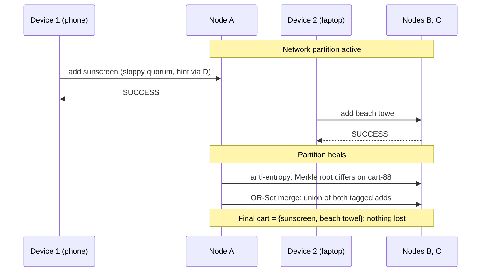

## Learning Objectives

- Trace, step by step, a shopping-cart write through a network partition and back, naming the exact concept responsible for each step: sloppy quorums during the partition, vector-clock divergence detection, Merkle-tree anti-entropy on healing, and OR-Set CRDT merge for the final, lossless reconciliation.
- Explain precisely why modeling the cart as an OR-Set, rather than a plain overwritable value, is what makes the reconciliation lossless and automatic rather than requiring a manual conflict-resolution step.
- Contrast this capstone's deliberate choice explicitly against `distributed-systems-i`'s own capstone: the same underlying CAP tension, resolved by two systems making opposite, equally deliberate trade-offs.
- State honestly, in one paragraph, what real production concern this capstone still leaves out, matching the same honest-boundary discipline every capstone in this curriculum keeps.

## Context & Motivation

`capstone-tracing-a-client-write-through-a-raft-replicated-system`, `distributed-systems-i`'s own capstone, traced a client write through a Raft cluster choosing Consistency, every write waits for a majority quorum, and a client sees success only once its write is durably, unlosably committed. This capstone traces the same kind of event, a client write, through a system making the opposite, equally deliberate choice, Availability, using the exact scenario DeCandia et al.'s own Dynamo paper uses throughout its motivating examples: a customer's shopping cart. Every mechanism named below was built earlier in this discipline; this capstone's job is naming, precisely, which concept is responsible for each step of one concrete, partitioned scenario, exactly the pattern `distributed-systems-i`'s own capstone set for this curriculum's discipline-closing concept.

## Core Theory

### The scenario, and the exact mechanisms it exercises, in order

A customer's cart, key "cart-88", preference list [A, B, C] (N=3, per `dynamo-style-leaderless-replication-and-quorum-intersection`), modeled as an **OR-Set** (per `operation-based-crdts-and-practical-data-types`) rather than a plain overwritable value, is about to be written to from two different devices during a network partition that isolates node A from nodes B and C.

```text
1. PARTITION OCCURS: node A is isolated from B and C.

2. WRITE 1 (device 1, phone): add "sunscreen" to cart-88.
   Coordinator (routing to A's side) cannot reach B, C for the
   full preference list -> SLOPPY QUORUM (sloppy-quorums-and-
   hinted-handoff): write is accepted by A and a substitute
   node D, with D holding a hint "belongs to B or C".
   W is satisfied by {A, D}. Client sees SUCCESS.

3. WRITE 2 (device 2, laptop, same customer), CONCURRENTLY,
   reaching the OTHER side of the partition: add "beach towel"
   to cart-88. Coordinator (routing to B/C's side) reaches B
   and C directly (no substitute needed, A is simply
   unreachable from here). W is satisfied by {B, C}. Client
   sees SUCCESS.

4. Both writes are tagged with unique OR-Set add-tags (per
   operation-based-crdts-and-practical-data-types): "sunscreen"
   tagged (sunscreen, tagP1), "beach towel" tagged
   (beach-towel, tagL1). Neither write's coordinator has ANY
   knowledge of the other: vector-clocks-and-detecting-
   concurrent-writes's comparison, if run right now between
   A's view {(sunscreen,tagP1)} and B's view
   {(beach-towel,tagL1)}, finds NEITHER dominates: genuinely
   CONCURRENT.

5. PARTITION HEALS. A, B, C, D can all reach each other again.

6. ANTI-ENTROPY (anti-entropy-read-repair-and-merkle-tree-
   synchronization): a background Merkle-tree comparison
   between A's key range and B/C's key range finds cart-88's
   root hash differs: recursing down (per that concept's own
   O(log n) argument) isolates cart-88 specifically as diverged.

7. Hinted handoff (sloppy-quorums-and-hinted-handoff) delivers
   D's held write back toward the true preference list at the
   same time, ensuring the sunscreen add physically reaches a
   true preference-list node, not just D.

8. MERGE: because cart-88 is an OR-Set, not a plain value, the
   merge (operation-based-crdts-and-practical-data-types) is a
   deterministic UNION of both tagged adds: the merged cart
   contains BOTH {(sunscreen,tagP1), (beach-towel,tagL1)}: no
   item lost, no manual conflict resolution, no "last write
   wins" discarding either customer's addition.
```



### Why the OR-Set choice, specifically, is what makes this lossless

Had cart-88 been modeled as a plain LWW-Register instead (per `operation-based-crdts-and-practical-data-types`'s own honest comparison), step 8's merge would have picked exactly one of the two writes by timestamp and silently discarded the other, one customer's device would show an item vanish from their cart with no explanation, a real, documented failure mode DeCandia et al.'s own paper reports plainly: "the item was never lost, but a stale count was briefly shown." Modeling the cart as an OR-Set is the specific, deliberate design decision that turns a genuine concurrent-write conflict into a safe, automatic union instead of a lossy pick-one, exactly the same real trade-off `operation-based-crdts-and-practical-data-types` named honestly between the two data types.

### The direct contrast with `distributed-systems-i`'s own capstone

`capstone-tracing-a-client-write-through-a-raft-replicated-system` traced a write where the client's success reply was delayed until a Raft majority durably committed it, Consistency chosen, and a leader crash before that commit left the client needing to retry, per that capstone's own idempotent-retry mechanism. This capstone's writes, by contrast, both returned SUCCESS immediately, from whichever side of the partition each device reached, Availability chosen, with the honest cost, made fully concrete here rather than left abstract, being exactly the divergence traced through steps 2 to 4 above and only resolved after the fact, in steps 6 to 8. Both capstones trace a real client write through a real, concrete failure scenario; the difference between them is `the-cap-theorem-a-precise-statement`'s own trade-off, made into two working systems making opposite, equally deliberate choices, not one system being more "correct" than the other.

## Worked Examples

### Example 1: the full trace, with concrete quorum values

```text
N=3 [A,B,C], W=2, R=2 (dynamo-style-leaderless-replication-
  and-quorum-intersection's own R+W>N=3 configuration).

During partition: Device 1's write reaches only {A, D}
  (D substituting for the unreachable B or C): W=2 satisfied
  via SLOPPY quorum, not the true preference list.
Device 2's write reaches {B, C}: W=2 satisfied via the TRUE
  preference list (both reachable from that side).

A READ during the partition, querying R=2 from [A,B,C], say
  {A,B}: A has ONLY sunscreen (via D's hint, once forwarded, or
  not yet if hinted handoff hasn't run); B has ONLY beach towel.
  R+W>N's guarantee does NOT hold across the sloppy-quorum
  write, exactly as sloppy-quorums-and-hinted-handoff stated
  honestly: the reader may see an INCOMPLETE cart during the
  partition, resolved only after step 8's merge completes.
```

### Example 2: the merge, worked with explicit OR-Set state

```text
A's local OR-Set state for cart-88 (after receiving D's hinted
  write): {(sunscreen, tagP1)}
B/C's local OR-Set state for cart-88: {(beach-towel, tagL1)}

Merge operation (union of tagged elements, per operation-
  based-crdts-and-practical-data-types): 
  {(sunscreen, tagP1)} UNION {(beach-towel, tagL1)}
  = {(sunscreen, tagP1), (beach-towel, tagL1)}

Both items present. Applying this merge at A, B, AND C
  (anti-entropy propagates it to all three) leaves all three
  replicas in the IDENTICAL state: Strong Eventual Consistency
  (strong-eventual-consistency-and-state-based-crdts),
  achieved with no manual reconciliation and no lost item.
```

### Example 3: what would go wrong with a plain register instead

```text
Same scenario, but cart-88 modeled as a single LWW-Register
  holding a JSON list, overwritten wholesale on each write
  (NOT an OR-Set of individually-tagged items).

Device 1's write: cart = ["sunscreen"] (replacing whatever
  was there before, timestamp T1).
Device 2's write: cart = ["beach towel"] (replacing whatever
  was there before, timestamp T2, say T2 > T1).

LWW merge: keeps ONLY the later-timestamped write in full:
  cart = ["beach towel"]. Sunscreen is GONE, silently, with no
  trace: exactly the lossy outcome operation-based-crdts-and-
  practical-data-types warned about, and exactly why this
  capstone's Core Theory section insists on the OR-Set choice
  specifically, not any CRDT at all.
```

## Common Misconceptions & Pitfalls

- **"Choosing a Dynamo-style, Available system means accepting item loss as the cost of doing business."** Example 3 shows item loss is a consequence of a SPECIFIC, avoidable data-modeling choice (a plain register), not an inherent cost of the PA/EL trade-off itself; the OR-Set choice in Example 2 shows the same availability trade-off achieved with zero item loss, at the different, honest cost of a cart briefly showing an incomplete view during the partition itself.
- **"This capstone's system is simply worse than `distributed-systems-i`'s Raft-based one, since it can show a temporarily incomplete cart."** They are solving for different priorities, correctly, per `the-cap-theorem-a-precise-statement` and `pacelc-the-latency-consistency-trade-off-beyond-cap`: a payment ledger genuinely needs the Raft capstone's Consistency; a shopping cart, per Dynamo's own real, published design reasoning, genuinely prefers this capstone's Availability, neither choice is objectively superior in the abstract.
- **"Once the OR-Set merge completes, there is nothing more this system needs to handle correctly."** Real Dynamo-family deployments still need a policy for a customer who genuinely, intentionally wants to REMOVE an item that a concurrent add keeps re-surfacing (the OR-Set's own honest add-wins trade-off, named plainly in `operation-based-crdts-and-practical-data-types`), a real, remaining product-level decision this technical capstone does not resolve, and states so honestly rather than pretending the mechanism alone settles every case.

## Summary

This capstone traces one concrete shopping-cart write through a real network partition and back, naming every mechanism this discipline's Distributed Databases topic built in order: a sloppy quorum keeps both sides of the partition available, vector-clock comparison proves the two concurrent adds are a genuine, unordered conflict, background Merkle-tree anti-entropy finds the divergence once the partition heals, and because the cart is modeled as an OR-Set CRDT rather than a plain overwritable value, the final merge deterministically unions both additions with no lost item, exactly the "the item was never lost" outcome Dynamo's own paper reports for this exact scenario. Set directly against `distributed-systems-i`'s own capstone, which traced the opposite, Consistency-first choice through a Raft cluster, this closes the discipline's arc: the same CAP tension that concept proved abstractly, made fully concrete here as two different, equally deliberate engineering answers to the same underlying trade-off.

## Documentation Links

- [DeCandia et al.: Dynamo: Amazon's Highly Available Key-value Store (SOSP, 2007)](https://www.allthingsdistributed.com/files/amazon-dynamo-sosp2007.pdf): the source paper this capstone's entire scenario is drawn from directly, including its own shopping-cart running example and its own reported outcome of a divergence resolved by union rather than data loss.
- [Shapiro, Preguica, Baquero, and Zawirski: Conflict-Free Replicated Data Types (INRIA / SSS, 2011)](https://inria.hal.science/inria-00609399): the source for the OR-Set merge this capstone's final reconciliation step relies on, cited again here to make explicit that the lossless outcome traced above depends on this specific data type, not on Dynamo-style replication alone.
