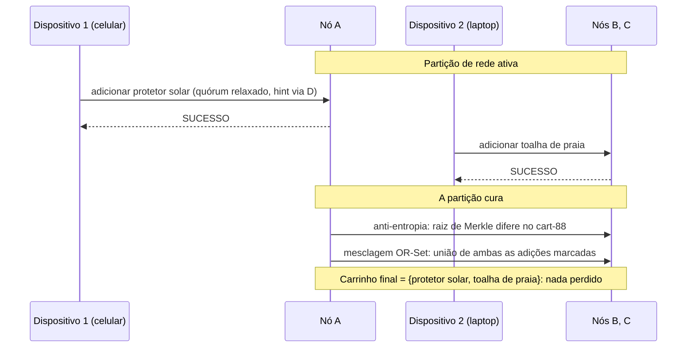

## Objetivos de Aprendizagem

- Rastrear, passo a passo, uma escrita de carrinho de compras por uma partição de rede e de volta, nomeando o conceito exato responsável por cada passo: quóruns relaxados durante a partição, detecção de divergência por relógio vetorial, anti-entropia por árvore de Merkle na cura, e mesclagem de CRDT OR-Set para a reconciliação final e sem perdas.
- Explicar com precisão por que modelar o carrinho como um OR-Set, em vez de um valor sobrescrevível simples, é o que torna a reconciliação sem perdas e automática, em vez de exigir um passo manual de resolução de conflito.
- Contrastar a escolha deliberada deste capstone explicitamente contra o próprio capstone de `distributed-systems-i`: a mesma tensão subjacente do CAP, resolvida por dois sistemas fazendo trade-offs opostos e igualmente deliberados.
- Enunciar honestamente, num parágrafo, que preocupação real de produção este capstone ainda deixa de fora, respeitando a mesma disciplina de fronteira honesta que todo capstone neste currículo mantém.

## Contexto e Motivação

`capstone-tracing-a-client-write-through-a-raft-replicated-system`, o próprio capstone de `distributed-systems-i`, rastreou uma escrita de cliente por um cluster Raft escolhendo Consistência, toda escrita espera por um quórum majoritário, e um cliente vê sucesso só uma vez que a sua escrita é durável e impossível de perder após o commit. Este capstone rastreia o mesmo tipo de evento, uma escrita de cliente, por um sistema fazendo a escolha oposta e igualmente deliberada, Disponibilidade, usando o exato cenário que o próprio artigo do Dynamo de DeCandia et al. usa por todos os seus exemplos motivadores: o carrinho de compras de um cliente. Todo mecanismo nomeado abaixo foi construído antes nesta disciplina; o trabalho deste capstone é nomear, com precisão, qual conceito é responsável por cada passo de um cenário concreto e particionado, exatamente o padrão que o próprio capstone de `distributed-systems-i` estabeleceu para o conceito de encerramento de disciplina deste currículo.

## Teoria Central

### O cenário, e os mecanismos exatos que ele exercita, em ordem

O carrinho de um cliente, chave "cart-88", lista de preferência [A, B, C] (N=3, por `dynamo-style-leaderless-replication-and-quorum-intersection`), modelado como um **OR-Set** (por `operation-based-crdts-and-practical-data-types`) em vez de um valor sobrescrevível simples, está prestes a ser escrito a partir de dois dispositivos diferentes durante uma partição de rede que isola o nó A dos nós B e C.

```text
1. PARTIÇÃO OCORRE: o nó A é isolado de B e C.

2. ESCRITA 1 (dispositivo 1, celular): adicionar "protetor solar" ao cart-88.
   O coordenador (roteando para o lado de A) não consegue alcançar B, C para a
   lista de preferência completa -> QUÓRUM RELAXADO (sloppy-quorums-and-
   hinted-handoff): a escrita é aceita por A e um nó
   substituto D, com D segurando um hint "pertence a B ou C".
   W é satisfeito por {A, D}. O cliente vê SUCESSO.

3. ESCRITA 2 (dispositivo 2, laptop, mesmo cliente), CONCORRENTEMENTE,
   alcançando o OUTRO lado da partição: adicionar "toalha de praia"
   ao cart-88. O coordenador (roteando para o lado de B/C) alcança B
   e C diretamente (nenhum substituto necessário, A é simplesmente
   inalcançável daqui). W é satisfeito por {B, C}. O cliente
   vê SUCESSO.

4. Ambas as escritas são marcadas com add-tags únicas do OR-Set (por
   operation-based-crdts-and-practical-data-types): "protetor solar"
   marcado (protetor-solar, tagP1), "toalha de praia" marcado
   (toalha-de-praia, tagL1). Nenhum coordenador de escrita tem QUALQUER
   conhecimento do outro: a comparação de vector-clocks-and-detecting-
   concurrent-writes, se rodada agora mesmo entre
   a visão de A {(protetor-solar,tagP1)} e a visão de B
   {(toalha-de-praia,tagL1)}, não encontra NENHUMA dominando: genuinamente
   CONCORRENTES.

5. A PARTIÇÃO CURA. A, B, C, D todos conseguem se alcançar de novo.

6. ANTI-ENTROPIA (anti-entropy-read-repair-and-merkle-tree-
   synchronization): uma comparação em segundo plano por árvore de Merkle
   entre a faixa de chaves de A e a faixa de chaves de B/C encontra que o
   hash de raiz do cart-88 difere: recorrer para baixo (pelo próprio
   argumento O(log n) daquele conceito) isola o cart-88 especificamente como divergido.

7. O hinted handoff (sloppy-quorums-and-hinted-handoff) entrega
   a escrita segurada por D de volta rumo à verdadeira lista de preferência ao
   mesmo tempo, garantindo que a adição do protetor solar fisicamente alcance um
   nó verdadeiro da lista de preferência, não só D.

8. MESCLAGEM: como o cart-88 é um OR-Set, não um valor simples, a
   mesclagem (operation-based-crdts-and-practical-data-types) é uma
   UNIÃO determinística de ambas as adições marcadas: o carrinho mesclado
   contém AMBAS {(protetor-solar,tagP1), (toalha-de-praia,tagL1)}: nenhum
   item perdido, nenhuma resolução manual de conflito, nenhum "last write
   wins" descartando a adição de qualquer cliente.
```



### Por que a escolha do OR-Set, especificamente, é o que torna isto sem perdas

Tivesse o cart-88 sido modelado como um LWW-Register simples em vez disso (pela própria comparação honesta de `operation-based-crdts-and-practical-data-types`), a mesclagem do passo 8 teria escolhido exatamente uma das duas escritas por timestamp e silenciosamente descartado a outra, o dispositivo de um cliente mostraria um item sumir do seu carrinho sem explicação, um modo de falha real e documentado que o próprio artigo de DeCandia et al. relata de forma clara: "o item nunca foi perdido, mas uma contagem obsoleta foi brevemente mostrada". Modelar o carrinho como um OR-Set é a decisão de design específica e deliberada que transforma um conflito genuíno de escrita concorrente numa união segura e automática, em vez de uma escolha-de-um com perdas, exatamente o mesmo trade-off real que `operation-based-crdts-and-practical-data-types` nomeou honestamente entre os dois tipos de dados.

### O contraste direto com o próprio capstone de `distributed-systems-i`

`capstone-tracing-a-client-write-through-a-raft-replicated-system` rastreou uma escrita onde a resposta de sucesso ao cliente era adiada até uma maioria Raft fazer o commit de forma durável, Consistência escolhida, e uma falha de líder antes desse commit deixava o cliente precisando tentar de novo, pelo próprio mecanismo de retentativa idempotente daquele capstone. As escritas deste capstone, em contraste, ambas retornaram SUCESSO imediatamente, de qualquer lado da partição que cada dispositivo alcançou, Disponibilidade escolhida, com o custo honesto, tornado totalmente concreto aqui em vez de deixado abstrato, sendo exatamente a divergência rastreada pelos passos 2 a 4 acima e só resolvida após o fato, nos passos 6 a 8. Ambos os capstones rastreiam uma escrita de cliente real por um cenário de falha real e concreto; a diferença entre eles é o próprio trade-off de `the-cap-theorem-a-precise-statement`, transformado em dois sistemas funcionais fazendo escolhas opostas e igualmente deliberadas, não um sistema sendo mais "correto" do que o outro.

## Exemplos Resolvidos

### Exemplo 1: o rastreamento completo, com valores concretos de quórum

```text
N=3 [A,B,C], W=2, R=2 (a própria configuração R+W>N=3 de dynamo-style-
  leaderless-replication-and-quorum-intersection).

Durante a partição: a escrita do Dispositivo 1 alcança só {A, D}
  (D substituindo o B ou C inalcançável): W=2 satisfeito
  por quórum RELAXADO, não pela verdadeira lista de preferência.
A escrita do Dispositivo 2 alcança {B, C}: W=2 satisfeito pela VERDADEIRA
  lista de preferência (ambos alcançáveis daquele lado).

Uma LEITURA durante a partição, consultando R=2 de [A,B,C], digamos
  {A,B}: A tem SÓ protetor solar (via o hint de D, uma vez encaminhado, ou
  ainda não se o hinted handoff não rodou); B tem SÓ toalha de praia.
  A garantia de R+W>N NÃO se sustenta ao longo da escrita de quórum
  relaxado, exatamente como sloppy-quorums-and-hinted-handoff enunciou
  honestamente: o leitor pode ver um carrinho INCOMPLETO durante a
  partição, resolvido só depois de a mesclagem do passo 8 se completar.
```

### Exemplo 2: a mesclagem, resolvida com estado OR-Set explícito

```text
Estado OR-Set local de A para o cart-88 (após receber a escrita com hint
  de D): {(protetor-solar, tagP1)}
Estado OR-Set local de B/C para o cart-88: {(toalha-de-praia, tagL1)}

Operação de mesclagem (união de elementos marcados, por operation-
  based-crdts-and-practical-data-types): 
  {(protetor-solar, tagP1)} UNIÃO {(toalha-de-praia, tagL1)}
  = {(protetor-solar, tagP1), (toalha-de-praia, tagL1)}

Ambos os itens presentes. Aplicar esta mesclagem em A, B E C
  (a anti-entropia a propaga para os três) deixa as três
  réplicas no estado IDÊNTICO: Consistência Eventual Forte
  (strong-eventual-consistency-and-state-based-crdts),
  alcançada sem reconciliação manual e sem item perdido.
```

### Exemplo 3: o que daria errado com um registro simples em vez disso

```text
Mesmo cenário, mas o cart-88 modelado como um único LWW-Register
  segurando uma lista JSON, sobrescrita por inteiro a cada escrita
  (NÃO um OR-Set de itens individualmente marcados).

Escrita do Dispositivo 1: cart = ["protetor solar"] (substituindo o que
  quer que estivesse ali antes, timestamp T1).
Escrita do Dispositivo 2: cart = ["toalha de praia"] (substituindo o que
  quer que estivesse ali antes, timestamp T2, digamos T2 > T1).

Mesclagem LWW: mantém SÓ a escrita de timestamp posterior por inteiro:
  cart = ["toalha de praia"]. O protetor solar SUMIU, silenciosamente, sem
  rastro: exatamente o desfecho com perdas sobre o qual operation-based-crdts-and-
  practical-data-types advertiu, e exatamente por que a seção de Teoria Central
  deste capstone insiste na escolha do OR-Set
  especificamente, não em qualquer CRDT de forma alguma.
```

## Equívocos Comuns e Armadilhas

- **"Escolher um sistema Disponível no estilo Dynamo significa aceitar a perda de itens como o custo de fazer negócio."** O Exemplo 3 mostra que a perda de itens é consequência de uma escolha ESPECÍFICA e evitável de modelagem de dados (um registro simples), não um custo inerente do próprio trade-off PA/EL; a escolha do OR-Set no Exemplo 2 mostra o mesmo trade-off de disponibilidade alcançado com zero perda de itens, ao custo diferente e honesto de um carrinho mostrando brevemente uma visão incompleta durante a própria partição.
- **"O sistema deste capstone é simplesmente pior do que o baseado em Raft de `distributed-systems-i`, já que ele pode mostrar um carrinho temporariamente incompleto."** Eles estão resolvendo para prioridades diferentes, corretamente, por `the-cap-theorem-a-precise-statement` e `pacelc-the-latency-consistency-trade-off-beyond-cap`: um livro-razão de pagamento genuinamente precisa da Consistência do capstone Raft; um carrinho de compras, pelo próprio raciocínio de design real e publicado do Dynamo, genuinamente prefere a Disponibilidade deste capstone, nenhuma escolha é objetivamente superior no abstrato.
- **"Uma vez que a mesclagem do OR-Set se completa, não há mais nada que este sistema precise tratar corretamente."** As implantações reais da família Dynamo ainda precisam de uma política para um cliente que genuína e intencionalmente quer REMOVER um item que uma adição concorrente continua ressurgindo (o próprio trade-off honesto de adição-vence do OR-Set, nomeado de forma clara em `operation-based-crdts-and-practical-data-types`), uma decisão real e remanescente em nível de produto que este capstone técnico não resolve, e enuncia isso honestamente em vez de fingir que o mecanismo sozinho acerta todo caso.

## Resumo

Este capstone rastreia uma escrita de carrinho de compras concreta por uma partição de rede real e de volta, nomeando todo mecanismo que o tópico de Bancos de Dados Distribuídos desta disciplina construiu em ordem: um quórum relaxado mantém ambos os lados da partição disponíveis, a comparação de relógio vetorial prova que as duas adições concorrentes são um conflito genuíno e sem ordem, a anti-entropia em segundo plano por árvore de Merkle encontra a divergência uma vez que a partição cura, e como o carrinho é modelado como um CRDT OR-Set em vez de um valor sobrescrevível simples, a mesclagem final deterministicamente une ambas as adições sem item perdido, exatamente o desfecho de "o item nunca foi perdido" que o próprio artigo do Dynamo relata para este exato cenário. Posto diretamente contra o próprio capstone de `distributed-systems-i`, que rastreou a escolha oposta, de Consistência primeiro, por um cluster Raft, isto fecha o arco da disciplina: a mesma tensão do CAP que aquele conceito provou abstratamente, tornada totalmente concreta aqui como duas respostas de engenharia diferentes e igualmente deliberadas ao mesmo trade-off subjacente.

## Documentation Links

- [DeCandia et al.: Dynamo: Amazon's Highly Available Key-value Store (SOSP, 2007)](https://www.allthingsdistributed.com/files/amazon-dynamo-sosp2007.pdf): o artigo-fonte de onde o cenário inteiro deste capstone é extraído diretamente, incluindo o seu próprio exemplo condutor de carrinho de compras e o seu próprio desfecho relatado de uma divergência resolvida por união em vez de perda de dados.
- [Shapiro, Preguica, Baquero, and Zawirski: Conflict-Free Replicated Data Types (INRIA / SSS, 2011)](https://inria.hal.science/inria-00609399): a fonte da mesclagem OR-Set da qual o passo final de reconciliação deste capstone depende, citada de novo aqui para tornar explícito que o desfecho sem perdas rastreado acima depende deste tipo de dados específico, não da replicação no estilo Dynamo sozinha.
