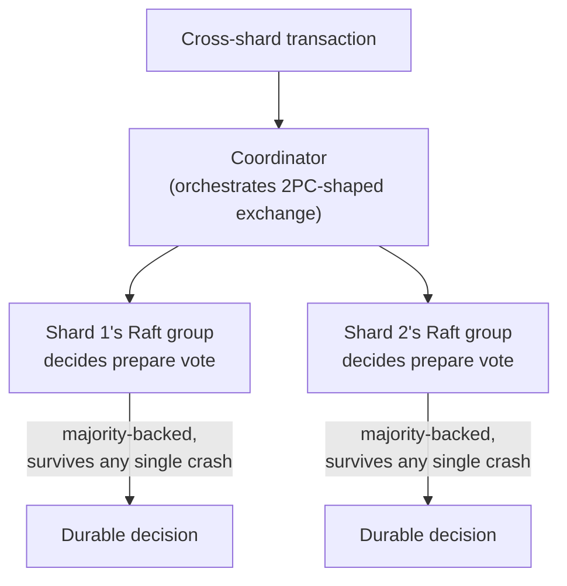

## Learning Objectives

- State Gray and Lamport's central insight precisely: 2PC's coordinator can be replaced by a small Paxos (or Raft) group deciding each participant's outcome, so no single coordinator's crash can ever block the transaction.
- Explain exactly why Paxos Commit does not need 3PC's bounded-delay assumption to avoid blocking, and connect this directly to what `the-flp-impossibility-result` and `paxos-the-original-consensus-protocol` already proved about consensus under asynchrony.
- Trace, at a real, concrete level, how production distributed SQL systems (Google Spanner, CockroachDB) apply this exact idea, a consensus group per shard deciding commit outcomes.
- Explain precisely what is preserved from `two-phase-commit-and-the-blocking-problem`'s original two-phase structure, and what is genuinely new.

## Context & Motivation

`three-phase-commit-and-why-it-still-fails-under-partitions` reached an honest dead end: 3PC solves 2PC's blocking problem only by assuming bounded message delay, an assumption this discipline has refused to grant real networks since `why-distributed-systems-are-hard-partial-failure-and-no-shared-state`. Gray and Lamport's 2006 paper does not try to patch that assumption further; it makes a genuinely different move, observing that this discipline (via `distributed-systems-i`) already built a mechanism proven to reach agreement correctly under full asynchrony whenever any majority of participants is reachable, Paxos, and asking, directly, why a transaction commit decision should ever depend on one single, unreplicated coordinator at all, when a small Paxos group can make that same decision with no single point of failure. This concept closes the discipline's Distributed Transactions topic by tracing that idea through to how production systems actually build on it today.

## Core Theory

### The real insight: replace the coordinator, not the phases

2PC's structure, a prepare phase collecting votes, then a commit phase broadcasting the decision, is not itself the problem; the problem, proven precisely in `two-phase-commit-and-the-blocking-problem`, is that a single coordinator process decides and communicates the outcome, and its crash during the uncertainty window leaves no other process able to safely determine what it decided. Paxos Commit keeps 2PC's two-phase shape (prepare, then commit) but replaces the single coordinator process with a small group of **acceptors** running Paxos (`paxos-the-original-consensus-protocol`) to agree on each participant's prepare vote. The commit decision for each participant is now a value Paxos has chosen, and once Paxos has chosen a value, `paxos-the-original-consensus-protocol`'s core safety property guarantees it can never be un-chosen or replaced, regardless of which specific acceptors are up at any later moment, only a majority of the acceptor group needs to be reachable, not one specific, unreplaceable coordinator process.

### Why no bounded-delay assumption is needed

`the-flp-impossibility-result` already proved no deterministic consensus protocol can guarantee termination in a purely asynchronous system, exactly why Paxos and Raft rely on timeouts and randomization for liveness in practice rather than a hard synchrony guarantee, but critically, FLP's result is about termination, not safety. Paxos never violates its Agreement property even when it cannot make progress; it simply waits (or a leader re-proposes) until a majority becomes reachable again. Applied to commit, this means Paxos Commit can never produce 3PC's contradiction (two participant groups reaching opposite decisions), because Paxos's majority-overlap safety argument, the same one `raft-safety-the-election-restriction-and-log-completeness` proved for Raft's log, guarantees at most one outcome is ever chosen for a given participant, permanently, regardless of how the network partitions afterward. What Paxos Commit trades for this is exactly what Paxos itself already honestly trades, it may pause (not err) during a partition that leaves no majority reachable, availability under an extreme partition, never correctness.

### From Paxos Commit to real distributed SQL

Modern distributed SQL systems apply exactly this idea at production scale, per shard (a partition of the keyspace, in the same sense `sharding-strategies-rebalancing-and-secondary-indexes`, `system-design-concepts`, already covers), rather than one Paxos group for the whole database. Google Spanner and CockroachDB each run a small Raft (a more understandable, equivalent-in-safety-guarantee descendant of Paxos, per `raft-leader-election`) group per shard, and a transaction spanning multiple shards uses a 2PC-shaped protocol where each shard's own Raft group, not a single fragile process, is asked to durably agree on that shard's prepare vote and commit decision. A coordinator (itself potentially also backed by consensus, or made stateless and simply retryable) orchestrates the overall two-phase exchange, but no single shard's outcome can ever be lost to a single process crash, since a Raft group's leader crashing is exactly what `raft-leader-election`'s election mechanism already handles without losing any committed entry.



## Worked Examples

### Example 1: the exact blocking scenario from two concepts ago, now resolved

```text
Recall two-phase-commit-and-the-blocking-problem's Example 2:
  Shard1 and Shard2 both vote YES, the (single) coordinator
  decides COMMIT internally, then crashes before telling
  either shard.

WITH Paxos Commit: the "coordinator's decision" IS a Paxos-
  chosen value, replicated across a small acceptor group (say
  3 acceptors, tolerating 1 crash). The original process that
  drove the Paxos round may crash, but the CHOSEN value (COMMIT)
  already exists, durably, on a majority of acceptors. ANY
  surviving process can query that acceptor group, per
  paxos-the-original-consensus-protocol's own majority-read
  guarantee, learn the already-chosen COMMIT decision, and
  relay it to Shard1 and Shard2: no indefinite blocking, no
  guessing, because the decision was never held hostage by one
  unreplaceable process to begin with.
```

### Example 2: the exact partition scenario from 3PC, now safe instead of contradictory

```text
Recall three-phase-commit-and-why-it-still-fails-under-
  partitions's Example 2: {P1,P2} and {P3,P4} each elect their
  own new coordinator during a partition and reach opposite
  decisions.

WITH Paxos Commit backing each participant's vote: for ANY
  single Paxos-chosen value (say, "P1's prepare vote is YES"),
  paxos-the-original-consensus-protocol's core safety property
  guarantees only ONE value can ever be chosen, permanently,
  regardless of which side of a later partition asks. Neither
  {P1,P2} nor {P3,P4} can produce a genuinely DIFFERENT, equally
  "chosen" answer for the same vote: one side may simply be
  UNABLE to learn the answer (no majority reachable), which is
  an availability cost, but it can never learn a WRONG or
  CONTRADICTORY one, exactly the property 3PC's fix lacked.
```

### Example 3: a concrete cross-shard transaction in a Spanner-like system

```text
Transaction: move a row from Shard A's key range to Shard B's
  key range (a common distributed-SQL operation).

1. Coordinator sends PREPARE to Shard A's Raft leader and
   Shard B's Raft leader.
2. Shard A's leader replicates its own prepare-vote decision
   (YES) through ITS Raft group (raft-log-replication-and-
   commitment) before replying: durable across any single
   node crash in that shard's group.
3. Shard B's leader does the same for its own prepare vote.
4. Coordinator collects both YES votes, decides COMMIT.
5. Even if Shard A's Raft LEADER crashes immediately after
   voting YES, raft-leader-election elects a new leader for
   Shard A's group that already has the YES vote durably in
   its replicated log: the coordinator's later COMMIT message
   reaches a live, correctly-informed leader regardless of
   which specific node within Shard A's group is currently
   leading it.
```

## Common Misconceptions & Pitfalls

- **"Paxos Commit replaces 2PC's two phases with Paxos's own phases instead."** It keeps 2PC's two-phase shape (prepare, then commit) entirely intact; what changes is WHO makes and remembers each phase's decision, a majority-backed Paxos group instead of one unreplicated coordinator process, as Example 1 makes concrete.
- **"Since Paxos solves consensus under asynchrony, Paxos Commit has no availability cost at all, unlike 2PC's blocking."** Example 2 states this precisely: Paxos Commit can still be unable to make progress if no majority of some shard's acceptor group is reachable, an availability cost, exactly like plain Paxos's own honest limits, but critically, unlike 3PC, it is never forced into producing a wrong, contradictory answer merely to keep moving.
- **"This is a novel invention for transactions, unrelated to the consensus material `distributed-systems-i` already covered."** Example 3 shows precisely the opposite, this is the exact same Raft leader-election and log-replication mechanism `raft-leader-election` and `raft-log-replication-and-commitment` already proved correct, applied to deciding transaction outcomes instead of application state machine commands, the same mechanism, a different use.

## Summary

Gray and Lamport's 2006 insight replaces 2PC's single, unreplicated coordinator with a small Paxos (or Raft) group deciding each participant's prepare vote and commit outcome, keeping 2PC's original two-phase shape intact while removing exactly the single point of failure `two-phase-commit-and-the-blocking-problem` proved could block a transaction indefinitely, with no need for 3PC's fragile bounded-delay assumption, since Paxos's safety guarantee, proven correct under full asynchrony back in `distributed-systems-i`, already ensures no two conflicting outcomes can ever be chosen for the same decision. Production distributed SQL systems, Google Spanner and CockroachDB among them, apply exactly this idea at scale, a Raft group per shard deciding that shard's commit outcomes, closing the loop between this discipline's own consensus material and the transactions topic it opened. This closes the Distributed Transactions topic; the discipline now turns to formalizing the weaker consistency model this entire Distributed Databases topic was built around.

## Documentation Links

- [Gray and Lamport: Consensus on Transaction Commit (ACM Transactions on Database Systems, 2006)](https://www.microsoft.com/en-us/research/publication/consensus-on-transaction-commit/): the source paper for Paxos Commit itself, replacing 2PC's coordinator with a Paxos-backed acceptor group, and its explicit comparison against 2PC's blocking problem and 3PC's synchrony-dependent fix.
- [Ongaro and Ousterhout: In Search of an Understandable Consensus Algorithm (Raft, USENIX ATC 2014)](https://raft.github.io/raft.pdf): cited again here for the concrete, production-relevant descendant of Paxos (Raft) this concept's real-world Spanner/CockroachDB tracing relies on, the same source `distributed-systems-i` used to build the leader-election and log-replication mechanism reused here.
