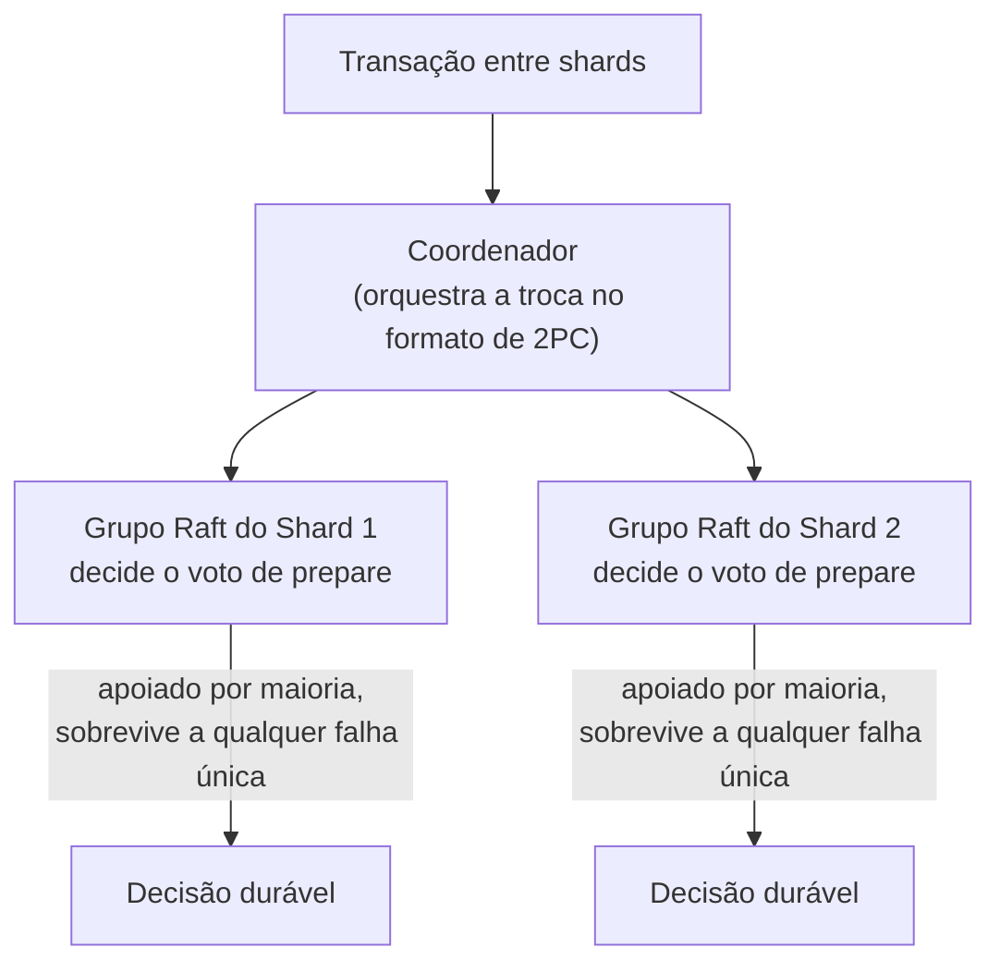

## Objetivos de Aprendizagem

- Enunciar a percepção central de Gray e Lamport com precisão: o coordenador do 2PC pode ser substituído por um pequeno grupo Paxos (ou Raft) decidindo o desfecho de cada participante, de modo que a falha de nenhum coordenador único possa jamais bloquear a transação.
- Explicar exatamente por que o Paxos Commit não precisa da suposição de atraso limitado do 3PC para evitar bloqueio, e conectar isso diretamente ao que `the-flp-impossibility-result` e `paxos-the-original-consensus-protocol` já provaram sobre consenso sob assincronia.
- Rastrear, num nível real e concreto, como os sistemas de SQL distribuído de produção (Google Spanner, CockroachDB) aplicam essa exata ideia, um grupo de consenso por shard decidindo os desfechos de commit.
- Explicar com precisão o que é preservado da estrutura de duas fases original de `two-phase-commit-and-the-blocking-problem`, e o que é genuinamente novo.

## Contexto e Motivação

`three-phase-commit-and-why-it-still-fails-under-partitions` alcançou um beco sem saída honesto: o 3PC resolve o problema de bloqueio do 2PC só assumindo um atraso de mensagem limitado, uma suposição que esta disciplina se recusou a conceder a redes reais desde `why-distributed-systems-are-hard-partial-failure-and-no-shared-state`. O artigo de Gray e Lamport de 2006 não tenta remendar essa suposição ainda mais; ele faz um movimento genuinamente diferente, observando que esta disciplina (via `distributed-systems-i`) já construiu um mecanismo provado alcançar acordo corretamente sob assincronia completa sempre que qualquer maioria de participantes é alcançável, Paxos, e perguntando, diretamente, por que uma decisão de commit de transação deveria jamais depender de um único coordenador não replicado de forma alguma, quando um pequeno grupo Paxos pode tomar essa mesma decisão sem nenhum ponto único de falha. Este conceito fecha o tópico de Transações Distribuídas da disciplina rastreando essa ideia até como os sistemas de produção de fato se constroem sobre ela hoje.

## Teoria Central

### A percepção real: substituir o coordenador, não as fases

A estrutura do 2PC, uma fase de prepare coletando votos, depois uma fase de commit transmitindo a decisão, não é ela mesma o problema; o problema, provado com precisão em `two-phase-commit-and-the-blocking-problem`, é que um único processo coordenador decide e comunica o desfecho, e a sua falha durante a janela de incerteza deixa nenhum outro processo capaz de determinar com segurança o que ele decidiu. O Paxos Commit mantém o formato de duas fases do 2PC (prepare, depois commit), mas substitui o único processo coordenador por um pequeno grupo de **aceitadores** rodando Paxos (`paxos-the-original-consensus-protocol`) para concordar sobre o voto de prepare de cada participante. A decisão de commit para cada participante é agora um valor que o Paxos escolheu, e uma vez que o Paxos escolheu um valor, a propriedade de segurança central de `paxos-the-original-consensus-protocol` garante que ele nunca pode ser desescolhido ou substituído, independentemente de quais aceitadores específicos estão de pé em qualquer momento posterior, só uma maioria do grupo de aceitadores precisa ser alcançável, não um processo coordenador específico e insubstituível.

### Por que nenhuma suposição de atraso limitado é necessária

`the-flp-impossibility-result` já provou que nenhum protocolo de consenso determinístico pode garantir terminação num sistema puramente assíncrono, exatamente por que Paxos e Raft dependem de timeouts e aleatorização para a vivacidade na prática em vez de uma garantia dura de sincronia, mas, criticamente, o resultado do FLP é sobre terminação, não segurança. O Paxos nunca viola a sua propriedade de Acordo mesmo quando não consegue progredir; ele simplesmente espera (ou um líder re-propõe) até uma maioria se tornar alcançável de novo. Aplicado ao commit, isso significa que o Paxos Commit nunca pode produzir a contradição do 3PC (dois grupos de participantes alcançando decisões opostas), porque o argumento de segurança de sobreposição de maiorias do Paxos, o mesmo que `raft-safety-the-election-restriction-and-log-completeness` provou para o log do Raft, garante que no máximo um desfecho é jamais escolhido para um dado participante, permanentemente, independentemente de como a rede se particione depois. O que o Paxos Commit troca por isso é exatamente o que o próprio Paxos já troca honestamente, ele pode pausar (não errar) durante uma partição que deixa nenhuma maioria alcançável, disponibilidade sob uma partição extrema, nunca correção.

### Do Paxos Commit ao SQL distribuído real

Os sistemas de SQL distribuído modernos aplicam exatamente essa ideia em escala de produção, por shard (uma partição do espaço de chaves, no mesmo sentido que `sharding-strategies-rebalancing-and-secondary-indexes`, `system-design-concepts`, já cobre), em vez de um grupo Paxos para o banco de dados inteiro. O Google Spanner e o CockroachDB cada um roda um pequeno grupo Raft (um descendente de Paxos mais compreensível e equivalente-em-garantia-de-segurança, por `raft-leader-election`) por shard, e uma transação que abrange múltiplos shards usa um protocolo no formato de 2PC onde o próprio grupo Raft de cada shard, não um único processo frágil, é pedido a concordar de forma durável sobre o voto de prepare e a decisão de commit daquele shard. Um coordenador (ele mesmo potencialmente também apoiado por consenso, ou tornado sem estado e simplesmente reexecutável) orquestra a troca geral de duas fases, mas o desfecho de nenhum shard único pode jamais ser perdido para uma única falha de processo, já que a falha do líder de um grupo Raft é exatamente o que o mecanismo de eleição de `raft-leader-election` já trata sem perder nenhuma entrada com commit.



## Exemplos Resolvidos

### Exemplo 1: o exato cenário de bloqueio de dois conceitos atrás, agora resolvido

```text
Lembre do Exemplo 2 de two-phase-commit-and-the-blocking-problem:
  Shard1 e Shard2 ambos votam SIM, o (único) coordenador
  decide COMMIT internamente, depois falha antes de contar a
  qualquer shard.

COM Paxos Commit: a "decisão do coordenador" É um valor
  escolhido por Paxos, replicado por um pequeno grupo de aceitadores (digamos
  3 aceitadores, tolerando 1 falha). O processo original que
  conduziu a rodada Paxos pode falhar, mas o valor ESCOLHIDO (COMMIT)
  já existe, de forma durável, numa maioria de aceitadores. QUALQUER
  processo sobrevivente pode consultar esse grupo de aceitadores, pela
  própria garantia de leitura-por-maioria de
  paxos-the-original-consensus-protocol, aprender a decisão de COMMIT já
  escolhida, e retransmiti-la para Shard1 e Shard2: nenhum bloqueio indefinido, nenhum
  chute, porque a decisão nunca foi refém de um único
  processo insubstituível em primeiro lugar.
```

### Exemplo 2: o exato cenário de partição do 3PC, agora seguro em vez de contraditório

```text
Lembre do Exemplo 2 de three-phase-commit-and-why-it-still-fails-under-
  partitions: {P1,P2} e {P3,P4} cada um elege o seu
  próprio novo coordenador durante uma partição e alcança decisões opostas.

COM Paxos Commit apoiando o voto de cada participante: para QUALQUER
  único valor escolhido por Paxos (digamos, "o voto de prepare de P1 é SIM"),
  a propriedade de segurança central de paxos-the-original-consensus-protocol
  garante que só UM valor pode jamais ser escolhido, permanentemente,
  independentemente de qual lado de uma partição posterior pergunta. Nem
  {P1,P2} nem {P3,P4} pode produzir uma resposta genuinamente DIFERENTE e igualmente
  "escolhida" para o mesmo voto: um lado pode simplesmente ser
  INCAPAZ de aprender a resposta (nenhuma maioria alcançável), o que é
  um custo de disponibilidade, mas ele nunca pode aprender uma ERRADA ou
  CONTRADITÓRIA, exatamente a propriedade que o conserto do 3PC não tinha.
```

### Exemplo 3: uma transação concreta entre shards num sistema no estilo Spanner

```text
Transação: mover uma linha da faixa de chaves do Shard A para a faixa de
  chaves do Shard B (uma operação comum de SQL distribuído).

1. O coordenador envia PREPARE ao líder Raft do Shard A e ao
   líder Raft do Shard B.
2. O líder do Shard A replica a sua própria decisão de voto de prepare
   (SIM) pelo SEU grupo Raft (raft-log-replication-and-
   commitment) antes de responder: durável por qualquer falha de
   nó único naquele grupo de shard.
3. O líder do Shard B faz o mesmo para o seu próprio voto de prepare.
4. O coordenador coleta ambos os votos SIM, decide COMMIT.
5. Mesmo que o LÍDER Raft do Shard A falhe imediatamente após
   votar SIM, raft-leader-election elege um novo líder para
   o grupo do Shard A que já tem o voto SIM de forma durável no
   seu log replicado: a mensagem de COMMIT posterior do coordenador
   alcança um líder vivo e corretamente informado independentemente de
   qual nó específico dentro do grupo do Shard A está atualmente
   liderando-o.
```

## Equívocos Comuns e Armadilhas

- **"O Paxos Commit substitui as duas fases do 2PC pelas próprias fases do Paxos em vez disso."** Ele mantém o formato de duas fases do 2PC (prepare, depois commit) inteiramente intacto; o que muda é QUEM toma e lembra a decisão de cada fase, um grupo Paxos apoiado por maioria em vez de um processo coordenador não replicado, como o Exemplo 1 torna concreto.
- **"Como o Paxos resolve o consenso sob assincronia, o Paxos Commit não tem custo de disponibilidade de forma alguma, diferentemente do bloqueio do 2PC."** O Exemplo 2 enuncia isso com precisão: o Paxos Commit ainda pode ser incapaz de progredir se nenhuma maioria do grupo de aceitadores de algum shard for alcançável, um custo de disponibilidade, exatamente como os próprios limites honestos do Paxos simples, mas, criticamente, diferentemente do 3PC, ele nunca é forçado a produzir uma resposta errada e contraditória só para continuar se movendo.
- **"Esta é uma invenção nova para transações, sem relação com o material de consenso que `distributed-systems-i` já cobriu."** O Exemplo 3 mostra precisamente o oposto, este é o exato mesmo mecanismo de eleição de líder e replicação de log do Raft que `raft-leader-election` e `raft-log-replication-and-commitment` já provaram correto, aplicado a decidir desfechos de transação em vez de comandos de máquina de estado da aplicação, o mesmo mecanismo, um uso diferente.

## Resumo

A percepção de Gray e Lamport de 2006 substitui o coordenador único e não replicado do 2PC por um pequeno grupo Paxos (ou Raft) decidindo o voto de prepare e o desfecho de commit de cada participante, mantendo o formato de duas fases original do 2PC intacto enquanto remove exatamente o ponto único de falha que `two-phase-commit-and-the-blocking-problem` provou poder bloquear uma transação indefinidamente, sem necessidade da frágil suposição de atraso limitado do 3PC, já que a garantia de segurança do Paxos, provada correta sob assincronia completa lá em `distributed-systems-i`, já garante que nenhuns dois desfechos conflitantes possam jamais ser escolhidos para a mesma decisão. Os sistemas de SQL distribuído de produção, o Google Spanner e o CockroachDB entre eles, aplicam exatamente essa ideia em escala, um grupo Raft por shard decidindo os desfechos de commit daquele shard, fechando o laço entre o próprio material de consenso desta disciplina e o tópico de transações que ela abriu. Isso fecha o tópico de Transações Distribuídas; a disciplina agora se volta a formalizar o modelo de consistência mais fraco em torno do qual este tópico inteiro de Bancos de Dados Distribuídos foi construído.

## Documentation Links

- [Gray and Lamport: Consensus on Transaction Commit (ACM Transactions on Database Systems, 2006)](https://www.microsoft.com/en-us/research/publication/consensus-on-transaction-commit/): o artigo-fonte do próprio Paxos Commit, substituindo o coordenador do 2PC por um grupo de aceitadores apoiado por Paxos, e a sua comparação explícita contra o problema de bloqueio do 2PC e o conserto dependente de sincronia do 3PC.
- [Ongaro and Ousterhout: In Search of an Understandable Consensus Algorithm (Raft, USENIX ATC 2014)](https://raft.github.io/raft.pdf): citado de novo aqui para o descendente concreto e relevante para produção de Paxos (Raft) do qual o rastreamento de mundo real de Spanner/CockroachDB deste conceito depende, a mesma fonte que `distributed-systems-i` usou para construir o mecanismo de eleição de líder e replicação de log reusado aqui.
