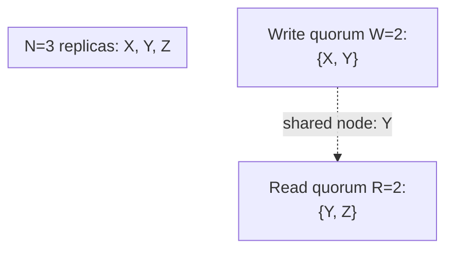

## Learning Objectives

- Describe Dynamo's replication model precisely: a key's N replicas are its preference list, typically the next N distinct nodes clockwise on a consistent-hashing ring; a write succeeds once W replicas acknowledge it; a read queries R replicas and reconciles their responses.
- Prove, from the pigeonhole principle, that R + W > N guarantees every read quorum and every write quorum share at least one common node.
- Explain precisely what that shared-node guarantee does and does not give a reader, it guarantees a chance to see the latest write, not that the coordinator returns only the latest value without help from vector-clock comparison.
- Contrast this replication model directly with `primary-backup-vs-quorum-based-replication`'s replicated-state-machine quorum, naming exactly what changed (no leader, no ordered log) and what stayed the same (majority/quorum overlap as the safety argument).

## Context & Motivation

`primary-backup-vs-quorum-based-replication` (`distributed-systems-i`) introduced quorum-based replication at the replicated-state-machine level: a majority of replicas agreeing on one ordered log, the exact mechanism Paxos and Raft implement. That concept closed by noting quorum-based replication "tolerat[es] individual node failures without a single designated leader stalling everything, at the real cost of needing an actual majority-agreement protocol." Dynamo's leaderless model takes that same overlap idea in a different direction entirely: no ordered log, no leader coordinating a total order at all, only per-key read and write quorums with a tunable size, and `pacelc-the-latency-consistency-trade-off-beyond-cap` already named exactly why a real system reaches for this trade, everyday latency, not the linearizability a Raft-backed log provides. This concept builds the actual replication model and proves, rigorously, the one structural property (R + W > N) every one of Dynamo's real deployments depends on.

## Core Theory

### The preference list: which N nodes hold a key

Each key maps to a position on a consistent-hashing ring (`consistent-hashing`, `system-design-concepts`), and its **preference list** is the next N distinct physical nodes found walking clockwise from that position. This reuses the exact structural idea `primary-backup-vs-quorum-based-replication` already flagged, "when that replica set is chosen dynamically at scale, it is typically the same N nodes a consistent-hashing ring already assigns to a given key", now made the actual mechanism a leaderless store uses to decide which nodes hold which keys.

### Writes: W acknowledgments, no leader coordinating order

A client's write is handled by a coordinator (any node holding the key, or a client-side library), which sends the write to all N nodes on the preference list and waits for W of them to acknowledge before returning success to the client. Critically, there is no leader deciding a global order for this key's writes the way a Raft leader orders every entry in its log, each write is tagged with the writer's current vector clock (`vector-clocks-and-detecting-concurrent-writes`) so that two writes accepted by different nodes with no coordination between them can later be recognized, correctly, as either one superseding the other or as genuinely concurrent.

### Reads: R replicas, reconciled by the client (or coordinator)

A read queries R nodes on the preference list and collects their responses, each carrying its own vector clock. If all R responses carry the same value (or one dominates the others per `vector-clocks-and-detecting-concurrent-writes`'s comparison rule), the read returns that value. If the responses are genuinely concurrent (`operation-based-crdts-and-practical-data-types`, later, covers exactly how a well-chosen data type resolves this automatically), the read may return multiple versions for the application, or the data type's own merge, to reconcile.

### The proof: R + W > N guarantees quorum overlap

**Claim:** if a key has N replicas, and a write requires W acknowledgments while a read queries R replicas, then R + W > N guarantees the read quorum and the write quorum share at least one common node.

**Proof, by the pigeonhole principle:** the write quorum occupies W of the N total replica slots; the read quorum occupies R of the same N total replica slots. If the two quorums shared zero nodes, together they would occupy W + R distinct slots out of only N available slots. But R + W > N means W + R exceeds the total number of slots there are, an immediate contradiction, W + R distinct slots cannot fit inside only N slots. Therefore the two quorums cannot be disjoint; they must share at least one node.



### What the shared node does, and does not, guarantee

The shared node is guaranteed to have received the write (it was part of the write quorum) and to be queried by the read (it is part of the read quorum), so the read is guaranteed to have a **chance** to observe the latest write. It does not by itself guarantee the read **returns** only the latest value without further work, the read still collects R responses that may disagree (a slower node not yet caught up by anti-entropy, `anti-entropy-read-repair-and-merkle-tree-synchronization`, next but one), and it is exactly `vector-clocks-and-detecting-concurrent-writes`'s comparison rule that lets the reader (or coordinator) determine which of the R returned values actually dominates the others.

## Worked Examples

### Example 1: Dynamo's own canonical configuration, N=3, R=2, W=2

```text
Key "cart-42" has preference list [Node A, Node B, Node C] (N=3).

WRITE "add item X": coordinator sends to A, B, C. Waits for
  W=2 acks (say A and B respond first) -> write succeeds,
  returns to client. C may still be catching up.

READ "get cart-42": coordinator queries R=2 nodes (say B and C).
  R + W = 2 + 2 = 4 > N = 3 -> quorum overlap guaranteed.
  B (in the write quorum) is queried, so B's response reflects
  the latest write. C's response may be stale (it wasn't in
  the write's W=2). The reader compares B and C's vector
  clocks (vector-clocks-and-detecting-concurrent-writes) and
  correctly identifies B's value as dominating C's stale one.
```

### Example 2: proving the overlap fails when R + W <= N

```text
Same N=3 preference list [A, B, C]. Suppose instead R=1, W=1
  (R + W = 2, NOT > N=3).

WRITE: coordinator only needs W=1 ack -> say only A acknowledges
  (the write reaches A only, in the worst case).
READ: coordinator only needs R=1 response -> say it happens to
  query C.

A (write quorum {A}) and C (read quorum {C}) share ZERO nodes:
  exactly the case the pigeonhole proof rules OUT when R+W>N,
  and exactly what CAN happen when R+W<=N: W+R=2 distinct slots
  fit easily inside N=3 slots with no forced overlap. The read
  returns C's stale value with no way to know a newer write (at
  A) exists: a real, structural staleness the R+W>N inequality
  is specifically designed to prevent.
```

### Example 3: R=N, W=1 (fast writes, guaranteed-fresh reads)

```text
N=3, R=3 (query all replicas), W=1 (fastest possible write).
R + W = 3 + 1 = 4 > N = 3 -> overlap guaranteed.

WRITE: succeeds the instant just 1 of 3 replicas acks: very
  low write latency (exactly the PACELC "L" choice, no waiting
  for a majority).
READ: queries ALL 3 replicas every time: guaranteed to include
  whichever single replica had the latest write, at the cost of
  higher read latency (querying every replica, every time) and
  lower read AVAILABILITY (a read now needs all 3 replicas
  reachable, not just a majority): a genuine, different point
  on the same R/W tuning spectrum, chosen per workload.
```

## Common Misconceptions & Pitfalls

- **"R + W > N gives the same guarantee as Raft's majority commit."** It is the same overlap-by-pigeonhole argument in spirit, but the guarantee is weaker: Raft's majority quorum guarantees a single, globally agreed, ordered log (`raft-log-replication-and-commitment`); Dynamo's R+W>N only guarantees a read TOUCHES a node that saw the latest write, the reader still must reconcile potentially divergent responses via vector clocks, there is no single ordered log to fall back on at all.
- **"As long as R+W>N, a read can never return a stale value."** Example 1 shows the read can still receive a stale response (from the non-overlapping replica) alongside the fresh one; the guarantee is that at least one of the R responses is fresh, not that every response is, which is precisely why the comparison step still matters.
- **"Choosing R and W is just a fixed trade-off with one right answer."** Example 3 shows R and W can be tuned independently per workload, R=N,W=1 favors fast writes and slower, safer reads; the reverse favors fast reads and slower, safer writes; both configurations still honestly satisfy R+W>N.

## Summary

Dynamo's leaderless replication assigns each key to N replicas via its preference list on a consistent-hashing ring, and lets a write succeed once W replicas acknowledge while a read queries R replicas, no leader, no ordered log. The pigeonhole principle proves that whenever R + W > N, the read quorum and write quorum must share at least one node, guaranteeing every read has a chance to observe the latest write, though the reader still must use vector-clock comparison to determine which of its R responses actually is the latest. This is the exact structural property real deployments (N=3, R=2, W=2 being Dynamo's own running example) depend on, and the next two concepts show, honestly, what happens to that guarantee when Dynamo deliberately weakens it for availability during a partition (sloppy quorums) and how divergent replicas are brought back into agreement afterward (anti-entropy).

## Documentation Links

- [DeCandia et al.: Dynamo: Amazon's Highly Available Key-value Store (SOSP, 2007)](https://www.allthingsdistributed.com/files/amazon-dynamo-sosp2007.pdf): the source paper for the preference list, the N/R/W parameterization, and the R+W>N quorum-intersection design this concept proves from first principles.
- [Martin Kleppmann: Designing Data-Intensive Applications, 2nd Edition (O'Reilly), Chapter 6, "Leaderless Replication"](https://www.oreilly.com/library/view/designing-data-intensive-applications/9781098119058/): a second, pedagogically-focused source for the same quorum-read/write model and its R+W>N property, cross-checked against the primary Dynamo paper for consistency of the argument this concept presents.
