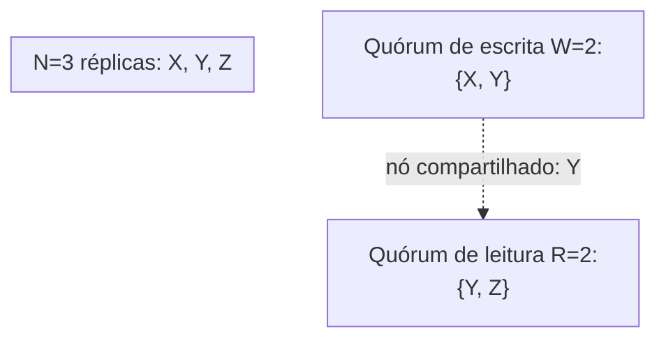

## Objetivos de Aprendizagem

- Descrever o modelo de replicação do Dynamo com precisão: as N réplicas de uma chave são a sua lista de preferência, tipicamente os próximos N nós distintos no sentido horário num anel de hashing consistente; uma escrita tem sucesso uma vez que W réplicas a reconhecem; uma leitura consulta R réplicas e reconcilia as suas respostas.
- Provar, pelo princípio da casa dos pombos, que R + W > N garante que todo quórum de leitura e todo quórum de escrita compartilham pelo menos um nó comum.
- Explicar com precisão o que essa garantia de nó compartilhado dá e não dá a um leitor, ela garante uma chance de ver a última escrita, não que o coordenador retorne só o último valor sem ajuda da comparação de relógio vetorial.
- Contrastar este modelo de replicação diretamente com o quórum de máquina de estado replicada de `primary-backup-vs-quorum-based-replication`, nomeando exatamente o que mudou (sem líder, sem log ordenado) e o que permaneceu igual (a sobreposição de maiorias/quóruns como argumento de segurança).

## Contexto e Motivação

`primary-backup-vs-quorum-based-replication` (`distributed-systems-i`) introduziu a replicação baseada em quórum no nível de máquina de estado replicada: uma maioria de réplicas concordando sobre um log ordenado, o exato mecanismo que Paxos e Raft implementam. Aquele conceito se encerrou notando que a replicação baseada em quórum "tolera falhas de nós individuais sem um único líder designado travando tudo, ao custo real de precisar de um protocolo real de acordo por maioria". O modelo sem líder do Dynamo pega essa mesma ideia de sobreposição numa direção inteiramente diferente: sem log ordenado, sem líder coordenando uma ordem total de forma alguma, só quóruns de leitura e escrita por chave com um tamanho ajustável, e `pacelc-the-latency-consistency-trade-off-beyond-cap` já nomeou exatamente por que um sistema real recorre a essa troca, a latência cotidiana, não a linearizabilidade que um log apoiado por Raft fornece. Este conceito constrói o modelo de replicação de fato e prova, rigorosamente, a única propriedade estrutural (R + W > N) da qual cada uma das implantações reais do Dynamo depende.

## Teoria Central

### A lista de preferência: quais N nós seguram uma chave

Cada chave mapeia para uma posição num anel de hashing consistente (`consistent-hashing`, `system-design-concepts`), e a sua **lista de preferência** são os próximos N nós físicos distintos encontrados caminhando no sentido horário a partir daquela posição. Isso reaproveita a exata ideia estrutural que `primary-backup-vs-quorum-based-replication` já sinalizou, "quando esse conjunto de réplicas é escolhido dinamicamente em escala, ele é tipicamente os mesmos N nós que um anel de hashing consistente já atribui a uma dada chave", agora tornada o mecanismo de fato que uma store sem líder usa para decidir quais nós seguram quais chaves.

### Escritas: W reconhecimentos, nenhum líder coordenando a ordem

A escrita de um cliente é tratada por um coordenador (qualquer nó que segura a chave, ou uma biblioteca do lado do cliente), que envia a escrita a todos os N nós da lista de preferência e espera que W deles a reconheçam antes de retornar sucesso ao cliente. Criticamente, não há líder decidindo uma ordem global para as escritas desta chave do jeito que um líder Raft ordena toda entrada no seu log, cada escrita é marcada com o relógio vetorial atual do escritor (`vector-clocks-and-detecting-concurrent-writes`) para que duas escritas aceitas por nós diferentes sem coordenação entre eles possam depois ser reconhecidas, corretamente, ou como uma suplantando a outra ou como genuinamente concorrentes.

### Leituras: R réplicas, reconciliadas pelo cliente (ou coordenador)

Uma leitura consulta R nós da lista de preferência e coleta as suas respostas, cada uma carregando o seu próprio relógio vetorial. Se todas as R respostas carregam o mesmo valor (ou uma domina as outras pela regra de comparação de `vector-clocks-and-detecting-concurrent-writes`), a leitura retorna aquele valor. Se as respostas são genuinamente concorrentes (`operation-based-crdts-and-practical-data-types`, mais tarde, cobre exatamente como um tipo de dados bem escolhido resolve isso automaticamente), a leitura pode retornar múltiplas versões para a aplicação, ou a própria mesclagem do tipo de dados, reconciliar.

### A prova: R + W > N garante a sobreposição de quóruns

**Afirmação:** se uma chave tem N réplicas, e uma escrita exige W reconhecimentos enquanto uma leitura consulta R réplicas, então R + W > N garante que o quórum de leitura e o quórum de escrita compartilham pelo menos um nó comum.

**Prova, pelo princípio da casa dos pombos:** o quórum de escrita ocupa W dos N slots de réplica totais; o quórum de leitura ocupa R dos mesmos N slots de réplica totais. Se os dois quóruns compartilhassem zero nós, juntos eles ocupariam W + R slots distintos de só N slots disponíveis. Mas R + W > N significa que W + R excede o número total de slots que há, uma contradição imediata, W + R slots distintos não cabem dentro de só N slots. Portanto os dois quóruns não podem ser disjuntos; eles têm de compartilhar pelo menos um nó.



### O que o nó compartilhado garante, e não garante

O nó compartilhado tem garantia de ter recebido a escrita (ele foi parte do quórum de escrita) e de ser consultado pela leitura (ele é parte do quórum de leitura), então a leitura tem garantia de ter uma **chance** de observar a última escrita. Ela não garante por si só que a leitura **retorne** só o último valor sem trabalho adicional, a leitura ainda coleta R respostas que podem discordar (um nó mais lento ainda não alcançado pela anti-entropia, `anti-entropy-read-repair-and-merkle-tree-synchronization`, o próximo depois do seguinte), e é exatamente a regra de comparação de `vector-clocks-and-detecting-concurrent-writes` que deixa o leitor (ou coordenador) determinar qual dos R valores retornados de fato domina os outros.

## Exemplos Resolvidos

### Exemplo 1: a própria configuração canônica do Dynamo, N=3, R=2, W=2

```text
A chave "cart-42" tem lista de preferência [Nó A, Nó B, Nó C] (N=3).

ESCRITA "adicionar item X": o coordenador envia para A, B, C. Espera por
  W=2 acks (digamos que A e B respondem primeiro) -> a escrita tem sucesso,
  retorna ao cliente. C ainda pode estar se atualizando.

LEITURA "pegar cart-42": o coordenador consulta R=2 nós (digamos B e C).
  R + W = 2 + 2 = 4 > N = 3 -> sobreposição de quóruns garantida.
  B (no quórum de escrita) é consultado, então a resposta de B reflete
  a última escrita. A resposta de C pode estar obsoleta (ele não estava
  no W=2 da escrita). O leitor compara os relógios vetoriais de B e C
  (vector-clocks-and-detecting-concurrent-writes) e
  corretamente identifica o valor de B como dominando o obsoleto de C.
```

### Exemplo 2: provar que a sobreposição falha quando R + W <= N

```text
Mesma lista de preferência N=3 [A, B, C]. Suponha em vez disso R=1, W=1
  (R + W = 2, NÃO > N=3).

ESCRITA: o coordenador só precisa de W=1 ack -> digamos que só A reconhece
  (a escrita alcança só A, no pior caso).
LEITURA: o coordenador só precisa de R=1 resposta -> digamos que por acaso
  consulta C.

A (quórum de escrita {A}) e C (quórum de leitura {C}) compartilham ZERO nós:
  exatamente o caso que a prova da casa dos pombos DESCARTA quando R+W>N,
  e exatamente o que PODE acontecer quando R+W<=N: W+R=2 slots distintos
  cabem facilmente dentro de N=3 slots sem sobreposição forçada. A leitura
  retorna o valor obsoleto de C sem forma de saber que uma escrita mais nova (em
  A) existe: uma obsolescência real e estrutural que a desigualdade R+W>N
  é especificamente projetada para prevenir.
```

### Exemplo 3: R=N, W=1 (escritas rápidas, leituras com frescor garantido)

```text
N=3, R=3 (consultar todas as réplicas), W=1 (a escrita mais rápida possível).
R + W = 3 + 1 = 4 > N = 3 -> sobreposição garantida.

ESCRITA: tem sucesso no instante em que só 1 de 3 réplicas reconhece: latência de
  escrita muito baixa (exatamente a escolha "L" do PACELC, nenhuma espera
  por uma maioria).
LEITURA: consulta TODAS as 3 réplicas toda vez: com garantia de incluir
  qualquer réplica única que teve a última escrita, ao custo de
  latência de leitura mais alta (consultar toda réplica, toda vez) e
  DISPONIBILIDADE de leitura mais baixa (uma leitura agora precisa de todas as 3 réplicas
  alcançáveis, não só uma maioria): um ponto genuíno e diferente
  no mesmo espectro de ajuste de R/W, escolhido por carga de trabalho.
```

## Equívocos Comuns e Armadilhas

- **"R + W > N dá a mesma garantia que o commit por maioria do Raft."** É o mesmo argumento de sobreposição-por-casa-dos-pombos em espírito, mas a garantia é mais fraca: o quórum majoritário do Raft garante um único log ordenado, globalmente acordado (`raft-log-replication-and-commitment`); o R+W>N do Dynamo só garante que uma leitura TOCA um nó que viu a última escrita, o leitor ainda tem de reconciliar respostas potencialmente divergentes por relógios vetoriais, não há nenhum único log ordenado para recorrer de forma alguma.
- **"Desde que R+W>N, uma leitura nunca pode retornar um valor obsoleto."** O Exemplo 1 mostra que a leitura ainda pode receber uma resposta obsoleta (da réplica que não se sobrepõe) ao lado da fresca; a garantia é que pelo menos uma das R respostas é fresca, não que toda resposta seja, que é precisamente por que o passo de comparação ainda importa.
- **"Escolher R e W é só um trade-off fixo com uma resposta certa."** O Exemplo 3 mostra que R e W podem ser ajustados independentemente por carga de trabalho, R=N,W=1 favorece escritas rápidas e leituras mais lentas e seguras; o inverso favorece leituras rápidas e escritas mais lentas e seguras; ambas as configurações ainda satisfazem honestamente R+W>N.

## Resumo

A replicação sem líder do Dynamo atribui cada chave a N réplicas por meio da sua lista de preferência num anel de hashing consistente, e deixa uma escrita ter sucesso uma vez que W réplicas a reconhecem enquanto uma leitura consulta R réplicas, sem líder, sem log ordenado. O princípio da casa dos pombos prova que sempre que R + W > N, o quórum de leitura e o quórum de escrita têm de compartilhar pelo menos um nó, garantindo que toda leitura tem uma chance de observar a última escrita, embora o leitor ainda tenha de usar a comparação de relógio vetorial para determinar qual das suas R respostas de fato é a última. Essa é a exata propriedade estrutural da qual as implantações reais (N=3, R=2, W=2 sendo o próprio exemplo condutor do Dynamo) dependem, e os próximos dois conceitos mostram, honestamente, o que acontece com essa garantia quando o Dynamo deliberadamente a enfraquece por disponibilidade durante uma partição (quóruns relaxados) e como réplicas divergentes são trazidas de volta ao acordo depois (anti-entropia).

## Documentation Links

- [DeCandia et al.: Dynamo: Amazon's Highly Available Key-value Store (SOSP, 2007)](https://www.allthingsdistributed.com/files/amazon-dynamo-sosp2007.pdf): o artigo-fonte da lista de preferência, da parametrização N/R/W e do design de interseção de quóruns R+W>N que este conceito prova a partir de princípios básicos.
- [Martin Kleppmann: Designing Data-Intensive Applications, 2nd Edition (O'Reilly), Chapter 6, "Leaderless Replication"](https://www.oreilly.com/library/view/designing-data-intensive-applications/9781098119058/): uma segunda fonte, focada na pedagogia, para o mesmo modelo de leitura/escrita por quórum e a sua propriedade R+W>N, cruzada com o artigo primário do Dynamo para consistência do argumento que este conceito apresenta.
