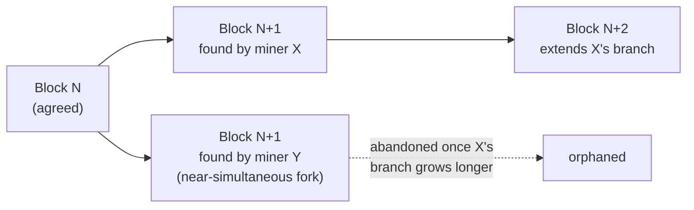

## Learning Objectives

- State the one assumption PBFT depends on that Nakamoto consensus deliberately refuses to make, a fixed, known set of n = 3f + 1 participants who can be counted for a quorum, and explain why that refusal forces a completely different mechanism for agreement.
- Explain proof-of-work as a leader-election mechanism (a lottery weighted by computational effort) rather than as "mining coins," and connect it back to the leader-election problem `raft-leader-election` already solved under a very different trust model.
- Explain why Nakamoto consensus's safety is only probabilistic (a block becomes more final the more blocks are chained on top of it) rather than the deterministic, quorum-certified finality PBFT and Raft both provide the instant their message quorums complete.
- State honestly, in one paragraph, why this discipline treats Nakamoto consensus as one comparison point for a different trust model rather than as a subject to build out in the depth PBFT received.

## Context & Motivation

`practical-byzantine-fault-tolerance-pbft` solved Byzantine agreement for a specific, and specifically convenient, setting: a fixed cluster of n = 3f + 1 known replicas, where "2f+1 out of n" is a number every replica can actually compute because every replica knows n. Nakamoto's 2008 design starts from a setting where that convenience is not available at all, anyone with an internet connection can join or leave anonymously, with no membership list, no way to even count n, let alone elect a primary by rotation among a known set. This concept exists to name that difference precisely, not to teach blockchain mechanics for their own sake, matching the scope decision this discipline commits to explicitly: a rigorous distributed-systems course that treats Nakamoto consensus as a genuinely different point on the same trust-model spectrum PBFT and Raft occupy, worth naming with real precision, without turning an 80-hour discipline about consensus and replication into a course about a specific application of it.

## Core Theory

### The setting: no membership list, no known n

PBFT's 2f+1 quorums require every replica to agree on what n is; Raft's majority elections require every server to know the size of the cluster it is voting within. Nakamoto consensus assumes neither. Participants (miners) join and leave a peer-to-peer network freely, and no participant can reliably learn how many others exist, let alone identify them. Under this assumption, a Byzantine Generals-style quorum count is simply not computable, so Nakamoto consensus substitutes an entirely different mechanism for deciding who gets to propose the next state transition.

### Proof-of-work as a leader-election lottery

Instead of a rotation among known servers (Raft) or a designated primary within a known cluster (PBFT), Nakamoto consensus elects a leader for each round (each block) via a computational lottery: a participant must find a value (a nonce) such that the cryptographic hash of the block's contents together with that nonce falls below a target threshold, an search with no shortcut faster than brute-force trial and error. Winning this lottery is proportional to the computational power a participant contributes to the network, so a participant (or coalition) controlling less than half the network's total computational power wins this lottery, and therefore proposes the next block, less than half the time, in expectation. This is a genuine leader-election mechanism, structurally answering the same question `raft-leader-election`'s randomized timeout answers (who proposes next), under a completely different assumption: Raft's randomized timeout only needs to break ties fairly among known, cooperating servers; proof-of-work needs to prevent a leader from being electable merely by identity, since identity itself is not available to check.

### Why safety here is only probabilistic

Once a participant wins a round and broadcasts a block, other participants adopt it and begin the next round's lottery on top of it, extending the longest valid chain they have seen. Because the network has real propagation delay, two participants can occasionally win the lottery for the same position in the chain nearly simultaneously, producing a temporary fork, two competing "next blocks" that different parts of the network see first. Nakamoto consensus's rule for resolving this is simple and specifically probabilistic: always extend the longest (most cumulative-work) chain, and treat a fork's losing branch as abandoned once the network converges on the longer side. A transaction included in a block is never instantly, certifiably final the way a PBFT commit-quorum or a Raft commit-index advance is; it becomes exponentially less likely to be reversed the more blocks get chained on top of it, which is why real deployments wait for a number of confirmations rather than treating inclusion in one block as final.



### The honest comparison: two different trust models, not a strictly better or worse one

| | PBFT | Nakamoto consensus |
|---|---|---|
| Membership | fixed, known n = 3f+1 | open, unknown, anonymous |
| Leader selection | deterministic rotation among known replicas | computational lottery, proportional to work |
| Finality | deterministic, the instant a 2f+1 commit quorum completes | probabilistic, grows with confirmations |
| Fault tolerance | up to f Byzantine replicas out of 3f+1 known | up to (just under) half the network's total honest computational power |

Neither dominates the other; each buys its guarantee (open, permissionless membership versus fast, deterministic finality) by giving up the other's convenience. Real deployments choose based on which convenience they actually need, a private, known-membership replicated service reaches for PBFT-style protocols precisely because it can afford deterministic finality and a fixed membership list; a public, permissionless currency reaches for Nakamoto consensus precisely because it cannot assume either.

## Worked Examples

### Example 1: comparing leader election mechanisms side by side

```text
RAFT (crash-fault, known n=5 servers):
  Follower's randomized timeout (150-300ms) elapses with no
  heartbeat -> becomes Candidate -> requests votes from the
  other 4 known servers -> needs 3 votes (majority of 5) to
  become leader. Fast (milliseconds), deterministic once a
  majority responds.

PBFT (Byzantine, known n=3f+1 replicas):
  Deterministic rotation (view number mod n) picks the next
  primary among the SAME known set once 2f+1 replicas vote
  VIEW-CHANGE. Fast (milliseconds to seconds), deterministic.

NAKAMOTO CONSENSUS (Byzantine, unknown/open n):
  Every participant simultaneously searches for a winning nonce.
  No "election" message exchange at all: winning the
  computational lottery IS the election. Slow by design (the
  target threshold is tuned so a new block is found roughly
  every ~10 minutes on Bitcoin's actual network), and never
  fully deterministic: two winners can tie.
```

### Example 2: a temporary fork resolving by cumulative work

```text
Block 100 is agreed by the whole network.
Miner X finds block 101a and broadcasts it.
Miner Y, who had not yet seen X's block, finds a DIFFERENT
  block 101b nearly simultaneously and broadcasts it.
Network is now split: some nodes extend 101a, some extend 101b.

Miner Z (who saw 101a first) finds block 102, extending the
  101a branch. The 101a-102 branch now has more cumulative work
  (2 blocks) than the 101b branch (1 block).

Nodes that had adopted 101b now switch to the 101a-102 branch
  (the longer-work chain rule), and any transaction that was
  ONLY in block 101b is now orphaned, unconfirmed, and must be
  resubmitted if still wanted. A transaction in block 101a,
  now with one block (102) on top of it, is more likely to
  survive further forks than it was the instant it appeared:
  exactly the "probabilistic, growing" finality this concept
  names, contrasted with a PBFT commit-quorum's instant,
  permanent certainty.
```

### Example 3: why PBFT's mechanism cannot simply be reused here

```text
Attempt: "Just run PBFT's 2f+1 quorum rule on the open Bitcoin
network instead of proof-of-work."

Problem 1: n is unknown. A quorum threshold (2f+1) is only
  computable if every honest participant agrees on n; an open
  network has no membership list to agree on.

Problem 2: identity is free. Even if n could somehow be
  estimated, PBFT's safety argument assumes a bounded fraction
  of REPLICAS (not of arbitrary participants) is Byzantine. On
  an open network, a single attacker can trivially create many
  fake identities (a Sybil attack) to appear as many replicas,
  defeating any quorum threshold based on counting identities
  rather than counting a costly resource (computational work)
  that cannot be freely duplicated.

This is precisely why proof-of-work substitutes a resource that
IS costly to fake (computation) for the identity count PBFT's
quorum depends on: a genuinely different solution to a
genuinely different constraint, not an oversight in PBFT's design.
```

## Common Misconceptions & Pitfalls

- **"Nakamoto consensus is a strictly more advanced or more secure version of PBFT."** They solve Byzantine agreement under different, non-comparable assumptions about membership. PBFT provides fast, deterministic finality but requires a known, fixed set of replicas; Nakamoto consensus tolerates a fully open, anonymous membership but only ever provides probabilistic finality that strengthens over time. Neither is a strict upgrade of the other.
- **"Proof-of-work is fundamentally about solving useful puzzles or 'mining' something valuable."** The computational work itself is deliberately useless outside its role as a costly, hard-to-fake signal, its entire purpose, as Example 3 shows, is substituting for the identity count PBFT's quorum needs, which an open, permissionless network cannot compute directly.
- **"This is where the discipline should teach the rest of blockchain (smart contracts, tokens, consensus variants like proof-of-stake)."** This concept deliberately stops at exactly the comparison this discipline needs, a different trust model for Byzantine agreement, and does not extend into blockchain applications or its many consensus variants, which are a different, much larger subject outside a distributed-systems-theory discipline's scope.

## Summary

Nakamoto consensus solves Byzantine agreement under an assumption PBFT never has to confront: an open, anonymous membership with no known count of participants at all. It substitutes a computational proof-of-work lottery, a costly, hard-to-fake resource, for the fixed replica count PBFT's quorums depend on, electing a leader for each block roughly the way `raft-leader-election`'s randomized timeout elects a leader, but under a trust model where identity itself cannot be counted or verified. The result is a genuinely different kind of finality, probabilistic and strengthening over time as more blocks accumulate, rather than the instant, deterministic finality a PBFT commit-quorum or a Raft commit-index advance provides. This closes the discipline's Byzantine Fault Tolerance arc; the next concept turns to the far more common real-world setting, crash faults and network partitions in a known cluster, and the latency-versus-consistency trade-off systems built on that model actually make.

## Documentation Links

- [Nakamoto: Bitcoin: A Peer-to-Peer Electronic Cash System (2008)](https://bitcoin.org/bitcoin.pdf): the source paper for proof-of-work as a leader-election lottery, the longest-chain rule for resolving forks, and the probabilistic-finality argument this concept builds through.
- [Castro and Liskov: Practical Byzantine Fault Tolerance (OSDI, 1999)](https://www.usenix.org/legacy/publications/library/proceedings/osdi99/full_papers/castro/castro_html/castro.html): cited here for the direct contrast this concept draws: PBFT's fixed, known-membership quorum model versus Nakamoto consensus's open, anonymous one.
