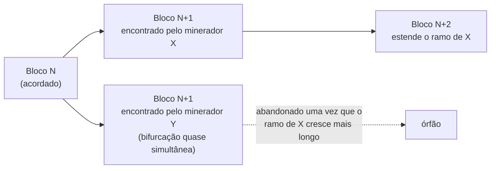

## Objetivos de Aprendizagem

- Enunciar a única suposição da qual o PBFT depende que o consenso de Nakamoto deliberadamente se recusa a fazer, um conjunto fixo e conhecido de n = 3f + 1 participantes que podem ser contados para um quórum, e explicar por que essa recusa força um mecanismo completamente diferente para o acordo.
- Explicar a prova-de-trabalho como um mecanismo de eleição de líder (uma loteria ponderada por esforço computacional) em vez de como "minerar moedas", e conectá-la de volta ao problema de eleição de líder que `raft-leader-election` já resolveu sob um modelo de confiança muito diferente.
- Explicar por que a segurança do consenso de Nakamoto é só probabilística (um bloco se torna mais final quanto mais blocos são encadeados sobre ele) em vez da finalidade determinística e certificada por quórum que PBFT e Raft ambos fornecem no instante em que os seus quóruns de mensagem se completam.
- Enunciar honestamente, num parágrafo, por que esta disciplina trata o consenso de Nakamoto como um ponto de comparação para um modelo de confiança diferente, em vez de como um assunto a desenvolver na profundidade que o PBFT recebeu.

## Contexto e Motivação

`practical-byzantine-fault-tolerance-pbft` resolveu o acordo bizantino para um cenário específico, e especificamente conveniente: um cluster fixo de n = 3f + 1 réplicas conhecidas, onde "2f+1 de n" é um número que toda réplica consegue de fato computar porque toda réplica conhece n. O design de Nakamoto de 2008 começa de um cenário onde essa conveniência não está disponível de forma alguma, qualquer um com uma conexão de internet pode entrar ou sair anonimamente, sem lista de membros, sem forma de sequer contar n, muito menos eleger um primário por rotação entre um conjunto conhecido. Este conceito existe para nomear essa diferença com precisão, não para ensinar mecânica de blockchain por si só, respeitando a decisão de escopo com a qual esta disciplina se compromete explicitamente: um curso rigoroso de sistemas distribuídos que trata o consenso de Nakamoto como um ponto genuinamente diferente no mesmo espectro de modelo de confiança que PBFT e Raft ocupam, que vale nomear com real precisão, sem transformar uma disciplina de 80 horas sobre consenso e replicação num curso sobre uma aplicação específica dele.

## Teoria Central

### O cenário: sem lista de membros, sem n conhecido

Os quóruns 2f+1 do PBFT exigem que toda réplica concorde sobre o que é n; as eleições por maioria do Raft exigem que todo servidor conheça o tamanho do cluster dentro do qual está votando. O consenso de Nakamoto não assume nenhum dos dois. Os participantes (mineradores) entram e saem de uma rede par a par livremente, e nenhum participante consegue aprender de forma confiável quantos outros existem, muito menos identificá-los. Sob essa suposição, uma contagem de quórum no estilo dos Generais Bizantinos simplesmente não é computável, então o consenso de Nakamoto substitui um mecanismo inteiramente diferente para decidir quem consegue propor a próxima transição de estado.

### Prova-de-trabalho como uma loteria de eleição de líder

Em vez de uma rotação entre servidores conhecidos (Raft) ou um primário designado dentro de um cluster conhecido (PBFT), o consenso de Nakamoto elege um líder para cada rodada (cada bloco) por meio de uma loteria computacional: um participante tem de encontrar um valor (um nonce) tal que o hash criptográfico do conteúdo do bloco junto desse nonce caia abaixo de um limiar-alvo, uma busca sem atalho mais rápido do que tentativa e erro por força bruta. Vencer essa loteria é proporcional ao poder computacional que um participante contribui à rede, então um participante (ou coalizão) controlando menos da metade do poder computacional total da rede vence essa loteria, e, portanto, propõe o próximo bloco, menos da metade do tempo, em expectativa. Este é um mecanismo genuíno de eleição de líder, respondendo estruturalmente à mesma pergunta que o timeout aleatorizado de `raft-leader-election` responde (quem propõe a seguir), sob uma suposição completamente diferente: o timeout aleatorizado do Raft só precisa desempatar de forma justa entre servidores conhecidos e cooperantes; a prova-de-trabalho precisa impedir que um líder seja elegível meramente por identidade, já que a identidade em si não está disponível para checar.

### Por que a segurança aqui é só probabilística

Uma vez que um participante vence uma rodada e transmite um bloco, outros participantes o adotam e começam a loteria da próxima rodada sobre ele, estendendo a cadeia válida mais longa que viram. Como a rede tem atraso de propagação real, dois participantes podem ocasionalmente vencer a loteria para a mesma posição na cadeia quase simultaneamente, produzindo uma bifurcação temporária, dois "próximos blocos" concorrentes que partes diferentes da rede veem primeiro. A regra do consenso de Nakamoto para resolver isso é simples e especificamente probabilística: sempre estender a cadeia mais longa (de maior trabalho cumulativo), e tratar o ramo perdedor de uma bifurcação como abandonado uma vez que a rede converge para o lado mais longo. Uma transação incluída num bloco nunca é instantânea e certificadamente final do jeito que um quórum de commit do PBFT ou um avanço de índice de commit do Raft é; ela se torna exponencialmente menos provável de ser revertida quanto mais blocos são encadeados sobre ela, que é por que as implantações reais esperam por um número de confirmações em vez de tratar a inclusão num bloco como final.



### A comparação honesta: dois modelos de confiança diferentes, não um estritamente melhor ou pior

| | PBFT | Consenso de Nakamoto |
|---|---|---|
| Membros | fixo, n = 3f+1 conhecido | aberto, desconhecido, anônimo |
| Seleção de líder | rotação determinística entre réplicas conhecidas | loteria computacional, proporcional ao trabalho |
| Finalidade | determinística, no instante em que um quórum de commit 2f+1 se completa | probabilística, cresce com as confirmações |
| Tolerância a falhas | até f réplicas bizantinas de 3f+1 conhecidas | até (logo abaixo de) metade do poder computacional honesto total da rede |

Nenhum domina o outro; cada um compra a sua garantia (membros abertos, sem permissão versus finalidade rápida e determinística) desistindo da conveniência do outro. As implantações reais escolhem com base em qual conveniência de fato precisam, um serviço replicado privado e de membros conhecidos recorre a protocolos no estilo PBFT precisamente porque pode se dar ao luxo de finalidade determinística e uma lista de membros fixa; uma moeda pública e sem permissão recorre ao consenso de Nakamoto precisamente porque não consegue assumir nenhum dos dois.

## Exemplos Resolvidos

### Exemplo 1: comparar os mecanismos de eleição de líder lado a lado

```text
RAFT (falha por crash, n=5 servidores conhecidos):
  O timeout aleatorizado de um seguidor (150-300ms) se esgota sem
  heartbeat -> torna-se Candidato -> pede votos dos
  outros 4 servidores conhecidos -> precisa de 3 votos (maioria de 5) para
  se tornar líder. Rápido (milissegundos), determinístico uma vez que uma
  maioria responde.

PBFT (bizantino, n=3f+1 réplicas conhecidas):
  A rotação determinística (número de visão mod n) escolhe o próximo
  primário entre o MESMO conjunto conhecido uma vez que 2f+1 réplicas votam
  VIEW-CHANGE. Rápido (milissegundos a segundos), determinístico.

CONSENSO DE NAKAMOTO (bizantino, n desconhecido/aberto):
  Todo participante busca simultaneamente um nonce vencedor.
  Nenhuma troca de mensagens de "eleição" de forma alguma: vencer a
  loteria computacional É a eleição. Lento por design (o
  limiar-alvo é ajustado para que um novo bloco seja encontrado mais ou menos
  a cada ~10 minutos na rede real do Bitcoin), e nunca
  totalmente determinístico: dois vencedores podem empatar.
```

### Exemplo 2: uma bifurcação temporária resolvendo por trabalho cumulativo

```text
O Bloco 100 é acordado pela rede inteira.
O minerador X encontra o bloco 101a e o transmite.
O minerador Y, que ainda não tinha visto o bloco de X, encontra um bloco 101b
  DIFERENTE quase simultaneamente e o transmite.
A rede agora está dividida: alguns nós estendem 101a, alguns estendem 101b.

O minerador Z (que viu 101a primeiro) encontra o bloco 102, estendendo o
  ramo 101a. O ramo 101a-102 agora tem mais trabalho cumulativo
  (2 blocos) do que o ramo 101b (1 bloco).

Os nós que tinham adotado 101b agora trocam para o ramo 101a-102
  (a regra da cadeia de maior trabalho), e qualquer transação que estava
  SÓ no bloco 101b agora está órfã, não confirmada, e tem de ser
  reenviada se ainda desejada. Uma transação no bloco 101a,
  agora com um bloco (102) sobre ela, é mais provável de
  sobreviver a outras bifurcações do que era no instante em que apareceu:
  exatamente a finalidade "probabilística, crescente" que este conceito
  nomeia, contrastada com a certeza instantânea e permanente de um quórum
  de commit do PBFT.
```

### Exemplo 3: por que o mecanismo do PBFT não pode simplesmente ser reusado aqui

```text
Tentativa: "É só rodar a regra de quórum 2f+1 do PBFT na rede
Bitcoin aberta em vez de prova-de-trabalho."

Problema 1: n é desconhecido. Um limiar de quórum (2f+1) só é
  computável se todo participante honesto concorda sobre n; uma rede
  aberta não tem lista de membros para concordar.

Problema 2: a identidade é gratuita. Mesmo que n pudesse de algum modo ser
  estimado, o argumento de segurança do PBFT assume que uma fração limitada
  de RÉPLICAS (não de participantes arbitrários) é bizantina. Numa
  rede aberta, um único atacante pode trivialmente criar muitas
  identidades falsas (um ataque Sybil) para parecer muitas réplicas,
  derrotando qualquer limiar de quórum baseado em contar identidades
  em vez de contar um recurso custoso (trabalho computacional)
  que não pode ser livremente duplicado.

É precisamente por isso que a prova-de-trabalho substitui um recurso que
É custoso de falsificar (computação) pela contagem de identidades da qual o
quórum do PBFT depende: uma solução genuinamente diferente para uma
restrição genuinamente diferente, não um descuido no design do PBFT.
```

## Equívocos Comuns e Armadilhas

- **"O consenso de Nakamoto é uma versão estritamente mais avançada ou mais segura do PBFT."** Eles resolvem o acordo bizantino sob suposições diferentes e não comparáveis sobre os membros. O PBFT fornece finalidade rápida e determinística, mas exige um conjunto conhecido e fixo de réplicas; o consenso de Nakamoto tolera membros totalmente abertos e anônimos, mas só fornece finalidade probabilística que se fortalece ao longo do tempo. Nenhum é uma melhoria estrita do outro.
- **"A prova-de-trabalho é fundamentalmente sobre resolver quebra-cabeças úteis ou 'minerar' algo valioso."** O trabalho computacional em si é deliberadamente inútil fora do seu papel como um sinal custoso e difícil de falsificar, o seu propósito inteiro, como o Exemplo 3 mostra, é substituir a contagem de identidades de que o quórum do PBFT precisa, que uma rede aberta e sem permissão não consegue computar diretamente.
- **"Aqui é onde a disciplina deveria ensinar o resto de blockchain (contratos inteligentes, tokens, variantes de consenso como prova-de-participação)."** Este conceito deliberadamente para exatamente na comparação de que esta disciplina precisa, um modelo de confiança diferente para o acordo bizantino, e não se estende para aplicações de blockchain ou as suas muitas variantes de consenso, que são um assunto diferente e muito maior fora do escopo de uma disciplina de teoria de sistemas distribuídos.

## Resumo

O consenso de Nakamoto resolve o acordo bizantino sob uma suposição que o PBFT nunca tem de enfrentar: membros abertos e anônimos sem nenhuma contagem conhecida de participantes de forma alguma. Ele substitui uma loteria computacional de prova-de-trabalho, um recurso custoso e difícil de falsificar, pela contagem fixa de réplicas da qual os quóruns do PBFT dependem, elegendo um líder para cada bloco mais ou menos do jeito que o timeout aleatorizado de `raft-leader-election` elege um líder, mas sob um modelo de confiança onde a própria identidade não pode ser contada ou verificada. O resultado é um tipo genuinamente diferente de finalidade, probabilística e que se fortalece ao longo do tempo conforme mais blocos se acumulam, em vez da finalidade instantânea e determinística que um quórum de commit do PBFT ou um avanço de índice de commit do Raft fornece. Isso fecha o arco de Tolerância a Falhas Bizantinas da disciplina; o próximo conceito se volta para o cenário de mundo real muito mais comum, falhas por crash e partições de rede num cluster conhecido, e o trade-off de latência versus consistência que os sistemas construídos sobre esse modelo de fato fazem.

## Documentation Links

- [Nakamoto: Bitcoin: A Peer-to-Peer Electronic Cash System (2008)](https://bitcoin.org/bitcoin.pdf): o artigo-fonte da prova-de-trabalho como uma loteria de eleição de líder, da regra da cadeia mais longa para resolver bifurcações, e do argumento de finalidade probabilística que este conceito desenvolve.
- [Castro and Liskov: Practical Byzantine Fault Tolerance (OSDI, 1999)](https://www.usenix.org/legacy/publications/library/proceedings/osdi99/full_papers/castro/castro_html/castro.html): citado aqui para o contraste direto que este conceito traça: o modelo de quórum de membros fixos e conhecidos do PBFT versus o aberto e anônimo do consenso de Nakamoto.
