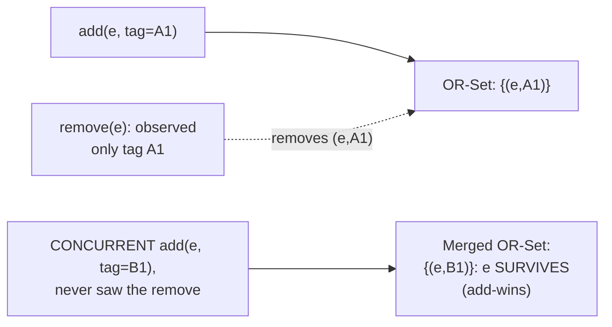

## Learning Objectives

- Explain precisely what an operation-based CRDT (CmRDT) transmits instead of full state, and state the exact condition (concurrent-operation commutativity, plus reliable causal-order delivery) that guarantees its convergence.
- Explain the OR-Set's add-wins conflict resolution mechanism precisely: unique tags per add, and why a concurrent add and remove of the same element resolve deterministically in the add's favor.
- Explain the Last-Write-Wins Register's tiebreak mechanism and state honestly and precisely what it silently discards when two writes are genuinely concurrent.
- State, without hedging, the real limit of every CRDT covered in this discipline: convergence is guaranteed, semantic correctness for the application is not.

## Context & Motivation

`strong-eventual-consistency-and-state-based-crdts` proved convergence for state-based CRDTs by requiring every merge to ship a replica's entire state, fine for a small counter, wasteful once the replicated object is a large set or document, since every gossip round then resends everything, not just what changed. Shapiro, Preguica, Baquero, and Zawirski's same 2011 paper proves a second, complementary route to Strong Eventual Consistency that avoids exactly this cost, shipping only the operation itself, under a different, equally rigorous condition. This concept builds that second model and the two concrete data types Dynamo-family stores actually deploy in production, directly completing the picture `vector-clocks-and-detecting-concurrent-writes` opened when it asked how a store decides whether to keep both of two concurrent writes.

## Core Theory

### Operation-based CRDTs (CmRDTs): the different convergence condition

Instead of merging whole states, an operation-based CRDT broadcasts each **operation** (e.g. "add element e" or "increment") to every replica, which applies it directly to its own local state. Convergence here is proven under a different pair of conditions, both real, checkable requirements: (1) **commutativity of concurrent operations**, any two operations that are truly concurrent (per `vector-clocks-and-detecting-concurrent-writes`'s comparison, neither happened-before the other) must produce the same resulting state regardless of the order they are applied in; and (2) **reliable causal-order delivery**, the messaging layer must guarantee an operation is never applied at a replica before every operation it causally depends on has already been applied there. Given both, every replica ends up applying the identical set of operations in an order that respects causality, and commutativity of the genuinely concurrent ones guarantees the final state matches regardless of the specific interleaving, exactly Strong Convergence again, proven from a different, complementary set of premises than the state-based model's join-semilattice.

### The OR-Set: add-wins, via unique tags

A plain set has an unresolvable ambiguity under concurrency: if one replica concurrently adds element e while another removes it (neither knowing about the other's operation), what should the merged set contain? The **Observed-Remove Set (OR-Set)** resolves this deterministically by tagging every add with a globally unique identifier (a replica ID plus a local counter, structurally similar to the per-replica slot this discipline's own vector clocks already use): "add e" really means "add the pair (e, unique-tag)," and "remove e" means "remove every (e, tag) pair this replica has actually observed so far." A concurrent add and remove of e can now only ever remove tags the removing replica had already seen, it cannot remove a tag it never observed, so a concurrent add (with a brand-new tag the remover never saw) always survives the merge, this is precisely why the design is called add-wins, and it is a deterministic, provable consequence of the tagging scheme, not an arbitrary convention.

### The Last-Write-Wins Register: a much simpler, much lossier tiebreak

An **LWW-Register** holds a single value and resolves any conflicting concurrent write by keeping whichever write carries the higher timestamp (this discipline's own vector clock, when comparable, or a physical wall-clock timestamp when not, exactly `physical-clock-synchronization-and-drift`'s own honestly-limited tool, reused here for a different purpose). When two writes are genuinely concurrent (`vector-clocks-and-detecting-concurrent-writes`'s comparison finds neither dominates), the register still must pick exactly one, by definition it discards the other entirely, with no OR-Set-style mechanism to preserve both.



## Worked Examples

### Example 1: OR-Set add-wins, traced with concrete tags

```text
Replica X and Replica Y both hold a shared shopping-cart set,
  currently {(milk, tagX1)}.

CONCURRENT operations (neither replica has seen the other's
  operation yet):
  X: remove(milk): X has observed only tagX1, so this removes
     exactly {(milk, tagX1)}.
  Y: add(milk, tagY2): a SEPARATE, brand-new tag, because Y is
     re-adding milk independently, with no knowledge of X's
     remove.

Merge (causal-order delivery guarantees both operations
  eventually apply at both replicas):
  Apply X's remove: removes (milk, tagX1) specifically;
    (milk, tagY2), a different tag, is UNAFFECTED, since it
    was never observed by X's remove operation.
  Apply Y's add: (milk, tagY2) is present.

Final merged state at BOTH replicas: {(milk, tagY2)}: milk
  SURVIVES the concurrent remove, deterministically, because
  the remove could only ever act on tags it had actually seen.
```

### Example 2: LWW-Register silently discarding a real concurrent write

```text
Two devices, same user account, both offline-editing a profile
  "status" field, then both reconnect and sync.

Device A (vector clock [3,0]) writes status="At the gym".
Device B (vector clock [0,2]) writes status="In a meeting".

Compare [3,0] and [0,2]: neither dominates (3>0 in slot 1, but
  0<2 in slot 2): genuinely CONCURRENT, exactly the case
  vector-clocks-and-detecting-concurrent-writes defines.

LWW-Register's tiebreak (say, physical timestamp): Device B's
  write happened to be assigned a later physical timestamp by a
  fraction of a second. Merged value: "In a meeting".

Device A's "At the gym" is GONE, entirely, with no trace and no
  merge: a real, silent loss of a genuinely concurrent,
  equally valid write, the exact, honest cost this concept's
  Common Misconceptions section states plainly.
```

### Example 3: why the OR-Set's guarantee needs causal delivery, not just commutativity

```text
Same OR-Set setup as Example 1, but suppose the messaging layer
  delivers Y's add(milk, tagY2) to a THIRD replica Z BEFORE Z
  has received an EARLIER operation Y's add causally depended
  on (say, an earlier "create cart" operation establishing the
  set itself even exists at Z).

Without reliable causal-order delivery, Z could apply
  add(milk, tagY2) to a set that does not yet reflect the
  cart's own creation, an operation-ordering violation
  commutativity of CONCURRENT operations alone does not
  protect against, since "create cart" and "add milk" are NOT
  concurrent, add milk causally depends on create cart having
  happened first. This is exactly why this concept's Core
  Theory names causal-order delivery as a SEPARATE, necessary
  condition alongside commutativity, not a redundant one.
```

## Common Misconceptions & Pitfalls

- **"CRDTs guarantee the merged result is what the user actually wanted."** Example 2 is the direct, concrete counterexample: an LWW-Register's merge is entirely correct BY THE CRDT'S OWN DEFINITION (deterministic, convergent, provably so) and still silently discards a real, valid concurrent write with no notification to anyone, the guarantee is convergence to a well-defined state, never semantic correctness for the application.
- **"Add-wins (OR-Set) is simply the 'better' or 'more correct' choice compared to remove-wins."** It is a deliberate design choice with its own honest cost, in Example 1, a user who genuinely wanted milk removed will find it mysteriously reappeared if someone else concurrently re-added it, add-wins optimizes for never losing a genuine add, at the cost of a remove sometimes not sticking, exactly the opposite trade a remove-wins design would make.
- **"Operation-based CRDTs need only commutativity of concurrent operations, nothing about delivery order."** Example 3 shows this is precisely the missing half, causally DEPENDENT (non-concurrent) operations still require in-order delivery, commutativity is only proven to matter for the genuinely concurrent case, which is why this concept states both conditions as jointly necessary, not either alone.

## Summary

Operation-based CRDTs (CmRDTs) ship only the operation itself, converging correctly whenever concurrent operations commute and the messaging layer guarantees reliable causal-order delivery, a genuinely different, complementary route to Strong Eventual Consistency compared to the state-based model's join-semilattice merge. The OR-Set achieves deterministic add-wins conflict resolution by tagging every add with a unique identifier, so a remove can only ever act on tags it has actually observed, letting a concurrent add reliably survive; the LWW-Register, by contrast, resolves any conflict with a simple timestamp tiebreak, and this concept states honestly, without hedging, that doing so silently and correctly discards one of two genuinely concurrent writes with no trace. Every CRDT this discipline covered guarantees convergence to a well-defined state, never that the converged value matches what any single user actually intended, the real, honest boundary of what this technique solves. The discipline's capstone, next, traces all of this discipline's Distributed Databases material, quorums, vector clocks, anti-entropy, and this exact OR-Set, through one concrete scenario end to end.

## Documentation Links

- [Shapiro, Preguica, Baquero, and Zawirski: Conflict-Free Replicated Data Types (INRIA / SSS, 2011)](https://inria.hal.science/inria-00609399): the source paper for the operation-based (CmRDT) convergence conditions, the OR-Set's add-wins tagging scheme, and the Last-Write-Wins Register this concept builds through, including the paper's own precise statement of the causal-delivery requirement.
- [DeCandia et al.: Dynamo: Amazon's Highly Available Key-value Store (SOSP, 2007)](https://www.allthingsdistributed.com/files/amazon-dynamo-sosp2007.pdf): cited again here for the real, production motivation behind exactly these two data types, a Dynamo-family store's shopping-cart and profile-field use cases are the concrete, real-world setting this concept's worked examples are drawn from.
