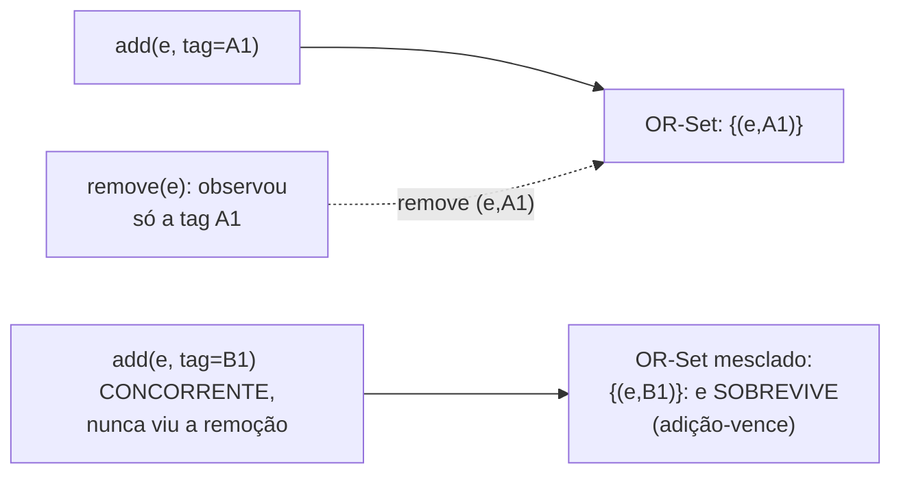

## Objetivos de Aprendizagem

- Explicar com precisão o que um CRDT baseado em operação (CmRDT) transmite em vez de estado completo, e enunciar a condição exata (comutatividade de operações concorrentes, mais entrega confiável em ordem causal) que garante a sua convergência.
- Explicar o mecanismo de resolução de conflito adição-vence do OR-Set com precisão: tags únicas por adição, e por que uma adição e uma remoção concorrentes do mesmo elemento resolvem deterministicamente em favor da adição.
- Explicar o mecanismo de desempate do Last-Write-Wins Register e enunciar honestamente e com precisão o que ele silenciosamente descarta quando duas escritas são genuinamente concorrentes.
- Enunciar, sem ressalvas, o limite real de todo CRDT coberto nesta disciplina: a convergência é garantida, a correção semântica para a aplicação não é.

## Contexto e Motivação

`strong-eventual-consistency-and-state-based-crdts` provou a convergência para CRDTs baseados em estado exigindo que toda mesclagem envie o estado inteiro de uma réplica, aceitável para um contador pequeno, desperdiçador uma vez que o objeto replicado é um conjunto ou documento grande, já que toda rodada de gossip então reenvia tudo, não só o que mudou. O mesmo artigo de 2011 de Shapiro, Preguica, Baquero e Zawirski prova uma segunda rota complementar à Consistência Eventual Forte que evita exatamente esse custo, enviando só a própria operação, sob uma condição diferente e igualmente rigorosa. Este conceito constrói esse segundo modelo e os dois tipos de dados concretos que as stores da família Dynamo de fato implantam em produção, completando diretamente o quadro que `vector-clocks-and-detecting-concurrent-writes` abriu quando perguntou como uma store decide se mantém ambas de duas escritas concorrentes.

## Teoria Central

### CRDTs baseados em operação (CmRDTs): a condição de convergência diferente

Em vez de mesclar estados inteiros, um CRDT baseado em operação transmite cada **operação** (ex.: "adicionar elemento e" ou "incrementar") a toda réplica, que a aplica diretamente ao seu próprio estado local. A convergência aqui é provada sob um par diferente de condições, ambos requisitos reais e conferíveis: (1) **comutatividade de operações concorrentes**, quaisquer duas operações que sejam verdadeiramente concorrentes (pela comparação de `vector-clocks-and-detecting-concurrent-writes`, nenhuma aconteceu-antes da outra) têm de produzir o mesmo estado resultante independentemente da ordem em que são aplicadas; e (2) **entrega confiável em ordem causal**, a camada de mensagens tem de garantir que uma operação nunca seja aplicada numa réplica antes de toda operação da qual ela causalmente depende já ter sido aplicada ali. Dados ambos, toda réplica acaba aplicando o conjunto idêntico de operações numa ordem que respeita a causalidade, e a comutatividade das genuinamente concorrentes garante que o estado final bate independentemente do entrelaçamento específico, exatamente a Convergência Forte de novo, provada a partir de um conjunto diferente e complementar de premissas do que o semirretículo de junção do modelo baseado em estado.

### O OR-Set: adição-vence, via tags únicas

Um conjunto simples tem uma ambiguidade irresolúvel sob concorrência: se uma réplica concorrentemente adiciona o elemento e enquanto outra o remove (nenhuma sabendo da operação da outra), o que o conjunto mesclado deveria conter? O **Observed-Remove Set (OR-Set)** resolve isso deterministicamente marcando toda adição com um identificador globalmente único (um ID de réplica mais um contador local, estruturalmente semelhante ao slot por réplica que os próprios relógios vetoriais desta disciplina já usam): "adicionar e" na verdade significa "adicionar o par (e, tag-única)", e "remover e" significa "remover todo par (e, tag) que esta réplica de fato observou até agora". Uma adição e uma remoção concorrentes de e agora só podem remover tags que a réplica removedora já tinha visto, ela não consegue remover uma tag que nunca observou, então uma adição concorrente (com uma tag novíssima que o removedor nunca viu) sempre sobrevive à mesclagem, é precisamente por isso que o design é chamado de adição-vence, e é uma consequência determinística e comprovável do esquema de tags, não uma convenção arbitrária.

### O Last-Write-Wins Register: um desempate muito mais simples, muito mais com perdas

Um **LWW-Register** segura um único valor e resolve qualquer escrita concorrente conflitante mantendo qualquer escrita que carregue o timestamp mais alto (o próprio relógio vetorial desta disciplina, quando comparável, ou um timestamp de relógio físico de parede quando não, exatamente a própria ferramenta honestamente limitada de `physical-clock-synchronization-and-drift`, reusada aqui para um propósito diferente). Quando duas escritas são genuinamente concorrentes (a comparação de `vector-clocks-and-detecting-concurrent-writes` não encontra nenhuma dominando), o registro ainda tem de escolher exatamente uma, por definição ele descarta a outra inteiramente, sem nenhum mecanismo no estilo do OR-Set para preservar ambas.



## Exemplos Resolvidos

### Exemplo 1: adição-vence do OR-Set, rastreado com tags concretas

```text
A Réplica X e a Réplica Y ambas seguram um conjunto de carrinho de compras compartilhado,
  atualmente {(leite, tagX1)}.

Operações CONCORRENTES (nenhuma réplica viu a operação da outra
  ainda):
  X: remove(leite): X observou só tagX1, então isto remove
     exatamente {(leite, tagX1)}.
  Y: add(leite, tagY2): uma tag SEPARADA e novíssima, porque Y está
     readicionando leite independentemente, sem conhecimento da
     remoção de X.

Mesclagem (a entrega em ordem causal garante que ambas as operações
  eventualmente se apliquem em ambas as réplicas):
  Aplicar a remoção de X: remove (leite, tagX1) especificamente;
    (leite, tagY2), uma tag diferente, fica INAFETADO, já que
    nunca foi observado pela operação de remoção de X.
  Aplicar a adição de Y: (leite, tagY2) está presente.

Estado mesclado final em AMBAS as réplicas: {(leite, tagY2)}: o leite
  SOBREVIVE à remoção concorrente, deterministicamente, porque
  a remoção só podia atuar sobre tags que de fato tinha visto.
```

### Exemplo 2: LWW-Register silenciosamente descartando uma escrita concorrente real

```text
Dois dispositivos, mesma conta de usuário, ambos editando offline um campo
  "status" de perfil, depois ambos reconectam e sincronizam.

Dispositivo A (relógio vetorial [3,0]) escreve status="Na academia".
Dispositivo B (relógio vetorial [0,2]) escreve status="Em reunião".

Comparar [3,0] e [0,2]: nenhuma domina (3>0 no slot 1, mas
  0<2 no slot 2): genuinamente CONCORRENTES, exatamente o caso que
  vector-clocks-and-detecting-concurrent-writes define.

Desempate do LWW-Register (digamos, timestamp físico): a escrita do
  Dispositivo B por acaso foi atribuída um timestamp físico posterior por uma
  fração de segundo. Valor mesclado: "Em reunião".

O "Na academia" do Dispositivo A SUMIU, inteiramente, sem rastro e sem
  mesclagem: uma perda real e silenciosa de uma escrita genuinamente concorrente e
  igualmente válida, o exato custo honesto que a seção de
  Equívocos Comuns deste conceito enuncia de forma clara.
```

### Exemplo 3: por que a garantia do OR-Set precisa de entrega causal, não só comutatividade

```text
Mesma configuração de OR-Set do Exemplo 1, mas suponha que a camada de mensagens
  entrega o add(leite, tagY2) de Y a uma TERCEIRA réplica Z ANTES de Z
  ter recebido uma operação ANTERIOR da qual o add de Y causalmente dependia
  (digamos, uma operação "criar carrinho" anterior estabelecendo que o
  conjunto sequer existe em Z).

Sem entrega confiável em ordem causal, Z poderia aplicar
  add(leite, tagY2) a um conjunto que ainda não reflete a
  própria criação do carrinho, uma violação de ordenação de operações
  contra a qual a comutatividade de operações CONCORRENTES sozinha não
  protege, já que "criar carrinho" e "adicionar leite" NÃO são
  concorrentes, adicionar leite causalmente depende de criar carrinho ter
  acontecido primeiro. É exatamente por isso que a Teoria Central deste conceito
  nomeia a entrega em ordem causal como uma condição SEPARADA e necessária
  ao lado da comutatividade, não uma redundante.
```

## Equívocos Comuns e Armadilhas

- **"Os CRDTs garantem que o resultado mesclado é o que o usuário de fato queria."** O Exemplo 2 é o contraexemplo direto e concreto: a mesclagem de um LWW-Register é inteiramente correta PELA PRÓPRIA DEFINIÇÃO DO CRDT (determinística, convergente, comprovadamente assim) e ainda silenciosamente descarta uma escrita concorrente real e válida sem notificação a ninguém, a garantia é a convergência para um estado bem definido, nunca a correção semântica para a aplicação.
- **"Adição-vence (OR-Set) é simplesmente a escolha 'melhor' ou 'mais correta' em comparação com remoção-vence."** É uma escolha de design deliberada com o seu próprio custo honesto, no Exemplo 1, um usuário que genuinamente queria o leite removido o encontrará misteriosamente reaparecido se outra pessoa concorrentemente o readicionou, adição-vence otimiza para nunca perder uma adição genuína, ao custo de uma remoção às vezes não grudar, exatamente a troca oposta que um design de remoção-vence faria.
- **"Os CRDTs baseados em operação precisam só de comutatividade de operações concorrentes, nada sobre a ordem de entrega."** O Exemplo 3 mostra que essa é precisamente a metade que falta, operações causalmente DEPENDENTES (não concorrentes) ainda exigem entrega em ordem, a comutatividade só é provada importar para o caso genuinamente concorrente, que é por que este conceito enuncia ambas as condições como conjuntamente necessárias, não uma sozinha.

## Resumo

Os CRDTs baseados em operação (CmRDTs) enviam só a própria operação, convergindo corretamente sempre que as operações concorrentes comutam e a camada de mensagens garante entrega confiável em ordem causal, uma rota genuinamente diferente e complementar à Consistência Eventual Forte em comparação com a mesclagem por semirretículo de junção do modelo baseado em estado. O OR-Set alcança a resolução de conflito determinística de adição-vence marcando toda adição com um identificador único, para que uma remoção só possa atuar sobre tags que de fato observou, deixando uma adição concorrente sobreviver de forma confiável; o LWW-Register, em contraste, resolve qualquer conflito com um desempate simples de timestamp, e este conceito enuncia honestamente, sem ressalvas, que fazê-lo silenciosa e corretamente descarta uma de duas escritas genuinamente concorrentes sem rastro. Todo CRDT que esta disciplina cobriu garante a convergência para um estado bem definido, nunca que o valor convergido bate com o que qualquer usuário individual de fato pretendeu, a fronteira real e honesta do que esta técnica resolve. O capstone da disciplina, a seguir, rastreia todo o material de Bancos de Dados Distribuídos desta disciplina, quóruns, relógios vetoriais, anti-entropia e este exato OR-Set, por um cenário concreto de ponta a ponta.

## Documentation Links

- [Shapiro, Preguica, Baquero, and Zawirski: Conflict-Free Replicated Data Types (INRIA / SSS, 2011)](https://inria.hal.science/inria-00609399): o artigo-fonte das condições de convergência baseadas em operação (CmRDT), do esquema de tags de adição-vence do OR-Set e do Last-Write-Wins Register que este conceito desenvolve, incluindo a própria afirmação precisa do artigo sobre o requisito de entrega causal.
- [DeCandia et al.: Dynamo: Amazon's Highly Available Key-value Store (SOSP, 2007)](https://www.allthingsdistributed.com/files/amazon-dynamo-sosp2007.pdf): citado de novo aqui para a motivação real e de produção por trás exatamente desses dois tipos de dados, os casos de uso de carrinho de compras e de campo de perfil de uma store da família Dynamo são o cenário concreto e de mundo real de onde os exemplos resolvidos deste conceito são extraídos.
