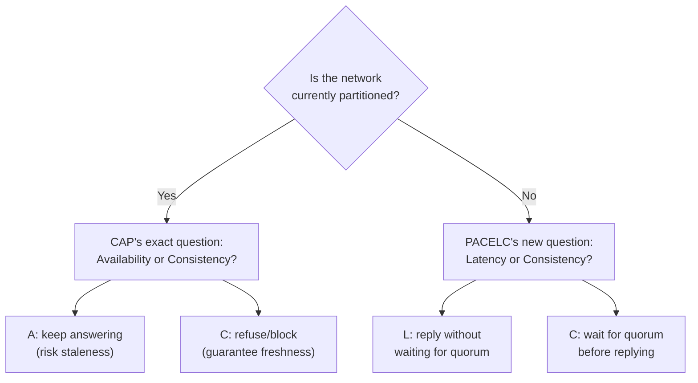

## Learning Objectives

- State the PACELC formulation precisely: if Partitioned, choose Availability or Consistency (exactly CAP); Else (no partition), choose Latency or Consistency.
- Explain exactly what question CAP leaves unanswered, and why that question matters every single day a system runs, not only during the rare interval of an actual partition.
- Classify at least four real systems (a linearizable single-leader store, Dynamo-style stores, Cassandra with tunable consistency, and a consensus-backed store like Spanner) by their PACELC category (PC/EC, PA/EL, and the ones that mix per-request).
- Explain, precisely, why this concept is the real motivation for every remaining concept in this discipline's Distributed Databases topic.

## Context & Motivation

`the-cap-theorem-a-precise-statement` proved something narrow and real: during an actual network partition, a system must choose Consistency or Availability, and it proved this by contradiction, constructing a partition and showing the two nodes on opposite sides cannot both stay linearizable and both stay available. That proof is airtight, and it is also silent about the overwhelming majority of a system's actual runtime, the time with no partition at all. A system with no partition can still choose to wait for every replica to acknowledge a write before replying (strong consistency, higher latency) or to reply the instant one replica accepts it (lower latency, weaker consistency), and CAP's proof says nothing about which of those two choices is correct, because its entire argument depends on a partition existing. Abadi's 2012 paper names this second, always-present trade-off precisely, and this concept exists to make it the explicit bridge between the Byzantine Fault Tolerance material this discipline just finished and the Distributed Databases material it is about to build, the honest answer to "why would any system choose weaker consistency even when the network is perfectly healthy."

## Core Theory

### The formulation, stated precisely

**PACELC:** if **P**artitioned, a system must choose **A**vailability or **C**onsistency (this half is exactly `the-cap-theorem-a-precise-statement`'s proof, unchanged); **E**lse (no partition), a system must choose **L**atency or **C**onsistency. The second half is the genuinely new content: even with a perfectly healthy network, a system that wants strong consistency (every read reflects every prior write) must coordinate with other replicas before replying, and that coordination costs real, measurable latency; a system willing to skip that coordination can reply faster, at the cost of potentially returning a stale value.

### Why the "Else" branch is not optional to consider

A system is never partitioned most of the time, by design, partitions are the rare, unusual event, not the steady state. A system's PACELC classification during that steady state, therefore, is what its users actually experience on the overwhelming majority of requests. A store classified PC/EC (Consistent under partition, Consistent when healthy, e.g. a system built directly on Raft or Paxos consensus, per `paxos-the-original-consensus-protocol` and `raft-log-replication-and-commitment`) pays a latency cost on every single write, waiting for a majority quorum's round trip, specifically to guarantee `linearizability-a-rigorous-definition`'s real-time ordering at all times. A store classified PA/EL (Available under partition, lower Latency when healthy) never pays that cost, and accepts `eventual-consistency-and-its-real-guarantees`'s weaker promise as the price.

### The classification, worked across real systems

| System | Partitioned (PA or PC) | Healthy (EL or EC) | PACELC class |
|---|---|---|---|
| A Raft- or Paxos-backed store (e.g. etcd) | PC (refuses/blocks a minority side rather than risk disagreement) | EC (every write waits for majority quorum) | PC/EC |
| Dynamo-style leaderless store (default config) | PA (sloppy quorums keep answering, next two concepts) | EL (a write returns once W of N replicas ack, no global coordination) | PA/EL |
| Cassandra (tunable per query) | PA by default, or PC if quorum consistency levels are requested | EL by default, or EC if quorum levels are requested | mixed, chosen per request |
| Traditional single-leader relational store, synchronous replication | PC (blocks writes if the standby is unreachable) | EC (every write waits for the standby's ack) | PC/EC |

### Why this motivates everything that follows in this discipline

Every one of Dynamo's specific mechanisms this discipline is about to build, vector clocks, sloppy quorums, hinted handoff, anti-entropy, exists specifically to make the PA/EL choice work well in practice, not merely to survive partitions, but to keep every single request fast when the network is healthy, which is the overwhelming majority of the time. Naming this trade-off explicitly, before building any of those mechanisms, is what makes the motivation for choosing them honest rather than assumed.



## Worked Examples

### Example 1: the same write, two systems, no partition present

```text
Both systems below are perfectly healthy, no partition exists.
A client writes x=5.

SYSTEM A (PC/EC, e.g. Raft-backed):
  Leader appends x=5 to its log, replicates via AppendEntries,
  waits for majority ack (raft-log-replication-and-commitment),
  THEN replies. Round trip: ~1 network round trip to the
  farthest quorum member. Every reader after this reply is
  GUARANTEED to see x=5.

SYSTEM B (PA/EL, e.g. Dynamo-style):
  Coordinator forwards the write to N=3 replicas, replies to
  the client as soon as W=1 replica acknowledges (no
  coordination with the other 2 needed yet). Round trip:
  effectively zero extra network hops beyond the write itself.
  A reader querying a DIFFERENT replica immediately after may
  still see the OLD value until replication catches up.

Same healthy network. Different, deliberate trade: this is
PACELC's "Else" branch, not CAP's, since no partition exists
in either scenario.
```

### Example 2: classifying a system by testing both branches

```text
Given: a store that, during a network partition, continues
accepting writes on every reachable node (never blocks) but,
when the network is healthy, requires a majority of replicas
to acknowledge before returning from a write.

Partitioned behavior -> keeps answering -> PA
Healthy behavior -> waits for majority quorum -> EC

Classification: PA/EC: a real, valid combination (distinct
from PA/EL and PC/EC in the table above), showing the two
branches are independently chosen design decisions, not a
single linked switch.
```

### Example 3: why "eventually consistent" alone does not fully describe a system

```text
Two systems both correctly describe themselves as "eventually
consistent" (satisfying eventual-consistency-and-its-real-
guarantees's convergence promise). A user asks: "but how does
it behave RIGHT NOW, with no partition happening?"

SYSTEM X: even when healthy, waits for 2 of 3 replicas
  (a read/write quorum) before replying -> EC in PACELC terms,
  despite being "eventually consistent" in the CAP/liveness
  sense during an actual partition (PA).
  Full classification: PA/EC.

SYSTEM Y: when healthy, replies from a single replica
  immediately, no quorum wait -> EL.
  Full classification: PA/EL.

Both are legitimately "eventually consistent" systems by the
CAP-era vocabulary alone, and yet have measurably different
day-to-day latency and staleness behavior: exactly the gap
PACELC's second branch exists to close.
```

## Common Misconceptions & Pitfalls

- **"PACELC just restates CAP with two extra letters."** The P/A/C portion is exactly CAP, unchanged; the genuinely new content is the E/L/C portion, which answers a question CAP's proof never addresses at all (what happens with no partition), as Example 1 makes concrete with two systems that behave identically under partition analysis but differently every single healthy day.
- **"A system's CAP classification (its behavior during a partition) determines its everyday latency behavior."** Example 3 shows two independently "eventually consistent" (PA) systems with opposite EL/EC classifications, and Example 2 shows a real PA/EC combination distinct from both PA/EL and PC/EC, the two branches are genuinely separate design choices, not one binary switch.
- **"Choosing PA/EL means giving up on consistency entirely."** PA/EL only describes default, no-coordination behavior; `strong-eventual-consistency-and-state-based-crdts`, later in this discipline, shows a PA/EL system can still provide a real, precisely provable convergence guarantee (SEC), just not the always-fresh guarantee EC systems pay latency for.

## Summary

PACELC extends CAP's real but narrow proof (a partition forces a Consistency-versus-Availability choice) with the question that matters on every ordinary, unpartitioned day a system runs: does it wait for coordination (Consistency) or reply immediately (Latency)? Classifying real systems, a Raft-backed store as PC/EC, a Dynamo-style store as PA/EL, Cassandra as tunable per request, shows these are two genuinely independent design decisions, not one linked switch, and that a system's partition-time behavior alone never fully describes what its users experience the rest of the time. This is the honest motivation for the entire Distributed Databases topic that follows: Dynamo-style systems choose PA/EL deliberately, for everyday latency, not merely to survive rare partitions, and every mechanism this discipline builds next, vector clocks, sloppy quorums, anti-entropy, exists to make that deliberate choice work well in practice.

## Documentation Links

- [Abadi: Consistency Tradeoffs in Modern Distributed Database System Design (IEEE Computer, 2012)](http://www.cs.umd.edu/~abadi/papers/abadi-pacelc.pdf): the source paper for the PACELC formulation itself, including its own classification of real systems (Dynamo, PNUTS, and traditional replicated relational databases) into the PA/EL, PC/EC, and mixed categories this concept works through.
- [Gilbert and Lynch: Brewer's Conjecture and the Feasibility of Consistent, Available, Partition-Tolerant Web Services (2002)](https://groups.csail.mit.edu/tds/papers/Gilbert/Brewer2.pdf): the original CAP proof this concept's P/A/C half is built directly on, cited again here specifically to make explicit that PACELC's first half is not new content, only its second, "Else" half is.
