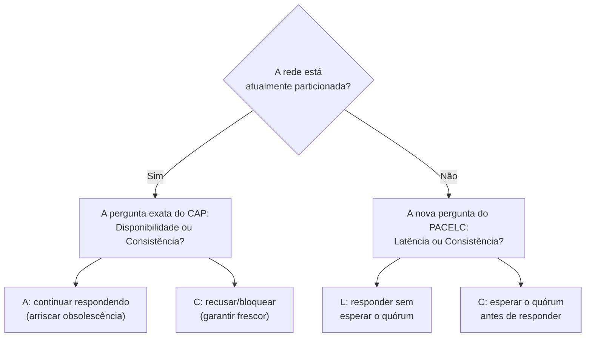

## Objetivos de Aprendizagem

- Enunciar a formulação PACELC com precisão: se Particionado, escolha Disponibilidade ou Consistência (exatamente CAP); Senão (sem partição), escolha Latência ou Consistência.
- Explicar exatamente que pergunta o CAP deixa sem resposta, e por que essa pergunta importa todo dia que um sistema roda, não só durante o intervalo raro de uma partição de fato.
- Classificar pelo menos quatro sistemas reais (uma store linearizável de líder único, stores no estilo Dynamo, Cassandra com consistência ajustável, e uma store apoiada por consenso como o Spanner) pela sua categoria PACELC (PC/EC, PA/EL, e as que misturam por requisição).
- Explicar, com precisão, por que este conceito é a motivação real para todo conceito restante no tópico de Bancos de Dados Distribuídos desta disciplina.

## Contexto e Motivação

`the-cap-theorem-a-precise-statement` provou algo estreito e real: durante uma partição de rede de fato, um sistema tem de escolher Consistência ou Disponibilidade, e provou isso por contradição, construindo uma partição e mostrando que os dois nós em lados opostos não podem ambos permanecer linearizáveis e ambos permanecer disponíveis. Essa prova é à prova de falhas, e também é silenciosa sobre a esmagadora maioria do tempo de execução de fato de um sistema, o tempo sem nenhuma partição. Um sistema sem partição ainda pode escolher esperar que toda réplica reconheça uma escrita antes de responder (consistência forte, latência mais alta) ou responder no instante em que uma réplica a aceita (latência mais baixa, consistência mais fraca), e a prova do CAP nada diz sobre qual dessas duas escolhas é correta, porque o seu argumento inteiro depende de uma partição existir. O artigo de Abadi de 2012 nomeia esse segundo trade-off, sempre presente, com precisão, e este conceito existe para torná-lo a ponte explícita entre o material de Tolerância a Falhas Bizantinas que esta disciplina acabou de terminar e o material de Bancos de Dados Distribuídos que ela está prestes a construir, a resposta honesta a "por que qualquer sistema escolheria consistência mais fraca mesmo quando a rede está perfeitamente saudável".

## Teoria Central

### A formulação, enunciada com precisão

**PACELC:** se **P**articionado, um sistema tem de escolher **A**vailability (Disponibilidade) ou **C**onsistency (Consistência) (essa metade é exatamente a prova de `the-cap-theorem-a-precise-statement`, inalterada); senão (**E**lse, sem partição), um sistema tem de escolher **L**atency (Latência) ou **C**onsistency (Consistência). A segunda metade é o conteúdo genuinamente novo: mesmo com uma rede perfeitamente saudável, um sistema que quer consistência forte (toda leitura reflete toda escrita anterior) tem de coordenar com outras réplicas antes de responder, e essa coordenação custa latência real e mensurável; um sistema disposto a pular essa coordenação pode responder mais depressa, ao custo de potencialmente retornar um valor obsoleto.

### Por que o ramo "Senão" não é opcional de considerar

Um sistema nunca está particionado a maior parte do tempo, por design, as partições são o evento raro e incomum, não o estado estacionário. A classificação PACELC de um sistema durante esse estado estacionário, portanto, é o que os seus usuários de fato experimentam na esmagadora maioria das requisições. Uma store classificada PC/EC (Consistente sob partição, Consistente quando saudável, ex.: um sistema construído diretamente sobre consenso Raft ou Paxos, por `paxos-the-original-consensus-protocol` e `raft-log-replication-and-commitment`) paga um custo de latência em toda escrita, esperando a ida e volta de um quórum majoritário, especificamente para garantir a ordenação em tempo real de `linearizability-a-rigorous-definition` o tempo todo. Uma store classificada PA/EL (Disponível sob partição, Latência mais baixa quando saudável) nunca paga esse custo, e aceita a promessa mais fraca de `eventual-consistency-and-its-real-guarantees` como o preço.

### A classificação, trabalhada por sistemas reais

| Sistema | Particionado (PA ou PC) | Saudável (EL ou EC) | Classe PACELC |
|---|---|---|---|
| Uma store apoiada por Raft ou Paxos (ex.: etcd) | PC (recusa/bloqueia um lado minoritário em vez de arriscar discordância) | EC (toda escrita espera o quórum majoritário) | PC/EC |
| Store sem líder no estilo Dynamo (config padrão) | PA (quóruns relaxados continuam respondendo, próximos dois conceitos) | EL (uma escrita retorna uma vez que W de N réplicas reconhecem, sem coordenação global) | PA/EL |
| Cassandra (ajustável por consulta) | PA por padrão, ou PC se níveis de consistência de quórum são pedidos | EL por padrão, ou EC se níveis de quórum são pedidos | misto, escolhido por requisição |
| Store relacional tradicional de líder único, replicação síncrona | PC (bloqueia escritas se o standby está inalcançável) | EC (toda escrita espera o ack do standby) | PC/EC |

### Por que isto motiva tudo o que se segue nesta disciplina

Cada um dos mecanismos específicos do Dynamo que esta disciplina está prestes a construir, relógios vetoriais, quóruns relaxados, hinted handoff, anti-entropia, existe especificamente para fazer a escolha PA/EL funcionar bem na prática, não meramente para sobreviver a partições, mas para manter toda requisição rápida quando a rede está saudável, que é a esmagadora maioria do tempo. Nomear esse trade-off explicitamente, antes de construir qualquer um desses mecanismos, é o que torna a motivação para escolhê-los honesta em vez de assumida.



## Exemplos Resolvidos

### Exemplo 1: a mesma escrita, dois sistemas, nenhuma partição presente

```text
Ambos os sistemas abaixo estão perfeitamente saudáveis, nenhuma partição existe.
Um cliente escreve x=5.

SISTEMA A (PC/EC, ex.: apoiado por Raft):
  O líder acrescenta x=5 ao seu log, replica via AppendEntries,
  espera o ack da maioria (raft-log-replication-and-commitment),
  ENTÃO responde. Ida e volta: ~1 ida e volta de rede ao
  membro de quórum mais distante. Todo leitor após esta resposta tem
  GARANTIA de ver x=5.

SISTEMA B (PA/EL, ex.: no estilo Dynamo):
  O coordenador encaminha a escrita para N=3 réplicas, responde ao
  cliente assim que W=1 réplica reconhece (nenhuma
  coordenação com as outras 2 necessária ainda). Ida e volta:
  efetivamente zero saltos de rede extras além da própria escrita.
  Um leitor consultando uma réplica DIFERENTE imediatamente depois pode
  ainda ver o valor ANTIGO até a replicação se atualizar.

Mesma rede saudável. Troca diferente e deliberada: este é
o ramo "Senão" do PACELC, não o do CAP, já que nenhuma partição existe
em nenhum dos cenários.
```

### Exemplo 2: classificar um sistema testando ambos os ramos

```text
Dado: uma store que, durante uma partição de rede, continua
aceitando escritas em todo nó alcançável (nunca bloqueia), mas,
quando a rede está saudável, exige que uma maioria de réplicas
reconheça antes de retornar de uma escrita.

Comportamento particionado -> continua respondendo -> PA
Comportamento saudável -> espera o quórum majoritário -> EC

Classificação: PA/EC: uma combinação real e válida (distinta
de PA/EL e PC/EC na tabela acima), mostrando que os dois
ramos são decisões de design independentemente escolhidas, não uma
única chave ligada.
```

### Exemplo 3: por que "eventualmente consistente" sozinho não descreve por completo um sistema

```text
Dois sistemas ambos corretamente se descrevem como "eventualmente
consistentes" (satisfazendo a promessa de convergência de eventual-consistency-and-its-real-
guarantees). Um usuário pergunta: "mas como ele se
comporta AGORA MESMO, sem nenhuma partição acontecendo?"

SISTEMA X: mesmo quando saudável, espera 2 de 3 réplicas
  (um quórum de leitura/escrita) antes de responder -> EC em termos de PACELC,
  apesar de ser "eventualmente consistente" no sentido
  CAP/vivacidade durante uma partição de fato (PA).
  Classificação completa: PA/EC.

SISTEMA Y: quando saudável, responde de uma única réplica
  imediatamente, sem espera de quórum -> EL.
  Classificação completa: PA/EL.

Ambos são legitimamente sistemas "eventualmente consistentes" pelo
vocabulário da era CAP sozinho, e ainda assim têm comportamento de latência e
obsolescência cotidiano mensuravelmente diferente: exatamente a lacuna
que o segundo ramo do PACELC existe para fechar.
```

## Equívocos Comuns e Armadilhas

- **"O PACELC só reenuncia o CAP com duas letras extras."** A porção P/A/C é exatamente o CAP, inalterada; o conteúdo genuinamente novo é a porção E/L/C, que responde a uma pergunta que a prova do CAP nunca aborda de forma alguma (o que acontece sem partição), como o Exemplo 1 torna concreto com dois sistemas que se comportam identicamente sob análise de partição, mas diferentemente todo dia saudável.
- **"A classificação CAP de um sistema (o seu comportamento durante uma partição) determina o seu comportamento de latência cotidiano."** O Exemplo 3 mostra dois sistemas independentemente "eventualmente consistentes" (PA) com classificações EL/EC opostas, e o Exemplo 2 mostra uma combinação PA/EC real distinta tanto de PA/EL quanto de PC/EC, os dois ramos são escolhas de design genuinamente separadas, não uma chave binária única.
- **"Escolher PA/EL significa desistir da consistência inteiramente."** PA/EL só descreve o comportamento padrão, sem coordenação; `strong-eventual-consistency-and-state-based-crdts`, mais adiante nesta disciplina, mostra que um sistema PA/EL ainda pode fornecer uma garantia de convergência real e precisamente comprovável (SEC), só não a garantia de sempre-fresco pela qual os sistemas EC pagam latência.

## Resumo

O PACELC estende a prova real, mas estreita, do CAP (uma partição força uma escolha de Consistência versus Disponibilidade) com a pergunta que importa em todo dia comum e não particionado que um sistema roda: ele espera por coordenação (Consistência) ou responde imediatamente (Latência)? Classificar sistemas reais, uma store apoiada por Raft como PC/EC, uma store no estilo Dynamo como PA/EL, Cassandra como ajustável por requisição, mostra que essas são duas decisões de design genuinamente independentes, não uma chave ligada, e que o comportamento de tempo de partição de um sistema sozinho nunca descreve por completo o que os seus usuários experimentam o resto do tempo. Essa é a motivação honesta para o tópico inteiro de Bancos de Dados Distribuídos que se segue: os sistemas no estilo Dynamo escolhem PA/EL deliberadamente, pela latência cotidiana, não meramente para sobreviver a partições raras, e todo mecanismo que esta disciplina constrói a seguir, relógios vetoriais, quóruns relaxados, anti-entropia, existe para fazer essa escolha deliberada funcionar bem na prática.

## Documentation Links

- [Abadi: Consistency Tradeoffs in Modern Distributed Database System Design (IEEE Computer, 2012)](http://www.cs.umd.edu/~abadi/papers/abadi-pacelc.pdf): o artigo-fonte da própria formulação PACELC, incluindo a sua própria classificação de sistemas reais (Dynamo, PNUTS e bancos de dados relacionais replicados tradicionais) nas categorias PA/EL, PC/EC e mista que este conceito desenvolve.
- [Gilbert and Lynch: Brewer's Conjecture and the Feasibility of Consistent, Available, Partition-Tolerant Web Services (2002)](https://groups.csail.mit.edu/tds/papers/Gilbert/Brewer2.pdf): a prova original do CAP sobre a qual a metade P/A/C deste conceito é construída diretamente, citada de novo aqui especificamente para tornar explícito que a primeira metade do PACELC não é conteúdo novo, só a sua segunda metade, "Senão", é.
