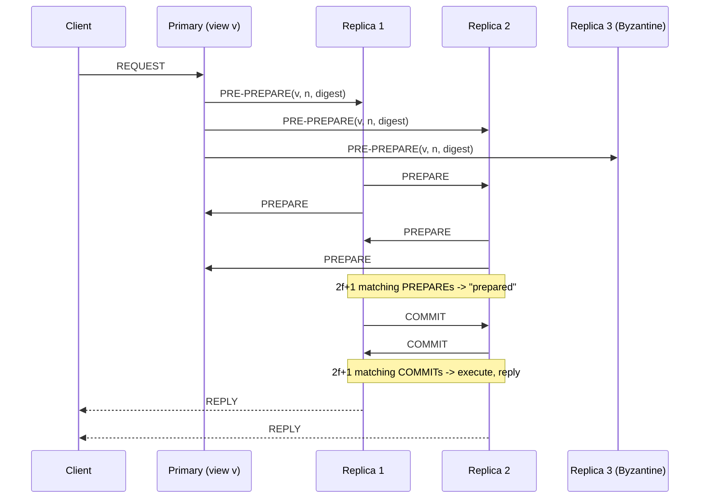

## Learning Objectives

- State PBFT's fault-tolerance bound (n = 3f + 1 replicas tolerate f Byzantine replicas) and connect it explicitly to the Byzantine Generals Problem's own n ≥ 3m + 1 bound.
- Walk through the three normal-case message phases, pre-prepare, prepare, and commit, and explain precisely what each phase's quorum size (2f + 1) protects against that the previous phase alone could not.
- Explain the view-change sub-protocol's role: what triggers it, and why it is what makes PBFT a liveness-preserving protocol rather than one that simply halts when a primary misbehaves.
- Explain why PBFT's protocol structure, a designated primary proposing an order that a quorum must ratify, mirrors Raft's leader-driven replication structurally, while the size and meaning of its quorums do not.

## Context & Motivation

`the-byzantine-generals-problem` proved a bound, n ≥ 3m + 1 generals tolerate m traitors, and gave an algorithm, but OM(m) is a theoretical construction: its message complexity grows exponentially with the number of traitors tolerated, useless for a real, replicated service handling client requests at any meaningful rate. Castro and Liskov's 1999 paper closes that seventeen-year gap between theory and practice, keeping the exact same fault-tolerance bound (their n = 3f + 1 is the Byzantine Generals bound wearing different variable names) while replacing OM(m)'s exponential recursion with a fixed, three-phase protocol whose cost scales with the number of replicas, not the depth of a recursive relay. This concept is deliberately scoped exactly as `crash-faults-vs-byzantine-faults` promised: the real, practical Byzantine-tolerant replication protocol, at the level of its actual phases and quorums, complementing rather than re-deriving `byzantine-faults-and-system-models`'s (`system-design-concepts`) broader treatment of testing and system-model philosophy around the same paper.

## Core Theory

### The setup: n = 3f + 1, and why that specific number

A PBFT cluster of n replicas tolerates up to f Byzantine replicas (arbitrary behavior, including collusion) whenever n ≥ 3f + 1. This is not a new bound invented for PBFT; it is the Byzantine Generals bound applied to state machine replication (`the-replicated-state-machine-approach`'s Agreement and Order, now under adversarial rather than crash faults): with f possible traitors, a quorum of any 2f + 1 replicas is guaranteed to overlap any other quorum of 2f + 1 replicas in at least f + 1 replicas, which itself guarantees the overlap includes at least one honest replica (since at most f of any 2f + 1 replicas can be Byzantine). That single overlap-guarantees-one-honest-witness argument is what every phase below relies on.

### Phase 1: pre-prepare

One replica is the **primary** for the current view (a monotonically numbered epoch, directly analogous to Raft's term). When a client request arrives, the primary assigns it the next sequence number and broadcasts a **pre-prepare** message (view number, sequence number, request digest, primary's signature) to every backup replica. This phase alone proposes an order; it does not yet establish agreement, a Byzantine primary could send different sequence-number assignments to different backups, exactly the kind of lie the Byzantine Generals Problem's commander could tell.

### Phase 2: prepare

Every backup that accepts the pre-prepare (the view and sequence number make sense, and it has not already accepted a different request for that same sequence number) broadcasts a **prepare** message to every other replica. A replica moves to the "prepared" state for that request only once it has collected 2f + 1 matching prepare messages (including its own). Because any 2f + 1 quorum overlaps any other 2f + 1 quorum in at least one honest replica, no two honest replicas can become prepared with a different request assigned to the same sequence number in the same view, this is exactly the property that catches a Byzantine primary lying differently to different backups in phase 1.

### Phase 3: commit

Being "prepared" only guarantees agreement within the current view; it does not yet guarantee that a future view change will preserve that agreement. Each replica that becomes prepared broadcasts a **commit** message; once a replica collects 2f + 1 matching commits, it is "committed-local" and executes the request, replying to the client. The commit phase's quorum overlap is what carries a decision safely across a subsequent view change, a future primary cannot propose a conflicting order for an already-committed sequence number, because doing so would require ignoring the honest replica any 2f + 1 overlap is guaranteed to include.



### View changes: what keeps the protocol alive, not just safe

The three phases above prove safety (no two honest replicas ever disagree), but say nothing about liveness if the primary itself is the Byzantine replica and simply refuses to propose anything. Every backup runs a timer on each pending request; if it expires with no progress, the backup broadcasts a **view-change** message and stops accepting further messages in the old view. Once a replica collects 2f + 1 view-change messages (or view-change acknowledgments), the next replica in a fixed, deterministic rotation becomes the new primary and resumes normal-case operation, carrying forward any request that a quorum had already prepared or committed in the old view so that safety established in phases 1 through 3 is never lost across the transition.

## Worked Examples

### Example 1: the normal case, traced with concrete numbers, f=1, n=4

```text
n=4, f=1 (n = 3f+1 = 4, exactly the minimum).
Replicas: P (primary, view 0), R1, R2, R3.

1. Client sends REQUEST "SET x=1" to P.
2. P assigns sequence number 42, broadcasts
   PRE-PREPARE(view=0, seq=42, digest=d) to R1, R2, R3.
3. R1, R2, R3 each broadcast PREPARE(view=0, seq=42, digest=d).
4. R1 collects PREPARE from R2, R3, plus its own = 3 matching
   prepares. Quorum needed: 2f+1 = 3. R1 is now "prepared".
   (R2 and R3 reach the same conclusion symmetrically.)
5. R1, R2, R3 each broadcast COMMIT(view=0, seq=42, digest=d).
6. R1 collects COMMIT from R2, R3, plus its own = 3 matching
   commits (2f+1=3 needed). R1 executes "SET x=1", replies to
   client. Same for R2, R3: all three honest replicas execute
   the identical request in the identical order.
```

### Example 2: a Byzantine primary lying in pre-prepare, caught in the prepare phase

```text
n=4, f=1. P is the Byzantine replica.

1. Client sends REQUEST "SET x=1".
2. P (lying) sends PRE-PREPARE(seq=42, digest=d1="SET x=1")
   to R1, but PRE-PREPARE(seq=42, digest=d2="SET x=2") to R2.
3. R1 broadcasts PREPARE(seq=42, d1). R2 broadcasts
   PREPARE(seq=42, d2). R3, receiving both pre-prepares from P
   (impossible under a single honest primary, but P is
   Byzantine and may equivocate to R3 as well) detects the
   conflict directly.
4. R1 needs 2f+1=3 matching PREPAREs for d1. It has its own,
   but R2's PREPARE is for d2, not d1: no honest replica can
   assemble 3 matching prepares for EITHER digest, since R1 and
   R2 disagree and R3 will not vouch for a digest a Byzantine
   primary invented without an honest majority behind it.
5. Neither R1 nor R2 ever reaches "prepared" for this sequence
   number. Timers expire -> VIEW-CHANGE triggered (see below).
   No two honest replicas execute conflicting requests: safety
   holds even though the primary actively lied.
```

### Example 3: a stalled primary triggering a view change

```text
n=4, f=1. P is Byzantine and simply stops responding to a new
client request (a liveness attack, not a safety attack).

1. R1, R2, R3 each start a timer on receiving the client's
   request forwarded to them directly (PBFT clients broadcast
   to all replicas precisely to guard against this).
2. Timers expire with no PRE-PREPARE from P. R1, R2, R3 each
   broadcast VIEW-CHANGE(view=1, ...).
3. Once any replica collects 2f+1=3 view-change messages, the
   deterministic rotation selects the next replica (R1, say) as
   the new primary for view 1.
4. R1 broadcasts NEW-VIEW(view=1), and normal operation
   (pre-prepare / prepare / commit) resumes under R1 as primary:
   the stalled P is simply bypassed, with no client request
   ever lost, because any request a quorum had already prepared
   in view 0 is carried forward into view 1 by construction.
```

## Common Misconceptions & Pitfalls

- **"PBFT's three phases are just Raft's leader-driven replication with an extra step."** Structurally, a designated proposer and a follower quorum, the shape rhymes with `raft-leader-election` and `raft-log-replication-and-commitment`, but the substance is different: Raft's quorum (any majority, n/2+1) only needs to outnumber crashed replicas, while PBFT's quorum (2f+1 out of 3f+1) is sized specifically so that any two quorums are guaranteed to share an honest replica even when up to f replicas actively lie, a guarantee Raft's simple majority-vote argument does not provide against adversarial replicas.
- **"Being 'prepared' already means the request is safely committed."** Example 2 shows prepared is only a within-view guarantee; the commit phase's separate 2f+1 quorum is what specifically survives a view change. A protocol that skipped the commit phase and executed directly on "prepared" could have a request lost or reordered across a view change in ways this concept's commit-phase quorum overlap is specifically built to prevent.
- **"A view change means the protocol has failed."** Example 3 shows the opposite: the view-change sub-protocol is what makes PBFT a genuinely fault-tolerant, live system rather than one that simply halts the moment a primary misbehaves, exactly analogous to how a Raft election, not a symptom of failure, is the mechanism that keeps a Raft cluster available after a leader crash.

## Summary

PBFT turns the Byzantine Generals Problem's theoretical n ≥ 3m + 1 bound into a practical replication protocol, n = 3f + 1 replicas run three message phases per client request: pre-prepare (the primary proposes an order), prepare (a 2f+1 quorum agrees on that order within the view, catching a lying primary), and commit (a second 2f+1 quorum makes that agreement survive any future view change). A view-change sub-protocol, triggered by a timeout, replaces a stalled or actively malicious primary without losing any request a quorum had already prepared, delivering both the safety the Byzantine Generals Problem demands and the liveness a real, continuously operating service needs. The next concept turns to a genuinely different way of achieving Byzantine-tolerant agreement, one that gives up PBFT's fixed, known membership entirely.

## Documentation Links

- [Castro and Liskov: Practical Byzantine Fault Tolerance (OSDI, 1999)](https://www.usenix.org/legacy/publications/library/proceedings/osdi99/full_papers/castro/castro_html/castro.html): the source paper for the n=3f+1 bound, the pre-prepare/prepare/commit three-phase protocol, and the view-change sub-protocol this concept builds through in detail.
- [Lamport, Shostak, and Pease: The Byzantine Generals Problem (ACM TOPLAS, 1982)](https://lamport.azurewebsites.net/pubs/byz.pdf): the original theoretical bound (n ≥ 3m+1) that PBFT's fault-tolerance threshold directly inherits, cited here to make that inheritance explicit rather than treat PBFT's bound as a new, unrelated number.
